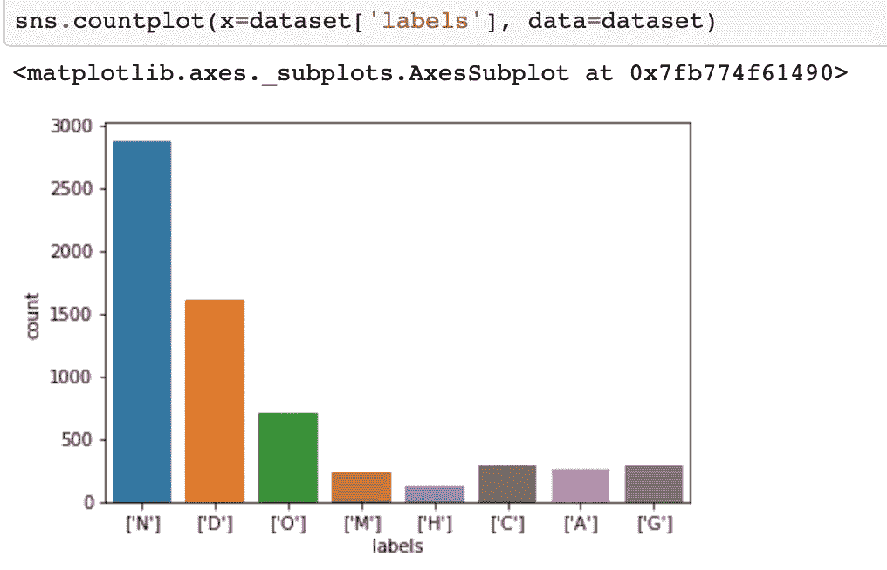
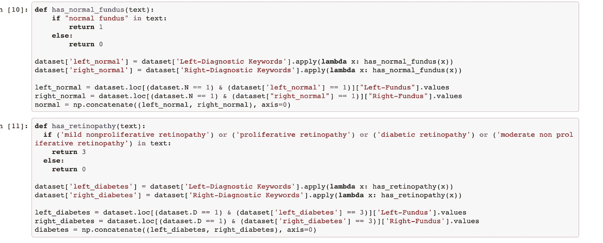
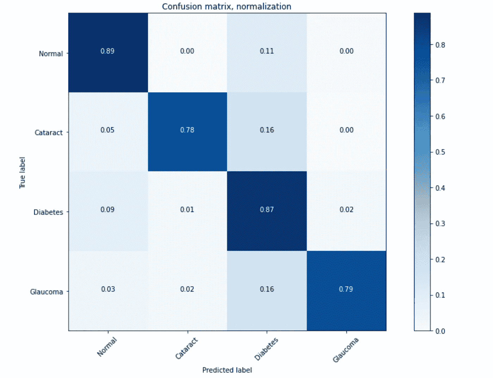
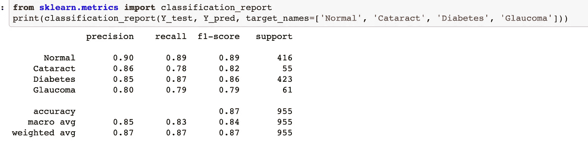
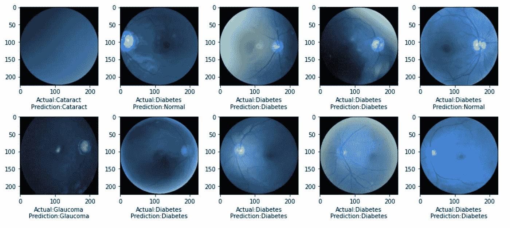

# 基于细胞神经网络的眼病识别。

> 原文：<https://medium.com/analytics-vidhya/ocular-disease-recognition-using-cnns-4953e4619679?source=collection_archive---------5----------------------->

# 介绍

[研究](https://www.sciencedirect.com/science/article/pii/S2214109X13701451#:~:text=This%20systematic%20review%20and%20meta,to%20288%20million%20in%202040.)显示，到 2020 年，全球将有 1.96 亿人口患有一种形式的老年性黄斑变性(AMD)到另一种，据估计，这个数字在 2040 年将上升到 2.88 亿。例如，预计在 2013 年至 2040 年间，全球青光眼疾病负担预计将增加 [74%](https://www.aaojournal.org/action/showPdf?pii=S0161-6420%2814%2900433-3) 。进一步的[研究](https://bmcpublichealth.biomedcentral.com/track/pdf/10.1186/s12889-020-8445-y.pdf)也显示，非洲和东地中海地区的 amd 全球负担明显高于其他地区。这应该是一个主要问题，尤其是在非洲大陆，因为我们在减少碳排放方面仍然落后，而且在该地区的许多社区，特别是村庄，使用易燃的烹饪方法非常普遍，所有这些都导致眼睛损伤并增加 amd 的风险。此外，据观察，尽管自 2010 年以来眼科医生的数量每年都有[增长](https://bjo.bmj.com/content/bjophthalmol/104/4/588.full.pdf)，但增长速度仍赶不上世界上 amd 的增长速度，这进一步影响了获得优质眼科护理的机会，并且在许多情况下增加了现有专业人员的护理负担，因为他们不得不应对青光眼、白内障等发病率不断上升的问题。

本文讨论的方法旨在提供一种**方法，通过在眼底照片上使用卷积神经网络来加速眼睛缺陷的检测，从而帮助**眼科医生提供护理。

# 数据集配置:

本练习使用的数据集来自 Kaggle 的[眼病识别](https://www.kaggle.com/andrewmvd/ocular-disease-recognition-odir5k)数据集，该数据集是一个包含 5000 名患者的结构化眼科数据库，详细记录了他们的年龄、性别、他们的左眼和右眼眼底照片，使用包括青光眼、白内障、高血压、糖尿病性视网膜病变等在内的诊断关键词进行分类。让这个特定数据集吸引我的是，作为一名药剂师，我遇到过许多患有上述眼病的人，对许多人来说，晚发现是常见的，并且获得合格的医疗从业者也是一个挑战，所以我觉得，“在与合格的专业人士合作的同时，创造一种算法，让人们更容易定期拍摄他们的眼睛，并对他们的眼睛健康做出明智的决定，这并不是坏事”。

标签是正常，糖尿病视网膜病变，青光眼，白内障和其他 amd。

数据集的结构使得很难简单地将其输入任何 CNN，这样做是为了对每个患者使用右眼和左眼提供两个结果，当然，还有两个目标数据。这对我来说是第一次这样的挑战，但是当然，有志者事竟成。

在积极寻找解决方案后，我找到的最好方法是编写一个函数，该函数可以搜索整个数据集，搜索诸如白内障、青光眼、糖尿病视网膜病变等关键词。，返回这些实例并将它们连接起来，以便了解相应疾病的病例总数。我将其精简为仅正常、青光眼、白内障和各种糖尿病视网膜病变的眼底照片，考虑到它们在数据集中的患病率最高。有了这些经过整理的图像，我就可以构建一个更简单的数据集来处理并提供给我的 CNN。

说明如何提取正常和糖尿病视网膜病变眼底照片的例子。

# CNN 体系结构和模型推理

我通过迁移学习使用了 VGG-16 架构，屏蔽了顶层，并对模型进行了微调，以适应有问题的数据集。在运行该模型 20 个时期后，我们达到了大约 97%的准确度。

因为我正在处理一个健康数据集，所以单独使用准确性数字就足够了，因为我们需要确保模型不会学习准确预测一类眼底照片，在这种情况下，可能是正常照片，因为它们具有最高数量的图像。因此，计算算法的查全率和查准率势在必行。

在这种情况下，算法的召回将告诉我们，在从所有真正阳性病例中检测每种疾病状况的阳性病例时，模型的表现如何。这在医学算法中尤其重要，因为它可用于筛选目的，即检测给定人群中阳性病例的比例。召回率低的算法存在无法检测到所有真正阳性病例的风险，对于我们这里的健康数据来说，这可能是一个挑战，反之亦然。

另一方面，算法的精度告诉我们预测的阳性病例中有多少比例实际上是阳性的。在医学算法的情况下，这是非常重要的，因为我们不希望出现算法将患者误诊为白内障的情况，而实际上患者并没有。这可能给患者带来情感和经济负担，也可能给医疗专业人员带来诉讼问题。

使用混淆矩阵，我能够了解算法的性能，并且通过分类报告，人们可以很容易地看到算法的精确度、召回率和 f1 分数。

该算法在检测正常眼底照片和表示糖尿病视网膜病变形式的照片时表现最佳

算法的精度、召回率和 F1 值

从上面的图像可以看出，通过眼底图像检测白内障和青光眼时，算法的召回率不是很好。这可能是由于多种因素造成的，其中一个因素是所用损失函数的选择，在这种情况下，分类交叉熵只是惩罚了预测和基本事实之间的差异。本质上，它没有考虑假阴性。大量的假阴性会对算法的召回产生负面影响。其原因可能包括算法在其上被训练的数据集中某些图像的错误标记，因此这可能需要手动查看被错误分类为阴性的图像，另一种方法可能是大大增加来自真阳性的图像的数量。无论如何，平均来说，该算法的平均召回率为 83%。另一方面，精确度在所有 4 种疾病条件下都相当不错。

我也决定看一看图像的预测与地面真相标签的比较。

在 10 个随机抽样的图像中，有 2 个被错误地误诊。

我相信这样做，我愿意回答任何关于这个项目和任何其他计算机视觉项目的问题。实际上，学习是具有挑战性的，但最终是有趣的。这项工作的 Github repo 可以在这里找到[。谢谢大家！](https://github.com/onyekaokonji/OCCULAR-DISEASE-RECOGNITION/blob/main/ODR.ipynb)