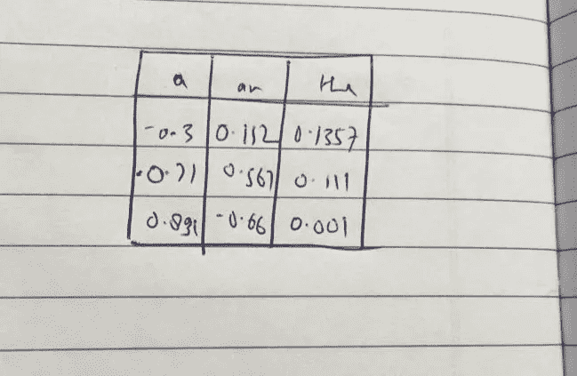

# 格格不入

> 原文：<https://medium.com/analytics-vidhya/odd-one-out-b80be62c02b6?source=collection_archive---------10----------------------->

.

这是机器学习的一个有趣的应用，用于找出一组单词中的一个单词。通过这个简单的项目，你可以想象机器学习的力量，以及它将如何塑造我们的未来。

我们将使用“Google news-vectors-negative 300 . bin”和这个项目的 Gensim 库。

首先，什么是矢量化，它有什么用途？

我们的机器只理解低或高输入，其他什么都不懂。所以我们需要用低或高输入的组合来表示它。

假设我们有三个词来代表。

我们可以有一个由 3 个单元组成的矩阵，每个单元代表一个单词。万岁！我们用一个简单的方法解决了这个大问题，但问题来了。这里我们只有 3 个单词，但是 1000 个单词或者 100 万个单词或者 10 亿个单词呢？用这种方式表示会耗费我们大量的内存，不仅仅是处理时间，所以我们需要设计一种新的方法。

如三个单词的图片所示，我们有一个 3*3 的矩阵。十亿个单词，十亿*十亿个矩阵。想象一下所需的空间和处理能力…

所以现在的解决方案是…

如果我们不保留零，而是在特定单词的每一行都有一些值，会怎么样呢？

就像这样。我们仍然有 3*3 矩阵，但我们可以保持一个固定的数字，假设我们有 300 行和 10 亿个字。现在我们有 3000 亿矩阵。如果你想更深入地了解它是如何完成的，我建议你去看看谷歌关于 Word to c 矢量化的文章。

因此，我们使用余弦相似度来寻找两个单词之间的相似度。

我们可以观察到单词 Samsung 和 Korea 之间的相似度约为 0.4679。

因此，主要思想是将一个单词转换为其矢量化形式，然后找到所有单词的平均值，然后通过简单地与平均值进行比较，可以挑选出最不相似的单词。

用于在一组单词中查找奇数单词的代码。

结果:

我们把巴黎作为重新设置的国家。我相信你们一定很惊讶，通过使用一个简单的逻辑，我们能够推导出这个奇怪的单词。这太令人惊讶了，简直太壮观了。

谢谢你读出来，如果你喜欢这个帖子，你可以激励我一些👏。