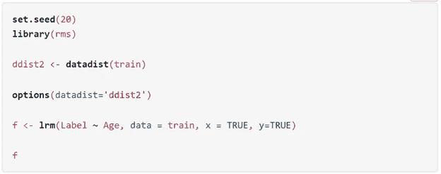

# 优势比和效应大小

> 原文：<https://medium.com/analytics-vidhya/odds-ratio-and-effect-size-a59c968ddda6?source=collection_archive---------1----------------------->

在统计学中，**效应大小**是衡量统计总体中两个变量之间关系强度的数字。

## **逻辑回归中的效应大小**

逻辑回归是最常见的二元分类器之一 *s.* 许多常见的效应大小统计数据，如 eta-squared 和 Cohen's d，不能在逻辑回归模型中计算。**在逻辑回归模型中，比值比可用作效应大小统计量。**比值比在给定暴露于感兴趣变量(如年龄)的情况下，比较感兴趣结果(癌症与非癌症)发生的相对比值。

> 比值比用于确定特定变量是否是利息结果的风险因素及其风险大小。

*   OR=1 变量不影响结果的概率
*   或> 1 个变量与结果的较高几率相关
*   或者<1 variable associated with lower odds of an outcome

Specifically, the regression coefficient's exponential function (e^(b1)) is the odds ratio associated with a one-unit increase in the variable or exposure.

## Let’s look at the example using R

Using the ***lrm*** 模型从包 ***rms*** 是实现 R 的 logistic 回归模型最简单的方法之一。

这里有一个预测癌症的例子(标签 1=癌症；并且使用年龄作为暴露变量，使用训练数据集(N=430 个患者=163 个癌症患者，267 个没有癌症)来标记 0=没有癌症)。

以年龄为变量构建预测癌症的 logistic 回归模型

这个模型看起来会像

模型的输出

该模型显示“*”是与基于 *wald 检验*和 *p 值*预测癌症结果相关的重要变量。*

*现在，让我们来看看模型的总结和它的优势比。*

**

*汇总和比值比*

*这里的结果表明，当*年龄*由 46 变为 67 时，患者患癌风险增加 2.1175 倍(优势比)。*

*如果我们想具体看到*年龄*从 50 岁增加到 51 岁时风险的变化呢？*

**

*我们注意到，将年龄从 50 岁改为 51 岁，患癌症的风险增加了 1.0364 倍。*

*将年龄从 70 岁改为 71 岁是否一致？*

**

*是啊！赔率依然是 1.0364。这告诉我们，年龄是线性地*依赖于预测结果。换句话说，年龄值每增加 1 个单位，患者患癌症的风险增加 1.0364 倍。**

**与“危险比”不同，优势比通常在整个研究中累积，使用确定的终点。风险比代表一段时间内的瞬时风险，这使得它们在选择终点时较少受到选择偏差的影响，并且可以指示在终点之前发生的风险。在下一篇文章中详细介绍危险比率！**

**感谢您通读！下面我们连线上 [***推特***](https://twitter.com/pranjal31vaidya) 和[***LinkedIn***](https://www.linkedin.com/in/pranjal-vaidya-1913ab9a/)***。*****