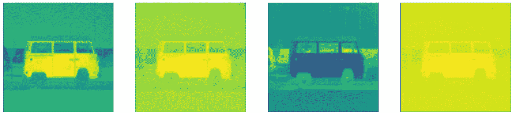
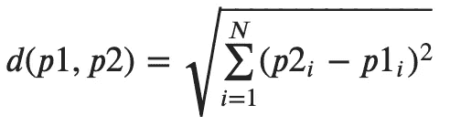
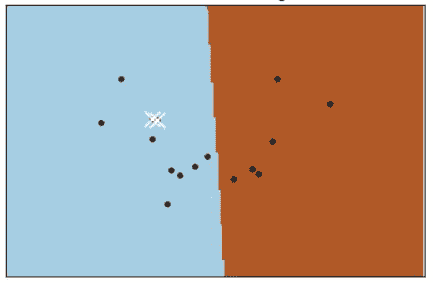

# 哦，你可以用集群做的事情

> 原文：<https://medium.com/analytics-vidhya/oh-the-things-you-can-do-with-clustering-5dd2eed9460b?source=collection_archive---------6----------------------->

你能用集群做些什么？很多。首先，分类、检测重复和寻找相似之处只是几个例子。

# 目录

K 表示聚类是如何工作的？
[样本图像](#743c)
[像素作为特征](#eb5c)
[特征图](#bd5f)
[距离函数](#e0be)
∘ [欧氏距离](#4609)
∘ [余弦距离](#2791)
[相似性](#8def)
[结论](#2e04)
[参考文献](#f7b5)


照片由 [Terra Slaybaugh](https://unsplash.com/@terras?utm_source=unsplash&utm_medium=referral&utm_content=creditCopyText) 在 [Unsplash](https://unsplash.com/s/photos/cluster?utm_source=unsplash&utm_medium=referral&utm_content=creditCopyText) 上拍摄

聚类是一种无监督学习算法，广泛用于机器学习。简而言之，它以这样一种方式对数据进行分组，即同一集群中的对象共享相似的功能。然而，聚类是预处理数据时可以使用的最有用的技术之一。在本文中，我将使用非结构化图像数据作为例子，但是同样的技术也适用于结构化数据。整个源代码共享在 [Colab 笔记本](https://github.com/changsin/ClassifyImages/blob/main/notebooks/cluster_images.ipynb)中。

# K 均值聚类是如何工作的？

K-Means 聚类是一种迭代算法，它根据已定义特征的相对距离对相似项目进行分组。算法是:

1.  选取两个随机点作为初始质心(质心是簇的中心点)。
2.  根据每个数据点到质心的距离将每个数据点放到一个聚类中。换句话说，数据点将被放入质心更近的聚类中。
3.  聚类后，计算每个聚类的真实质心。
4.  使用新的质心对数据进行重新聚类。
5.  检查簇或质心是否有任何变化。如果没有变化，我们就完了。否则，重复 3–5。

我的另一篇文章更详细地介绍了上述算法。要实现该算法，您必须定义两件事:即特征和相似性度量:

1.  **特性:**根据数据类型和用途决定特性。不管数据类型和特性如何，它们都需要用向量来表示。
2.  **距离函数:**一旦确定了特征并转换成向量形式，你就要决定你要用哪个距离函数来度量两个特征向量之间的距离。流行的距离函数有欧几里德、余弦、曼哈顿和汉明。

在我们的例子中，数据类型是图像，所以我们可以在图像中使用像素值或结构。对于距离函数，我们将尝试欧几里德和余弦函数来计算相似性。

# 样本图像

有了聚类算法，让我们将它应用于视觉任务领域。我准备了三个样本数据集:高速公路的昼夜图像、来自高速公路监控摄像头的图像和车辆图像。

*   **高速公路的白天和夜晚图像:**期望这些图像应该形成两个自然集群:白天和夜晚图像。这应该是最简单的，除了像黎明和黄昏图像、隧道、阴天等边界情况。


高速公路的日夜图像

*   **高速公路监控摄像头图像:**这些图像都是在白天拍摄的，但采用了两种不同的变焦设置:缩小和放大。前两个图像被缩小，其余的是放大的图像。


高速公路监控摄像头图像

*   **车辆图片:**4 辆大众微型车和 4 辆大众甲壳虫的图片。尽管这两个图像集对于人类观察者来说形成了两个自然的聚类，但是将它们聚类成两个组将是非常具有挑战性的，因为背景、位置、车辆的位置等。都是复杂多样的。


大众微型车图片


大众甲壳虫图片

# 像素作为特征

聚类图像最简单的方法是使用像素值作为特征。对于彩色图像，每个像素包含 RGB 或 RGBA 值。因此，如果使用 320x320 分辨率的三个通道(RGB ),则图像将被转换为 320x320x3 多维数组。使用 OpenCV，将图像文件加载到数组形式只需要一行代码:

```
import cv2image = cv2.imread(file_path)
```

一旦加载了图像列表，我们就可以使用 sklearn 库的 KMeans 聚类算法来获得聚类。K 的值应该是多少这个问题需要另一种讨论。在我们的例子中，我们知道应该有两个集群，所以让我们设置 K=2 并运行算法。

```
from sklearn.cluster import KMeansK = 2images_flattend = images.reshape(images.shape[0], -1)kmeans = KMeans(n_clusters=K, random_state=0)
clusters = kmeans.fit(images_flattend)
```

KMeans fit 方法期望输入是 2D 数组，因此图像数组需要“展平”例如，加载十个图像将产生一个(10，320，320，3)多维数组，该数组在展平后变成(10，307200)。在展平数组并初始化 KMeans 之后，可以调用 fit()和 predict()或 fit_predict()来获得预测(即聚类)。结果是一个索引列表。对于 K=2，索引指的是图像数据所属的簇 0 或 1。

```
array([0, 1, 1, 0, 0, 1, 1, 1, 1, 1, 1, 1, 1, 0, 1, 0], dtype=int32)
```

为了可视化聚类，我们需要将维度降低到 2D，这可以通过 PCA(主成分分析)来实现。事实上，由于它降低了维数，我们也可以使用主成分分析的结果来进行聚类。组合后的代码如下所示:

PCA.fit_transform 将维数减少到 K。在我们的例子中，因为 K=2，所以我们有一个 2D 阵列，我们可以在潜在空间中将它与 K 均值聚类边界一起绘制成图形。两个白色标记是簇的质心(中心点)。


白天和夜晚图像的集群

对于白天和夜晚的图像，聚类是:

```
{0: array([0, 1, 2, 3, 4]), 1: array([5, 6, 7, 8, 9])}
```

它们完美地对应了白天和夜间两组图像。

对于高速公路闭路电视图像，他们也符合我们的期望。

```
{0: array([2, 3, 4]), 1: array([0, 1])}
```

然而，对于车辆图像，我们就没那么幸运了。这些组是:

```
{0: array([ 1,  2,  5,  6,  7,  8,  9, 10, 11, 12, 13, 14, 15]),
 1: array([0, 3, 4])}
```

虽然第二个聚类(索引 1)包含所有的微型巴士图像，但是第一个聚类是 5 个微型巴士和 8 个甲壳虫图像的混合包。

聚类图还显示了在潜在空间中随机分布的数据点:


汽车图像聚类图

我们希望看到一些自然的集群。原因应该是显而易见的。在白天和夜晚的图像中，我们很幸运，因为单个像素值的大小充当了旋转标准。就汽车而言，它们都是在白天复杂的背景下拍摄的。虽然我们作为人类可以识别不同的汽车模型类型，但对于计算机来说，它们只是随机的像素值，因此没有自然的聚类组出现。

我们需要的是一种让机器识别图像中固有结构的方法。为此，我们求助于 CNN(卷积神经网络)。

# 特征地图

CNN 被广泛用于分析图像。一幅图像通过一系列的卷积，这些卷积作为过滤器来提取“特征图”这些特征地图被用作模型中后续层的输入，以执行更高级别的认知任务，例如对象检测。这是 VGG-16 的图表，它是最早的 CNN 模型之一。


[https://neurohive.io/en/popular-networks/vgg16/](https://neurohive.io/en/popular-networks/vgg16/)


https://neurohive.io/en/popular-networks/vgg16/

除了最后三层，卷积层包括 VGG-16 层的大部分。来看看卷积的效果。让我们截取一个卷积输出，并将其可视化。下面是截取 CNN 输出的方法。您可以指定要从中提取 CNN 输出的层数。

第一卷积层返回 shape (224，224，64)的输出向量。我们可以将输出向量想象成一个由(224，224)个灰度图像组成的 8×8 网格，每个网格代表一个特定卷积的结果。让我们来看看第一个 CNN 图层输出中的几个。有些输出不太容易被人类识别，但这里有一些对人类来说似乎是有意义的。



CNN 中间输出

虽然我们不能总是理解卷积结果，但我们可以看到每个卷积运算都提取了输入图像的一个特定方面。这些卷积结果然后在最后三个完全连接的层之前一直被馈送到随后的卷积层。出于我们的目的，我们将把卷积层的最后输出作为聚类的特征图。以下是汽车图像的聚类结果:

```
0: array([ 0,  1,  2,  3,  4,  5,  6,  7, 11, 13]),
1: array([ 8,  9, 10, 12, 14, 15])
```


使用特征地图的聚类结果(白色标记是质心)

虽然使用特征图的聚类结果仍然没有显示整齐的两组数据点，但它们显示了改进:聚类 0 具有全部 8 只微型巴士和 2 只甲虫，而聚类 1 只有 6 只甲虫。

对车辆类型和型号进行分类实际上是一个相当具有挑战性的问题。它通常需要一个完整的神经网络模型来准确可靠地完成。单独的聚类不足以完成这项工作，这就是为什么它被用作训练成熟的神经网络模型的预处理步骤。

# 距离函数

让我们简单地转到距离函数这个话题。

## 欧几里得距离

欧几里德距离函数的公式是:



*   p1 和 p2 是向量空间中的两个数据点
*   n 是维度。

这是我们到目前为止使用的默认距离函数。

## 余弦距离

另一方面，余弦距离测量两个归一化向量之间的角度差。


考虑余弦距离的一个简单方法是，所有向量都归一化为长度为 1 的单位向量，唯一的区别是角度。因此，当矢量的大小无关紧要时，就使用余弦距离。为了规范化，我们可以使用 sklearn 的 preprocessing.normalize()方法:

```
from sklearn import preprocessingX_fm = preprocessing.normalize(X_fm.reshape(len(X_fm), -1))
```

在我们的例子中，距离函数之间没有太大的区别。在其他情况下，例如，文本相似性，一般的智慧是使用余弦距离。

# 类似

距离函数用于基于相似性度量来寻找聚类。使用相同的距离函数，我们可以很容易地找到相似的图像或重复的图像。下面是潜在空间中最接近的两个数据点，以及根据欧几里德距离对应的汽车图像:



使用余弦距离，它们是:


使用余弦距离的两幅最相似的图像


我们观察到的是，这两张甲虫图像在大小上有很大不同，但是根据余弦距离函数，它们仍然被计算为最相似的。

对于两个最不相似的图像，欧几里德函数和余弦函数都认为这两个图像彼此最不相同:


汽车图像数据集中最不相似的图像

# 结论

作为数据科学家或机器学习工程师，聚类是非常有用的工具。在本文中，我们探索了一些可以用集群做的事情:即分类、检测重复项、查找相似项。然而，我们也看到，并不是所有的数据集都可以像白天和黑夜的图像一样整齐地聚集在一起。根据您的目的，您需要选择不同的特征，例如使用特征地图而不是像素值，或者使用余弦距离函数而不是欧氏距离函数。您可以探索更多的东西，但这应该是一个很好的起点。

# 参考

*   [理解 K 意味着图形化聚类](https://changsin.medium.com/understanding-k-means-clustering-graphically-5b90beafc900)