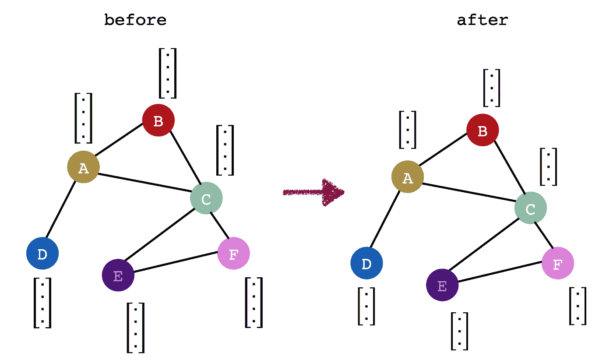
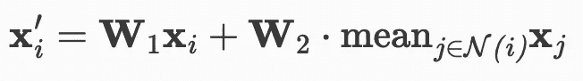

# oh my graphs:PyG 中的 GraphSAGE

> 原文：<https://medium.com/analytics-vidhya/ohmygraphs-graphsage-in-pyg-598b5ec77e7b?source=collection_archive---------0----------------------->

在之前的一篇文章中，我描述了一个基本的图形神经网络(GNN)算法 GraphSAGE 背后的直觉和一些数学。我们如何为实际任务实现 GraphSAGE？


我是 PyTorch 的人，PyG 是我在 GNN 实验中的助手。对于更大的图形， [DGL](https://www.dgl.ai/) 可能是更好的选择，好消息是他们有 PyTorch 后端！

如果您以前使用过 PyTorch，那么大部分都很直观，所以让我们开始吧！

# **安装**

PyG 正在快速开发中，新的发布也很频繁。我发现每当有新的发布时，我总是与各种需要的包有某种冲突。下面是我在这个笔记本上使用的版本。你可以用`pip`或`conda`安装，但要注意选择正确的设备版本:即`cuda10`、`cuda9`或`cpu`。文档中的安装说明在此处为。

```
torch                         1.8.0
torch-cluster                 1.5.9
torch-geometric               1.7.0
torch-scatter                 2.0.6
torch-sparse                  0.6.9
torch-spline-conv             1.2.1
```

# **卷积层**

图卷积的目标是改变图中每个节点的特征空间。重要的是要认识到图*的结构*并没有改变 ie，在下面的前后视觉中，相同的节点是相互连接的。图形卷积背后的神奇之处在于如何为每个节点计算新特征。



PyG 有各种类型的卷积层；在本帖中，我们将简单地回顾一下 SAGEConv 层，它是聚合和更新步骤的一个迭代。)。您可以通过简单地指定预期的输入和输出要素形状来实例化一层图形卷积，这与 PyTorch 中的普通卷积非常相似。

```
from torch_geometric.nn import SAGEConv
conv = SAGEConv(input_dim, output_dim)
```

向前通过卷积层需要两样东西，节点特征矩阵， **X** 和**邻接矩阵。**

```
x = conv(data.x, data.adj_t)
```

回想一下， **X** 矩阵是一个 **(n x D)** 矩阵，其中 **D** 是图中每个节点的维度。或者，如果你不能创建一个邻接矩阵(因为它们会随着大量的节点而爆炸！)，可以使用边缘列表。**边缘列表**预期是一个**(2×n)**矩阵，其中矩阵的第一行代表源节点，第二行代表目标节点。

## 引擎盖下发生了什么？

`SAGEConv`的默认聚合函数是均值聚合，也就是说，我将获取我的相邻结点要素并对它们进行平均(这是第二个术语)。更新步骤只是邻居表示和新变换的当前节点表示的线性组合(第一项)。PyG 处理消息传递并计算出每个节点 *i* 等的邻居。



SAGEConv 方程(参见[文档](https://pytorch-geometric.readthedocs.io/en/latest/modules/nn.html#torch_geometric.nn.conv.SAGEConv))

# 创建模型

GraphSAGE 模型只是一堆堆叠在一起的`SAGEConv`层。下面的模型有 3 层卷积。在 forward 方法中，您会注意到我们可以添加激活层和 dropout(您甚至可以加入一些批处理规范！)

下面的模型是训练一个**节点分类**模型。该模型有效地尝试使模型的最后一层具有与数据集中的类相同数量的神经元。在末尾添加一个 softmax 可以训练模型为每个节点输出最可能的类。

```
class GraphSAGE(torch.nn.Module):
    def __init__(self, in_dim, hidden_dim, out_dim, dropout=0.2):
        super().__init__()
        self.dropout = dropout
        self.conv1 = SAGEConv(in_dim, hidden_dim)
        self.conv2 = SAGEConv(hidden_dim, hidden_dim)
        self.conv3 = SAGEConv(hidden_dim, out_dim)

    def forward(self, data):
        x = self.conv1(data.x, data.adj_t)
        x = F.elu(x)
        x = F.dropout(x, p=self.dropout)

        x = self.conv2(x, data.adj_t)
        x = F.elu(x)
        x = F.dropout(x, p=self.dropout)

        x = self.conv3(x, data.adj_t)
        x = F.elu(x)
        x = F.dropout(x, p=self.dropout)
        return torch.log_softmax(x, dim=-1)
```

注意，我称这个模型为`GraphSAGE`，但是原始文件的 conv 层的设置，激活等在这里[描述](https://arxiv.org/abs/1706.02216)。这个模型唯一“明智”的地方是`SAGEConv`层。

# 数据集

我没有过多地谈论数据集，因为 GNNs 中的许多研究都使用 PyG 中可用的标准数据集。毫无疑问，没有什么可以阻止你创建一个自定义数据集，但这是另一天的另一篇文章(尤其是当你有一个大图的时候！).在这个例子中，我将使用打包在 [OGB](https://ogb.stanford.edu/) 中的数据集。要将此加载到您的笔记本中，请确保`pip install ogb`。

下面的代码片段从`ogb`加载了一个亚马逊产品数据集。

```
import torch
import torch_geometric.transforms as T
from ogb.nodeproppred import PygNodePropPredDatasetdevice = f'cuda' if torch.cuda.is_available() else 'cpu'
device = torch.device(device)dataset = PygNodePropPredDataset(name='ogbn-products',
                                 transform=T.ToSparseTensor())
data = dataset[0]# this dataset comes with train-val-test splits predefined for benchmarking
split_idx = dataset.get_idx_split()
train_idx = split_idx['train'].to(device)
```

关于数据集的一些基本信息打包在`data`对象中:

```
print(f' dataset has {data.num_nodes} nodes where each node has a {data.num_node_features} dim feature vector')print(f' dataset has {data.num_edges} edges where each edge has a {data.num_edge_features} dim feature vector')print(f' dataset has {dataset.num_classes} classes')
```

这个特殊的数据集(训练、val 和测试索引)是为我们分离出来的。

```
print(split_idx['train'].shape)
print(split_idx['valid'].shape)
print(split_idx['test'].shape)
```

邻接矩阵预先填充在`data.adj_t`中，它是一个`SparseTensor` 矩阵，因为它在形状上是`n x n`，这是巨大的，因为有～2M 节点！

```
SparseTensor(row=tensor([      0,       0,       0,  ..., 2449028, 2449028, 2449028]),
             col=tensor([    384,    2412,    7554,  ..., 1787657, 1864057, 2430488]),
             size=(2449029, 2449029), nnz=123718280, density=0.00%)
```

# 培养

当我第一次开始玩 GNNs 时，我觉得在 train 循环中我们总是传递整个图很奇怪——我们必须传递整个图，因为我们需要完整的结构来计算聚合和更新步骤。但是，由于我们需要在一组特定的节点上*训练*并在另一组节点上进行验证/测试，我们只需用我们的训练/验证/测试集中的节点索引来屏蔽我们想要的梯度！

附注:以下代码是从马蒂亚斯·菲的 [ogb](https://github.com/snap-stanford/ogb/tree/master/examples/nodeproppred/products) 提交中窃取的！

```
# compute activations for train subset
out = model(data)[train_idx]# get gradients for train subset
loss = F.nll_loss(out, data.y.squeeze(1)[train_idx])# evaluate model on test set
out = model(data)[test_idx]
```

对于这个`ogb`数据集，`train`和`test`函数可以这样打包:

```
def train(model, data, train_idx, optimizer):
    model.train() optimizer.zero_grad()
    out = model(data)[train_idx]
    loss = F.nll_loss(out, data.y.squeeze(1)[train_idx])
    loss.backward()
    optimizer.step()return loss.item()[@torch](http://twitter.com/torch).no_grad()
def test(model, data, split_idx, evaluator):
    model.eval() out = model(data)
    y_pred = out.argmax(dim=-1, keepdim=True) train_acc = evaluator.eval({
        'y_true': data.y[split_idx['train']],
        'y_pred': y_pred[split_idx['train']],
    })['acc']
    valid_acc = evaluator.eval({
        'y_true': data.y[split_idx['valid']],
        'y_pred': y_pred[split_idx['valid']],
    })['acc']
    test_acc = evaluator.eval({
        'y_true': data.y[split_idx['test']],
        'y_pred': y_pred[split_idx['test']],
    })['acc'] return train_acc, valid_acc, test_acc
```

`ogb`附带一个`Evaluator`来帮助对输出预测评分。

```
lr = 1e-4 
epochs = 50 
hidden_dim = 75
evaluator = Evaluator(name='ogbn-products')model = GraphSAGE(in_dim=data.num_node_features, 
                 hidden_dim=hidden_dim, 
                 out_dim=dataset.num_classes)optimizer = torch.optim.Adam(model.parameters(), lr=lr)for epoch in range(1, 1 + epochs):
    loss = train(model, data, train_idx, optimizer)
    result = test(model, data, split_idx, evaluator)
    #logger.add_result(run, result)if epoch % 10 == 0:
        train_acc, valid_acc, test_acc = result
        print(f'Epoch: {epoch}/{epochs}, '
              f'Loss: {loss:.4f}, '
              f'Train: {100 * train_acc:.2f}%, '
              f'Valid: {100 * valid_acc:.2f}% '
              f'Test: {100 * test_acc:.2f}%')
```

# TL，DR:在 PyG 快速构建 GNNs 是 ez！

此外，如果您想试验`[GAT](/@nabila.abraham/ohmygraphs-graph-attention-networks-b7562289ae4b)`或其他类型的卷积层，这将(在很大程度上)是一个简单的换入换出场景。点击查看文档[中的其他可用图层。](https://pytorch-geometric.readthedocs.io/en/latest/modules/nn.html#convolutional-layers)

完整的笔记本脚本可以在这里[获得](https://github.com/nabsabraham/ohmygraphs/blob/master/ogb_sage.ipynb)，尽管它主要是马蒂亚斯[代码](https://github.com/snap-stanford/ogb/tree/master/examples/nodeproppred/products)的分解版本。