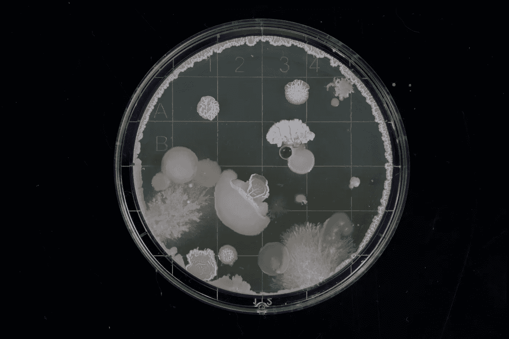
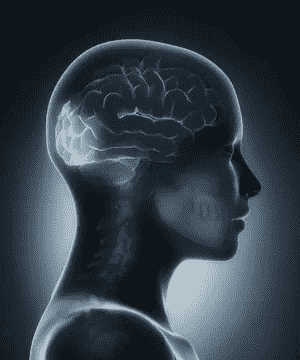

# 卷积神经网络的体系结构——入门

> 原文：<https://medium.com/analytics-vidhya/on-the-architecture-of-convolutional-neural-networks-a-primer-ced9e9065741?source=collection_archive---------23----------------------->

[迈克尔·希弗](https://unsplash.com/@michael_schiffer_design?utm_source=unsplash&utm_medium=referral&utm_content=creditCopyText)在 [Unsplash](https://unsplash.com/?utm_source=unsplash&utm_medium=referral&utm_content=creditCopyText) 上拍照

[卷积神经网络](https://en.wikipedia.org/wiki/Convolutional_neural_network)是一类深度学习网络，可以用于许多行业面临的高复杂性问题，它们甚至可以推动人类可能性的极限——从磁共振成像的晚期医疗状况检测[到允许完全自动驾驶汽车的可能性](https://mike-flanagan.medium.com/curiosity-inspiring-innovation-74b051f9e14e)，甚至允许脑机接口[的进步](https://ieeexplore.ieee.org/document/9176228)。

面对如此令人困惑的可能性，想象从哪里开始寻找解决方案是极其令人困惑的。然而，了解这类网络的能力，可以让我们在处理复杂问题时遵循逻辑流程。让我们来看看卷积神经网络的架构，以消除围绕这种增强工具的神秘面纱。

janulla 在 iStock 上拍摄的照片

# 在内心深处

CNN 源于对大脑视觉皮层的研究。CNN 最常见的用途是简单地分析和分类视觉图像，其技术的进步为现代计算机视觉奠定了基础。该过程的架构围绕输入图像，使用一系列**过滤方法进行特征学习**，并将学习到的属性汇总到一个**密集矩阵**中，用于进一步的应用。让我们进入这项技术的初级加工步骤…

# 特征学习

用于图像分类的简单 CNN 过程包括在进行分类之前用于特征学习的**递归过程**。CNN 的特征学习过程应用以下步骤:

1.  卷积-应用过滤器生成特征图。
2.  非线性校正—去除负值
3.  池化-对生成的要素地图进行缩减采样操作。

CNN 通过图像的部分来评估图像之间的相似性。这个过程背后的数学称为**过滤**，其中:

1.  一个特征排列在图像的一段上
2.  每个图像像素乘以相应的特征像素
3.  然后将所得乘积相加，再除以特征中的像素总数。

戴维·特拉维斯在 [Unsplash](https://unsplash.com/?utm_source=unsplash&utm_medium=referral&utm_content=creditCopyText) 上拍摄的照片

注意:滤镜是一个矩形矩阵，它将围绕输入图像逐步移动，并且可以是任意大小。对于我们的示例，想象一个正方形的 3x3 像素过滤器，过滤器在任何一个时间可以看到的输入图像的像素总数是 9，但是过滤器将在输入图像周围移动，直到它看到图像的每个 3x3 像素部分。

# 盘旋

对图像上特征矩阵可能排列的每个可能位置的*重复这个过滤过程就是**卷积的过程，**这种深度学习的方法由此得名。最终结果是一张地图，它会告知您影像上要素出现的每个位置，外观类似于关联矩阵或热点图。*

用几个滤镜卷积一个图像会创建一个对应图像贴图的堆栈，它被定义为一个**卷积层。**这是流程的第一步，针对各种概念特征重复进行。

卷积神经网络涉及*许多*这些卷积层，然而卷积层只是 CNN 中使用的一个工具。

# 非线性整流

在生成每个特征图(通过用卷积对输入图像进行滤波)之后，进一步的处理方法是将**非线性、**局部应用于每个卷积的像素值。应用非线性的最常见方法是**整流线性激活函数**或 [**ReLU**](https://machinelearningmastery.com/rectified-linear-activation-function-for-deep-learning-neural-networks/) **，**，其将特征图中的任何负值移至零，而不改变 0 至 1 范围内的任何值。

简单地说，这种非线性校正将复杂性引入到学习管道中，该学习管道允许解决复杂任务的能力。对每个输出卷积层应用非线性是必要的。

# 联营

卷积后的另一项处理技术是**池化**——一种降低卷积层维度的方法**。**在这个过程中，我们将卷积层作为输入，并再次创建滤波器(通常为 2x2 或 3x3)，以**步长**(通常为 2)在卷积层周围滑动。从我们进入的每个部分，我们捕获一个值来创建一个新的合并图层，其分辨率小于我们正在引用的卷积图层。常见的联营形式有**最大联营、平均联营、**和**最小联营**。结果是一个图层代表我们的输入，具有相似的模式和降低的分辨率。

> **例如:Max pooling** 是我们捕捉截面视觉框架内所有像素的最大值*的地方。池化操作允许我们对输入图像的空间分辨率进行下采样，并处理该图像的多个尺度，或者我们的图像中的特征的多个尺度。*

来自 [*深度学习导论:什么是卷积神经网络？*](https://www.mathworks.com/videos/introduction-to-deep-learning-what-are-convolutional-neural-networks--1489512765771.html)

# 通过深度堆叠的特征层次

将上述处理中的三个操作结合起来创建一个要素层堆栈，并重复该过程以创建多个层堆栈。这些特征层堆栈本身可以被操作来创建*更大的*特征层堆栈——这个过程被称为**深度堆栈**。这可用于创建一个**特征层次**，其中较高级别的层建立在初始(较低级别的)层之上。为了说明这一意义，想象使用 CNN 进行面部识别:

*   低级特征——识别微小的图案细节，如边缘、黑点或曲线，在此基础上构建更高级别的抽象。
*   中级特征——从更简单的模式中构建元素；我们可以识别某些低级特征在哪里组合形成更抽象的模式，例如眼睛、鼻子和嘴。
*   高级特征——一旦中级特征被分类，我们可以在它们的基础上进一步识别整个面部结构。

一旦我们提取了复杂的特征，我们就可以使用它们来基于我们开始整个过程的输入图像进行一些分类或决策。

最后，通过该图像分析过程收集的类别分数可以作为密集矩阵输出，表示代表每个类别的概率。

提取的特征被展平到一个完全连接的层，或**密集矩阵**，它可以用来输出一个**概率分布**，允许模型对原始输入图像的分类做出决定。

所得到的分类输出可以被其它神经网络用于开头所建议的各种方法。

# 资源和延伸阅读

Aurélien Géron，【oreilly.com】

Brandon Rohrer，[卷积神经网络如何工作——YouTube](https://www.youtube.com/watch?v=FmpDIaiMIeA)

亚历山大阿米尼，[麻省理工 6。S191 (2020):卷积神经网络— YouTube](https://www.youtube.com/watch?v=iaSUYvmCekI)

deeplizard，[卷积神经网络(CNN)解释——deep lizard](https://deeplizard.com/learn/video/YRhxdVk_sIs)

3blue1brown，[但是什么是神经网络呢？深度学习，第一章——YouTube](https://www.youtube.com/watch?v=aircAruvnKk&vl=en)

Daphne Cornelese， [*卷积神经网络直观指南|* FreeCodeCamp](https://www.freecodecamp.org/news/an-intuitive-guide-to-convolutional-neural-networks-260c2de0a050/)

斯坦福， [CS231n 卷积神经网络用于视觉识别](https://cs231n.github.io/convolutional-networks/)