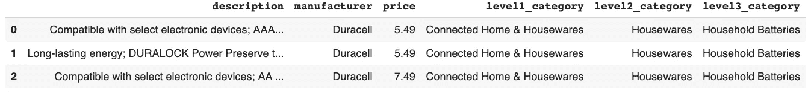
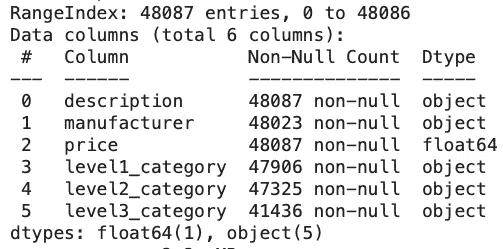
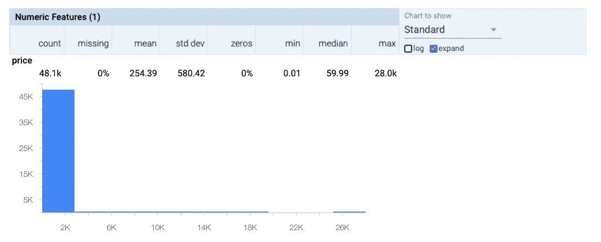
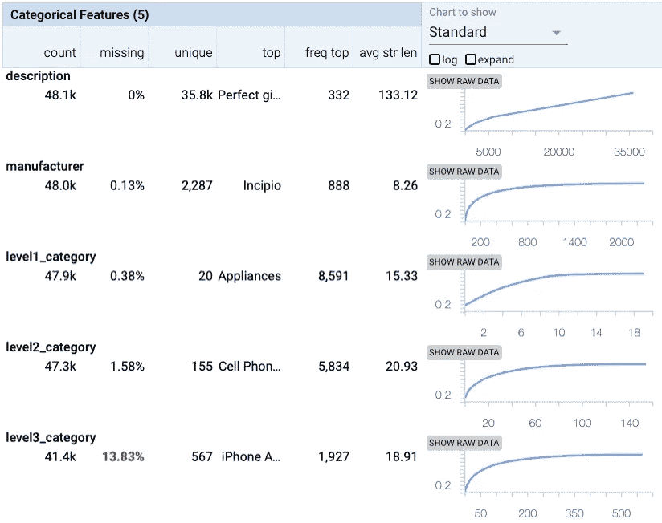

# 论数据在训练机器学习算法中的重要性——第一部分

> 原文：<https://medium.com/analytics-vidhya/on-the-importance-of-data-in-training-machine-learning-algorithms-part-one-7e677b7d2d40?source=collection_archive---------18----------------------->

数据在构建机器学习算法中起着至关重要的作用。通常，机器学习实践者往往会忽略数据质量的重要性，而是寻找“更好”的机器学习算法。在这一系列中，我计划研究数据的各种特征，这些特征会影响最终的机器学习算法的质量。

我们将研究影响机器学习模型的以下数据特征:

*   可用于培训的记录数量
*   培训数据的质量及其影响
*   扩充数据

在上述所有情况下，我们将保持机器学习算法不变。为了使这个具体化，我们将使用新发布的[tensor flow Decision Forests](https://www.tensorflow.org/decision_forests)并训练一个简单的 [RandomForestModel](https://www.tensorflow.org/decision_forests/api_docs/python/tfdf/keras/RandomForestModel) 。

# 数据探索

让我们来看看我们将在这个练习中使用的数据。我们将使用 BestBuy 的产品主数据——在 [Creative Commons Zero v1.0 通用许可](https://github.com/BestBuyAPIs/open-data-set/blob/master/LICENSE)下发布。

如果我们看一下数据的前几行，我们可以看到以下内容:

BestBuy 数据集中的示例行

从上表中，我们可以看到有三个输入字段(*描述*、*制造商*、*价格*)和三个输出字段(*级别 1 _ 类别*、*级别 2 _ 类别*、*级别 3 _ 类别*)。我们可以利用熊猫收集更多关于田地的信息:

我们总共有 48087 条记录，有 6 个字段，其中 4 个是类型*分类*，1 个是*数字*类型，1 个是*字符串*类型。为了控制我们的实验，我们将留出 8087 条记录，并对 40000 条记录进行处理。但是，在我们进入各种实验设置之前，让我们看一下我们将使用的数据集中字段的数据分布。

我们使用了一个名为 [Facets](https://pair-code.github.io/facets/) 的工具，这是一个开源数据可视化工具，可以“帮助理解和分析机器学习数据集”。我们将首先查看数字字段*价格*，如下所示:

***价格*** 字段的数据分布

这里需要注意的一点是，大部分数据位于 2.5K 以内，但有些记录甚至将~28K 作为输入值，相当多的值是该数据集中的异常值。从该字段的表格摘要中显示的最大值也可以看出这一点。数值字段类型中需要注意的一个重要特征是数据的均值和标准差。当手头的任务是预测数值字段的值(回归任务)时，这一点尤其重要。

如果我们查看分类字段，*制造商*、*级别 1 _ 类别*、*级别 2 _ 类别*和*级别 3 _ 类别*，我们会看到以下数据特征:

字段**数据分布描述**、**制造商**、**一级 _ 类别**、**二级 _ 类别**和**三级 _ 类别**

从上面的总结中可以看出一个有趣的点，分类字段 *level3_category* 遗漏了大约 14%的数据。这表明被训练来预测该字段的值的机器学习算法将学习预测 *NaN* 作为类别之一。

该摘要还显示了每个字段中最频繁出现的项目，其中*电器*是*级别 1 _ 类别*的最频繁出现值，其次是*手机*是*级别 2 _ 类别*的最频繁出现值。

# 数据探索综述

我们已经研究了将要使用的数据集，也看到了该数据中字段的一些基本特征。在本系列的下一部分中，我们将设置一个实验来了解训练记录的数量对测试分数的影响。

如果您认为该数据还有其他方面需要探索，请发表评论。

# 接下来呢？

如果你想知道更多关于各种算法的结果，请阅读本系列的第二部分。