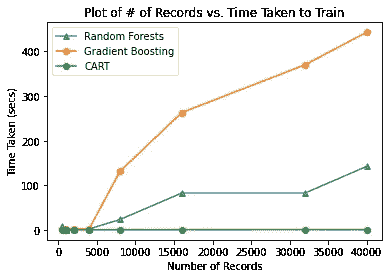
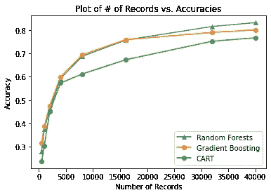
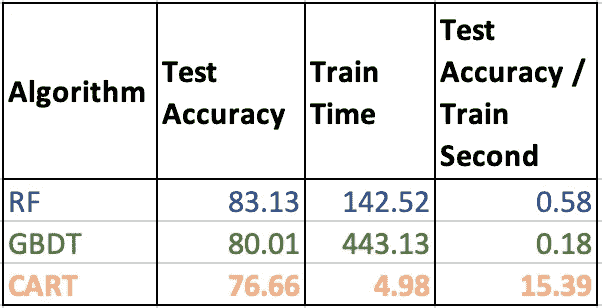

# 论数据在训练机器学习算法中的重要性——第三部分

> 原文：<https://medium.com/analytics-vidhya/on-the-importance-of-data-in-training-machine-learning-algorithms-part-three-db5c803e59e9?source=collection_archive---------15----------------------->

在本博客系列的第[部分一](https://krtk.medium.com/on-the-importance-of-data-in-training-machine-learning-algorithms-part-one)和第[部分二](/analytics-vidhya/on-the-importance-of-data-in-training-machine-learning-algorithms-part-two-aeb86dba509)中，我们看到了数据如何在提高机器学习算法的性能方面发挥作用。我们看到，最初的 50%的数据在测试数据性能方面提供了一个大的跳跃，而我们使用的后续数据添加了较少的信息来改善模型学习的内容。在本文中，我们将了解如何构建整个脚本，以及如何扩展该脚本以应用于新的数据集。

**TL；DR:** 你可以在这里找到这个博客系列中使用的完整代码:[bit.ly/TFDFData](https://bit.ly/TFDFData)。

我们将首先通过将数据分为训练和测试来准备数据集。请记住，测试数据始终保持不变。这可以通过 TensorFlow Decision Forests 的数据加载功能`tfdf.keras.pd_dataframe_to_tf_dataset`实现，如下所示:

```
train_ds = tfdf.keras.pd_dataframe_to_tf_dataset(train_df, label=label)     
test_ds = tfdf.keras.pd_dataframe_to_tf_dataset(test_df, label=label)
```

随着数据被分割，我们可以随后构建我们想要比较的分类器。以下是我们可以用于这种比较的分类器:

*   随机森林分类器
*   梯度推进决策树
*   手推车

所有这些模型及其 API 定义都可以在此[页面](https://www.tensorflow.org/decision_forests/api_docs/python/tfdf/all_symbols)中查看。我们将使用训练和测试数据集来训练和评估我们的分类器。使用 RandomForests 分类器的完整方法定义如下:

```
**def** train_rf_model_with_dataframes(train_df, test_df, label):
    train_ds = tfdf.keras.pd_dataframe_to_tf_dataset(train_df, label=label)
    test_ds = tfdf.keras.pd_dataframe_to_tf_dataset(test_df, label=label)

    *# Specify the model.*
    model_1 = tfdf.keras.RandomForestModel(num_trees=30)

    *# Optionally, add evaluation metrics.*
    model_1.compile(metrics=["accuracy"])

    t1 = time()
    *# Train the model.*
    **with** sys_pipes():
        model_1.fit(x=train_ds)

    evaluation = model_1.evaluate(test_ds)
```

类似地，我们将为将要评估的每个不同的分类器构建方法。我们将监控精度等性能指标和时间等训练指标，以比较算法及其在此数据上的性能。

# 新的度量建议

从性能评估指标(准确性)来看，很明显，当提供更多数据时，RandomForests 的性能似乎略好于梯度增强决策树。然而，在大多数实际场景中，仅约 3%的精度改进不能作为选择算法的理由。影响最终用户的另一个重要指标是获得给定模型所需的培训时间。

当我们比较不同算法所需的训练时间并根据记录数绘制时，我们看到与随机森林或梯度增强决策树相比，CART 需要几乎恒定的时间来训练各种数据集大小。



每种算法的训练时间要求图，作为用于训练的记录数量的函数

当我们查看每种算法的测试精度图时，我们会看到一幅完全不同的画面。



每种算法的测试精度与用于训练的记录数量的函数关系图

我们看到，随着用于训练的记录数量增加，随机森林的表现似乎比梯度增强树好一个百分点。任何机器学习实践者的一个自然问题是将这些指标结合在一起。

一个这样的度量是派生的度量，例如**(测试精度/训练秒)**。这将作为一种将测试时间准确度度量和达到该度量所需的训练时间进行比较的方法。

对于我们评估的数据集和算法集，我们可以将最终指标的值计算为:



不同算法的(测试精度/训练秒)度量的比较

从上表中，我们可以推断出 CART 为用于训练该算法的训练秒提供了最好的测试准确度分数。传统的算法性能比较表明，随机森林比 CART 性能好 6%,因此是最明显的选择。然而，当人们想到更大的数据集时，随机森林将在训练时间内线性扩大。这就是为什么这样的新度量将有助于理解算法在实现测试度量所需的训练时间方面如何执行的确切原因。使用新的派生度量，如果我们对大约 76%的测试性能准确性感到满意，我们可以说 CART 将是所比较的算法中最好的。

# 培训数据的影响摘要

在本系列中，我们以一个简单的表格数据集为例，评估了用于评估的测试数据集上使用的训练记录数量的影响。在这个特定的数据集上，我们比较了不同算法的性能及其训练时间。然后，我们使用一个派生的度量得出结论，CART 可能是一个更好的算法，如果我们对 CART 的测试准确性感到满意，这将是最划算的。如果我们可以在更多的数据集上看到类似的派生度量，CART 可能是选择的算法。

在我们的下一篇博客中，我们将探索更多的数据集，并简单地将导出的度量与这些数据集可能的最大可训练记录进行比较，然后我们得出结论，CART 可能是这种类型的数据集的选择。

*你认为这个衍生指标有意义吗？我们能改进这个指标吗？*