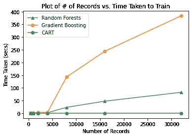
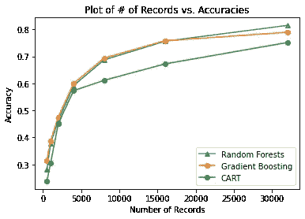

# 论数据在训练机器学习算法中的重要性——第二部分

> 原文：<https://medium.com/analytics-vidhya/on-the-importance-of-data-in-training-machine-learning-algorithms-part-two-aeb86dba509?source=collection_archive---------10----------------------->

在这个博客系列的第一部分[中，我们讨论了探索数据特征的动机，并介绍了我们将要使用的数据集。我们在上一篇文章中看到了 BestBuy 数据集的数据分布和特征。](https://krtk.medium.com/on-the-importance-of-data-in-training-machine-learning-algorithms-part-one)

# 实验装置

在本帖中，我们将更深入地探讨使用越来越多的记录来训练数据集的效果。如前所述，我们将保持分类器和测试记录不变，同时改变用于训练的记录数量。

一旦我们为一个分类器做了这些，我们将改变分类器并重复这些步骤。这将确保我们可以使用不同的算法，确认可用于训练的记录数量对最终指标的影响。

假设我们的 BestBuy 数据集中有大约 48000 条记录，我们将重组数据集并保留大约 8000 条记录进行测试。我们可以通过下面的*熊猫*轻松实现这一点:

```
"""
Splits a panda dataframe in two. Test split remains a constant.
"""dataset = dataset.sample(frac=1.0, random_state=1729)test_dataset = dataset[40000:]train_dataset = dataset[:num_train]
```

通过将 *random_state* 的值设置为一个常数，我们可以确保测试集是随机的，而且每次通过这种方法加载数据集时都是相同的。你有什么不同的建议吗？

# 数据集上的训练

正如上一篇文章中提到的，我们将使用 TensorFlow 决策树来训练不同的算法——随机森林、梯度提升决策树和 CART 模型。让我们快速看一下张量流决策树提供了什么:

> **TensorFlow 决策森林** ( **TF-DF** )是 TensorFlow 中可用的决策森林( **DF** )算法的集合。决策森林的工作方式不同于神经网络( **NN** ): DFs 通常不通过反向传播或小批量进行训练。因此，TF-DF 管道与其他 TensorFlow 管道有一些不同。

*TF-DF 框架的关键特征之一是它不是训练神经网络。*这自然意味着它不会因为过度参数化而陷入过度拟合数据的陷阱。这样做的结果是，数据不需要分成训练集、有效集和测试集，而只需要分成训练集和测试集。不需要用于验证的数据，因为框架不必监控它是否可能过度适应它正在被训练的数据。

请记住，如果您自己使用 TF-DF 算法进行超参数优化，那么将数据分成训练集、有效集和测试集可能是合理的。

使用这一框架的下一个特点是不需要打乱数据集或改变批量大小。与传统的神经网络不同，这种框架不会批量处理数据以从中学习，而是将完整的数据集读入内存以从中学习。虽然这对于从更大的数据集进行学习可能是一个问题，但对于可以在训练时间方面适合内存的数据集来说，它提供了相当大的优势。

*TF-DF 的作者建议，在大型数据集上进行训练的最佳实践是使用训练数据的子集来查看对性能和内存含义的影响。*这种方法背后的基本原理是增加数据集大小的收益递减。

作者指出的其他一些要点如下:

*   不要使用要素列转换数据
*   不要预处理特征
*   不要标准化数字特征
*   不编码分类特征
*   不要用幻值替换缺失的特性

虽然上述观点可能与机器学习课程中教授的内容完全矛盾，但作者在这里提出的原因是，该框架具有内置的功能，可以完成每个算法所需的所有转换、规范化和预处理，从而使预处理步骤变得多余。

# TL；博士—给我看看结果

如果你在这之前一直在阅读这篇文章，那么恭喜你。你已经等待了，会得到回报的。我们将查看结果，然后了解算法是如何实现这些结果的。

我们将看到的第一个比较是记录数量对可以用 TF-DF 训练的三种算法的影响。



记录数量对列车时间的影响

在上面的图中，我们看到，随着更多数量的记录被训练，梯度提升决策树需要明显更长的时间来训练，而随机森林模型在训练时间方面是非常合理和线性的。另一方面，CART 似乎具有相当低的训练时间值，如果性能指标也足够有竞争力，则使其成为对抗神经网络的可行候选。



记录数量对模型准确性的影响

在上面的图中，我们看到了指标(这里是准确性)与记录数量的比较。注意到所有三种算法在记录数量非常低之前表现得非常相似，这确实令人着迷，因为我们知道我们可以多快地训练该模型，所以给了 CART 模型相当大的优势。随着记录数量的增加，我们可以看到 GBDT 和 RF 开始超越。当我们使用 32000 条记录时，随机森林似乎在精确度和所需训练时间方面胜出。

# 构建模型和地块

在这篇文章中，我们已经用 BestBuy 数据集看了不同模型的图和分数。在下一篇文章中，我们将看看如何建立这些模型和情节。我们还将提出一个新的衡量标准，以评估机器学习模型在用这样的数据集进行训练时的可持续性。

你已经有什么想法了吗？你想看看不同的图来评估这些算法的性能吗？让我知道你的想法。

# 接下来呢？

我将在下一篇博客中分享代码以及我是如何构建这些实验的。如果你有兴趣看这个，你可以去看看这个系列的第三部分[。](/analytics-vidhya/on-the-importance-of-data-in-training-machine-learning-algorithms-part-three-db5c803e59e9?source=user_profile---------0----------------------------)