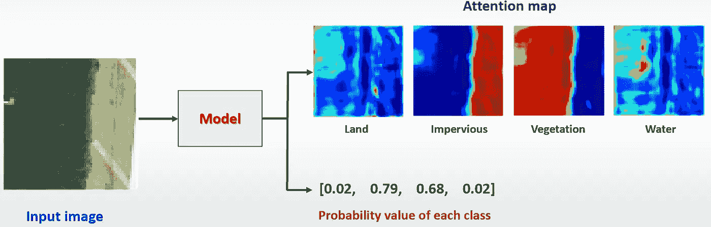
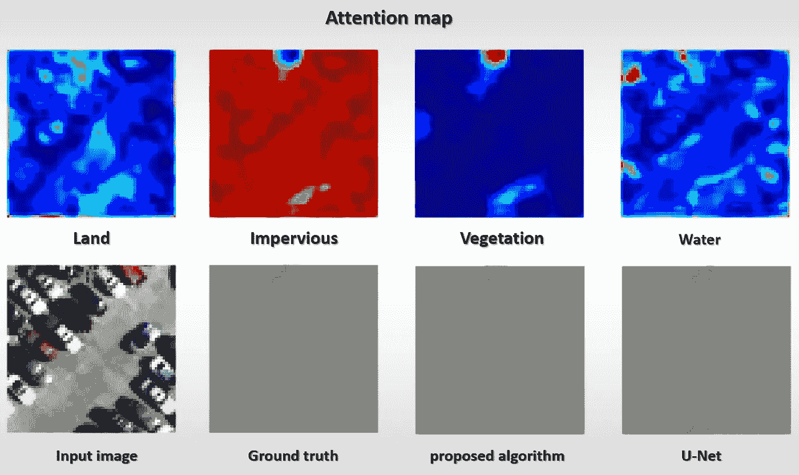

# 注意图在土地覆盖制图中的应用

> 原文：<https://medium.com/analytics-vidhya/on-the-use-of-attention-map-for-land-cover-mapping-4aebb59885cd?source=collection_archive---------19----------------------->

今天我就来回顾一下我的工作，也就是我在读硕士时的论文。这项工作将是关于在**遥感**领域实现 **AI** 。我将简要描述什么是遥感，以及如何在这项工作中使用它。

# 介绍

R 遥感是在不与物体或现象发生直接身体接触的情况下获取关于该物体或现象的信息。遥感应用于许多领域，尤其是地理领域。土地测量和地球科学，如水文学、生态学、海洋学、冰川科学和地质学，包括军事秘密服务、贸易、经济、规划和人道主义用途

遥感

目前，遥感一般是指利用大气传感技术，通过电磁波等波的分布原理，对地球海洋表面和地球大气层的物体进行探测和分类。当飞机或卫星自发射时，这可归类为主动遥感。或者通过接收来自诸如太阳光的其他能量的反射的信息的自供电遥感(被动遥感)。

所以，我们最熟悉，离我们最近的遥感。是一个普通的相机，因为我们可以获得物体的信息，如颜色，纹理，特征。不接触物体

目前，卫星图像在许多领域都是有益的和必不可少的。天气预报使用卫星图像来分析地球大气的变化。灾害管理使用卫星图像来确定和评估情况，以便制定及时和适当的对策。政府可以利用卫星图像进行作物监测，以制定更好的农产品价格政策。因此，我们看到卫星图像是有益的，因为它们可以应用于许多任务。目前，图像或计算机视觉中的人工智能研究受到了很多关注。已经开发了硬件和软件来加速图像分析任务。人工智能中最有影响力和最受欢迎的技术之一是深度学习，它被用作许多任务的主要结构。有了这项技术，人工智能可以更好地处理问题。比以前的技术更高的准确性，因此，我们在这项工作中使用了卫星图像的**深度学习**技术。

在这项工作中，我们设计了一个卷积神经网络训练模型，以减少资源，标记数据用于训练**分割，或卫星图像，土地覆盖测绘**地球表面的物体。这个过程就是给图像的每个像素分配一个类。我们将指定图像的哪些区域是什么类型的对象，因为卫星图像通常很大，可以收集很多信息。由于它是来自一直在轨道上运行的卫星的图像集合，即使它可以存储许多数据，标记也需要很多时间，并且需要专家仔细完成。为训练模型准备数据需要花费很多时间。而且，有时候有质量标签的数据很难找到。因此，我们调整了模型训练。通常，在一般模型中， **U-Net 使用像素级标签为图像中的每个像素指定类别**。那需要很多时间和努力。然而，在我们的工作中，我们已经适应了简单地通过说图像是否有出现的类来标记。这让我们节省了时间和专业知识。

为了实现这个目标，我们使用**注意力层**来分离每个类，以创建用于土地覆盖制图的**注意力地图**。注意层包含在模型结构中。让它在训练的时候跟着模型学习。最后，我们将通过该过程获取注意力图，并将其转换为分段图像。

你会发现这是一项需要大量时间的任务。在每个位置识别班级。图像体积越大，细节越高，花费的时间就越多

# **目标**

因此，从前面已经提到的介绍中可以看出，这项工作的主要目的如下:

> 通过减少用于模型训练的标记资源，使用深度学习设计用于卫星图像的土地覆盖制图的模型。

1.  以减少数据标记的时间。
2.  来分割图像而不需要标记每个像素。
3.  设计一个卷积神经网络架构，使用**“注意力地图”绘制土地覆盖图**

# 材料和方法

> ***1。数据集***

我们的实验使用了加州大学默塞德分校土地利用数据集(杨和纽萨姆，2010 年)的图像。该数据集是从美国地质调查局国家地图的大图像中分割出来的。该数据集中的图像包含 2100 幅图像和 256 x 256 像素，分辨率为 0.3 米。所有图像都是在 RGB 颜色空间中捕获的，在该数据集中，17 个土地覆盖类别包括飞机、建筑物、汽车、法院、码头、活动房屋、路面、船舶、坦克、海洋、水、裸土、沙子、灌木、田野、草地和树木。

我们在这项工作中使用的数据集被称为 UC Merced 土地利用数据集，这是一个 3 分支卫星图像，分辨率为 30 厘米的 RGB。

> ***2。数据预处理***

2.1 合并相似的类

由于训练图像数量有限，我们将它们从 17 个类别分为 4 个土地覆盖类别:不透水、水、土地和植被。

> ***【不透水(人造)*** *包含飞机、建筑、汽车、法院、码头、活动房屋、路面、船只和坦克。*
> 
> ***水*** *包含海和水。*
> 
> ***土地*** *包含裸露的土壤和沙土。*
> 
> ***植被*** *包含灌木、田野、草地和树木。*

我们合并类是因为与每个类中的数据量相比，数据有太多的类。这就是为什么我们几乎没有数据来训练模型。所以，我们把意义相似的类组合起来。此外，这也使模型更容易学习，因为较少的类减少了模型混乱。而且，还能解决阶层失衡的问题。

将 17 个相似的班级合并成 4 个班级

> ***3。数据规范化***

在这项工作中，可以通过多种方式进行标准化，通过使用标准化来缩放图像的像素值，标准化是从红、绿、蓝图像的每个通道计算的。通过找到所有数据的每个通道的平均值和标准偏差来计算，使用这种方法，我们发现结果比缩放到 0-1 范围更好，并且我们假设我们的训练数据足够大，可以代表测试数据，因此我们将使用从训练数据计算的相同平均值和标准偏差来缩放测试数据

我们发现这种方法是标准化的，通过对通道分别计算 RGB 得到更好的结果

> ***4。分割图像***

我们的网络必须自己学习图像中的观察数据和类别标签之间的对应关系。我们必须有一个数据集，其中一些训练样本有一个或两个土地覆被类。如果所有训练数据的所有土地覆盖类别都出现在所有图像中，我们的网络将不会了解类别之间的差异。为了实现这一目标，我们将所有图像和生成的地面实况划分为 64 x 64 像素的较小尺寸，总共生成 33，600 幅图像

将图像从 256x256 分割成 64x64

让我们来看一个例子，如果每幅图像一直由狗和猫组成，那么在狗和猫之间进行分类。而我们的标签是形象级的，也就是说只是告诉一只狗或者猫是什么形象出现的。而且模特之前不认识狗和猫。那会混淆模型，无法分辨那什么叫狗或猫？但是，如果我们有一只单独的狗和一只单独的猫的图像，最终，模型将学会区分狗和猫的特征。

> ***5。使用*** 中的类来标记图像

由于我们的工作不需要像素标签，我们必须说明图像中出现了哪些类。因此，我们可以通过执行一键编码从逐像素标签创建一个新标签

使用基本事实中的类别标记图像

因此，如果图像大小是 64x64 像素，如果在 1 个图像上使用像素级标签，将需要 4096 个标签，而图像级标签仅在 4 个标签中使用，其中我们有 4 个类。可以看出，它随着类的数量而不是图像的大小而变化，因此，在 1 个图像中，需要 1024 倍以上的像素级标记工作。

> **⑥*。提议的模型架构***

在这项工作中，我们提出了一个神经网络，通过分割一个基于图像，只有**存在或不存在**的土地覆盖类别来指定感兴趣类别的定位。**这一过程不需要像 U-Net 那样逐个像素地标记，也不需要像更快的 R-CNN 和 YOLO 那样的边界框标记**。我们论文中使用的网络。这里，我们包括了一个来自 ResNet 和 NIN(网络中的网络)的概念模型，其中使用跳过卷积层来避免大小为 1 × 1 的滤波器的渐变消失。全局平均池(GAP)也用于包含预测要素，而不是完全连接的图层，从而保留要素地图图层的空间信息。GAP 也作为一个正则化器来防止网络过度拟合。该模型并没有减少太多的图像大小，因为我们希望调整大小，以保持空间分辨率。卷积层使用大小为 3×3 的滤波器，所有卷积层之后分别是批量归一化和 ReLU 激活函数。

提议的网络

我们的模型结构是深度学习。该模型分为两部分，用于特征提取或基本网络和注意力映射。在寻找决策图、注意力图和特征图中，逐个元素相乘。注意力地图使用 softmax 激活功能，频道数量等于类别数量。(在我们的例子中，四个用于陆地、不透水、植被和水)我们的模型将在训练后将每个类别分配给注意力地图中的每个不同通道。因此，关注层和要素层之间的区别在于**关注层后跟 softmax 激活函数，将被估计为概率图，其中每个像素值在 0–1 之间**

softmax 激活函数用于映射每个通道中的注意力图的值，以使跨通道的值的组合等于 1

softmax 激活函数用于映射每个通道中的注意力图的值，以使跨通道的值的组合等于 1，因为我们想要将每个通道分离为每个类，所以每个通道的每个像素值是概率

换句话说，在关注层上，我们使用 softmax 激活函数来估计概率，该概率将在 0-1 的范围内，因此在特征图乘以关注层的任何位置，如果概率接近 0，则该特征不通过。但是如果概率值接近 1，那么它将通过

使用过滤后的要素进行决策时，我们发现在空间要素上使用 softmax 激活函数来转换为概率值可获得最佳结果。由于每个通道都被映射到一个类输出，这使得模型学会将每个通道映射分离到我们通过正确标记定义的类的顺序。类别的顺序分别是土地、不透水层、植被和水。此外，如果我们在最终输出时使用 sigmoid 激活函数，模型可以正确地预测表观类别，注意图将丢失空间数据。此外，该模型不能像我们适当分配的那样分离每个通道。

此外，我们使用全局平均池和全局最大池来总结特征，并通过平均来合并它。与仅使用全局平均池和全局最大池相比，这种方法可以提供最佳结果。全局平均池给出了汇总特征，该特征可能不指示使模型难以对类别进行分类的独特特征。然而，这可以强制注意层能够保留空间特征，并且全局最大池给出了使模型分类的唯一特征；但是，这会使注意力图层忽略空间要素，而只关注最终输出，因此，正确的方法是将其合并。

比较这三种方法，结果最好的方法是第三种方法

在这里，注意力地图充当过滤器，以启用或禁用通过决策过程的特征地图提取的特征。因为特征图和注意力图具有相同的尺寸和通道数量，并且乘法层是它们之间的元素式乘法。每个特征图都有对应的注意力图。因此，如果与土地覆盖类别(比如 A)相关联的关注图的一个通道中的像素具有零值，则在该像素中从特征图中的相应通道提取的特征将被消除。因此，关于存在的最终决定将不会具有关于该像素中来自类别 A 的特征的任何信息。相反，如果相同的像素和相同的通道具有值 1，那么将根据具有类别 a 的特征的该像素中的信息做出最终决定。根据这一思想，很明显，如果基础类别的特征存在于该像素中，则注意力图在给定像素中将具有值 1

注意层充当过滤器，以启用或禁用通过决策过程的特征图提取的特征

> ***7。*土地覆盖制图(分割)**

对于来自关注图的土地覆盖制图，关注图中的通道数量等于类别数量。我们比较每个类别的像素值或每个注意力图，并使用最高值来指示土地覆盖类别。因此，每个像素被指定为

比较每个注意力图的像素值，并选择最高值来指示类别

> ***其中𝑆(𝑥、𝑦)是像素的类(𝑥、𝑦)，而𝐴𝑐是𝑐.类的注意力图***

获取土地覆盖图的步骤包括以下主要步骤。第一步是将输入图像输入到模型中。为了获得输出，我们的模型将能够提供两种输出。一个是每个类别在图像中出现的概率和每个类别的注意力图，我们将把注意力图带到一个过程，以再次获得土地覆盖图。第二步比较每个注意力图的像素值，并选择最高值来指示类别。

土地覆盖制图过程始于将图像输入模型。我们将把它设置为模型输出的注意力地图。

我们比较每一层的像素概率值，并选择最大概率值为该像素分配一个类别。这就是我们通过将颜色映射到每个类，以颜色的形式显示的结果。

# 结果

我们的模型和 U-Net 提供了分割图像或土地覆盖制图，我们将测量我们的模型在图像级和像素级精度方面的性能。相比之下，Kappa 系数仅用于像素级精度。桌子。1 和表。2 分别提供 107，520 的图像级和像素级精度。可以看出，我们的算法明显优于 U-Net，因为我们的算法中的 107，520 个标签对应于 26，880 幅图像。相比之下，U-Net 只用了 27 张图片。

桌子。1 和表。2 分别提供 107，520 的图像级和像素级精度。可以看出，我们的算法明显优于 U-Net，因为我们的算法中的 107，520 个标签对应于 26880 幅图像。相比之下，U-Net 只用了 27 张图片。

**表 1** 相同标签数量下的图像级整体准确率

**表 2** 像素级精度标签数量相同

接下来，我们检验了我们的算法和 U-Net 对于不同数量的训练样本的性能。从表中。3，可以容易地看出，随着训练样本数量的增加，两种算法都表现得更好。然而，U-Net 算法在标记过程中需要更多的努力。在 100%的训练样本下，U-Net 和我们的算法之间的总体精度差异小于 3%，而 U-Net 需要大约 1000 倍以上的标记。

**表 3** 像素级精度与训练样本大小的函数关系

在表中。4、我们考察了类级精度。我们发现，在 100%训练样本下，U-Net 的 F-1 分数略高于我们提出的方法。请再次注意，U-Net 需要大约 1000 倍以上的贴标过程。

**表 4**

我们还研究了图像大小对准确性的影响。由于图像很大，所以图像包含两个或更多类的可能性更大。如果所有训练图像都同时包含土地和植被，我们的算法无法找到这两个类别之间的不同特征。更具体地说，很明显，土地和植被有棕色和绿色。我们的算法看到棕色和绿色，并且只知道图像中有植被和土地，但它不能将棕色与土地联系起来，绿色与植被联系起来。桌子。5 证明了我们的假设，随着图像尺寸越来越大，我们的算法的精度下降，而 U-Net 的性能大致不变。

**表 5**

绘制所需标签数量与总体精度的关系。很明显，如果只需要 80%的 OA，我们的算法可以节省大约 1000 倍的标签数量，这可以节省准备训练样本的数天或数周。

**从图中可以明显看出，如果要求 80%的准确率，我们的方法可以节省大约 1000 次的数据标注。这样既能节省资源又能节省时间和金钱**

定义代表每个类别的颜色

> **这是最终结果，100%样本数量的土地覆盖制图或图像分割(与 U-net 相比，我们的方法使用的标签数量不到 1，024 倍)。**

(a)陆地的注意地图，(b)不透水层的注意地图，(c)植被的注意地图，(d)水的注意地图，(e)观察图像，(f)地面实况，(g)提出的算法，(h) U-Net，(陆地:棕色，不透水层:灰色，植被:绿色，水:浅蓝色)(来自测试集的结果)

(a)陆地的注意地图，(b)不透水层的注意地图，(c)植被的注意地图，(d)水的注意地图，(e)观察图像，(f)地面实况，(g)提出的算法，(h) U-Net，(陆地:棕色，不透水层:灰色，植被:绿色，水:浅蓝色)(来自测试集的结果)

(a)陆地的注意地图，(b)不透水层的注意地图，(c)植被的注意地图，(d)水的注意地图，(e)观察图像，(f)地面实况，(g)提出的算法，(h) U-Net，(陆地:棕色，不透水层:灰色，植被:绿色，水:浅蓝色)(来自测试集的结果)

(a)陆地的注意地图，(b)不透水层的注意地图，(c)植被的注意地图，(d)水的注意地图，(e)观察图像，(f)地面实况，(g)提出的算法，(h) U-Net，(陆地:棕色，不透水层:灰色，植被:绿色，水:浅蓝色)(来自测试集的结果)

(a)陆地的注意地图，(b)不透水层的注意地图，(c)植被的注意地图，(d)水的注意地图，(e)观察图像，(f)地面实况，(g)提出的算法，(h) U-Net，(陆地:棕色，不透水层:灰色，植被:绿色，水:浅蓝色)(来自测试集的结果)

(a)陆地的注意地图，(b)不透水层的注意地图，(c)植被的注意地图，(d)水的注意地图，(e)观察图像，(f)地面实况，(g)提出的算法，(h) U-Net，(陆地:棕色，不透水层:灰色，植被:绿色，水:浅蓝色)(来自测试集的结果)

# 结论和建议

> ***结论***

提出了一种新的利用关注层的遥感图像土地覆盖制图算法。我们的方法的优点是，通过识别整个图像中土地覆盖类的存在和不存在，训练集只需要标记每幅图像四次，而不是标记图像中的每个像素。这种标记过程使得大量的训练集能够被快速开发。为了实现这一目标，我们设计了我们的网络，使得每个注意力层通道对应于一个且仅一个土地覆盖类别。因此，注意层充当开关，允许来自特征提取层的信息通过最终决策过程。因此，只有具有给定土地覆被类别的强存在的像素可以通过。我们用 U-Net 测试了我们算法的性能。**我们发现，在标签数量相同的情况下，我们的算法可以获得 82.86%的整体像素级准确率，而 U-Net 只能获得 59.71%。**

> **推荐 **

我们发现我们的模型可以处理少量类别的图像。此外，对空间细节和类位置的处理很差，因为我们使用的标签只告诉该类它是否出现。因此，用于训练模型的信息非常少。此外，该模型没有学习图像中的类的空间位置或每个类的密度。

此外，由于这个原因，虽然我们的模型的概述工作令人满意。此外，在与 U-Net 相同数量的标签下获得高精度，但这可能是因为在测试数据集中，图像在单个类中高达 30%,而 U-Net 更好地处理空间分辨率和位置，因此为了使我们的模型更好地工作并解决上述问题，我们可能需要找到其他方法来提高模型的精度。潜在的方法是**主动学习**，也就是如果我们需要做更多的标注。我们如何获得聪明有效的标签？我们如何选择

主动学习

实现这一点的方法可能是对每个数据及其标签给予同等的重视。我们可以对最重要的数据进行优先排序和标记，这很可能有助于模型更好地运行。因为如果我们不进行优先排序，假设所有信息都是平等的，我们有时会发现，在随机选择数据进行训练时，有时结果是有用的。而且，有时候错了。所以，每个数据都不一样。但是，这也取决于我们面临的问题。我们希望找到一个优秀的代表数据，用简单的术语来训练模型。

因此，对于我们的方法，我们最初只是说哪些类存在。这允许我们使用少量的标签来训练模型。这给了我们一个基线模型。我们将使用这个模型来确定数据的重要性。然后，我们选择标记数据，并用更多新数据训练新模型。然后重复这个过程循环。这将使模型开发过程更加高效。当我们考虑标注数据所需的资源时。具有增强的模型性能

有几种方法来区分要标记的数据的优先级。例如，所谓的最小置信度方法是指我们使用一个模型来预测未标记的数据。然后，当我们得到答案时，选择模型预测属于该类的每个数据的最大概率。然后，将这个最大概率值按升序排序，这样我们就对每个要标注的数据进行了优先级排序。由于预测模型的可信度较低，我们将选择先标记低概率数据。这意味着模型仍然与这些数据相混淆。

此外，我们没有很好地学习或具有一些使模型难以学习的特征。因此，如果我们标记这些数据，它应该有助于模型更好地整体学习。当处理简单的数据时，它应该工作得很好。或者，面对复杂数据时。它应该工作得更好，因为我们可以在培训中添加额外的标签。

我们遇到的数据集的另一个问题是我们通过组合类来处理的类不平衡问题。此外，执行减肥功能，但有其他方法可能会有所帮助，如过采样和欠采样。然而，它可能会丢失一些数据，但可能会使模型工作得更好。

而且，另一个可以尝试的问题是基网络的自适应(特征提取部分)。我们已经做了一些实验，但在有限的时间内不可能对假设进行充分的检验。看到这种改进的意义，但就我所知，我试图认为有一定的

最后感谢大家的关注，希望对感兴趣的人多多少少会有好处。如果有任何错误，我也在此道歉。

# 参考

[1][https://ieeexplore.ieee.org/document/9158220](https://ieeexplore.ieee.org/document/9158220)