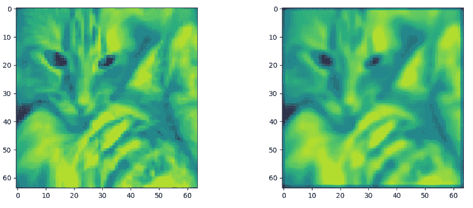

# 卷积神经网络中卷积层的向量化研究

> 原文：<https://medium.com/analytics-vidhya/on-vectorization-of-convolution-layer-in-convolution-neural-networks-cnns-1775cb4d30e6?source=collection_archive---------3----------------------->

**拆箱！**

在深度学习中，**卷积神经网络** ( **CNN** ，或 **ConvNet** )是深度神经网络的一类。CNN 在许多应用中表现出卓越的技术性能，例如图像和视频识别、推荐系统、图像分类、图像分割、医学图像分析和自然语言处理。

**图 1:卷积神经网络。**

**在本文中，我将只关注单个卷积层的矢量化，而不是整个卷积神经网络。**

# **卷积运算**

在图像处理中，核、卷积矩阵或掩模是一个小矩阵。它用于模糊、锐化、浮雕、边缘检测等。这是通过在内核和图像之间进行卷积来实现的。

卷积是一种矩阵运算，由一个核(一个小的权重矩阵)组成，它在输入数据上滑动，与输入数据所在的部分执行逐元素乘法，然后将结果相加得到一个输出。

在数学(特别是泛函分析)中，**卷积**是对两个函数( *f* 和 *g* )的数学运算，产生第三个函数(f * g ),表示一个函数的形状如何被另一个函数修改。矩阵卷积的一般形式由下式给出:

**图二:矩阵卷积【1】。**

直观地说，卷积允许权重共享(减少有效参数的数量)和图像平移(允许在输入空间的不同部分检测到相同的特征)。

卷积运算的 3D 可视化可以如下所示:

**图 3:卷积运算的三维可视化。**

根据核的类型，可以从输入图像中提取不同的特征。

**图 4:常用滤镜【1】。**

卷积运算的输出通常被称为**“特征图”**。

**图 5:卷积特征。**

这种卷积运算是卷积神经网络的主干。

# **让我们进行代码卷积运算**

针对单个输入图像的简单卷积运算的 Python 代码如下所示:

**图 6:用于单个输入图像的卷积操作的代码。**

上述操作将给出以下结果，

**图 7:原始图像(左)和高斯模糊(右)。**

但是上述实施将仅对一个输入图像执行卷积，**如果我们将多个图像输入到网络中(例如小批量)**会怎样？显然，我们想到的最简单的方法就是简单地在整个迷你批处理中循环上面的操作。假设 2D 背景和白色图像，与具有 3 个通道(RGB)(例如(28，28，3))的彩色图像相比，它具有 1 个通道(例如(28，28，1))。因此，上述设置的代码看起来会像这样，

**图 8:多个输入图像的卷积运算代码。**

让我们将此应用于手写数字——MNIST 数据集。MNIST 数据集由 60，000 张 28 x 28 的训练图像组成。输入大小将是(60000，28，28，1)。在应用具有 3 x 3 x 1 的内核大小和 32 个过滤器(输出通道)的卷积层之后，该层的输出将是(60000，26，26，32)。

具有 32 个不同过滤器的卷积层的输出看起来像这样，

**图 9:带有 32 个滤镜的卷积层的输出。**

但是考虑到数据集中所有输入图像(MNIST 的 60000 张图像)的循环，上述实现方法将会非常慢。因此，上述方法并不是最突出的方法，为了更好地理解和便于并行实现，**矢量化方法是关键**。训练和测试深度细胞神经网络的关键步骤被抽象为矩阵和向量算子，在此基础上可以很容易地实现并行。

考虑到 5000 个图像的**小批量**，上述实现花费 **658.169 秒。**随着输入图像数量的增加，运行时间也呈指数增长。

# 向量化卷积的策略

矢量化是指将原始数据结构转换为矢量表示的过程，以便标量运算符可以转换为矢量实现。

考虑具有 3 个不同的 2×2 滤波器的 3×3 的输入图像，在卷积运算期间，每个滤波器将在相同的输入图像上运行，并将产生 2×2 的输出特征图。因此，3 个不同的过滤器将产生 3 个“特征图”。有一种方法可以将这个操作矢量化。

向量化上述操作的步骤包括，

1.  将所有内核/过滤器转换为行，并获得一个内核矩阵。
2.  将你的输入(图像)分割成切片进行卷积，然后转换成列，得到一个输入矩阵。您可以附加其他输入(图像)以形成小批量
3.  将输入矩阵与核矩阵相乘。在结果矩阵中，每一行都是一个特征图。

**图 10:向量化卷积的策略。说明了用三个 2x2 内核卷积一个 3×3 输入图像并生成三个 2x2 特征图的方法[2]。**

类似的策略被用于实现，并且用于 32 个不同滤波器的输入大小(5000，28，28，1)的代码将看起来像这样，

**图 11:展平输入图像**

**图 12:对多个输入图像的卷积操作进行矢量化的代码。**

上面的实现产生了类似的输出，但是现在实现运行时间减少到只有 **1.511 秒**，

**图 13:带有 32 个过滤器的矢量化卷积层的输出。**

要了解更多细节，我建议读者看看 Jimmy SJ 的论文**“关于视觉任务的深度卷积神经网络的矢量化”。和许。**

# **总结**

在本文中，我阐述了深度卷积神经网络(CNN)中卷积层的矢量化是如何工作的。矢量化是减少总运行时间的关键。

# **参考文献**

[1]https://en . Wikipedia . org/wiki/Kernel _(image _ processing)

[https://en.wikipedia.org/wiki/Convolutional_neural_network](https://en.wikipedia.org/wiki/Convolutional_neural_network)

[3] [吉米 SJ。许。用于视觉任务的深度卷积神经网络的向量化。](http://lxu.me/mypapers/vcnn_aaai15.pdf)