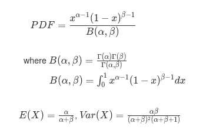
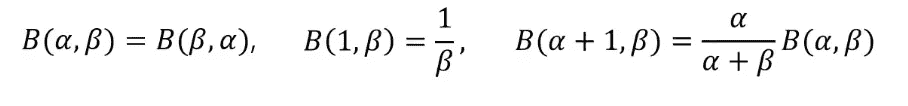
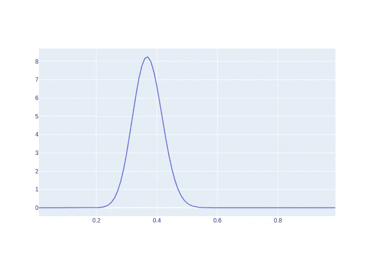
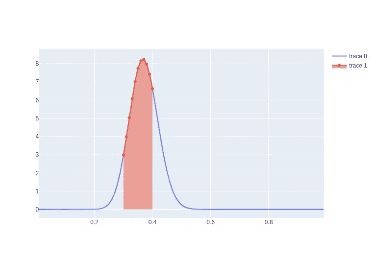
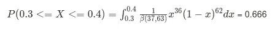

# 再一次，贝塔分布

> 原文：<https://medium.com/analytics-vidhya/once-again-beta-distribution-db467a7eded0?source=collection_archive---------2----------------------->

Haneul Kim 摄

# 目录

> 1.[简介](#9646)
> 
> 2.[什么是贝塔分布？](#d71e)
> 
> 3.[举例](#9c89)

# 介绍

很久以前，在一次数据分析师职位的面试中，有人问我一个问题“为什么在贝叶斯定理中使用贝塔分布”。那时我从未听说过贝塔分布，所以我记得我说“我不知道”。最近在工作中，在开发汤普森采样和上下文土匪贝塔分布再次出现。所以现在我决定更深入地研究贝塔分布，真正彻底地理解它。

我们将只关注统计观点，因此强化学习和汤普森抽样的知识是不必要的。

# 什么是贝塔分布

贝塔分布是表示概率的连续概率分布，**随机变量是概率**。

常用于解决搜索概率的问题“拥有小于 10%的缺陷的概率是多少？”“在掷硬币中获得少于 20%正面的概率？”、“广告点击率在 30%~40%之间的概率”等…

这里是概率密度函数、期望均值和方差的公式(不要担心，我们将通过一个例子来复习它们)。

和贝塔分布的性质

# 例子

因为我在一家广告技术公司工作，所以让我们坚持“一个广告(真实点击率为 34.3%)的点击率在 30%-40%之间的概率”(希望我的老板看到这一点)。

广告上个月的点击率是 34.3%，这个月还没有过去，因此我们必须在收集更多数据时更新我们的初始概率(先验)。

使用 CTR = 34.3%作为真实 CTR，让我们进行模拟。因为我们处理的是点击率，所以可以用二项式分布来表示，1 表示点击，0 表示不点击。每当点击发生时，我们将α增加 1，如果没有发生，我们将β增加 1，这允许随着新数据进入而连续更新先前概率。

我们将实例化属于 Ad 类的 Ad1 对象，并向用户显示 Ad1 次，以查看它的执行情况。

当我们的 Ad1 显示 50 次时，我们得到 alpha=20 和 beta=30，结果 ctr=0.4，随着我们显示更多的 Ad1，其 ctr 越来越接近真实 CTR 0.343。随着我们收集更多的数据，我们将越来越接近真实的 CTR。为简单起见，我们假设 CTR 是稳定的，但请记住，在现实世界中，CTR 是不稳定的，我们必须添加某种权重因子 w.r.t .时间，以赋予更新的数据更多的重要性。此外，实际上真实的 CTR 是未知的，因此使用模型进行预测。

现在我们用得到的α，β值来绘制β分布。

α= 37，β= 63 的β分布

所以要回答我们的问题，我们需要计算 0.3~0.4 之间的面积

将数字代入公式，我们得到:

因此，真实点击率为 34.3%的 Ad1 的点击率在 30%~40%之间的概率为 66.6%。

随着我们收集越来越多的数据，我们的 beta 分布将变得更窄，这意味着我们对自己的估计更有把握。这也可能导致问题，因为随着试验(广告显示)数量的增加，需要更大的数据来影响先验概率，因此它在反映新趋势方面变得更慢。为避免此类问题，您需要在每个`n`显示中包含权重因子 w.r.t .时间或重置 beta 分布参数。

# 结论

贝塔分布在贝叶斯定理中是一个重要且非常有用的分布，因为使用贝塔分布的先验输出贝塔分布作为后验分布，这给计算带来了巨大的好处。在下一篇博客中，我们将解释贝叶斯定理以及为什么选择贝塔分布作为它的先验分布。

谢谢，如果有任何不正确的信息，请评论！

**参考文献:**

*   [Beta 版——斯坦福 CS109](https://web.stanford.edu/class/archive/cs/cs109/cs109.1166/pdfs/22%20Beta.pdf)
*   [贝塔分布背后的直觉——栈交换](https://stats.stackexchange.com/questions/47771/what-is-the-intuition-behind-beta-distribution)
*   [连续概率分布(γ，β)—高丽大学](https://www.youtube.com/watch?v=RNkT4YG8B3A&list=PLpIPLT0Pf7IqS4as3nefPyGv94r2aY6IT&index=11)
*   [贝叶斯统计— MIT18.650](https://www.youtube.com/watch?v=bFZ-0FH5hfs)