# 一个热编码和危险功能

> 原文：<https://medium.com/analytics-vidhya/one-hot-encoding-and-hazard-function-dd28f9c0505b?source=collection_archive---------36----------------------->

一种热编码是一种过程，其中分类变量被转换成一种形式，该形式被馈送给机器学习算法以进行更准确的预测。

我在一个由我策划的虚拟数据上演示了这个概念。

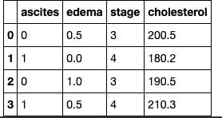

在这个样本数据集中，“腹水”、“水肿”和“分期”是分类变量，而“胆固醇”是连续变量，因为它可以是任何大于零的十进制值。

在这个数据集中，我对水肿列应用了一个热编码，因为它有三个类别。这个列上的一个热编码将为每个可能的结果创建特征列。我也将这种技术应用于 stage 列，因为它们不是 0 和 1 的形式。

热编码'阶段'

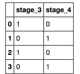

查看上表，它显示其中一个要素是冗余的，因此为了避免多重共线性，我删除了其中的列。

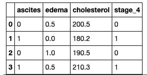

我将 one hot 编码值转换为小数，因为模型希望以某种数据类型将这些值提供给它。我将“stage_4”列重命名为“stage ”,然后使用 numpy 将值转换为 float64 数据类型。

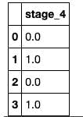

# 预测:

使用上述数据集，我使用风险函数预测了新患者的风险

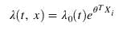

其中:

θ是 Xi 特征的系数，λ(t，x)是病人的危险度。

我用特征乘以系数。

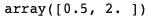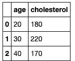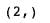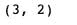

该系数是一个 1D 数组，所以我转置了 X

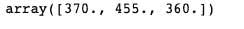

最后我预测了三个病人的危害。

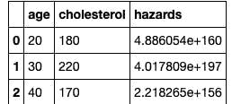

# 结论:

我相信我已经理解了一个热编码意味着什么以及如何去做。这是[代码](https://github.com/Nwosu-Ihueze/ML-projects/blob/main/hazrads.ipynb)，你可以在 [LinkedIn](https://www.linkedin.com/in/rosemary-nwosu-ihueze/) 上与我联系。感谢您的阅读。