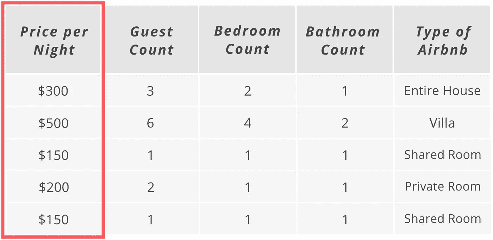
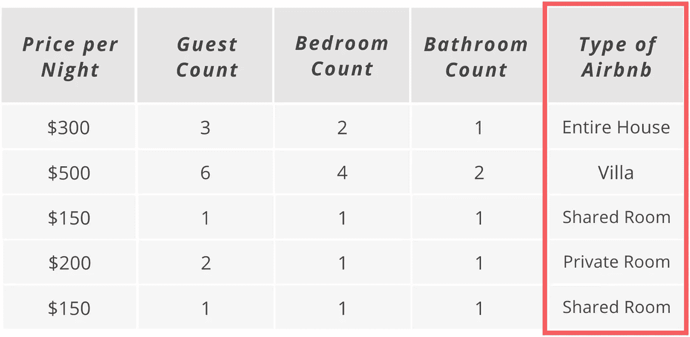
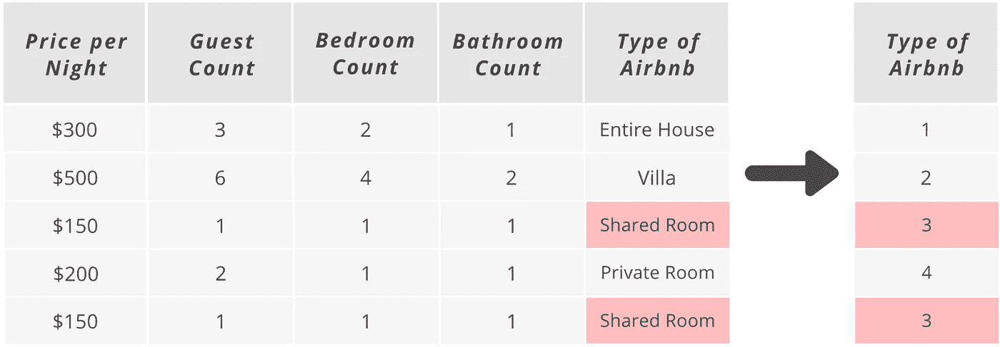
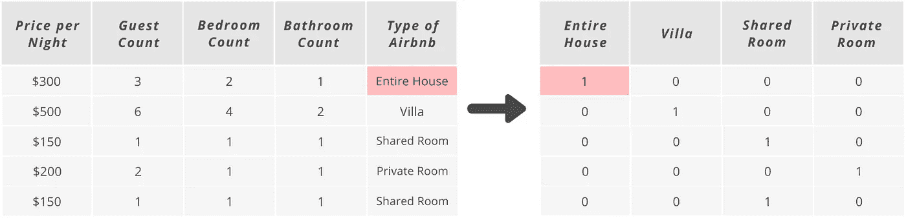
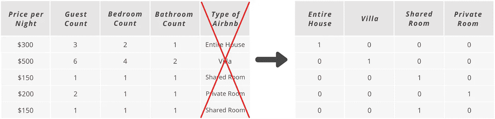
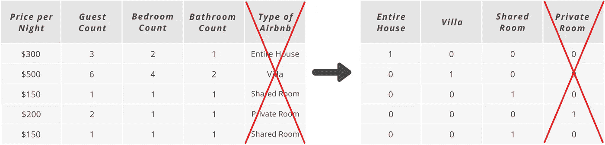

# 一次性编码分类变量——是什么？为什么呢？怎么样？

> 原文：<https://medium.com/analytics-vidhya/one-hot-encoding-categorical-variables-what-is-it-why-is-it-how-is-it-6fd9ed3a161?source=collection_archive---------2----------------------->

图片来自作者

****来自银河护卫队的线索 Drax】*

*简要解释了什么是分类变量，如何使用一键编码处理它们，以及如何用 Python 编写 11 行代码。*

在我们进入什么是一键编码之前，让我们简单地定义一下什么是分类变量。

***分类变量*** 包含名称、标签或字符串形式的值。乍一看，这些变量似乎无害。然而，它们会给你的机器学习模型带来困难，因为它们不知道如何给它们分配一些数值重要性。 ***为什么？*** 因为机器学习模型希望一切都以数字形式提供给它们。

> "机器学习模型希望一切都以数字形式提供给它们."

一个广泛使用的例子是预测房价。在一个完美的世界里，所有的输入变量都是数字，所以运行一个模型将是轻而易举的。但是，我们并不是在一个完美的世界中，所以数据有各种形状和大小，而且通常情况下，其中会有一个或多个分类变量，或者有时您希望将分类变量添加到您的模型中，因为您认为它会改进对输出变量的预测。

所以，现在的问题是，你如何提取这些分类变量持有的有意义的信息？*参见下面的例子:*

这里，我们有一个项目的样本数据，我们希望预测 Airbnb 房源的每晚价格。看数据和我们正在解决的问题，我们很容易说这是一个监督的问题。

图片来自作者

由于这是一个监督问题，我们有一列价格*(目标变量)*和输入变量，我们将把它们放入我们的模型，因为我们认为它们与每晚价格变量有某种关系。但是，Airbnb 变量的 ***类型是 ***分类*** 。它为每一类 Airbnb 房源提供了一个标签。 **见下文****

图片来自作者

我们不可能理解这些类之间的数字差异，因为它们没有任何顺序或规模。但一眼看去，Airbnb 的类型似乎真的可以用来预测每晚的价格，所以我们不想放弃它。所以，我们将回到我们之前的问题——你如何处理这样的分类变量？一个可能的解决方案是将每个类转换成数字形式。**见下文*

图片来自作者

你可以看到，整个房子被分配为 1，别墅为 2，共享房间为 3，私人房间为 4。这种方法实际上是可行的，模型将毫无问题地接受这个新变量。然而，这可能是 ***而不是*** 成为 ***这个变量的最佳逼近*** 或变换。 ***为什么？*在这里，我们告诉模型，共享房间比整个房子或别墅类型的列表好三倍，并将导致模型在这个转换变量*(Airbnb 的数字形式类型)*和我们的输出变量*(每晚价格)*之间找到错误的关系或没有关系。**

还是这个问题， ***“你如何处理这样的分类变量？”*** 解？创建新变量，通常称为 ***虚拟变量*** 。为了做到这一点，我们将使用一种叫做一键编码的方法。

> "独热编码是分类变量作为二进制向量的表示."

现在，让我们使用 one-hot 编码方法转换 Airbnb 的分类变量类型，或者将类表示为二进制向量。**见下文*

图片来自作者

我们现在为我们的 Airbnb 列中存在的每个类都有了一个新列。现在，整个 house 列的值为 1，其他三列的值为 0，同样的逻辑也适用于其他列。在这种用二进制值表示的转换中，我们没有给它们分配任何特定的顺序或数据比例。我们刚刚创建了新的列，模型可以轻松公正地评估是否存在任何预测关系。

我们现在可以使用这些列作为模型中的输入变量，并放弃 Airbnb 列的类型，因为包含的信息现在完全由模型可以处理的这 4 个新的数字列表示。**见下文*

图片来自作者

但是，我们仍然要考虑我们之前提到的一件事，那就是 ***虚拟变量陷阱*** 。

> “ ***虚拟变量陷阱*** 是输入变量完美地预测彼此的地方——创建 ***多重共线性*** 。”

***多重共线性*** 当两个或两个以上的输入变量 ***高度相关*** 时发生。这是我们试图避免的情况，因为虽然它不一定会影响模型的整体预测准确性，但很难相信关于模型表现如何以及它实际上有多少输入变量的统计数据。

那么，哑变量陷阱有解决方法吗？**是的！这很简单。我们所需要的是去掉一个虚拟变量，以确保它们之间没有完美的信息。如果我们有只需要三列或四列(如下图所示)甚至十列的虚拟变量，我们只需要删除其中一列。**

图片来自作者

***注意:*** *对你的模型中的每一组新的虚拟变量都这样做是很重要的。*

例如，如果您有另一个分类变量需要一次性编码处理，那么您也需要从该集合中删除一列。

那么，我们如何使用 Scikit-learn 在 Python 中仅用几行代码(尤其是 11 行代码)实现这种一次性编码处理呢？ **参见下面的代码模板*

***导入所需套餐***

***导入您的数据***

***将分类变量放入列表，实例化 OHE***

***对数据进行 OHE 处理***

现在，您有了一个可以在模型中使用的独热编码模板。但是你要知道还有其他方法来编码你的分类变量。我刚刚向你展示了最常见的处理方法。你可以在这里 检查并尝试其他方法 [***。***](https://feature-engine.readthedocs.io/en/1.0.x/encoding/index.html)

参考资料:

 [## ZL63388 -概述

### 阻止或报告该存储库是用于模型构建的基本和高级代码模板的集合。所有代码…

github.com](https://github.com/ZL63388)  [## 数据科学无限

### 以正确的方式学习正确的内容，并提供无限的支持和指导，我致力于帮助您成为一名…

data-science-infinity.teachable.com](https://data-science-infinity.teachable.com/courses/data-science-infinity?affcode=716157_jcwmqdhh)