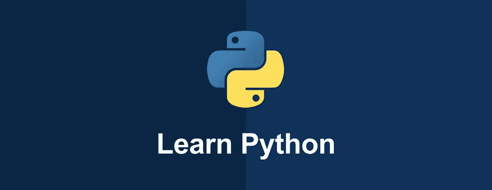

# 一个想法的改变，以提高您的 Python 技能

> 原文：<https://medium.com/analytics-vidhya/one-mind-change-to-advance-your-python-skills-b4b56c97fe3?source=collection_archive---------6----------------------->

如果你正在努力掌握 Python，或者你想知道如何跳出初学者的世界，一个简单的心态改变会有所帮助。

## Python 初学者的罪恶——隐藏类型

如果你刚刚开始学习编程，尤其是在工程世界之外，那么你很可能是从 Python 开始的。