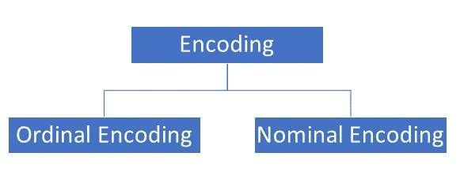
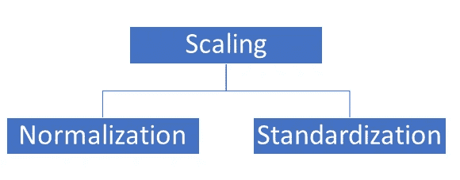
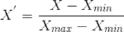
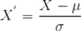

# 无限石“特征工程”之一

> 原文：<https://medium.com/analytics-vidhya/one-of-the-infinity-stone-feature-engineering-c18d3ac20942?source=collection_archive---------16----------------------->

图片由谷歌提供

在创建数据科学项目时，我们都遵循由不同阶段组成的数据科学生命周期，包括

数据采集

特征工程

特征选择

模型创建

模型的调整

评估矩阵

部署

要说我们的项目是数据科学项目，我们必须包括上述所有阶段。但在这里，我们将讨论一个重要且耗时的阶段，即特征工程。

根据我的经验，特征工程需要更多的大约。一个项目花费 30-40%的时间。

> 先说特征工程。

特征工程简单地说就是从我们的数据集中提取、操作、分析和发现相关数据，这有助于我们的模型给出更好的结果。

在现实中，数据并不像我们用于学习的那样简单，它们包含大量缺失值，列的单位和大小不同，可能存在异常值，特征可能不符合正态分布，还可能存在不平衡数据集。处理所有这些事情属于特征工程。

> 特征工程中包括的步骤

**数据清理**

它包括删除空值或用一些相关值替换，以增加特征的重要性。

> 处理空值的方法:

删除空值，这是最简单的方法，但不要马上尝试。

如果数据本质上是数字，则用平均值/众数/中位数代替。

如果数据是分类数据，则替换为最常用的值。

可以使用插补技术来填补空值。

有时向后和向前填充有助于处理空值。

在分类变量的情况下，应用分类器算法来预测缺失数据。

还有其他方法来处理空值，上面是一些处理空值的常用技术。如果你知道，请回复。

**与异类战斗**

**异常值**是数据集中远离所有其他观察值的数据点。位于数据集总体分布之外的数据点。

根据问题陈述，有时离群值很重要，比如说在股票市场中，有时任何公司股票的价格都可能呈指数上升，这就变成了离群值，但我们不能删除它，因为在股票价格预测中，我们需要最近 n 天的趋势。

> 但是我们应该知道如何处理异常值。同样，有多种方法:

通过使用 z 分数分布

通过用 1.5 倍偏差范围替换异常值，在极端异常值的情况下，我们可以使用 3 倍偏差范围。

**编码**

机器学习算法对数学公式起作用，因此当我们传递经过大量计算的数据集时，因此我们的数据本质上需要是整数或浮点数。

但有时我们的数据集包含需要转换为数值的分类数据，但我们不能直接转换它们，而是应该以这样的方式转换，它们应该包含关于数据集的信息。

分类数据有两种类型，即有序数据和名义数据。

名义数据只是简单地命名一些东西，而不是将其分配到与其他编号的对象或数据片段相关的顺序中。名义数据的一个例子可能是每个学生测试结果的“通过”或“失败”分类。

与名义数据不同，序数数据包含一些顺序；序数以排列的方式相互联系。例如，假设您收到了一份来自您最喜欢的餐馆的调查，要求您对所接受的服务提供反馈。您可以将服务质量分为“1”表示差，“2”表示低于平均水平，“3”表示一般水平，“4”表示非常好。

所以，对于这两者，我们有不同的编码方式。

作者图片

> 序数编码可以使用

标签编码器

目标引导的顺序类别

> 标称编码可以使用

一个热编码

一个热编码有多个类别

平均编码

用计数频率替换多个类别

**特征缩放**

大多数数据集包含 10 多个特征，每个特征都有其单位(千克/厘米/$/摄氏度)和量值(值)。

对于回归类型的问题，存在梯度下降的概念，我们必须最小化我们的损失，直到达到全局最小值，因此，如果您的数据集包含具有不同单位和大小的这些要素，则训练时间可能会增加，也会影响准确性。

在 KNN 情况下，如果我们不进行缩放，那么计算 2 个数据点之间的距离变得非常复杂和耗时。

因此，为了克服这种情况，我们可以将所有功能缩小到一个公共范围。

作者图片

**正常化**是一种缩放技术，在这种技术中，值被移动和重新缩放，使得它们最终的范围在 0 和 1 之间。这也称为最小-最大缩放。可以使用 MinMaxScaler 来完成。

这是归一化的公式:

**标准化**是另一种缩放技术，其中数值以平均值为中心，并带有单位标准偏差。这意味着属性的平均值变为零，结果分布有一个单位标准偏差。这可以使用 StandardScaler()来完成

这是标准化的公式:

**处理不平衡数据集**

假设我们有一个数据集，它有因变量作为分类数据，比如 0 和 1 或者是和否

在某些情况下，如果 70%的输入输出为 1，其余为 0。这可能导致数据集不平衡的情况。当我们创建模型时，它可能偏向于 1，在预测测试数据时，它将提供结果为 1。

因此，为了避免偏差，有不同的方法来处理不平衡数据集。

过采样:在少数类中随机复制例子

欠采样:随机删除多数类中的样本

使用集合技术

最后，这些是特征工程中涉及的步骤，如果有任何剩余，请给出您的回答。

> **如需进一步查询，您可以在我的**[***LinkedIn***](https://www.linkedin.com/in/mayank-yogi-806ba9156/)***或***[***GitHub***](https://github.com/MayankkYogi)上联系我