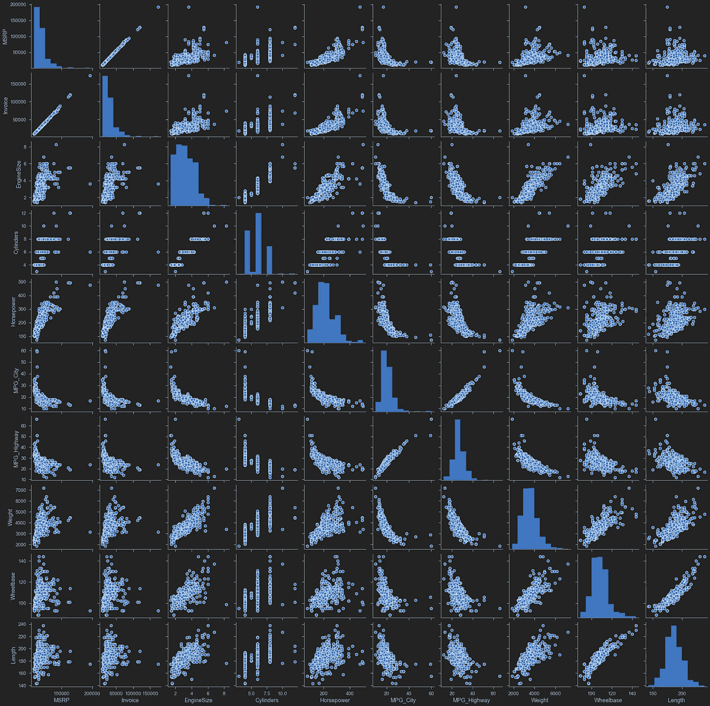

# 一个 XGBoost 来统治他们所有人！

> 原文：<https://medium.com/analytics-vidhya/one-xgboost-to-rule-them-all-af151496445c?source=collection_archive---------25----------------------->

> 在这个项目中，我探索了三种机器学习回归算法来计算二手车的价格。我探索了影响二手车价格的各种关键因素和一些很酷的数据可视化

在导入数据集和处理一些丢失的值后，我一头扎进数据可视化部分。使用 seaborn 和 wordcloud，我能够生成以下图表:



所有特征的相关散点图

我做这个项目的主要目的是让我的手脏在不同的可视化上，我可以用这个给定的数据集。


一个 wordcloud 涂鸦，直观地展示了最常用的单词

如果你是数字和视觉表达的爱好者，那么 seaborn heatmap 是最好的选择。


Seaborn 热图给出了所有特征之间的相关性

接下来的步骤是使用我们选择的三个回归模型:

1.  多元线性回归
2.  随机森林
3.  XGBoost


使用这些模型获得的结果如下:

1.  **多元线性回归:**


```
RMSE = 7666.822 
MSE = 58780154.678095385 
MAE = 5537.39021046368 
R2 = 0.8254024588481936
```

2.**随机森林:**


```
RMSE = 6502.105 
MSE = 42277371.44111407 
MAE = 4304.578557625638 
R2 = 0.8744214754043362
```

3. **XGBoost 型号:**


```
RMSE = 4487.556 
MSE = 20138158.003584985 
MAE = 3209.3451921329943 
R2 = 0.9401826536522745
```

我们可以清楚地看到 XGBoost 如何超越其他模型，这通常是大多数 Kaggle 比赛的情况，因为它已经成为大多数参与者的选择模型。

**源代码在**:[https://github . com/mayankjha-purdue/data _ science/blob/master/used _ car _ prices . ipynb](https://github.com/mayankjha-purdue/data_science/blob/master/used_car_prices.ipynb)