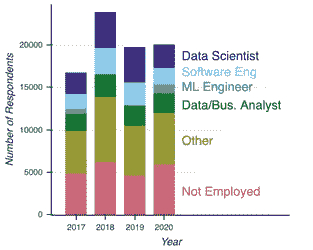
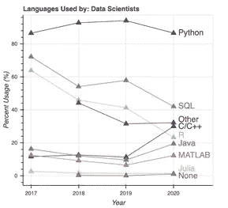
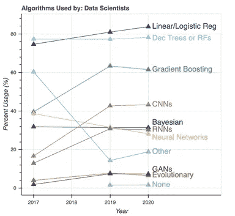
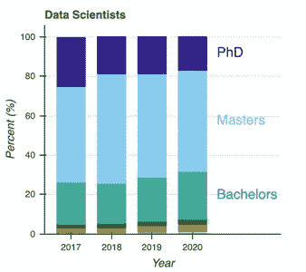

# 正在进行的 Kaggle 调查挑选了最重要的数据科学趋势

> 原文：<https://medium.com/analytics-vidhya/ongoing-kaggle-survey-picks-the-topmost-data-science-trends-7c19ec7606a1?source=collection_archive---------17----------------------->

希望进入数据科学行业的技术专业人士现在可以通过 Kaggle 了解最新的数据科学趋势。

# 自 2017 年以来，Kaggle 一直在进行数据科学调查。

Kaggle 被吹捧为最大的数据科学社区使用的完美平台之一，它提供了对 [**数据科学行业**](https://www.dasca.org/) 的独特窥视。

Kaggle 的调查涵盖了数据科学的重要领域，例如:

编程语言

机器学习算法

多元化、薪酬和教育

最新的 2020 年调查包括全球近 24，000 名用户，提供了有关他们的观点、行为和人口统计的信息。

Kaggle 每年都会进行一项调查，探索对特定群体最重要的话题和趋势。

由于我们已经开始了新的一年，我们将专门讨论前几年的调查——2017 年、2018 年、2019 年和 2020 年。

看到调查结果，你会大吃一惊。

随着新技术和算法以极快的速度加速，该调查展示了新技术是否会继续取代旧技术，或者可能成为现有技术的一部分。

# **为什么 Kaggle 调查被认为是最好的？**

原因如下:

自调查开始以来，受访者人数一直处于历史最高水平。该调查确保每年的参与者保持在 17，000 至 24，000 人之间。

其中，近 2，400 至 4，100 名受访者表示他们的职位是“数据科学家”。

除了数据科学家，我们还可以看到其他回应调查的职位，如“数据分析师”和“业务分析师”——然而，这两个职位已经合并为一个类别。由于各种原因，机器学习工程师等职位名称只在 2017 年和 2020 年的调查中出现过。因此，在其他年份(2018 年和 2019 年)，你不会看到它。

*图片来源:Kaggle*

该调查帮助用户分析**数据科学和大数据分析**行业的趋势和技术。更重要的是，这种调查可以帮助有抱负的数据科学专业人士、机器学习工程师或大数据分析师更好地了解趋势。

让我们更深入地探讨一下这些调查中涉及的重要领域。

# **编程语言**

最常见的是，一个 [**大数据分析师**](https://www.dasca.org/data-science-certifications/senior-big-data-analyst) 在决定学习哪种编程语言进入数据科学领域时会感到困惑。

根据调查，大多数数据科学家更喜欢使用 Python。

*图片来源:Kaggle*

作为调查的结果，超过 78%的数据科学家、机器学习工程师和软件工程师报告说他们对 Python 很熟悉。

即使对于业务和数据分析师来说，Python 的使用率也从 61%持续增长到 87%。

数据科学家最喜欢的另一种编程语言是 R。然而，使用 R 的数据科学家的比例下降了超过 33 个百分点，从 64%到 23%不等。

总的来说，在过去的四年里，Python 一直是数据科学家、机器学习工程师、业务分析师和数据分析师最喜欢的编程语言。

# **机器学习算法**

涉及数据分析和预测的数据科学技术是数据科学的核心。

在这四年中，人们对所使用的一般技术类型以及数据科学工作流程的时间表提出了质疑。然而，一个特定的问题出现在四份调查中的三份调查中——“使用的机器学习算法的类型是什么”？

*图片来源:Kaggle*

寻求进入**数据科学行业**的技术专业人士需要了解数据科学技术中使用的机器学习算法的类型。

最常见的算法包括:

线性回归

逻辑回归

决策树

梯度推进

CNN

贝叶斯定理的

RNNs

神经网络

甘斯

图像中缺失的另一类机器学习算法包括监督和非监督机器学习——聚类和降维。

# **多元化、薪酬和教育**

因此，大多数接受调查的数据科学专业人员都是男性。

尽管在过去几年中，数据科学领域的非男性专业人员的比例有了显著提高。

然而，数据科学领域的男性比例仍然很高(超过 80%)。

这些年来，除了软件工程师之类的工作头衔外，即使是数据科学家的薪酬也有所增加。

而根据人口统计，既没有博士学位也没有硕士学位的候选人从 27%到 32%略有增长。

*图片来源:Kaggle*

这可能是因为在线 MOOCs、在线教育项目、 [**在线数据科学认证项目**](https://www.dasca.org/data-science-certifications) 的不断泛滥。

现在的组织更关注拥有实践技能的候选人，而不仅仅是理论知识。现在，通过获得提供项目和现实世界问题解决方案的认证计划，这些都很容易实现。

# **结论**

也许，你需要再等一年，才能查看 2021 年发生的最新数据科学趋势。我们希望 Kaggle 在未来几年继续这项调查。