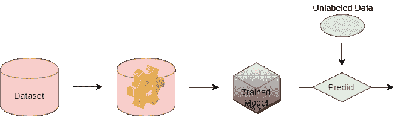
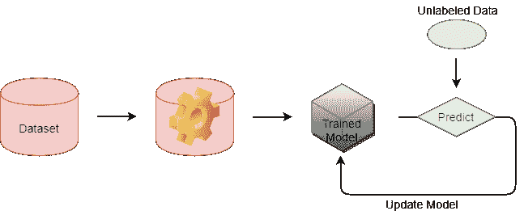
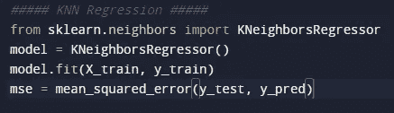
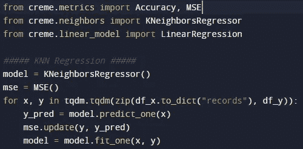

# 在线学习

> 原文：<https://medium.com/analytics-vidhya/online-learning-95266d450ac3?source=collection_archive---------5----------------------->

机器学习是对算法的研究，其技术用于创建一个数学模型，可以对生活中的任何话题做出一些预测。如今，对于一个企业来说，使用自动化逻辑来管理一些流程是一种强制性的领域，因为这是一个巨大的优势。人们通过以下三个主要阶段来创建逻辑决策者，更广泛地称为模型，这三个阶段是为训练模型准备数据、训练和测试。在应用了这三个主要阶段之后，我们就有了一个可以使用任何未知数据记录进行预测的模型。但是有一个好的模型是一个很关键的过程。因为有很多因素影响它的成功，比如有足够数量的数据记录，对特定数据使用最适合的机器学习算法等等。

用于训练模型的数据数量是需要处理的重要因素之一。因为当数据记录的数量增加时，模型的成功和范围在大多数情况下也会增加。人们通常通过使用数据集来创建模型，其中他们的记录数量受到系统主存空间的限制，因为在经典的机器学习方法中，整个数据是一次训练的。它们从数据库或任何其他存储源(如 excel 文件)中检索整个数据集。它是用来创建这些模型的方法之一，通常被称为*经典方法(离线学习)*。

离线(经典)学习的图解

随着物联网设备使用的增加和计算机计算能力的提高，可以从客户端检索的潜在数据量是巨大的。今天甚至我们的智能腕带也可以通过使用你的血压产生大量的数据记录。这也是为什么需要另一种机器学习方法的原因之一。通过使用*在线(增量)学习*，您可以使用流数据创建和训练模型。

在线学习允许机器学习模型逐步得到训练。如果你熟悉 python 包 scikit-learn，你一定知道函数 *fit()。*每个机器学习算法都有自己的 *fit()* 方法。在使用模型之前，它会获取数据集中的属性列表和目标值列表。现在假设你有一个新方法叫做 *partial_fit()或者 fit_one()* 而不是 *fit()* 方法。所以你可以用 T-2 时刻的数据块来训练一个模型。您可以在时间 T-1 使用您的模型的输出，并可以在时间 T 继续使用新的数据块训练您的模型。您可以将此模型作为您的网站或腕带的后台服务，并观察一段时间内模型行为的变化。

在线学习图解

代码示例:

使用 Python 库 Scikit-learn 进行离线学习的代码示例

使用 Python 库 Creme 进行在线学习的代码示例(也可以使用 River)

**在线学习的利与弊**

*   有利于内存分配。它需要更少的内存存储，因为它使用数据块而不是整个数据集。
*   能够处理流数据。
*   训练模型训练一次后保持的能力。
*   通常不利于有限大小的数据集。因为它使用流数据，所以在概括数据集方面，它不如离线学习成功。
*   当模型在一段时间内观察到的同类记录过多时，模型可能出现高度偏差。