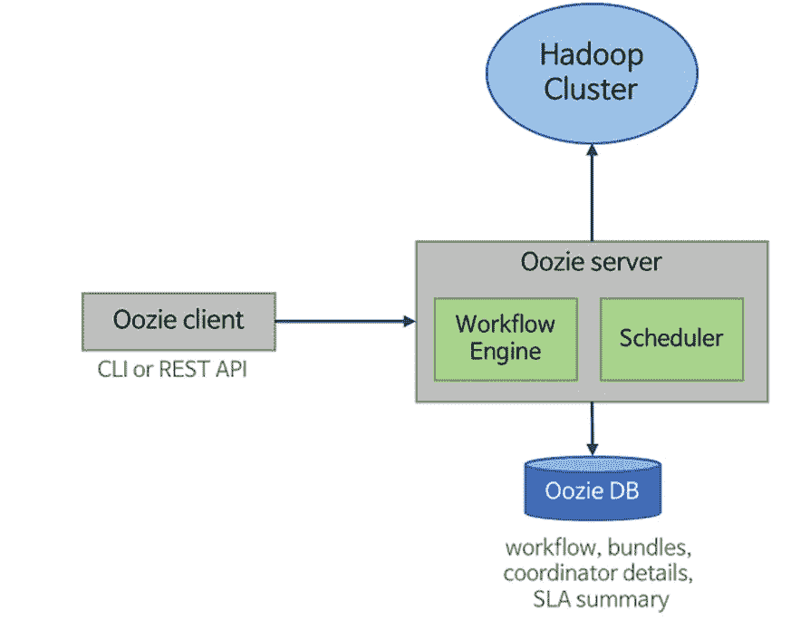
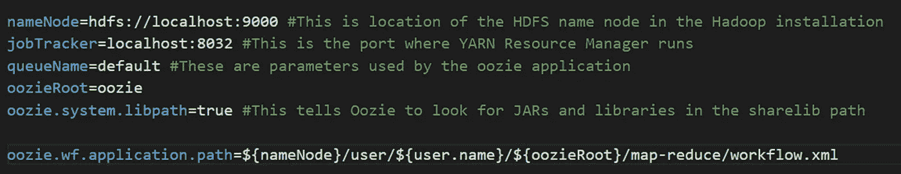

# oozie——什么，为什么，什么时候！

> 原文：<https://medium.com/analytics-vidhya/oozie-what-why-and-when-58aa9fc14dd2?source=collection_archive---------0----------------------->

理解 Oozie 的概念并在 GCP dataproc 集群中实现。


马库斯·斯皮斯克在 [Unsplash](https://unsplash.com?utm_source=medium&utm_medium=referral) 上的照片

# 让我们从什么是 oozie 开始？

*   **Oozie** 是一个工作流调度系统，用于管理 Apache Hadoop 作业。Oozie 工作流作业是动作的有向无环图(Dag)。
*   **工作流**、**协调器**、**捆绑包**一起组成了 Oozie 的构建模块。
*   Oozie 允许编排和控制这种复杂的多阶段 Hadoop 作业。
*   然后，多阶段 Hadoop 作业可以作为单个 Oozie 作业运行——oo zie 作业是您唯一需要管理的东西

## 什么是工作流？

*   工作流指定了一组操作以及执行这些操作的顺序和条件。
*   这些操作可以是任何操作，如 MapReduce 作业、Hive 查询、Shell 脚本、Pig 查询、Java 程序
*   您可能希望在特定的时间和频率运行这些工作流(假设输入数据可用)，因此我们需要**协调员**。

## 那么什么是协调者呢？

*   **协调器**在指定时间和/或指定频率以及数据可用性的情况下安排工作流的执行
*   如果输入数据不可用，则工作流会延迟，直到数据可用。
*   如果不需要输入数据，则工作流纯粹在指定的时间或频率运行。

## 让我们理解捆绑包的概念:

*   可以一起启动、停止和修改的**协调器作业**的集合称为 Bundle。
*   管理工作流的一个协调器作业的输出可以是另一个协调器作业的输入。
*   管理工作流的一个协调器作业的输出可以是另一个协调器作业的输入，这个过程被称为**数据管道**

**Oozie 架构**



Oozie 服务器:管理作业调度和执行。

Oozie 客户端:与服务器交互的 CLI 接口

数据库:所有与作业相关的信息都存储在数据库中。Oozie 默认支持 Derby。

Hadoop 集群:Oozie 作业在这个集群上运行

## Oozie 应用是什么？

*   其中有一个用 XML 定义的文件，它描述了名为 **workflow.xml** 的应用程序
*   它引用并包含执行这些操作的其他配置文件、jar 和脚本。
*   该应用程序可以是手动运行的工作流、单个协调器或形成捆绑包的多个协调器。
*   Oozie 希望在运行之前所有文件都在 HDFS。
*   这些 XML 文件以及 Oozie 应用程序所需的其他文件在作业运行之前被复制到 HDFS。

**工作流程:**

*   这是 Oozie 的核心构件
*   工作流将不同的操作集合在一起。
*   动作是组成工作流的单个工作单元。动作在工作流中执行实际的处理。
*   动作是乔布斯先生，蜂巢作业，猪作业，Java 程序。

## 工作流由以下节点组成:

**1。控制节点**

**2。行动节点**

**3。全局配置**

**控制节点** —控制工作流的开始、结束和基本执行

例如:<start>、<end>、<kill>、<ok>、</ok></kill></end></start>

**动作节点** —动作节点是指定执行单元的节点

例如:<map-reduce>、<pig>、<hive>、<shell>、<fs>、<email></email></fs></shell></hive></pig></map-reduce>

**全局配置** —这些可以在全局参数中定义，而不是为每个动作定义一次。

**什么是 job.properties 文件？该文件包含发送给 oozie 的作业配置，以调用 oozie 工作流应用程序的工作流和参数。Jobs.properties 位于本地文件系统上，而不是 HDFS 上。**



上图解释了每个元素的含义。在这里，应用程序路径是存储在 HDFS 中的 workflow.xml 的路径。

在特定触发条件下运行工作流，例如在一天中的特定时间或运行作业的特定频率，或者当数据可用时。因此，要在这个触发器上运行作业，您需要协调器。最后我们会检查代码。

让我们来理解捆绑包的概念。包是数据管道的抽象，它使得管理大量工作流变得简单方便。指定包的路径，这将自动在此位置查找 bundle.xml 文件。

该包指定了**参数，控制**和**协调器**是必需的，而其余两个是可选的

## 在 GCP Dataproc 集群中运行一个简单的 MapReduce 作业

*   初始化安装了 oozie 的 dataproc 集群。我们可以运行这个命令，为集群提供 oozie。您可以根据需要更改其他参数。我在试用帐户上工作，所以没有足够的 CPU 配额，所以选择机器类型。

```
gcloud dataproc clusters create <cluster_name> --region us-east1 --master-machine-type n1-standard-2 --master-boot-disk-size 70 --num-workers 2 --worker-machine-type n1-standard-2 --worker-boot-disk-size 50 --image-version 2.0.27-debian10 --project <project_id> --initialization-actions="gs://goog-dataproc-initialization-actions-us-east1/oozie/oozie.sh"
```

*   您可以通过运行 Oozie 附带的`oozie-examples`来测试这个 Oozie 安装。要打开集群的 CMD，请单击配置中出现的主节点的 SSH

将示例移动到虚拟机的本地目录:
`cp /usr/share/doc/oozie/oozie-examples.tar.gz ~`

解压存档:
`tar -xzf oozie-examples.tar.gz`

编辑出现在`~/examples/apps/map-reduce/job.properties`的 MapReduce job.properties 以及集群的详细信息:
`nameNode=hdfs://<cluster-name-m>:8020
jobTracker=<cluster-name-m>:8032`

把 Oozie 的例子搬到 HDFS:
`hadoop fs -put ~/examples/ /user/<username>/`

在命令行上使用以下命令运行示例:

`oozie job -oozie http://0.0.0.0:11000/oozie -config ~/examples/apps/map-reduce/job.properties -run`

# 终于！

*感谢阅读！*

如果你喜欢这个，请投我一票，也建议一些更多的主题。

请随时通过 [**LinkedIn**](https://www.linkedin.com/in/ajinkya-mishrikotkar-a6594a144/) 联系我

欢迎在下面发表评论，并提出你认为我错过了什么。谢谢！