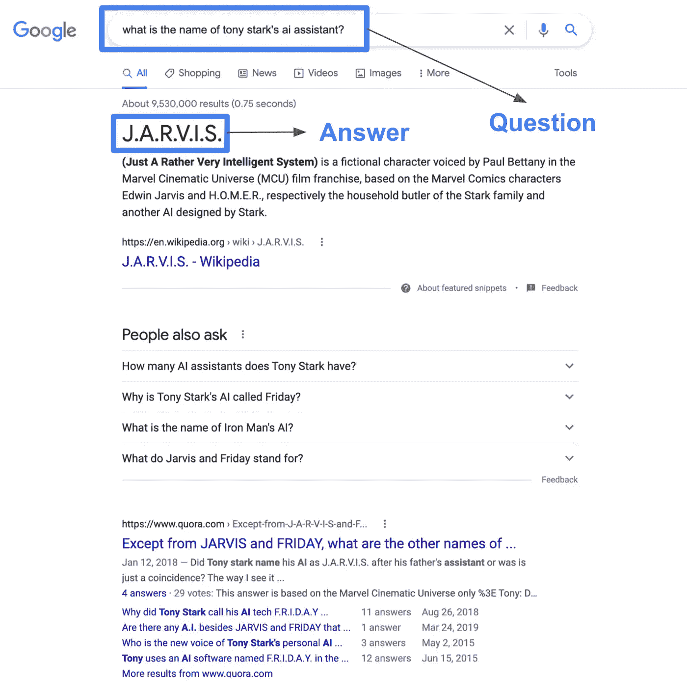
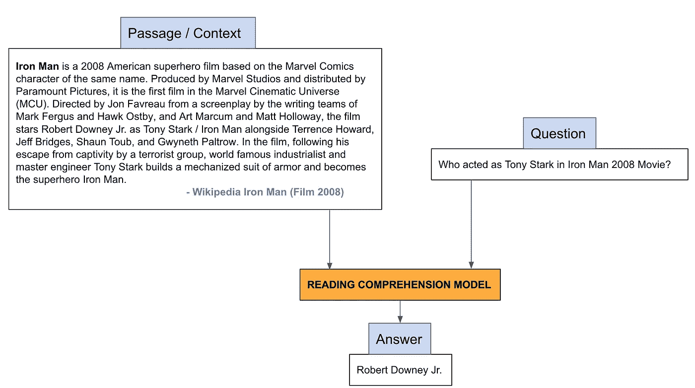
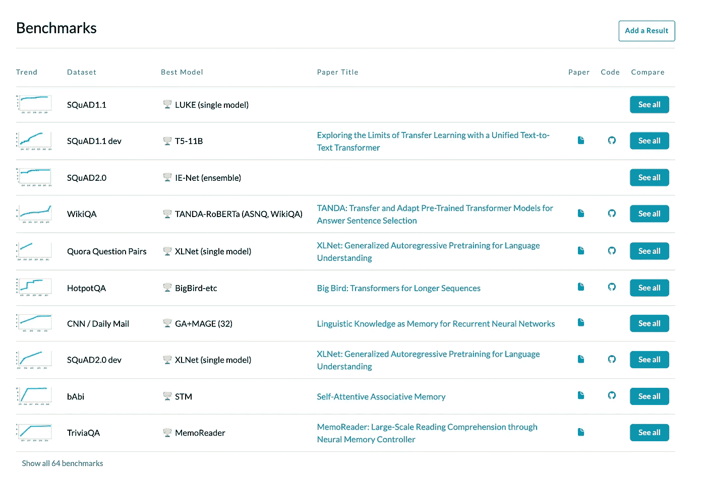
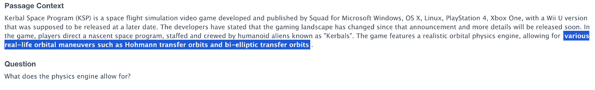
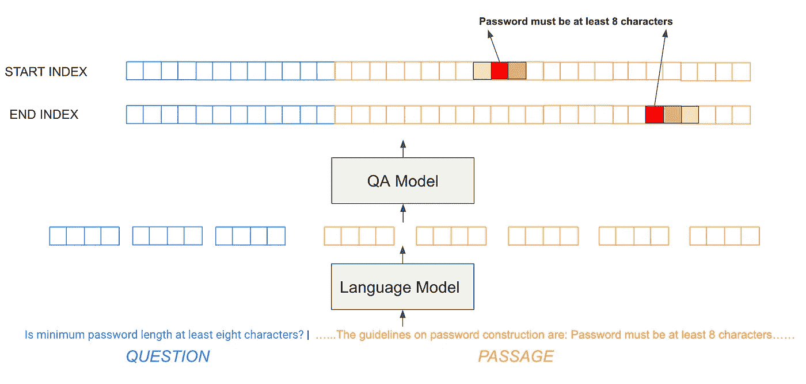
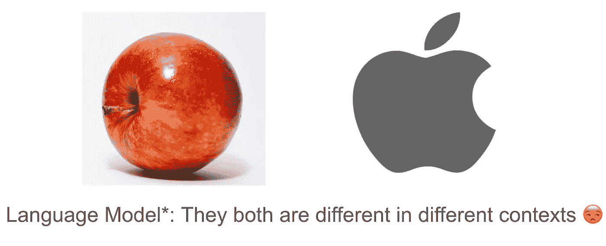

# 理解语义搜索—(第 1 部分:机器阅读理解简介)

> 原文：<https://medium.com/analytics-vidhya/open-domain-question-answering-series-part-1-introduction-to-reading-comprehension-question-1898c8c9560e?source=collection_archive---------4----------------------->

作者照片:太浩湖之旅中我最喜欢的照片(2019 年 7 月)

你有没有想过谷歌如何给我们的问题一个粒度的答案？

来自作者的截图

传统的搜索引擎只能给出与问题相关的网站。然而，由于机器阅读理解、迁移学习和语言建模方面的进步，当前的搜索引擎可以为每个问题提供粒度答案。在这篇文章中，我将介绍机器阅读理解。

机器阅读理解的任务是建立一个理解文章的系统来回答与之相关的问题。阅读理解模型的输入是一个问题和一个上下文/段落。模型的输出是文章的答案。

来自作者的截图

建立任何好的机器学习模型都需要相关的高质量数据集。自 2015 年以来，已经发布了收集了超过 100，000 个样本(问题、段落和答案)的数据集。

阅读理解/问答数据集:[论文，代码](https://paperswithcode.com/task/question-answering)

## 小队:

斯坦福问答数据集( [SQuAD](https://rajpurkar.github.io/SQuAD-explorer/) )是一个阅读理解数据集，由一组维基百科文章的众包构成的 10 万个问答对组成。每个问题的答案都是阅读文章中的一段文字。

可以使用 SQuAD 构建神经问答模型(QA 模型)。该模型采用提供的问题和相应的段落来预测段落中答案的开始和结束索引的概率。下图中的红色块表示高概率指数。

截图来自作者:问答/阅读理解模型预测文章中答案的起止索引。图片创意致谢:[布兰登·陈](https://www.linkedin.com/in/branden-chan-59b291a8/)

为了使模型理解文本的上下文，我们使用语言模型将问题中的单词和段落转换成嵌入/向量。

来自作者的截图

语言模型是在大型数据集上训练的概率或统计模型，如 Google books/Wikipedia dump/scraped 网站，使用不同的深度学习神经网络架构来理解上下文并区分同一单词的不同含义。

## **转移学习:**

迁移学习的想法是使用一个语言模型，并针对相关数据集(在我们的例子中是 SQuAD)对该模型进行微调。

来自 [Unsplash](https://unsplash.com/) 的[威尔·波拉达](https://unsplash.com/@will0629)的照片

## **关于如何微调语言模型的技术理解:**

BERT(来自 Transformers 的双向编码器表示)是由 Google 开发的基于 transformer 的语言模型，包含 12 个编码器堆栈(BERT Base)或 24 个编码器堆栈(BERT Large ),分别在 Google Book 语料库和 Wikipedia 语料库上训练。

为了微调用于问答任务的 BERT，我们可以在包含两个输出的 BERT 基础或大型架构的顶部添加单个线性层，一个用于预测起始索引位置，另一个用于预测结束索引位置。

对模型进行微调后，最后一层的权重会根据任务进行更新(预测开始和结束索引)。我们可以预计初始层的权重变化较小，因为它们将具有 BERT 在谷歌图书语料库和维基百科语料库上预先训练时学习的一般表示。

恭喜你，你完成了机器阅读理解入门。试试 Allen NLP 的机器阅读理解[演示](https://demo.allennlp.org/reading-comprehension/bidaf-elmo)。

在下一篇文章中，我们将讨论文本长文档的阅读理解。敬请关注开放领域问答系列更多文章！

敬请关注理解语义搜索系列的更多文章！(点击了解本系列[中其他文章的更多信息)](/@kaushikshakkari/list/9df1566193b0)

## 在 [LinkedIn](https://www.linkedin.com/in/kaushik-shakkari/) 上加我。谢谢大家！