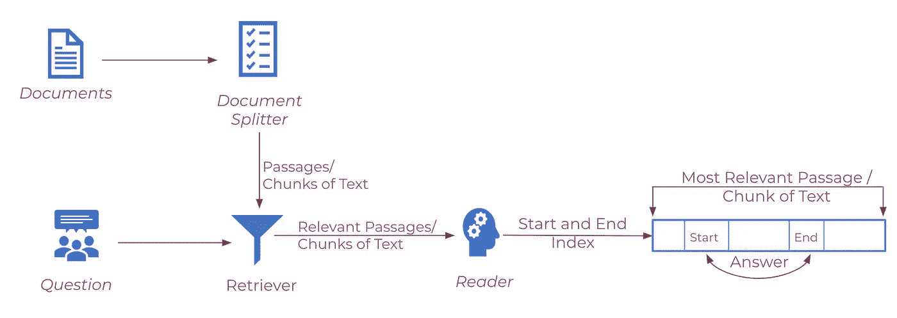
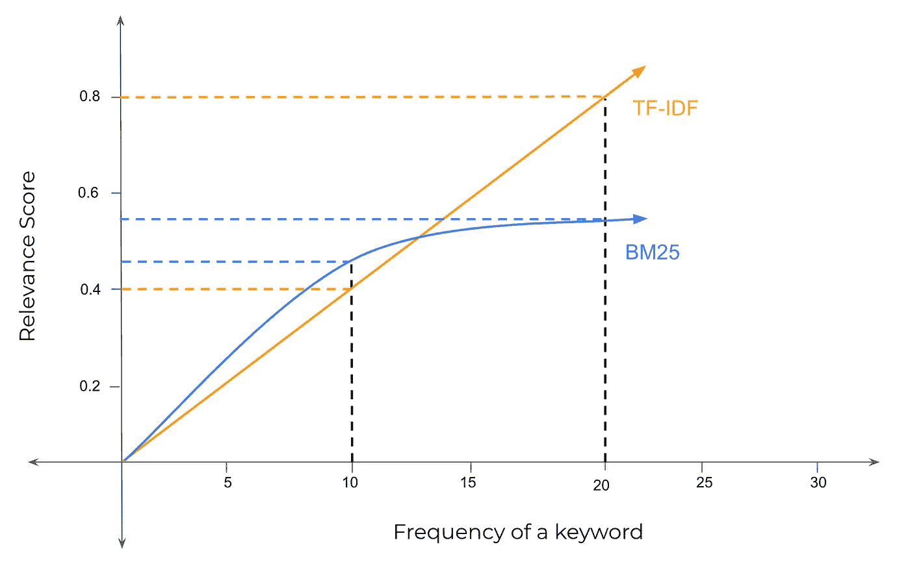
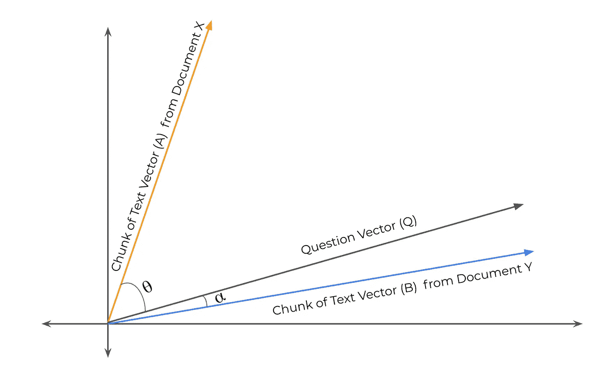

# 理解语义搜索—(第二部分:大规模机器阅读理解)

> 原文：<https://medium.com/analytics-vidhya/open-domain-question-answering-series-part-2-machine-reading-comprehension-at-scale-7ca0b75dbd3a?source=collection_archive---------6----------------------->

作者照片:从华盛顿山看到的匹兹堡市区全景(2021 年 7 月)

在[之前的文章](https://kaushikshakkari.medium.com/open-domain-question-answering-series-part-1-introduction-to-reading-comprehension-question-1898c8c9560e)中，我介绍了使用 SQuAD 数据集、语言模型和迁移学习的机器阅读理解模型。在这篇文章中，我将讨论如何扩展长文档的机器阅读理解模型。

机器阅读理解模型的最大限制是模型的输入规模。模型不能将整个文档作为输入，因为输入大小限于某些字符。例如，使用 Google BERT 语言模型的机器阅读理解模型的输入大小被限制为 512 个字符。因此，机器阅读理解模型不能直接应用于超过 512 个字符的长文档。

在本文中，我将介绍 ***阅读器和检索器*** 架构，它有助于克服机器阅读理解模型的上述局限性。这种架构最初是在[阅读维基百科回答开放领域问题](https://arxiv.org/abs/1704.00051)的论文中介绍的。文档被分解成文本块。一段文本不一定是一个段落或一个句子，它是文档的子集。在本文的其余部分，我将把这些文本块称为段落。检索者的工作是预测与给定问题相关的顶部段落。读者的工作是在检索者预测的相关段落上运行机器阅读理解模型。在前一篇文章中，我们看到了阅读器(BERT)是如何工作的。在本文中，我们将讨论不同的检索器算法。

来自作者的截图

**检索器算法:**

搜索引擎通常使用检索器算法来基于网页与用户搜索查询的相关性对网页进行排序。在我们的例子中，我们使用检索器算法对给定问题的所有文档中的段落进行排序。检索器算法将一个问题和一段文字作为输入，并计算相关性分数。

检索器算法可以分为两类:

1.  经典或稀疏检索算法(TF-IDF 和 BM25)
2.  神经或密集检索算法(DPR 和斯贝特)

**经典或稀疏检索算法:**

经典的检索算法有一个假设，即一个单词在一段文本中出现的频率越高，这段文本与该单词相关的可能性就越高。因此，如果一段文本包含问题中出现频率很高的单词，则该算法会假设它可能与问题相关。这些算法简单易懂，计算速度快。然而，在预测相关性分数时，它们没有捕捉词序、词义和语法结构。

**TF-IDF:**

TF-IDF 是一种经典而著名的信息检索算法。TF-IDF 得分通过 TF(术语频率)和 IDF(逆文档频率)相乘来计算。

词频是问题中的一个词在文章中出现的次数。逆文档频率惩罚常见或停用词，如“the，and，in ”,同时增加实际关键字的权重。在我们的例子中，来自包含来自具有高 TF-IDF 分数的问题的单词的文档的段落是给定问题的相关段落。

> *TF =(文章中一个问题中一个单词的重复次数)/(文章中的单词数)*
> 
> *IDF =log((总段落数)/(包含该单词的段落数)】*

请注意，如果该单词非常常见，并且出现在所有段落中，则*的段落总数将等于包含该单词的 ***的段落数。*** 因此 IDF = log 1 = 0，使得该单词的 TF-IDF 为零。(像 and、the、a 等非常常见的词，TF-IDF 得分通常为 0。)*

***BM25:***

*BM25 是 TF-IDF 的优化版本。让我们考虑一个文档中出现单词 pizza 10 次的段落和另一个文档中出现单词 pizza 20 次的段落。如果 pizza 是一个关键字，那么 TFIDF 给第二段的相关性分数是第一段的两倍。在大多数应用中，仅仅因为相关术语出现的频率是两倍，就给予两次或显著的相关性分数是不公平的。此外，较长的段落比较短的段落有优势，因为较长的段落比较短的段落有更多的单词，并且重复相关关键词的概率很高。*

*BM25 修改了 TF 公式，使得在该单词在文章中出现一定次数后，它使 TF 饱和。它还修改了 IDF 公式，使得具有不同单词长度的段落被标准化，并且当它们具有来自问题的相同单词频率时，较短的段落比较长的段落具有更大的优先权。*

**

*截图来自作者:TF-IDF 和 BM25 相关性评分示例*

*在上面的图中，我们可以看到 BM25 相关性曲线比 TF-IDF 曲线增长得快得多，但它后来变得饱和了。例如，BM25 对于频率为 20 的单词的相关性分数略高于频率 10，但是 TF-IDF 对于频率 20 的相关性分数是频率 10 的两倍。*

> *[关于 BM25 和配方的更多信息](https://www.elastic.co/blog/found-similarity-in-elasticsearch#how-lucene-does-bm25)*

***神经或密集检索算法:***

*神经或密集检索算法使用密集表示来计算相关性分数。密集检索器相对于稀疏检索器的主要优势是捕捉语义相似性(领导、队长、头等。，都是类似的词)和区分野心的词(河**银行**和钱**银行**)。然而，与 TF-IDF 和 BM25 这样的备用猎犬相比，密集猎犬速度较慢。*

***SBERT:***

*SBERT 通过在问题向量和所有段落的向量之间执行[点积](http://datahacker.rs/dot-product-inner-product/)或余弦相似性来生成相关性分数(向量之间的角度越小- >点积越高- >相关性分数越高)。SBERT 使用 [BERT 编码器](https://en.wikipedia.org/wiki/BERT_%28language_model%29)生成给定问题的问题向量和所有段落的段落向量。*

**

*来自作者的截图*

*在上面的图中，我们可以看到向量 A 代表文章 X，向量 B 代表文章 Y，向量 Q 代表一个问题。向量 B 和向量 Q 之间的角度α小于向量 A 和向量 Q 之间的角度θ。因此，向量 B 和向量 Q 之间的点积更高，这意味着 Y 段比 X 段与问题更相关。*

***DPR:(密度通道检索器)***

*DPR 与 SBERT 类似，使用点积来计算一个问题和多段文章之间的相关性分数。然而，DPR 使用两种不同的[伯特编码器](https://en.wikipedia.org/wiki/BERT_%28language_model%29)型号。第一编码器模型为问题生成问题向量，第二编码器模型为多个段落生成不同的向量。DPR 适用于问题的单词长度与段落长度相比非常小的问题。因此，对问题和段落使用不同的编码器是一个好主意。*

***结论:***

*人们可以通过实验和超参数调整来选择合适的检索算法。读者的表现高度依赖于检索者的表现，因为最相关的答案来自最相关的段落。*

*恭喜你，你大规模完成了机器阅读理解入门。下一篇文章将介绍知识图以及如何使用它们构建问答模型。*

*敬请关注理解语义搜索系列的更多文章！(点击了解本系列其他文章的更多信息*

# *在 [LinkedIn](https://www.linkedin.com/in/kaushik-shakkari/) 上加我。谢谢大家！*