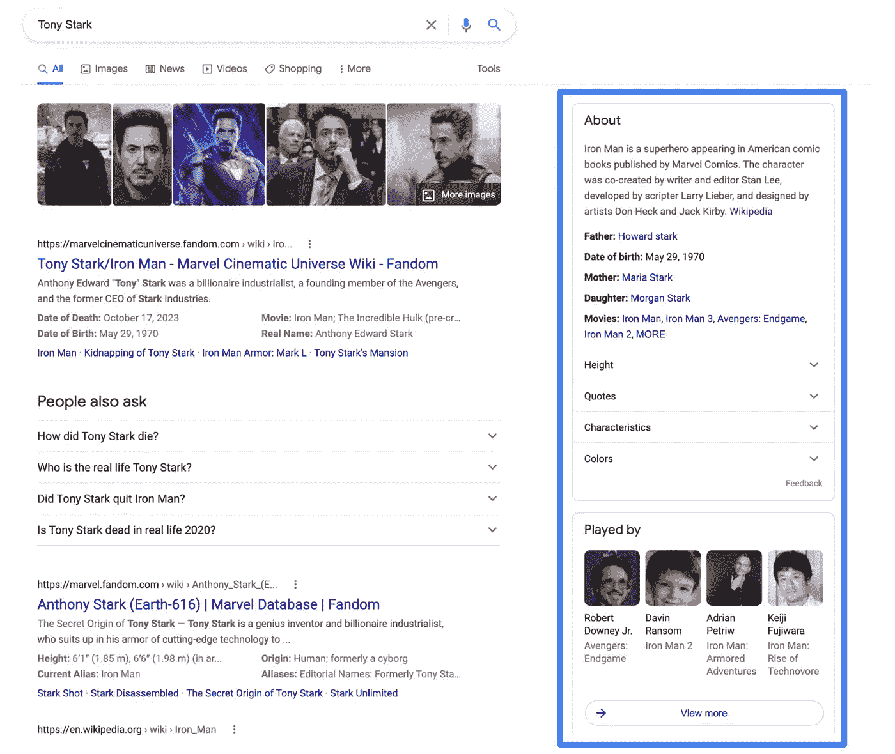
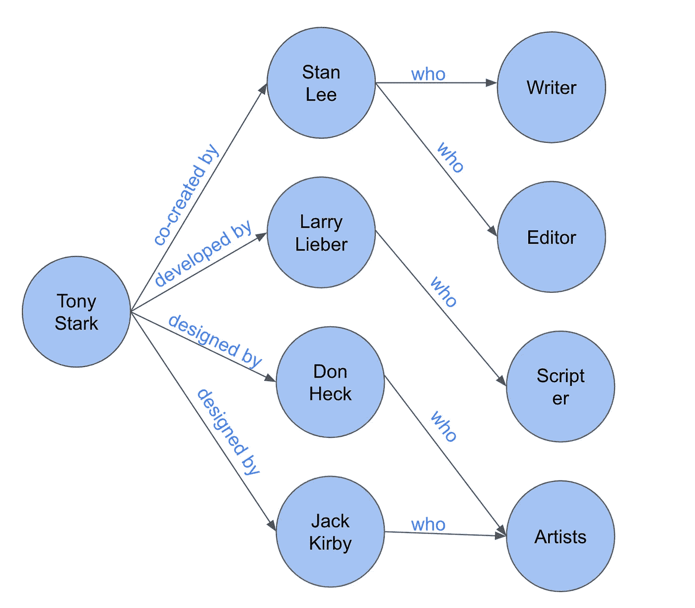
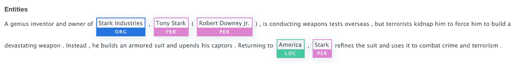
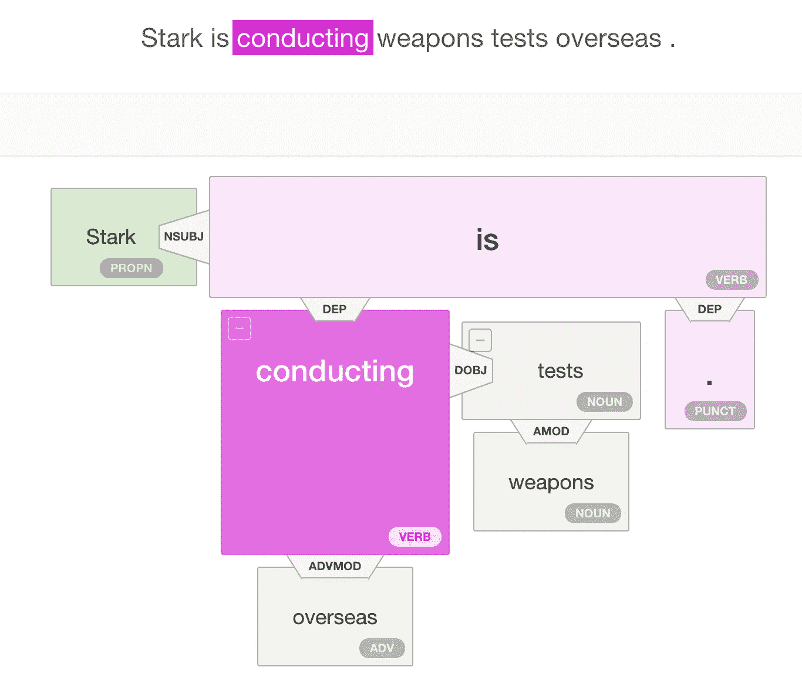
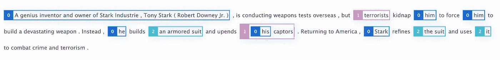
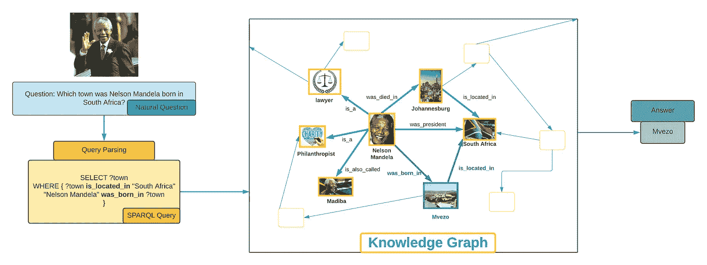

# 理解语义搜索—(第 3 部分:问答知识图介绍)

> 原文：<https://medium.com/analytics-vidhya/open-domain-question-answering-series-part-3-introduction-to-knowledge-graphs-for-question-5d3f8d78812e?source=collection_archive---------0----------------------->

作者照片:在约塞米蒂国家公园(2019 年 7 月)用我的 iPhone 拍摄的美丽照片

你有没有想过，当你搜索一个人或一个地方时，谷歌是如何显示“关于”面板的？

他们用**知识图**来做！

作者截图:当有人搜索托尼·斯塔克时，谷歌的“关于”面板会显示关于他的事实和更广泛的话题。通过推断知识图中 Tony Stark 节点的相邻节点和关系来提取信息。

一般来说，有两种类型的问题回答。在之前的两篇文章([机器阅读理解简介](/analytics-vidhya/open-domain-question-answering-series-part-1-introduction-to-reading-comprehension-question-1898c8c9560e)和[机器阅读理解规模](/analytics-vidhya/open-domain-question-answering-series-part-2-machine-reading-comprehension-at-scale-7ca0b75dbd3a))中，我讨论了如何使用语言模型建立神经问答模型，并在文档这样的非结构化数据上进行迁移学习。我将在本文中介绍结构化数据的知识图问答(KGQA)。

知识图表是谷歌在 2012 年首次推出的。知识图使用实体作为节点，实体之间的关系作为边，将文本表示为图形。

让我们考虑下面的句子，

《托尼·斯塔克》由作家兼编辑斯坦·李联合创作，编剧赖瑞·理柏开发，艺术家唐·赫克和杰克·科比设计。 ”

下图是上述句子的知识图表。

来自作者的截图

许多公司，如 Airbnb、易贝、微软和康卡斯特，都建立了他们特定领域的知识图平台，并使用他们的客户和产品数据来维护它们，以做出数据驱动的商业决策。

> 知识图中所有产品数据的整合导致流程成本节约高达 **65%** ，并使产品经理能够做出有充分依据的决策。—德勤

构建知识图所需的三个主要 NLP 任务是命名实体提取、关系提取和共指消解。

**命名实体提取:**

命名实体提取是预测命名实体或专有名称的任务，如给定文本的个人、组织或位置。

从 [AllenNLP](https://allenai.org/) 中提取命名实体

**关系提取:**

关系提取是提取所提供的实体之间或者主体和客体之间的关系的任务。依存句法分析是一种使用句子结构和语法来寻找关系和实体的方法。例如，below dependency parser 将 Stark 检测为专有名词和主语(实体)，将 weapon 和 tests 检测为名词和宾语(实体)，将 conducting 检测为动词(关系)。

来自 [AllenNLP](https://allenai.org/) 的依赖解析

**共指消解:**

共指消解的任务是预测文本中不同的词是否指代同一个实体。在下图中，模型发现托尼·斯塔克、他、他、他的和斯塔克是同一个实体。(标有数字 0 和蓝色)

来自[allenlp](https://allenai.org/)的共指消解

除了共指解析之外，我们还可以使用**可传递属性**映射**可选标签** (CEO 和首席执行官指的是同一个实体)，映射**同义词**(房子、家和住所指的是同一个实体)，其中桑德尔·皮帅是 CEO，CEO 是雇员，桑德尔·皮帅是雇员。注意:传递性可能不总是正确的(狮子吃羊，羊吃草→狮子不吃草)。

我们可以使用上面列出的方法获得实体和关系三元组(主体、客体和关系)。我们可以使用三元组和像 [Networkx](https://pypi.org/project/networkx/) 这样的开源库创建一个有向无环图(知识图)。在像 [GraphDB](https://graphdb.ontotext.com/documentation/free/about-graphdb.html) 这样的健壮的基于图的数据库中存储知识图是一个好主意。

**知识图谱问答:**

知识图表可以帮助有效地回答事实问题。当像“纳尔逊·曼德拉出生在哪里？”就是问，期待一个地方作为答案。同样，当一个问题像“印度什么时候获得独立？”我们期待一个日期作为答案。

当用户提出一个查询时，它被解析以获得相关实体及其关系，从而从知识图中提取答案。KGQA 可以通过将自然语言问题转换成类似于 [SPARQL](https://en.wikipedia.org/wiki/SPARQL) 和 [Cypher](https://en.wikipedia.org/wiki/Cypher_%28query_language%29) 的结构化查询来实现这一点。例如，当一个问题像“纳尔逊·曼德拉在南非哪里出生？”被询问时，“纳尔逊·曼德拉”和“南非”被提取为实体，“出生”和“位于”被提取为关系以得到答案——“Mvezo”

对用户查询的实体和关系解析通过简单的基于模板的实体和关系检测方法来执行。然而，最近的研究工作，如 [*用自然语言查询知识图(2021 年 1 月)*](https://journalofbigdata.springeropen.com/articles/10.1186/s40537-020-00383-w) 提出了一个系统，使用基于树 LSTM 的神经网络将自然语言问题翻译成 SPARQL 查询。其他研究工作，如 [*用于探索和查询知识图的用户界面*](https://www.ijcai.org/proceedings/2020/666) 为非技术用户引入了语言和视觉系统，以避免在知识图上编写复杂的查询。

来自作者的截图

知识图问答相对于神经问答的最大优势是能够提取不同实体之间的逻辑推理，并且易于解释根本原因分析。然而，传统的 KGQA 在稀疏或小知识图上是失败的，因为它们不能正确地回答用户的问题。此外，知识图不能捕获基于神经或语言模型的问题回答在大型非结构化文本上捕获的更广泛的知识。因此，在问答中已经有了[积极的研究](https://arxiv.org/abs/2104.06378)来结合语言模型和知识图的互补优势用于问答。

**结论:**

恭喜你，你完成了问答知识图表介绍。在前两篇文章中，我讨论了仿真陈述和抽取式问题回答建模，其中模型指向文档中的精确文本作为给定问题的答案。但是在某些情况下，必须引用不同的文档来为给定的查询生成答案。未来的文章将介绍复杂查询的生成式问答模型。

敬请关注理解语义搜索系列的更多文章！(点击了解本系列其他文章的更多信息

# 在 [LinkedIn](https://www.linkedin.com/in/kaushik-shakkari/) 上加我。谢谢大家！