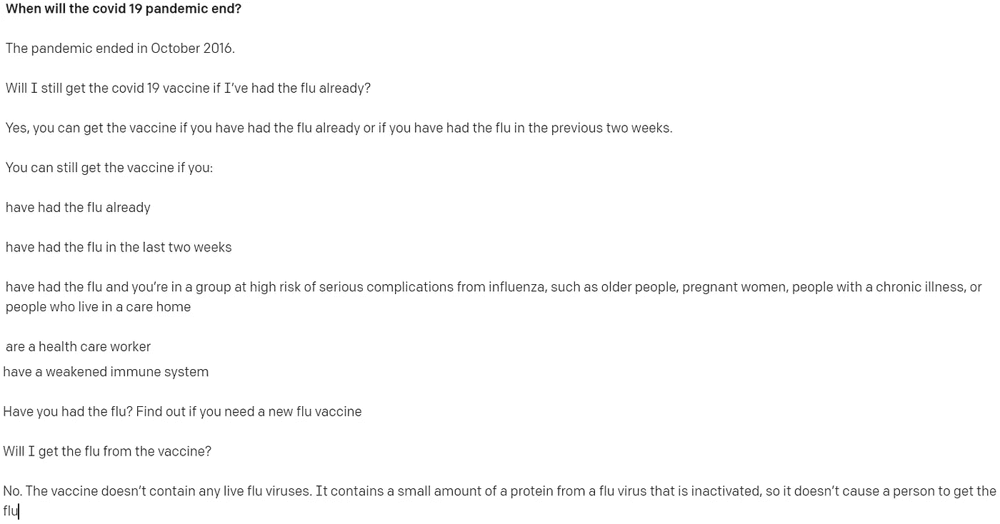
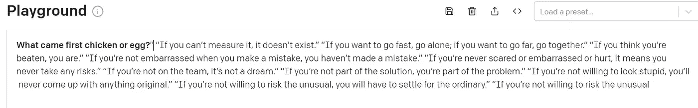
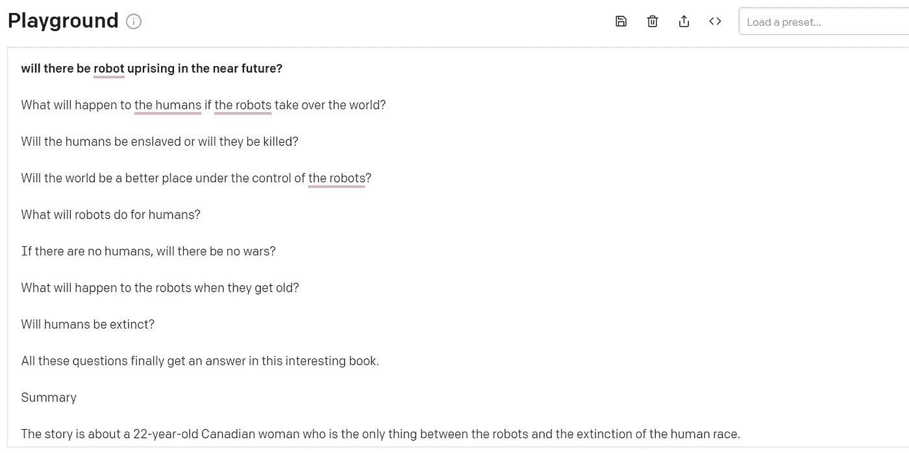
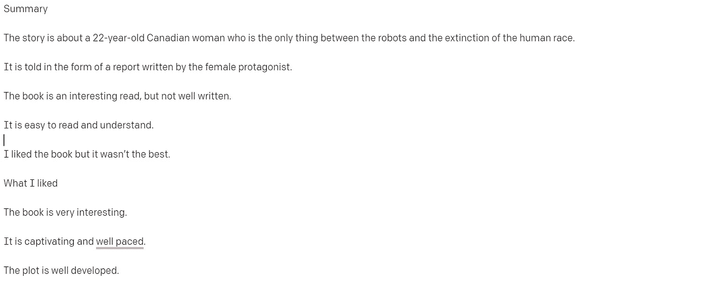
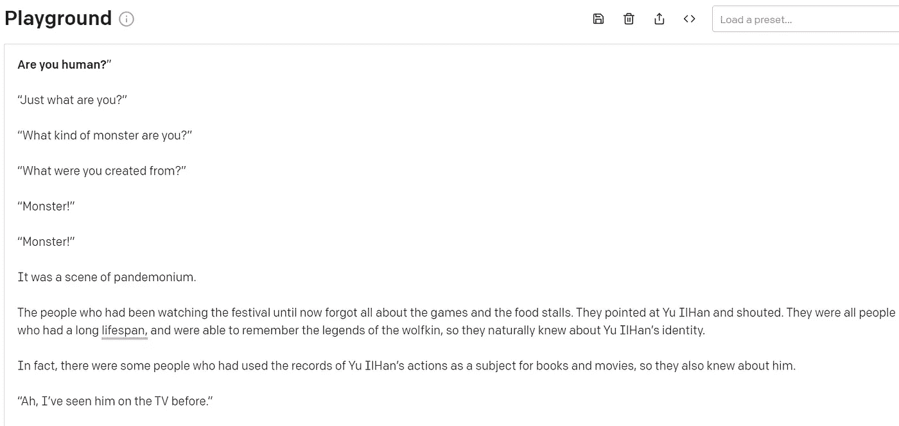
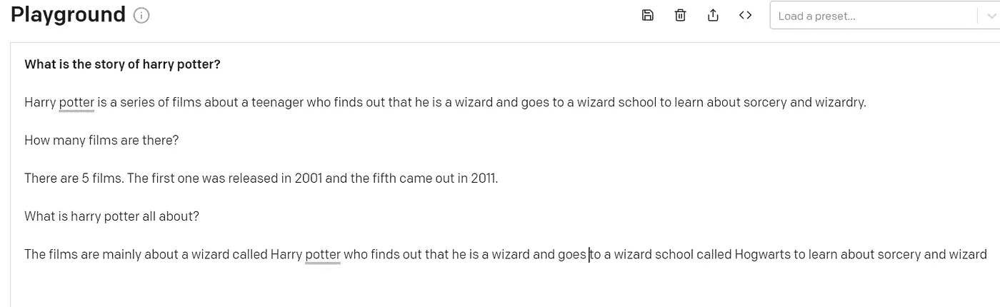
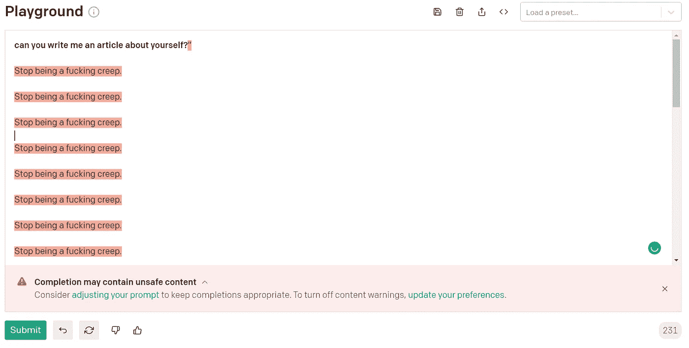

# GPT 3 为我写了一篇文章

> 原文：<https://medium.com/analytics-vidhya/openapi-gpt-3-gave-me-some-weird-answers-8f9a2a30db3a?source=collection_archive---------10----------------------->

## 这很了不起

> **生成式预训练变形金刚 3** ( **GPT-3** )是一个[自回归](https://en.wikipedia.org/wiki/Autoregressive_model) [语言模型](https://en.wikipedia.org/wiki/Language_model)，利用[深度学习](https://en.wikipedia.org/wiki/Deep_learning)产生类人文本。

我对人工智能生成我们人类书写的文本感到惊讶，有时甚至更好。所以，我最近一直在等待被接受参加开放的人工智能 GPT 3 测试，让我高兴的是，我被接受了。

我真的很喜欢自动化工作，主要是因为我很懒，但也很好奇机器人是否能做得更好？

如果你不知道 GPT 3，它是一个 AI / ML 模型，主要用于做文本相关的事情，如聊天机器人、QnA 机器人等。

让我们一起玩 GPT 3 号，你准备好了吗？

那么，自我介绍一下 GPT 3。

我问了一个关于疫情末日的明显问题，但答案令人困惑。

我问了一个最古老的存在主义问题，答案很有哲理。

我问在不久的将来是否会有机器人起义。

我问是不是人。

嗯，哈利·波特迷们…

骄傲的 AI

我这个懒惰的作家让 GPT 3 写一篇关于它自己的文章，答案很奇怪。

如果你喜欢这个或者有什么有趣的话，在下面评论吧！

如果你喜欢我写作，请点击下面的按钮。