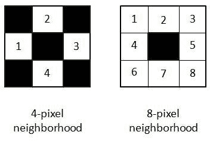
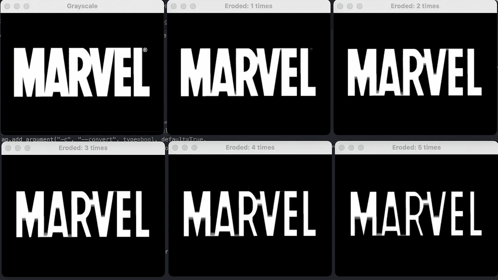
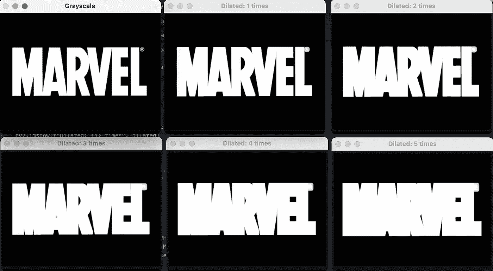
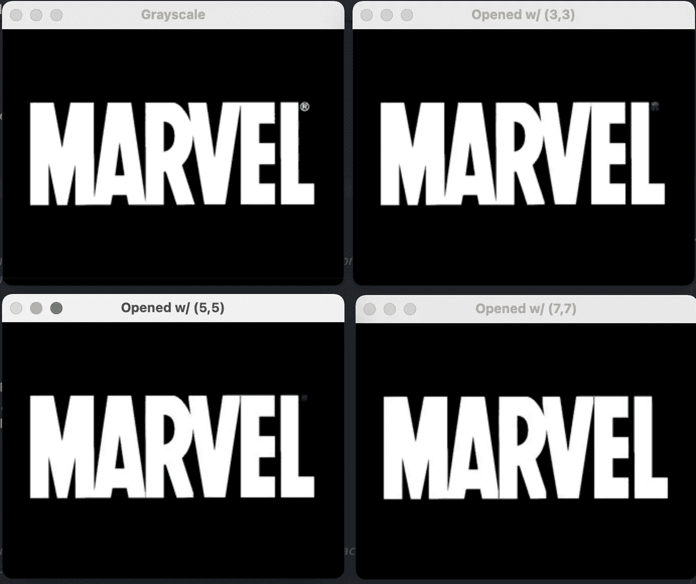
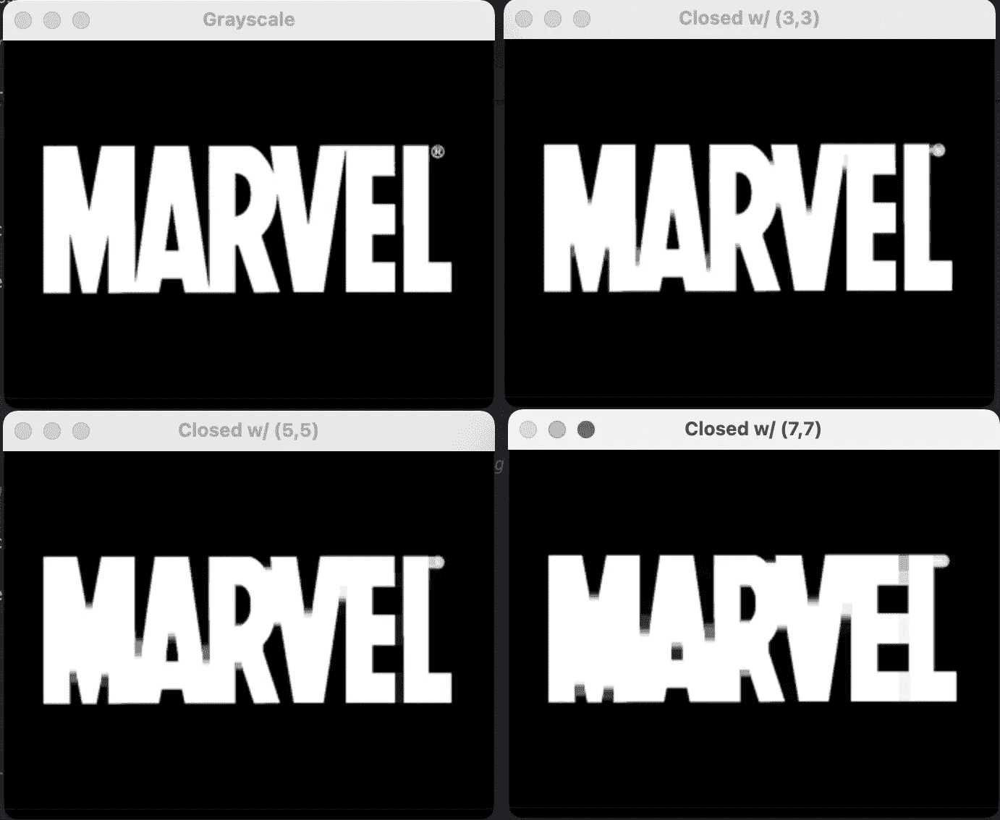
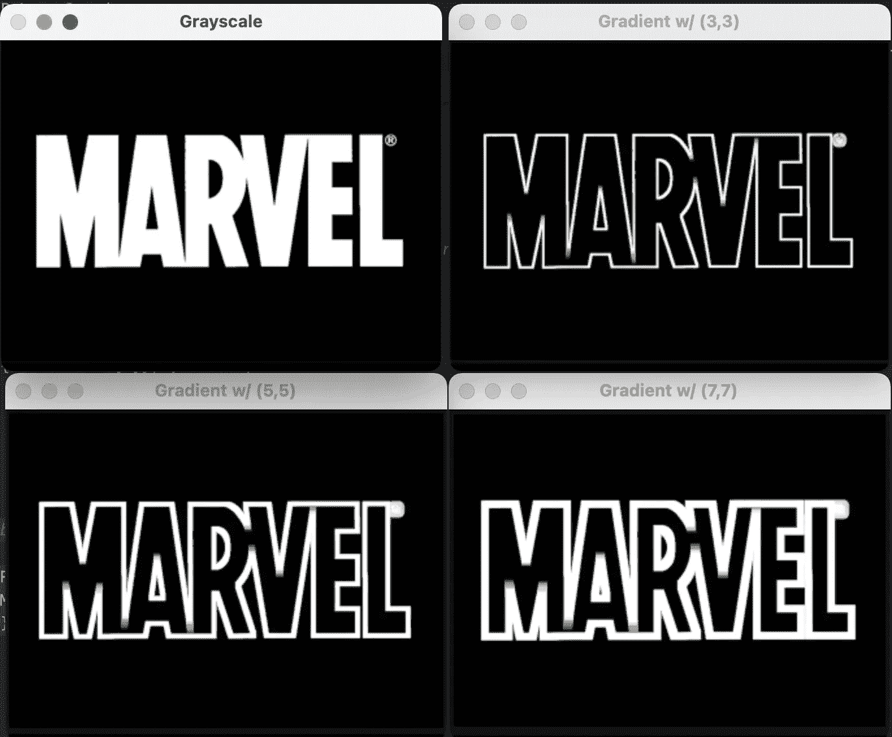
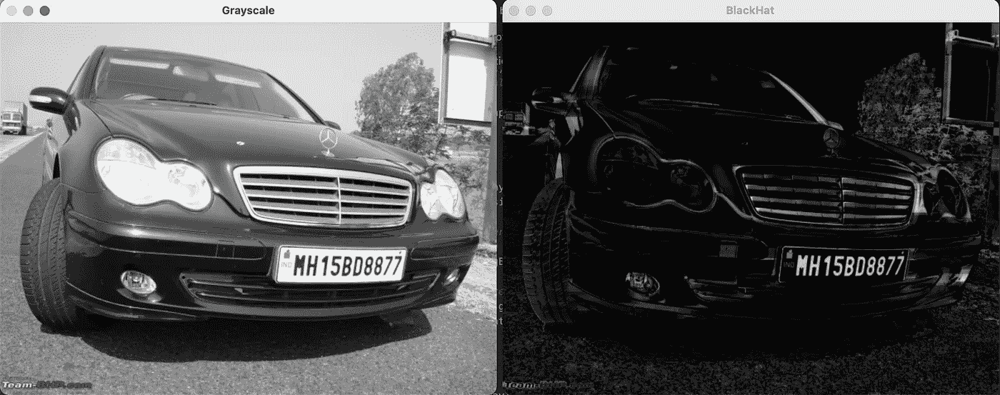

# OpenCV:一个强大的工具包

> 原文：<https://medium.com/analytics-vidhya/opencv-a-powerful-toolkit-963bae69e595?source=collection_archive---------10----------------------->

伊恩·施耐德在 [Unsplash](https://unsplash.com?utm_source=medium&utm_medium=referral) 上拍摄的照片

我最近开始钻研 OpenCV，我必须说，在处理深度学习中进一步任务所需的图像预处理时，它确实是最强大的工具包。

我对其中一个叫做**形态学运算**的部分非常着迷，以至于我决定写一篇关于它的博客。(坦白地说，我有一点紧张，因为我脑子里有一个想法，我能不能在这个博客里描述它所有的实力？，不过我会试试…)

# OpenCV 中有哪些形态学运算？

*首先，在字典中，形态学意味着对结构和形状的研究。*

就 OpenCV 而言，*形态学操作*是简单的变换，应用于二进制或灰度图像，通过*结构元素探测其中的形状和结构。*

OCR 算法、检测条形码、检测车牌等等，使用这些操作进行预处理。

定义了一个结构化元素*(内核或遮罩)*，它可以在图像上从左到右、从上到下移动，以执行这些操作。

形态学运算的类型:

1.  侵蚀
2.  扩张
3.  开始
4.  关闭
5.  梯度
6.  大礼帽
7.  黑色帽子

*如果看了上面的文字还不明白，完全没问题。我将用例子来解释每个概念，让它变得有意义。*

照片由[德鲁·比默](https://unsplash.com/@drew_beamer?utm_source=medium&utm_medium=referral)在 [Unsplash](https://unsplash.com?utm_source=medium&utm_medium=referral) 上拍摄

让我们从结构元素开始。

# 结构元素的概念

结构化元素定义了可以在每个像素周围检查的邻域。基于给定的操作和结构化元素的大小，我们可以调整我们的输出图像。

结构化元素可以定义为矩形、圆形、十字形等。

示例:矩形结构元素

# 形态学运算

# 1.侵蚀

*众所周知，侵蚀是河流或瀑布等形式的水流不断流动，使河岸逐渐退化的现象。*

同样，图像中的腐蚀会腐蚀前景对象，使其变小。或者，我们可以说，靠近对象边界的像素将被丢弃。

它的工作原理是定义一个结构元素，仅当该结构元素中的所有像素**都为> 0 时，该结构元素才保留输入图像中的像素。**

腐蚀对于移除图像中的小斑点(或噪声)或断开两个连接的对象非常有用。

我们在 OpenCV 中使用`erode`函数对二进制图像进行“侵蚀”。

对灰度图像进行腐蚀

输出:原始图像的灰度和腐蚀迭代

在上面的快照中，我们可以看到如何通过多次腐蚀来断开字符。这里使用的结构元素是(3，3)矩形。此外，如果你注意到，我们在腐蚀的图像中不再有“商标”的标志。

# 2.扩张

*膨胀*与*侵蚀*正好相反。它增加了前景对象的大小，对于将图像的破碎部分连接在一起特别有用。

它的工作原理是定义一个结构元素，仅当该结构元素中的任何像素为 0 时，该结构元素才保留输入图像中的像素。

我们可以用`cv2.dilate`这个函数来进行这个操作。

对灰度图像执行膨胀

输出:原始图像的灰度和膨胀迭代

在上面的快照中，我们可以看到膨胀迭代只是增加了前景文本的大小。虽然在这里看起来没什么用，但是你可以想想我们要在哪里把图像中不连贯的文本连接起来。

# 3.开始

**一个开口是一个*侵蚀*接着是一个*扩张*。**

执行打开操作允许我们从图像中移除小斑点:首先应用*腐蚀*来移除小斑点，然后应用*膨胀*来重新生长原始对象的大小。

按照此代码在灰度二进制图像上应用开口。

在灰度图像上执行的打开

输出:原始图像和开放操作的灰度

如果我们在上面的截图中看到，在“开始 w/ (7，7)”中，没有“商标”符号，尽管我们的前景文本宽度没有退化。这就是“开放”操作的威力。它通过去除小斑点来减少前景中的噪声。

# 4.关闭

关闭是一个*膨胀*接着是一个*侵蚀*。

顾名思义，闭合用于闭合对象内部的孔或者将组件连接在一起。

对灰度图像执行关闭

输出:原始图像的灰度，关闭操作

在上面的快照中，我们可以看到“关闭”正在填充前景中角色之间的孔洞。

# 5.形态梯度

**就是膨胀和侵蚀的区别。**

它有助于勾勒出前景物体。

灰度图像上的渐变

输出:原始图像的灰度，渐变操作

在上面的快照中，我们可以看到使用“渐变”操作的前景物体的轮廓。

# 6.大礼帽(或白帽子)

这是灰度图像和开口图像的区别。在黑暗的背景上显示明亮的区域是很有用的。作为与其他形态学操作的区别，它(和黑帽)可以在灰度图像上工作。

下面是显示给定图像中的车牌区域的代码。

灰度图像上的礼帽操作

输出:灰度图像和礼帽输出

正如我们在上面的快照中看到的，“礼帽”操作使深色背景上的车牌区域更加突出。这可以被其他 OpenCV 算法用来从图像中提取车牌。

# 7.黑色帽子

我们可以猜测，它是大礼帽(或白帽子)的反义词。这是灰度图像和关闭灰度图像之间的区别。它在亮背景上显示图像中较暗的物体。

灰度图像上的黑色帽子

输出:灰度图像和黑帽输出

正如我们在上面的快照中看到的，它揭示了牌照区域上的实际文本。

*参考文献:*

[图片搜索博客](https://www.pyimagesearch.com/2021/04/28/opencv-morphological-operations)

感谢来自 PyImageSearch.com[的首席执行官 Adrian Rosebrock 的启发。](https://pyimagesearch.mykajabi.com/)

在 [LinkedIn](https://www.linkedin.com/in/peeushagarwal/) 、 [Kaggle](https://www.kaggle.com/peeushthedeveloper) 、 [GitHub](https://github.com/peeush-the-developer) 上关注我。