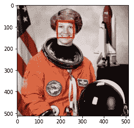
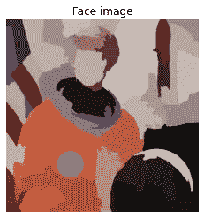

# OpenCV 与 Skimage 的图像分析。哪个更好？

> 原文：<https://medium.com/analytics-vidhya/opencv-vs-skimage-for-image-analysis-which-one-is-better-e2bec8d1954f?source=collection_archive---------2----------------------->

这两种算法在它们能检测到什么和不能检测到什么方面都有其优缺点。

**OpenCV** 在后端用 C++编程，用 python 作为分析图像模式的机器学习包。

**Skimage** 也称为 Scikit-Image，是一个为图像预处理而构建的机器学习包，用于发现隐藏的模式。

# **两者的最佳平台？**

OpenCV 最好在基于服务器的笔记本上完成，比如 google colab，或者 google cloud、Azure cloud 甚至 IBM 的笔记本扩展。

而对于 Skimage 来说，即使是 Jupyter Lab/Notebooks 也可以很好地工作，因为它在处理上没有 OpenCV 那么繁重。

# 使用 Skimage 分析面部数据的 Python 代码

```
**from** **skimage** **import** data
**from** **skimage.feature** **import** Cascade

**import** **matplotlib.pyplot** **as** **plt**
**from** **matplotlib** **import** patches

*# Load the trained file from the module root.*
trained_file = data.lbp_frontal_face_cascade_filename()

*# Initialize the detector cascade.*
detector = Cascade(trained_file)

img = data.astronaut()

detected = detector.detect_multi_scale(img=img,
                                       scale_factor=1.2,
                                       step_ratio=1,
                                       min_size=(60, 60),
                                       max_size=(90, 500))

plt.imshow(img)
img_desc = plt.gca()
plt.set_cmap('gray')

**for** patch **in** detected:

    img_desc.add_patch(
        patches.Rectangle(
            (patch['c'], patch['r']),
            patch['width'],
            patch['height'],
            fill=**False**,
            color='r',
            linewidth=2
        )
    )

plt.show()
```



```
# We have detected a face using Skimage in python*# Obtain the segmentation with default 100 regions*
segments = slic(img)

*# Obtain segmented image using label2rgb*
segmented_image = label2rgb(segments, img, kind=’avg’)

*# Detect the faces with multi scale method*
detected = detector.detect_multi_scale(img=segmented_image, 
                                       scale_factor=1.2, 
                                       step_ratio=1, 
                                       min_size=(10, 10), max_size=(1000, 1000))

*# Show the detected faces*
show_detected_face(segmented_image, detected)
```



## 因此，我们在这里看到了如何使用 python 中的 Skimage 来检测人脸和推断图像。

# 用 OpenCV 分析数据的 Python 代码

```
from google.colab import drivedrive.mount('/content/drive')image = cv2.imread(r'/content/drive/MyDrive/12-14-2020-tout.jpg')# check properties of the imageimage.shape# This image has 1333 pxl width, 2000 pxl height and 3 channels(red, green, blue)from google.colab.patches import cv2_imshowcv2_imshow(image)
```

这里我们用 OpenCV 上传了一张图片


```
eye_detector = cv2.CascadeClassifier('/content/drive/MyDrive/haarcascade_frontalcatface.xml')eye_detections = eye_detector.detectMultiScale(image)eye_detections# detect face with eyes on one of the faceseye_detections = eye_detector.detectMultiScale(image)for (x,y,w,h) in eye_detections:cv2.rectangle(image, (x,y), (x+w, y+h), (0,300,0), 2)cv2_imshow(image)
```


## 这里，我们使用 OpenCV 中的 Hascade 参数技术检测了其中一个人脸，该技术也可以调整为检测所有人脸。