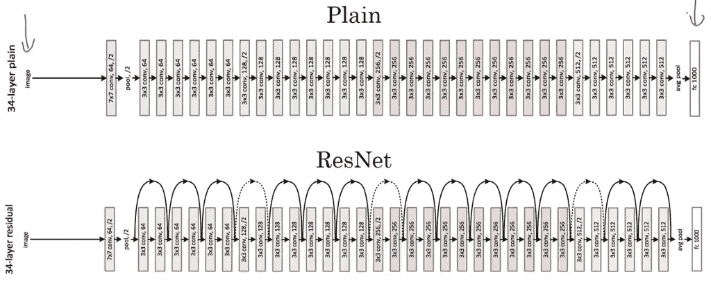
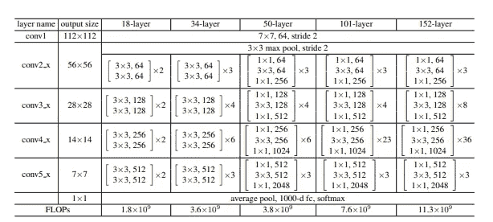
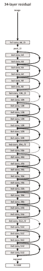
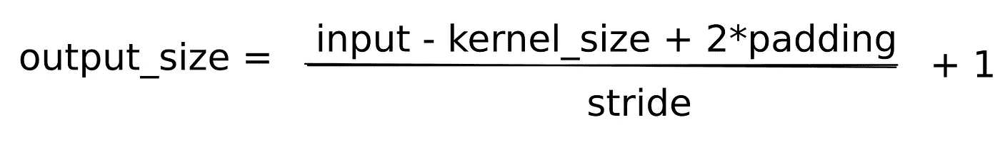
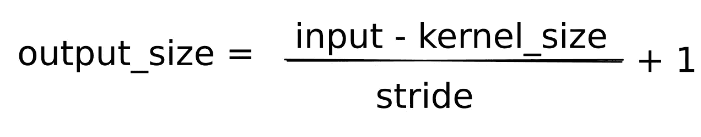

# 解锁资源网

> 原文：<https://medium.com/analytics-vidhya/opening-resnets-46bb28f43b25?source=collection_archive---------9----------------------->

***一步一步探索在一张残影网上发生了什么***

Resnet34 网摘自[原创论文](https://arxiv.org/pdf/1512.03385.pdf)

微软研究院的、何、、、任和在他们的开创性论文——[图像识别的深度残差学习](https://arxiv.org/pdf/1512.03385.pdf)中介绍了残差网络。Resnets 有效地解决了深度网络的消失梯度问题，并且从那时起，他们引入的思想已经被用于多种架构中。

在最近的一次任务中，我的任务是理解 Resnets 是如何工作的，并展示同样的内容。我很好奇，想知道 Resnet 中的一幅图像到底发生了什么，并试图找出同样的答案。这篇博客文章是这个实验的结果，并试图说明 Resnet 架构内部发生的各种计算。

> 在我们开始之前，我几乎可以肯定这篇文章会有错误。我已经尽力去消除它们了。然而，如果你发现任何错误，请让我在评论中知道，或者亲自发邮件到这里，我会尽快改正。

Resnet 架构

Resnet 论文很有帮助地提供了将网络分成块并显示每个块的输出大小的图表。然而，这张图可能会让人认为，从块 2 到块 5，stride 在网络中是常见的，但事实并非如此。我们还需要看看论文中给出的 Resnet 34 网络。

具有剩余连接的 Resnet 34 架构

此图像添加了早期图像中缺失的关于步幅的重要信息。然而，这没有早期图像的简洁的块结构，所以我建议将它们都放在手边。在计算图像尺寸时，还有一个更重要的有用信息。该论文将此表述为

*我们对所有快捷方式使用身份映射，对增加的维度使用零填充。*

但是，我觉得 Resnet 的(旧)Tensorflow 实现中的这一点 Python 更有帮助。

这是一个很好的规则，用于在块 1 之后通过架构进行计算，而不必每次都考虑它。想知道什么是 *padding="SAME"* 和 *padding="VALID"* 的人可以试试这个[链接](https://stackoverflow.com/questions/37674306/what-is-the-difference-between-same-and-valid-padding-in-tf-nn-max-pool-of-t)。有了这些信息，让我们开始工作吧。

输入图像尺寸— (224，224，3)

# 模块 1: conv1

第 1 层:卷积(过滤器=64，内核大小=7x7，步长=2)

要计算卷积图层中的输出大小，我们使用以下公式:

卷积输出公式

对于第一个输入，上述规则不适用，填充为 2。

输出大小=(224–7+2 * 2)/2+1 = 111.5≈112。

该块的最终输出大小= (112x112x64)

# 模块 2: conv2_x

第 1 层:最大池(内核大小=3x3，步长=2)

要计算最大池层中的输出大小，我们使用以下公式

最大池公式

输出大小=(112–3)/2+1 = 56

输出尺寸= (56x56x64)

第 2 层:卷积(过滤器=64，内核大小=3x3，步长=1)

输出大小=(56–3+2 x 1)/1+1 = 55.5≈56

输出大小= (56x6x64)

还有 5 个卷积层(过滤器=64，内核大小= 3×3，步长=1)。从上面的计算中可以看出，这不会对图像进行缩减像素采样，因此输出大小保持不变。因此，该模块的输出为(56x56x64)。

# 模块 3: conv3_x

第 1 层:卷积(过滤器=128，内核大小= 3×3，步长=2)

输出大小=(56–3+2 x 0)/2+1 = 27.5≈28

输出尺寸= (28x28x128)

第 2 层:卷积(过滤器=128，内核大小= 3×3，步长=1)

输出大小=(28–3+2 x 1)/1+1 = 28

输出尺寸= (28x28x128)

还有 6 个卷积层(过滤器=128，内核大小= 3×3，步长=1)。同样，这不会对图像进行缩减采样，因此输出大小保持不变。因此，这个块的输出是(28x28x128)。

# 模块 4: conv4_x

第 1 层:卷积(过滤器=256，内核大小=3x3，步长=2)

输出大小=(28–3+2 x 0)/2+1 = 13.5≈14

输出大小= (14x14x256)

第 2 层:卷积(过滤器=256，内核大小=3x3，步长=1)

输出大小=(14–3+2 x 1)/1+1 = 14

输出大小= (14x14x256)

还有 10 个卷积层(过滤器=256，内核大小= 3×3，步长=1)。和上面一样，输出大小保持不变。所以最终输出大小= (14x14x256)。

# 模块 5: conv5_x

第 1 层:卷积(过滤器=512，内核大小=3x3，步长=2)

输出大小=(14–3+2 x 0)/2+1 = 6.5≈7

输出大小= (7x7x512)

第 2 层:卷积(过滤器=512，内核大小=3x3，步长=1)

输出大小=(7–3+2 x1)/1+1 = 7

输出大小= (7x7x512)

还有 4 个卷积层(过滤器=512，内核大小= 3×3，步长=1)。和上面一样，输出大小保持不变。所以最终输出大小= (7x7x512)。

# 模块 5: conv5_x

Global average pool 本质上是一个大型分类器，它将 7x7x512 层转换为 1x1x1000，因为 Resnet 是在具有一千个类的 ImageNet 数据集上训练的。

现在你有了一个完整的 Resnet34 结果。希望你能从这些数学中得到乐趣。如果你有问题，请随意发表评论。祝你今天开心！玩的开心！

> 让我们在 [Linkedln](https://www.linkedin.com/in/anup-joseph/) 见面