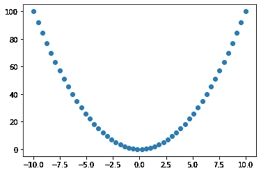

# 打开机器学习的黑匣子— TensorFlow 密集层

> 原文：<https://medium.com/analytics-vidhya/opening-the-black-box-of-machine-learning-tensorflow-dense-layers-8164441ed38f?source=collection_archive---------1----------------------->

我一直对机器学习有点困惑…它看起来像一个黑箱，我天生就对黑箱持怀疑态度。

我想把引擎盖掀开一点，弄清楚 ML 是如何工作的，为此我想专注于一些简单的事情…

密集层如何确定一个 *y = x* 关系？



y = x

我选择这个，只是因为我熟悉回归，我知道回归会如何处理这个问题，我并不真正理解 ML 会如何处理这个问题。

# 稠密的一层

密集层本质上是一组应用于输入的*权重*和*偏差*，包裹在*激活函数*中

在 *y = x* 的例子中，我们有一个单一的输入 *x* ，我们将应用一个权重 *w* 和偏差 *b* ，然后将它包装在一个激活函数 *a* 中，给我们..

```
*a(wx + b)*
```

根据我们希望我们的密集层有多少个单元/节点，我们可以用不同的权重和偏差重复这个过程

```
[a(w₀x + b₀),
 a(w₁x + b₁), 
 ... 
 a(wₙx + bₙ)]
```

激活功能:有几个不同的，但是我们将集中在 *relu* 上，它非常简单。

*relu(x)= x if x>0 else 0*


relu 激活功能

# 学习 y = x

你可能想知道……如果 x 看起来是线性运算，那么这个密集层将如何计算出像 x 这样的非线性关系。

因此..假设您有一个密集(2)层(具有两个节点的密集层)，为了简单起见，将权重保持为 1，将偏差保持为 0

```
**Dense(2) layer**node 0 = a(w₀x + b₀) = relu(x)node 1 = a(w₁x + b₁) = relu(-x)
```

如果我们将这些输出输入到具有线性激活函数(a(x) = x)的密集(1)层中，我们将得到(再次保持权重和偏差为 1 和 0)

```
**Dense(1) layer** (linear activation function a(x) = x)node 0 = a(w₀relu(x) + b₀) + a(w₁relu(-x) + b₁) 
node 0 = relu(x) + relu(-x)
```

策划这个开始看起来有希望了..


relu(x) + relu(-x)

因此，我们的机器学习拓扑将是具有 relu 激活功能的密集(2)层，连接到具有线性激活功能的密集(1)层。


我们的 ML 拓扑

这是你如何在张量流中定义它

```
model = keras.Sequential([
  layers.Dense(units = 2, activation = 'relu'),
  layers.Dense(1, activation = None)
])
```

希望你能开始明白这整个 ML 的工作原理…你把复杂的关系分解成一系列线性函数，用 relu 这样的非线性激活函数相互叠加。

# 增加节点

你可能已经猜到了，通过增加第一个密集层中的节点/单元数量，我们可以得到一个更好的模型

下面是 Tensorflow 中的一个示例，使用均方误差损失进行训练

```
import tensorflow as tf
from tensorflow import keras
from tensorflow.keras import layersimport numpy as np 
import matplotlib
from matplotlib import pyplot as pltm1 = keras.Sequential([
  # need this to flatten the input [1,2,3] => [[1],[2],[3]]
  layers.Flatten(), 
  layers.Dense(units = 4, 
               activation = 'relu'), 
  layers.Dense(1)
])m1.compile(
    loss=tf.keras.losses.MSE,
    optimizer=tf.optimizers.Adam(learning_rate=0.01))m1.fit(x, y, epochs=1000, batch_size=10, verbose=0)# plot the results 
plt.plot(x , y)
plt.plot(x, m1(x))
```


橙色训练后的模型输出

让我们在引擎盖下看看第一个密集层生成的 4 条线

```
# Get our 1st dense layer 
l = m1.layers[1] 
# get x in the shape expected by the layer 
x1 = x.reshape((-1, 1)) 
# apply the layer weights and bias 
y1 = (np.dot(x1, l.kernel.numpy()) + l.bias.numpy())
# apply relu 
y1[y1 < 0] = 0 
# plot lines 
plt.plot(x, y1)
```


由我们的模型训练的 4 条线

你真的可以看到，把这些加在一起，可以开始逼近 y = x

# 机器学习

现在你明白了如何堆叠密集的层来生成非线性图案，我将谈谈我们如何计算这些线的权重和偏差。

基本思想与回归非常相似，事实上我们在这个模型中使用了相同的损失函数。均方差。

这里的损失函数定义为

```
loss = (y₀ - m(x₀))² + (y₁ - m(x₁))² + ... + (yₙ - m(xₙ))²where m is our modelm(x) = w₀m₀(x) + b₀ + .. + w₀m₃(x) + b₃and mᵢ is our 1st dense layer mᵢ(x) = wᵢx + bᵢ
```

这基本上给了我们一些多项式方程，依赖于第一密集层的 4 个权重和偏差，以及第二层的 4 个权重和偏差

不需要太多的细节，我们可以很容易地估计出 8 维空间中特定点的梯度，并开始向极小点的方向移动。

显然，不能保证我们的 8 维空间只有一个极小点，可能会陷入局部极小。

因此，机器学习模型要小心行事，不要过快地移动到确定的最小点(由 learning_rate、批量大小和时期的选择来指定)

# 概括起来

机器学习中的密集层只是一堆线的花哨名称，这些线与激活函数一起可以堆叠在一起，以模拟复杂的数据关系。

***这下有好戏看了！*** 既然是一堆台词，那就要在*新*数据上表现的真的很差..我说的新数据是指 x 的值，它与我们已经看到的值不接近…我们在-10，10 之间的 x 上训练我们的模型…如果我们将 x = 100 输入到模型中，这将是可怕的..因此，关键的见解是…规范化您的数据！

机器学习与回归没有什么不同，在这个意义上，你试图找到损失函数的导数等于 0。

我希望这能让人们对机器学习工具包有更深的理解，因为大多数其他层都是基于类似的原理构建的。

祝您好运