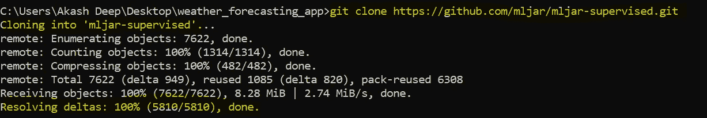
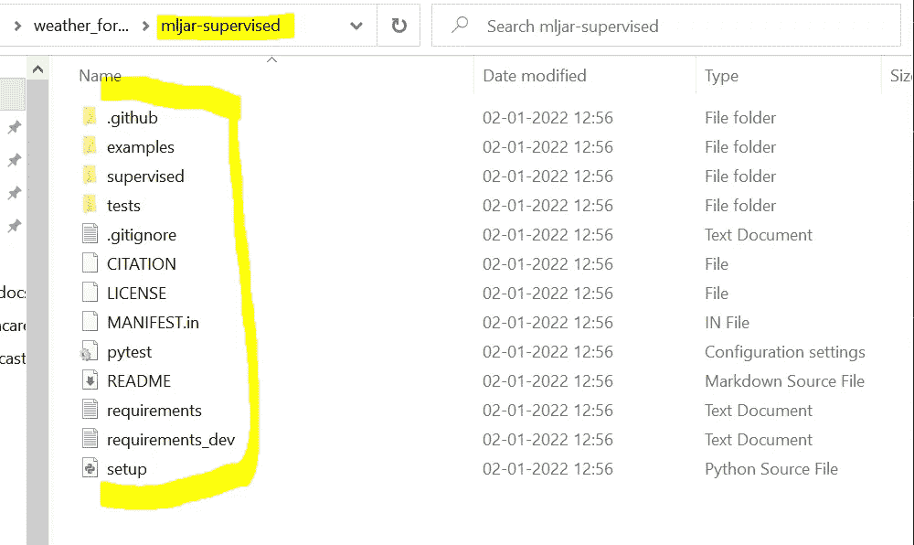

# 开源太棒了，开始使用 ml-jar 开源 MLOPS 项目

> 原文：<https://medium.com/analytics-vidhya/opensource-is-awesome-get-started-with-ml-jar-open-source-mlops-project-6fa846210121?source=collection_archive---------3----------------------->

数据科学开源

在这个博客系列中，我将试图涵盖开源的所有方面，即什么是开源，如何找到开源项目，我们如何学习和提高我们现有的技能，我们如何赚钱，我们如何在全球旅行并在你的空间中遇到酷、令人兴奋和有才华的人。本系列的最终目标是完成一个 python 开源项目，理解完整的实现，如果我们有一些好的想法，并且找到了优化现有过程的方法，最后为开源做出贡献。上面提到的整个过程不会在一夜之间发生。根据你的语言(Python，jave 等)熟练程度，至少需要 2 到 3 个月。如果你是云和机器学习初学者，你也可以在这个中等帐户中查看我的其他令人惊叹和非常简单的博客。现在，不浪费任何时间，让我们试着理解什么是开源。根据我的说法，是的，你没听错，这是我对开源的定义:-)

# **什么是开源？**

开源是一个虚拟和真实(两者兼有)的地方，在这里，来自全球的拥有相同技能的人们相互交流，分享他们对特定项目问题陈述的观点。与播客、youtube、书籍等所有其他学习资源相比，开源也是一个个人可以非常快速地掌握当前技能地方(我是以我的经验来说的)。这也是您学习行业最佳实践的地方，因为大多数开源项目都是在考虑到庞大的用户群(大约数百万甚至数十亿)的情况下开发的。

# 开源的先决条件

开始使用开源软件有 3 个主要先决条件:

1.  个人应该知道至少任何编程语言的基础，并应在谷歌精通:-)。
2.  个人应该有耐心，如果他/她有基本的编程理解，因为它需要耐心来理解代码，一旦你理解，慢慢地，慢慢地，你会掌握这一点。这个过程至少需要 5-6 个月的常规努力。
3.  最初，个人应该知道如何使用 Github (Github 是一个代码版本控制工具)。我将创建一个博客，介绍如何开始使用 github，以及在使用 Github 时我们需要记住的基本命令。

# 在哪里可以找到开源项目？

这是现在任何人都在思考的重要问题之一。要找到开源项目，你可以查看像“谷歌夏令营”这样的项目。你也可以找到你擅长的特定技能的项目。假设你擅长 Python 编程语言，并且对机器学习和人工智能充满热情。现在，您想要搜索特定的开源项目，在这些项目中，一组人参与了使用 python 语言构建一些 AI 和 ML 相关的解决方案。要简单地搜索这个，你需要在谷歌搜索上写“python 中的 AI 和 ML 开源项目”,你可以浏览你选择的各种链接。刚才我已经向你解释了如何根据你的技能和兴趣搜索开源项目的基本步骤。

# 从开源开始你将面临的挑战

我们需要记住的一件事是(如果你刚刚开始开源),在做了大量的项目探索后，我们只需要完成一个项目。一旦你找到了你所选择的项目，那么你的第一个任务就是进入这个项目的 Github 页面。在 Github 上探索，搜索哪些开放项目仍在继续，人们正在努力，搜索一些与该项目相关的 slack 频道和 teams 频道。我的意思是说，尽你所能，尽快理解完整的项目代码。如果这是你的第一个开源项目，这将尽快进行，至少需要 5-6 个月。在此期间，我们需要非常耐心。我从我的角度向你保证，一旦你完全理解 1 或 2 个项目，你将迈向开源社区的大师(我的意思是你的潜在收入将是每月 4-6 万美元)，显然这需要专门的时间。它还不断增加你的知识，让你越来越多的思考。

# 为 ml-jar 开源项目做贡献

现在我们有了什么是开源以及如何开始的基本概念。作为一个 Python 和 ML 爱好者，我选择了一个开源项目，该项目试图自动化一个完整的数据科学生命周期，并附有一些解释。是的，你说得对，我说的是可解释的和自动的人工智能和人工智能服务。通过小小的探索，我知道了一个项目，名为 ml-lib supervised，已经在致力于实现听起来像我的类似想法。

我们的目标是从官方的 ml-lib 监管的 Github 库下载完整的 ml-lib 项目。官方 ml-lib Github 库的链接是:[https://github.com/mljar/mljar-supervised/](https://github.com/mljar/mljar-supervised/)。

# 在本地配置项目环境的步骤

一旦你访问了上面的链接，试着在你的本地存储中克隆这个项目。使用下面的命令克隆 Github 项目:

https://github.com/mljar/mljar-supervised.git

在本地克隆 ml-jar 项目

克隆项目后，您将能够在本地看到完整的项目文件夹结构:

项目的文件夹结构

这个完整的项目是用 python 写的。我们将努力理解每一个文件夹和文件。从这里，我们的主要任务和挑战将开始，正如我前面提到的，我们需要探索所有可能的方法来理解和配置项目。在探索这个过程中，我了解到 ml-jar 也维护一个松弛通道。PFB 松弛频道链接:

 [## 松弛的

### 编辑描述

mljar-supervised.slack.com](https://mljar-supervised.slack.com/join/shared_invite/zt-gkhfsvhw-H6LMKxxV5adeTmn9V7nbZw#/shared-invite/email) 

在下一篇博客中，我们将尝试详细了解该项目的每个文件和文件夹结构，并了解如何使用 Github。如果您有任何与开源相关的问题，请告诉我，我很乐意帮助您。如果你想让我解释任何与数据科学、云、机器学习相关的话题，也请在下面发表评论。我还计划在 youtube 上创建一个现场工作会议，讨论如何使用适用于所有项目的基本构件来实现开源项目。我在 youtube 频道上解释了 devops 和 aws 云的概念。PFB 我的 youtube 链接:

 [## 阿卡什的娱乐和学习:-)

### 他们都来到这里一起学习，一起享受巨大的乐趣....plss 订阅.....我保证它会让你受益

www.youtube.com](https://www.youtube.com/channel/UCEqswuZNMJu0mjnLUzFVL5A) 

PFB 我的另一个深度学习 SDK 使用方法与步骤:

 [## 使用 Keras、Python 和 Tensorflow 逐步构建我们的第一个深度学习基本模型

### 在上一篇文章中，我们已经看到了关于神经网络的所有内容，如神经网络的历史，神经网络的基本构件…

medium.com](/analytics-vidhya/build-our-first-deep-learning-basic-model-using-keras-python-and-tensorflow-step-by-step-approach-d61c41b8a866) 

# 请继续关注开源的下一次更新