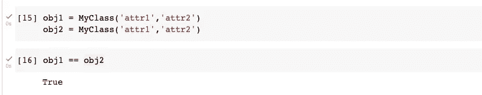

# Python 中的运算符重载

> 原文：<https://medium.com/analytics-vidhya/operator-overloading-in-python-d549c51ef4a0?source=collection_archive---------19----------------------->

大家好。在这个故事中，我将尝试解释如何在 Python 中重载操作符。

在我们开始之前，我们需要了解什么是过载。当我们在已经构建好的东西上改变一些功能时，我们称之为过程过载。在 Python 中，两个变量之间' == '运算符检查是相同，它返回布尔值。但是如果我们改变它的功能，它将返回除布尔之外的东西，所以我们可以对它进行重载。

让我们开始操作符重载。我将创建一个具有我的类名的类，并从中创建两个实例。

现在，我将使用这两个实例来测试' == '运算符。

您会看到它返回了 False。这不是我们的主要话题，只是想让你知道这个问题与内存中的引用有关。在这种情况下，我需要重载' == '运算符。这是我们的主要话题:我们如何能做到这一点。这个故事结尾展示的图片包含了我们的一些重载方法。我将使用' == '运算符的方法进行重载。我打算对我们的类实现重载 **__eq__** 方法。

现在我正试着检查它们是否相同。

是的，我得到了真，因为现在 Python 检查了它们的属性。但它之前检查过他们的参考资料。如果我们愿意，我们可以像下面这样返回字符串。

正如你在下面看到的一些操作符重载的方法，你可以在网上找到更多。

运算符重载的一些方法

你可以从[这里](https://colab.research.google.com/drive/15Qe2YSVZZ-yrgcMF3UTXEb927iKyYWoT?usp=sharing)访问我们为这个故事编写的 Google Colab 文件。

亲切的问候。