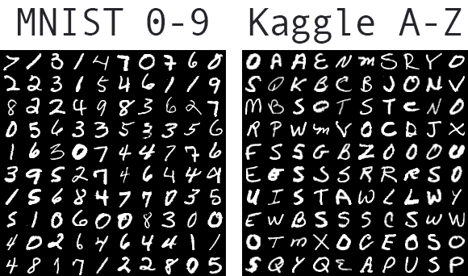

# 基于张量流的光学字符识别

> 原文：<https://medium.com/analytics-vidhya/optical-character-recognition-using-tensorflow-533061285dd3?source=collection_archive---------1----------------------->


在本文中，我们将学习如何构建 OCR(使用 TensorFlow 的光学字符识别系统)，我们还将在 flask 框架上部署深度学习模型。

## 目录

1.  什么是 OCR？
2.  数据收集
3.  构建 OCR 模型
4.  模型部署
5.  添加更多数据
6.  限制
7.  未来扩展

让我们从介绍 OCR 开始。

## 1.什么是 OCR？

维基百科中 OCR 的标准定义

> 光学字符识别或光学字符阅读器是将打字、手写或印刷文本的图像电子或机械转换成机器编码的文本，无论是从扫描的文档、文档的照片、场景照片还是从叠加在图像上的字幕文本。

等等不是更有技术含量吗？

简单地说，OCR 是从图像和扫描文件中识别文本的系统。就这么简单。

我们会知道深度学习中的所有数据。所以，让我们找一些数据集来解决这个问题。

## 2.数据收集

在本文中，我们将构建一个基于字符的 OCR 模型。为此，我们将使用 2 个数据集。

*   LECun 等人的标准[MNIST 0–9 数据集](http://yann.lecun.com/exdb/mnist/)。
*   萨钦·帕特尔的 Kaggle [A-Z 数据集。](https://www.kaggle.com/sachinpatel21/az-handwritten-alphabets-in-csv-format)

标准的 MNIST 数据集已经内置在许多深度学习框架中，如 tensorflow、Pytorch、keras。MNIST 数据集允许我们识别数字 0-9。每个图像包含一位数的 28×28 灰度图像。

MNIST 不包括 A-Z，因此我们使用由 Sachin Patel 在 kaggle 上发布的[数据集](https://www.kaggle.com/sachinpatel21/az-handwritten-alphabets-in-csv-format)。该数据集从 NIST 特殊数据库 19 中提取大写字母 *A-Z* ，并将其重新缩放为 *28 x 28* 灰度像素，以便与我们的 m NIST 数据格式相同。

这是该数据集中的图像示例。



解决 OCR 问题的数据集。

现在让我们直接跳到编码部分。

## 3.构建 OCR 模型

1.  **加载数据集**

让我们构建加载 mnist 数据集的代码。

上面代码中的每一行代码都是不言自明的，让我们继续吧。

现在我们还需要一个函数来加载 A-Z 数据集。

同样，借助注释，这段代码很容易理解。

让我们调用函数，我们的数据集就准备好了。

**2。组合数据集和数据集准备**

现在，我们需要将这两个数据集合并到模型中。这可以用几行代码完成。

这里我们给 a-z 数据集中的每个标签加 10，因为我们要把它们和 mnist 数据集堆在一起。然后我们堆叠数据和标签，然后我们的模型架构需要将图像调整为 32 x 32 像素，因此我们必须进一步调整其大小。我们为每个图像添加了一个通道维度，并将像素亮度从[0–255]下调至[0–1]

现在，我们必须将标签从整数转换为向量，以便于模型拟合，并查看数据集中每个字符的权重计数，以及每个标签的类权重计数。

**3。执行数据扩充**

我们可以通过使用 ImageDataGenerator 增加训练的输入数据来改进 ResNet 分类器的结果。我们在图像中使用了各种缩放旋转、缩放大小、水平平移、垂直平移和倾斜。这是一段代码，我们通过它来执行数据扩充。

现在我们的数据已经准备好了，让我们来构建我们项目的核心，即 ResNet 架构。

**4。构建 ResNet 架构**

以下是 resnet 架构的自定义实现。我不会在这篇文章中解释整个架构。

**5。编译模式**

让我们初始化某些超参数来适应我们的模型。

```
EPOCHS = 50
INIT_LR = 1e-1
BS = 128
```

因此，我们将用 50 个时期拟合模型，初始学习速率为 1e-1，批量大小为 128。

我们正在使用随机梯度下降优化器来拟合我们的分类交叉熵损失模型，我们将在准确性的基础上评估我们的模型。最后，让我们来拟合模型。

在 google colab 上用 GPU 进行了大约 3 个小时的训练后，我在训练集和测试集分别获得了 0.9679 和 0.9573 的准确率。

**6。模型评估**


评估矩阵

培训历史


ResNet 的培训历史

上图看起来相当不错，这表明我们的模型在这项任务中表现良好。

让我们保存这个模型，以便以后可以加载它。

```
model.save('OCR_Resnet.h5',save_format=".h5")
```

在进入模型部署之前，让我们检查一下我们的模型在实际图像中的表现。

下面是一段代码，它从测试集中随机获取一些图像，并通过可视化来预测它们。

看看我得到的输出。


ResNet 模型的输出

## 4.模型部署

最后，我们希望我们的模型对最终用户可用，以便他们可以使用它。模型部署是我们项目的最后阶段之一。为此，我们使用 python web framework flask 将我们的模型部署到 web 应用程序中。

**等等什么是烧瓶？**

Flask 是一个用 Python 写的 web 应用框架。它有多个模块，使 web 开发人员编写应用程序更加容易，而不必担心协议管理、线程管理等细节。

Flask 为开发 web 应用程序提供了多种选择，它为我们提供了构建 web 应用程序所必需的工具和库。

为了构建成功的 flask web-app，首先我们必须使用 HTML5、CSS3 和 Javascript 创建一个简单的网站。我们已经使用 pickling 将 python 对象形式的模型转换为字符流。这个想法是，这个字符流包含在另一个 python 脚本中重建对象所需的所有信息。

下一步是制作一个 API，通过网站接收用户的图像，并根据我们的模型计算预测的输出。

下面是整个应用程序的流程图。


流程图

现在让我们构建算法，以便成功地将我们的模型部署到 web 应用程序中。

这个东西是如何实现的

*   我们的模型以这样的方式训练，它一次识别一个字符，即它是一个基于字符的模型。但是在现实生活中，用户可以上传包含整个单词甚至句子的图片。因此，为了执行精确的预测，我们需要从图像中分离出每个字符，并将其输入模型以获得预测。
*   例子


提取字符

*   从上面的图片可以清楚地看到我们到底需要做什么。
*   一旦我们得到了提取字符的列表，我们就可以调整每个字符的大小，并将其一个接一个地输入到模型中，从而得到预测。
*   我们的 web 应用程序将显示输出。

下面是执行这项任务的完整代码。

你可以在我的 github [***资源库***](https://github.com/kamlesh11/OCR-with-tensorflow-and-opencv) 获得该项目的完整源代码。

现在让我们看看最终的 web 应用程序。


Web 应用程序

点击预测按钮后，app.py 文件将运行，预测将显示在屏幕上。


谷歌预测图像

再来看一张图的表现。


作者内容


## 5.添加更多数据

从我们的模型做出的预测可以看出，我们的模型在识别字符方面仍然很差。所以，我们需要做点什么。

我们已经做了一系列的实验来提高这个项目的性能，我已经涵盖了所有的实验。

我们的模型不知道 a-z 小字母表也存在，所以我们需要将该数据添加到我们的训练数据集中。除此之外，我们甚至可以添加更多的其他角色的数据。

所以在搜索中，我们找到了一个包含所有我们需要的东西的数据集。我们所做的是将所有 3 个数据集结合起来，即

1.  标准 MNIST
2.  kaggle 的 A-Z
3.  英语字符 74k 数据集

通过组合所有这些数据集，我们的数据集变得巨大，并且添加了 a-z 字符。之后，我们执行如上所示的所有相同步骤，并拟合模型，在测试集上获得 85%的准确性，模型性能也有所提高。


组合数据集模型性能

我们仍然可以通过适应更多的时代来提高模型的性能。

## 6.限制

*   如果图像非常复杂，我们的模型可能会失败。例如草书书写图像或具有连续字符的图像。
*   目前，我们的模型只接受英语和数字的训练。所以，如果一个用户上传了一张其他语言的图片，那么它会给出错误的预测。

我们可以通过扩展这个项目来解决这个限制。

## 7.进一步扩展

*   为了克服这些限制，我们可以用其他神经网络体系结构以及 CNN 和 RNN 的组合进行实验，即 RCNN，用于预测连续字符。
*   我们还可以在一些更大的数据集上进行训练，以提高性能。
*   对于除英语之外语言，我们可以用其他语言数据集来训练我们的模型。
*   我们还可以试验基于单词的 OCR 技术，这可能比基于字符的 OCR 更有效。

这项工作是我和我的团队[*阿朱迪亚王子*](https://princeajudiya.medium.com/) 和 [*Yagnik Bhavishi*](https://yagnikbavishi004.medium.com/) 在 Bhaskaracharya 空间应用和地理信息研究所进行的实习工作。

我希望你能从这篇文章中获得许多有用的信息。

感谢阅读。😃