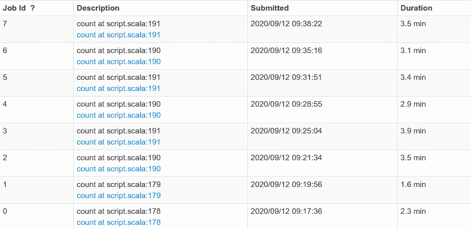

# 使用数据帧缓存优化 Spark 作业

> 原文：<https://medium.com/analytics-vidhya/optimising-spark-jobs-with-dataframe-caching-be377b367fb8?source=collection_archive---------13----------------------->

Apache Spark 是一个广泛用于执行大数据分析和处理的框架。事实证明，它在吸收和处理大量数据方面非常有用。当处理如此庞大的数据集时，优化任务以确保效率是必不可少的。

在这篇文章中，我将谈论我们如何优化我们在 MiQ Digital 的一项 Spark 工作。

让我们考虑一个示例作业，它通过基于自定义逻辑对数据集的某些字段进行哈希运算来屏蔽这些字段。为了确保处理过的数据是有效的，需要对数据进行一些完整性检查:

*   原始数据和已处理数据的行数应该匹配
*   处理后，哈希字段的不同计数应该保持不变

考虑下面执行上述健全性检查的示例代码片段。

健全性测试是在 2 TB 的原始数据上执行的。下面给出了提交的每个作业所用的时间:

不缓存花费的时间

作业 Id 0 和 1 指的是寻找整个数据帧的实际计数，而其余的对应于寻找不同字段的不同计数。 ***仅仅是健全性检查所花费的总时间就在 24 分钟左右！***

在上面的过程中，由于同一个数据帧被多次使用，Spark 将为每个执行的计数操作重新计算数据帧。为了处理这样的场景， **Spark 提供了数据帧**的*缓存*。

Spark 提供了方法 *cache()* 和 *persist()* 来将您的数据持久化到不同的存储级别。

默认情况下， *cache()* 方法将在内存中缓存数据，但是使用 *persist()* 可以指定想要缓存数据的存储级别。参考 Spark 提供的存储级别列表来缓存您的数据: [Spark 存储级别](https://spark.apache.org/docs/2.4.3/rdd-programming-guide.html#which-storage-level-to-choose)。

现在，我们可以通过在执行计数检查之前缓存数据帧来优化我们的工作。我们可以通过以下方式将数据帧保存在*内存和磁盘*存储级别:

下面给出了保存数据帧后作业所用的时间。

缓存后花费的时间

缓存前后作业所用时间的比较

可以看到，作业 0 和 1 在缓存后花费的时间稍长，因为这是数据帧缓存的时间。然而，随后的操作在性能上有了相当大的提高，并且该作业需要大约 13 分钟才能完成，这大约是之前时间的一半！

# 结论

缓存重复使用且计算成本高昂的数据集可以显著提高作业的性能。根据数据集的大小、操作的复杂程度和可用内存，可以选择不同的存储级别来保存数据。