# 机器学习中的优化算法

> 原文：<https://medium.com/analytics-vidhya/optimization-algorithms-in-machine-learning-6493c7badb6e?source=collection_archive---------9----------------------->

## **柯西 vs 牛顿**

这篇文章将集中在应用于机器学习问题的优化算法上。与流行的梯度下降算法相比，牛顿型算法是最高级的优化算法。但是在机器学习中广泛使用的是梯度算法的变体。事实是梯度算法属于所谓的**柯西型**算法，只有一个**线性收敛速度**【1】。奥古斯丁·柯西(Augustin Cauchy)提出了梯度下降算法的第一个变体之一——最速下降法(又名柯西法)。它使用迭代过程，其中使用一维线性优化来估计第α**k**步长，而第 **s(。)**基于第 **k** 点的梯度估计选择方向。

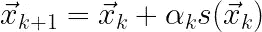

所有梯度算法的一般迭代过程

具有二次收敛速度的更有效和更快速的优化算法，例如**牛顿**方法或高斯-牛顿方法，在理论上早已为人所知。然而，它们在 ML 中的应用存在一些问题。

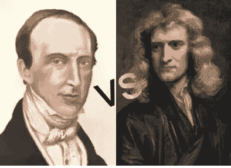

左边是奥古斯丁·路易斯·柯西，右边是艾萨克·牛顿(g .科内尔的肖像，1689 年)

为简单起见，让我们考虑一种具有固定步长的梯度算法变体，它演示了线性优化。该算法是任何神经网络操作的基础。其优点在于逐步优化的可靠性和保证收敛到次优点。这种相当简单但鲁棒的算法的使用表明，我们仍处于将优化理论应用于机器学习的早期阶段。

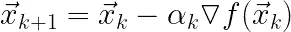

梯度算法，或称柯西最速下降算法，广泛应用于人工智能和最大似然法

事实是梯度法应用了关于一阶导数的知识，并参考了**一阶**方法。与此同时，在最优化理论中，寻找最优解的更有效的方法早已被开发并存在。训练诸如递归(RNN)、具有多个隐藏层的网络(深度神经网络 CNN)或卷积网络(CNN)的神经网络的任务被简化为找到它们的权重系数。通常，梯度算法的一个变体充当优化算法。选项如图所示。

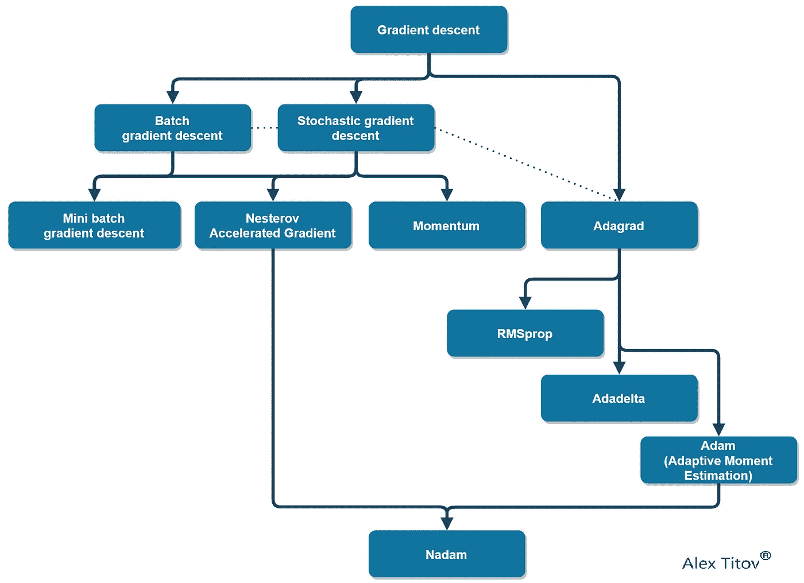

机器学习中梯度下降的进化

因此，可以认为，所有现代机器学习系统都是基于一系列梯度算法，采用逐步优化或逐步线性解决方案搜索。奇怪的是，我们目前没有使用具有非线性收敛速度的快速搜索过程。

梯度算法的一种替代方法是牛顿法或其选项——改进的牛顿法[1]。这些方法是**二阶方法**，具有二次收敛性，使用二阶导数。这提高了收敛速度，实现了更通用的搜索策略，并加速了机器学习。

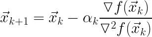

牛顿方法

> 我们可以在依赖于两个参数**【x，y】的函数的最简单优化问题上比较这些算法的收敛速度和稳定性。**

让我们考虑一个具有几个局部最小值的多峰函数的例子，由下面的表达式给出:

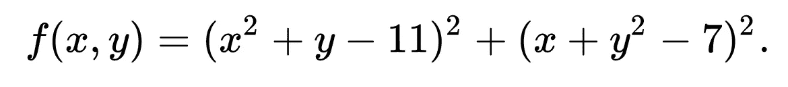

多模态 Himmelblau 函数

这是最优化理论中众所周知的 Himelblau 函数。它有四个相邻的局部最小值，一个中心局部最大值和四个鞍点。

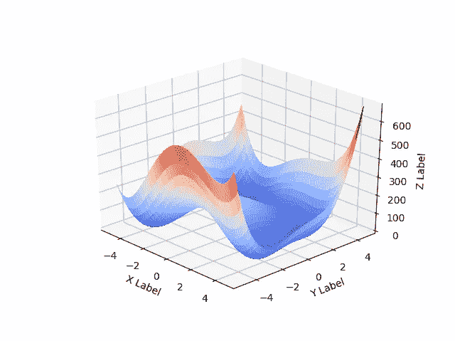

希梅尔布劳函数

从寻找最佳点和测试训练或优化算法的角度来看，该函数很有趣。绘制 Himmelblau 函数的 **的**代码如下:****

为神经网络寻找最优系数(目标函数的最优解)的问题是**现代问题具有 ***N > 1000 的大维数***。** 情况因异构、“原始”训练数据而变得复杂，这导致目标函数表面上的噪声。例如，将参数 ***M=0，sigma =20*** 的正态分布噪波添加到 Himmelblau 函数中，会导致曲面的显著变形。这是数值算法故障和神经网络系数估计中出现误差的原因。

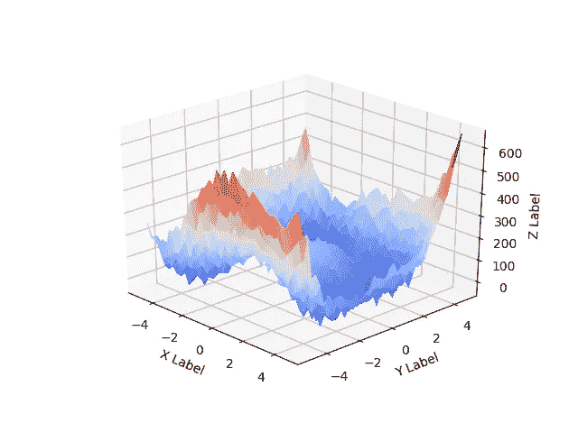

嘈杂的 Himmelblau 函数

实践表明，具有自适应步长调整、约束、罚函数和正则化的梯度算法的现代版本允许相当精确地调整网络权重系数。

让我们理解为什么梯度法的简单版本不能有效地工作，并且需要如此多的复杂性。对于简化的 Himmelblau 函数，我们绘制了梯度算法和牛顿法的收敛图。

带搜索记录的*梯度算法* 的**代码如下。**

**W_history** 变量是函数值， **f_history** 是函数值， **eps_history_f** 是函数值之间的范数距离， **eps_history_xy** 是变量值之间的范数距离。这些变量集合使用 **np 存储在堆栈中。堆栈()。**它们允许分析梯度算法收敛到 Himmelblau 函数 **f(x，y)的最优解 **f (x*，y*)** 。**收敛到最优解可以用极限来表示。

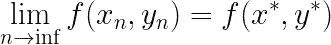

收敛到最优解

> 类似地，在机器学习中，梯度算法最小化目标误差函数 **J(。)**用同样的方法从矢量中提取θ参数。它将 **h** 假设与**数据**训练数据相匹配。

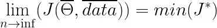

最小化神经网络的目标函数

让我们呈现为 ***f (x，y)*** 函数和***【x，y】***自变量获得的收敛图。

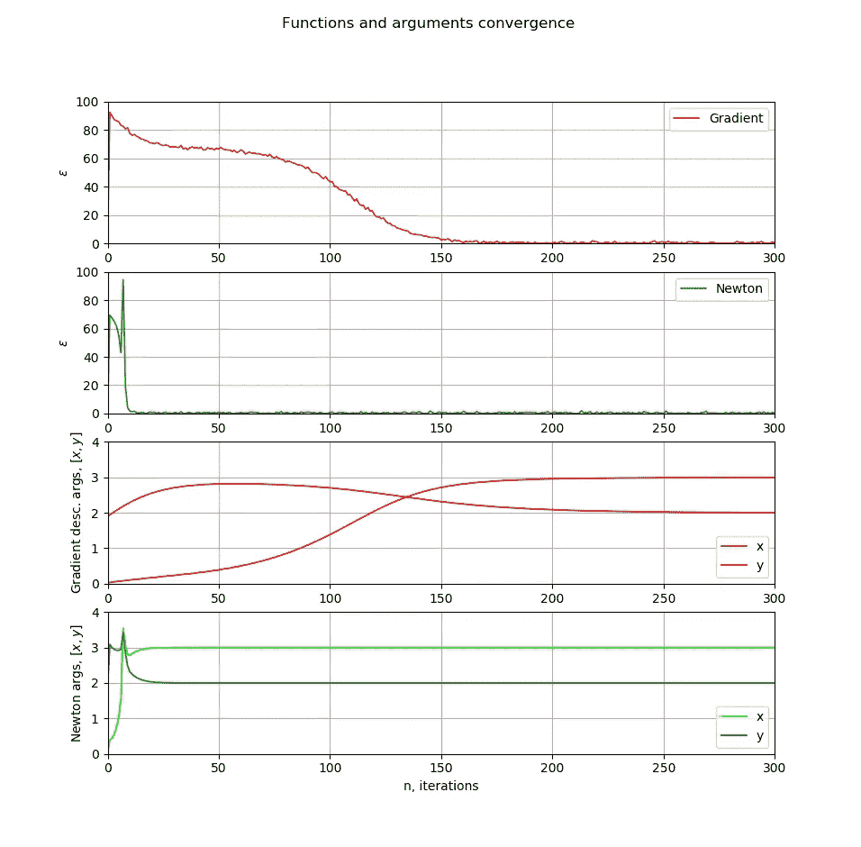

图表显示了梯度算法在 **~200** 次迭代中的收敛性。作为比较，牛顿法仅在 **~20** 次迭代中收敛。**牛顿法如下所示。**

> 梯度法慢慢滑动到坐标为[3，2]的一个最优点。相反，牛顿法沿着目标函数的曲面向相同的最优方向跳跃。

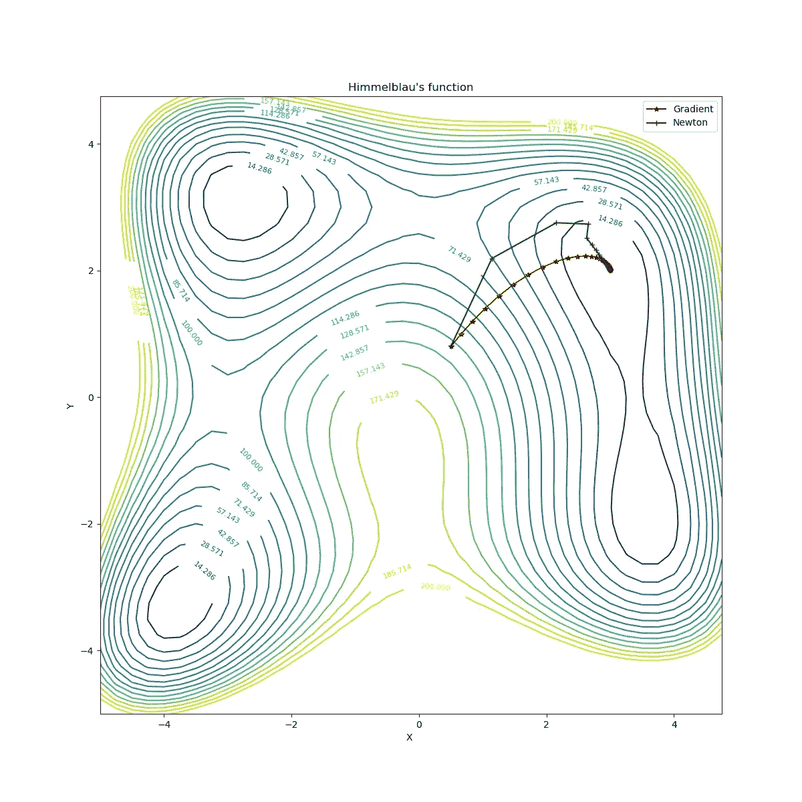

最优解的收敛性[x，y]

机器学习为什么不用二阶方法？毕竟，它们允许应用更通用的搜索策略。事实是，尽管有效，二阶方法不太稳定。他们给出了适应过程中的一些异常值。当在真实世界的情况下使用有噪声的目标函数时，神经网络将被训练有更多的异常值。

下面可以观察到有噪声的 Himmelblau 函数的优化，其中函数值和第一梯度的值都被具有参数 ***(M=0，sigma =5)*** 的高斯白噪声所噪声化。

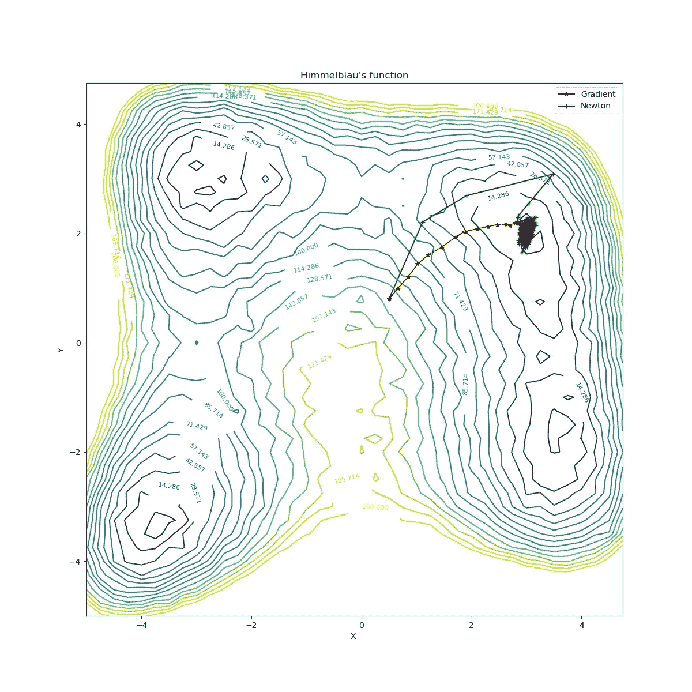

有噪声最优解的收敛性

> 对于噪声函数收敛到次优点的图形表明，慢梯度算法看起来比快速“牛顿”算法更可取！

牛顿法有时间适应函数的噪声抖动，这会对[x，y]最优值的估计产生负面影响(下图中的绿色图形)。同时，梯度法给出了自变量的相当准确的平均估计值(下面[x，y]的红色图形)。

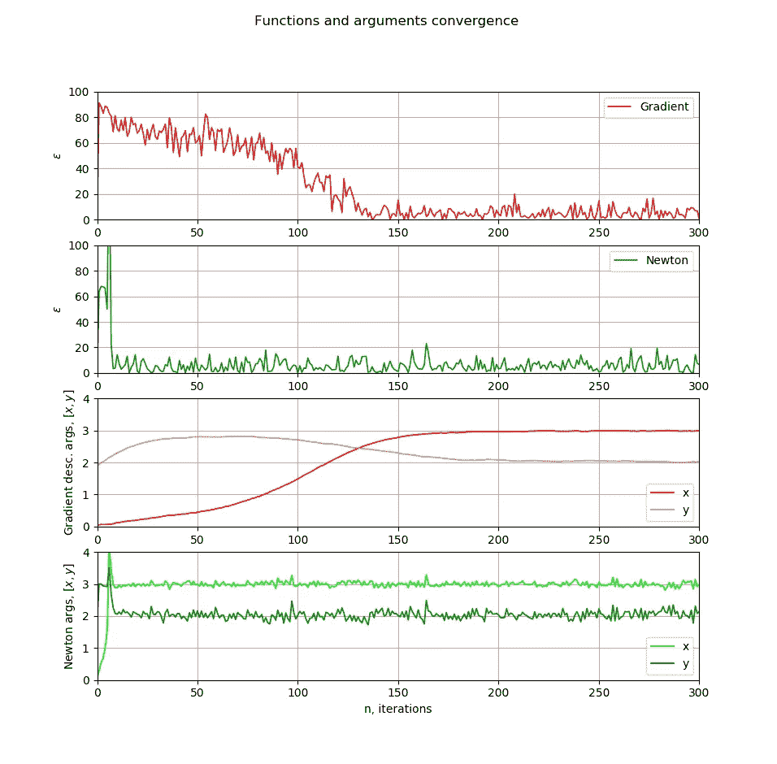

因此，当优化神经网络的成本函数 **J** 时，很难确定更可靠和更快速的算法。工程师们通常选择一种缓慢但可靠的逐步梯度算法，并对其进行了大量修改，称为 Adam [2]或其第二个版本 Nadam [3]。由于真实数据噪声很大且不均匀，梯度算法的缓慢收敛特性非常有用。**带有注释和许多参数的完整代码**用于比较柯西算法(基本梯度下降算法)和牛顿法，可在以下网址找到:

 [## AlexTitovWork/光学校准仪

### 玩优化算法。关于代码。在这个代码研究梯度或柯西方法-一阶方法与…

github.com](https://github.com/AlexTitovWork/Optimator) 

## 链接

1.  雷克雷蒂斯 g .，雷文德兰 a .，雷格斯代尔 K. (1986 年)。设备的优化。在两本书里。第一册。从英语翻译过来。M.: Mir(俄语)。
2.  [https://machinelingmastery . com/Adam-optimization-algorithm-for-deep-learning/](https://machinelearningmastery.com/adam-optimization-algorithm-for-deep-learning/)
3.  [https://medium . com/konvergen/modificing-Adam-to-use-nesterov-accelerated-gradients-nesterov-accelerated-adaptive-moment-67154177 e1fd](/konvergen/modifying-adam-to-use-nesterov-accelerated-gradients-nesterov-accelerated-adaptive-moment-67154177e1fd)