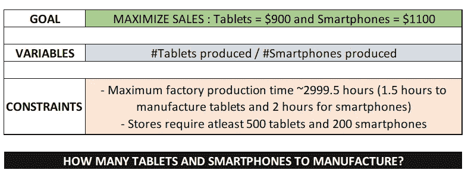
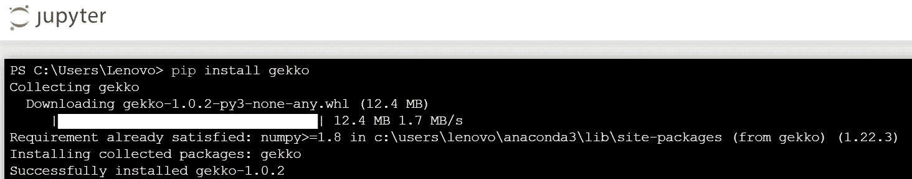

# 案例研究:使用 Gekko 优化 Python

> 原文：<https://medium.com/analytics-vidhya/optimization-b26b098061f8?source=collection_archive---------0----------------------->


## 问题范围



现在，让我们深入了解一下，在上述暗示的条件下，通过制造适当的产品单位来最大限度地提高产品销售的最佳解决方案是什么！

第一，进口‘盖柯’。如果您还没有安装它——pip 从终端安装 gekko，如下所示:



接下来，将包导入到您的笔记本中，并调用模型实例。

```
from gekko import gekko#Create model instance
m = gekko()
```

让我们从指定变量开始:-

*   片剂 _ 单位:生产的片剂数量
*   smartph_units:生产的智能手机数量。

此外，根据合计工厂生产时间和产品销售额，我们还需要 2 个变量

*   prod _ constr:这指定了每个产品的数量(单位数*生产时间)
*   total_sales:公司将获得的最大销售金额

我们将在下面的模型方程中加入这些变量，以便更好地理解目的。

```
#Initiate variables
tablet_units = m.Var(value=1)
smartph_units = m.Var(value=1)
prod_constr = m.Var()
total_sales = m.Var()#Production time to create each product type
tablet_time = 1.5
smartph_time = 2#Sale price of each product stored as a constant value
tablet_price = 900
smartph_price = 1100
```

现在，假设所有的产品都卖出去了，让我们来计算数学约束。

```
#Minimum units the stores need for each product
m.Equation(tablet_units>=500)
m.Equation(smartph_units>=200)<gekko.gekko.EquationObj at 0x184f83a4220>
```

上述约束是根据商店需要的最小产品数量计算的。

```
#Production constraint
m.Equation(prod_constr== (tablet_units*tablet_time)+(smartph_units*smartph_time))
m.Equation(prod_constr<=2999.5)<gekko.gekko.EquationObj at 0x184f83a4730>
```

生产约束规定了在最大可能工厂生产时间内生产每件产品所花费的总时间。

```
#Total sales 
m.Equation(total_sales==(tablet_units*tablet_price)+(smartph_units*smartph_price))<gekko.gekko.EquationObj at 0x184f83a4e50>
```

最后但也是最重要的一点是，计算每个存储产品的总销售额，以计算公司销售额最大化的目标。

```
#Setting the objective function
m.Obj(-total_sales)
m.options.SOLVER = 1
```

注意:目标函数默认设置为最小化，因此我们指定'-total_sales '，因为我们的目标是最大化。

m.options.SOLVER:将求解器设置为 APOPT 以获得整数解，因为我们应该将产品单位设置为整数。

我们现在都准备好了！还是叫解决方案吧！

```
m.solve()apm 45.114.158.17_gk_model0 <br><pre> ----------------------------------------------------------------
 APMonitor, Version 1.0.1
 APMonitor Optimization Suite
 ----------------------------------------------------------------

 --------- APM Model Size ------------
 Each time step contains
   Objects      :            0
   Constants    :            0
   Variables    :            7
   Intermediates:            0
   Connections  :            0
   Equations    :            6
   Residuals    :            6

 Number of state variables:              7
 Number of total equations: -            5
 Number of slack variables: -            3
 ---------------------------------------
 Degrees of freedom       :             -1

 * Warning: DOF <= 0
 ----------------------------------------------
 Steady State Optimization with APOPT Solver
 ----------------------------------------------

 Iter    Objective  Convergence
    0 -6.70000E+05  2.99950E+03
    1 -1.72412E+06  0.00000E+00
    2 -1.77970E+06  2.22045E-16
    3 -1.77970E+06  2.22045E-16
    4 -1.77970E+06  2.22045E-16
 Successful solution

 ---------------------------------------------------
 Solver         :  APOPT (v1.0)
 Solution time  :   1.290000000153668E-002 sec
 Objective      :   -1779700.00000000     
 Successful solution
 ---------------------------------------------------
```

## 最终解决

```
print('Total Tablet Units :' + str(tablet_units.value))
print('Total Smartphone Units:' +str(smartph_units.value))
print('Maximized total sales:' + str(total_sales.value))Total Tablet Units :[1733.0]
Total Smartphone Units:[200.0]
Maximized total sales:[1779700.0]
```

正如我们所看到的，最佳解决方案是生产 1733 台平板电脑和 200 部智能手机，以在业务问题的特定约束下获得 1779700 美元的优化销售额。