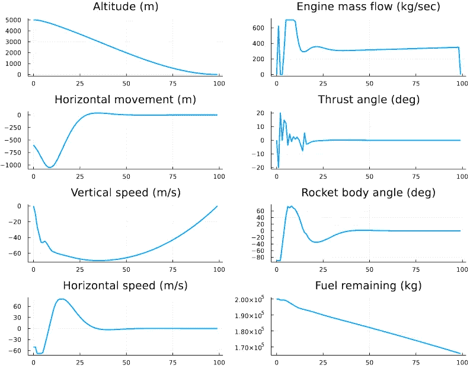
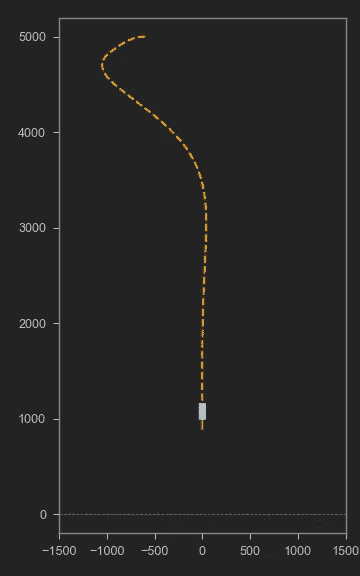

# 朱莉娅中的优化:火箭软着陆

> 原文：<https://medium.com/analytics-vidhya/optimization-in-julia-rocket-soft-landing-2aa8b9706e05?source=collection_archive---------0----------------------->

在针对快速计算和通用机器学习进行调整的高性能语言领域，出现了新的竞争对手。数据科学从业者可能注意到了 Julia 编程语言应用的缓慢而稳定的增长。

虽然创建于 2012 年，但现在 Julia v1.7.2 仍主要被研究人员用于需要非常快速计算的专业问题，如实时模拟、机器人控制、风险建模、制药建模等。对此很感兴趣，我决定在 Julia 中重新实现我以前的关于动态编程的 [python 文章](/analytics-vidhya/dynamic-optimization-in-python-rocket-soft-landing-a5a68eaf3b94)。在讨论实现细节之前，关于 python 的安装和特性还有一些需要注意的地方。

*   Julia 是通用的、高级的、编译的、动态类型的语言。它的主要卖点是速度。几个基准测试表明，Julia 在计算速度上接近 C，领先于 Fortran，平均比 Python 或 r 快 2 个数量级。
*   Julia 的语法非常简单，介于 Matlab 和 Python 之间。图书馆生态系统支持主要的 ML、DL 和优化方法。与 Python 不同，Julia 的面向对象能力有限。数组索引从 1 开始。
*   Julia 与 Python 有很好的集成，反之亦然。使用 **PyCall** 模块可以导入和运行 Python 模块和函数。安装 Julia 时，可以在 Julia 内部的单独环境中安装 Python，也可以使用现有的 Python 安装(仅限 conda)。

因此，使用 Julia 的公司只将它用于计算量最大的任务，同时仍然使用 Python/R 进行大部分开发。

为了感受这种语言，我用**跳转**模块和 **Ipopt** 解算器重写了火箭控制的优化问题。JuMP 可以说是最著名和最广泛使用的 Julia 优化模块，它支持许多针对各种问题类别的开源和商业解决程序，包括线性、混合整数、圆锥曲线和非线性编程。

在这里，我将尝试优化重物从某一高度(比如海拔 5 公里)下降并在所需点软着陆的 2D 轨迹，并受相关物理力(重力拉力、火箭发动机推力、风等)的影响。更多细节请参考我之前的[出版物](/analytics-vidhya/dynamic-optimization-in-python-rocket-soft-landing-a5a68eaf3b94)。完整的 Julia 代码和 python 可视化脚本可在[这里](https://github.com/Igor-Shvab/Rocket_soft_landing)获得。

在仔细选择初始条件(如进入速度)、可变边界和不同的积分方案后，下降轨迹这次看起来更符合实际。

可以使用 PyCall 模块将状态和控制向量保存为 numpy 数组，并在单独的 python 脚本中生成着陆视频。这是一个如何在 Julia 中调用 python 函数的例子。

