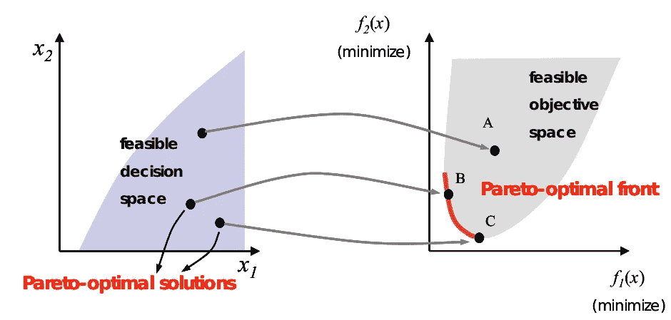
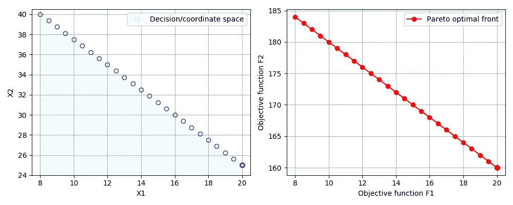
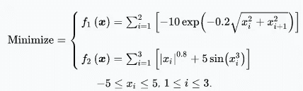
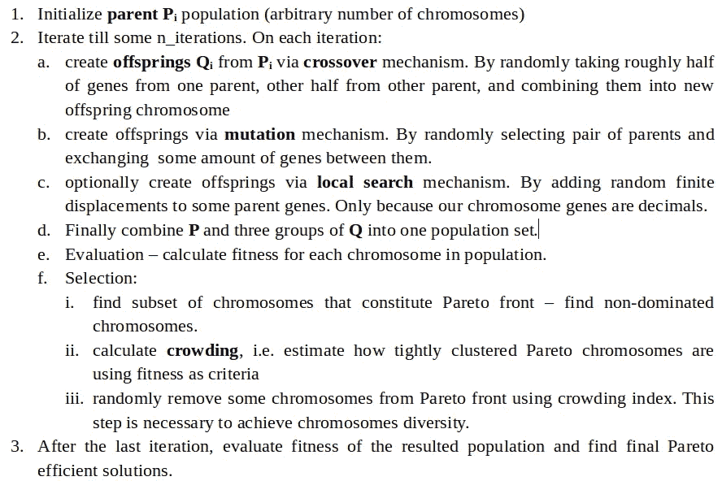
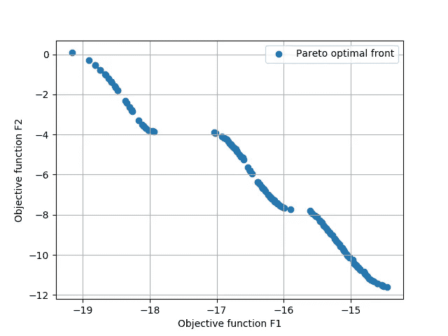

# Python 中的优化建模:多目标

> 原文：<https://medium.com/analytics-vidhya/optimization-modelling-in-python-multiple-objectives-760b9f1f26ee?source=collection_archive---------0----------------------->

在之前的两篇 [文章](/@igorshvab/optimization-modelling-in-python-metaheuristics-with-constraints-c22b08c487e8)中，我描述了单目标优化问题的精确和近似解决方案。虽然人们在实践中可能遇到的大多数问题确实是单目标的，但多目标优化( **MOO** )在制造业和汽车行业都有其应用领域。

在本文中，我将展示单目标优化问题和多目标优化问题之间的区别，并将简要描述解决后者的两种最流行的技术- **ε约束**和 **NSGA-II** 算法。

x1，x2，xj … x_n —优化问题的坐标搜索空间。

**x** (x1，x2，xj … x_n) —候选解。搜索空间中的一点。

**Fi**—**x**处的目标函数值。

在单目标优化问题中，一个解决方案相对于其他解决方案的优越性很容易通过比较它们的目标函数值来确定。在多目标情况下，人们不能直接比较一个目标函数值与另一个目标函数值。在这种情况下，解决方案的优劣由**优势**决定。

解 **x1** 支配 **x2** 如果:

*   解决方案 **x1** 在所有目标上都不比 **x2** 差
*   并且解决方案 **x1** 至少在一个目标上严格优于 **x2**

根据这个定义，任何一组解都可以分为支配子集和非支配子集。整个可行决策空间的非支配集称为**帕累托最优**或**帕累托有效集**。帕累托效率是这样一种情况，当一个人不能在不使 **Fj** 变得更糟的情况下改善关于 **Fi** 的解 **x** 时，反之亦然。在这个集合中没有“最佳解决方案”，因此用户可以根据业务需求选择任何一个解决方案。通常帕累托最优解可以由线或面连接起来。这样的边界称为**帕累托最优前沿**。

方案 B 和方案 C 都不占优，都是帕累托最优的。

多目标优化的目标是找到尽可能接近帕累托前沿的一组解。在本文的剩余部分，我将展示两个解决 MOO 问题的实际实现。

**ε-约束**是一种经典技术，属于 MOO 问题的标量化方法。本质上，标量化方法试图以某种方式将 MOO 重新表述为单目标问题。例如，在最简单的方法中，多个目标被线性组合成一个具有任意权重的总体目标函数。这种方法的缺点是，为了选择合适的权重，必须事先知道每个目标函数。在**ε-约束**方法中，我们仅优化一个目标函数，同时将其他函数限制在用户特定的值内，基本上将它们视为约束。让我们考虑下面这个超级简单的线性例子:

**最大化** F1 = x1

**最大化** F2 = 3x1 + 4x2

**约束** : x1 < = 20

x2 <= 40

5x1 + 4x2 <= 200

We are going to solve this problem using open-source **Pyomo** 优化模块。代码片段如下。

简而言之:

1.  首先我们分别优化 **F1** 和 **F2** ，只是为了了解 **F2** 在 **F1** 优化过程中的取值范围。
2.  然后我们把 **F2** 函数重写为约束: **F2 - slack_variable == ε** 。其中 **ε** 是用户定义的值，可选的松弛变量只是帮助优化器更好地探索整个决策空间。此时，整个问题只有一个目标函数 **F1** 和一个附加约束。
3.  最后在 **F2** 值范围内迭代所有可能的 **ε** 值，并在每一步优化新制定的问题。

上图显示了这个简单的线性多目标优化问题的帕累托前沿。值得指出的是，大多数情况下解决方案的分布非常不均匀。例如，对于这个特殊的问题，许多解决方案都集中在右下角。在下一个例子中，我将展示如何对帕累托最优解进行采样，以产生不同的解集。

在现实世界的应用中，当目标函数是非线性的或具有不连续的变量空间时，上述经典方法可能不能有效地工作。启发式方法如遗传算法(GA)被证明是经典方法的优秀替代品。在本节中，我们将应用最流行的启发式方法之一— **NSGA-II** (非支配排序遗传算法)来解决非线性 MOO 问题。具体来说，我们将在测试函数上测试 NSGA-II。

在深入研究代码之前，值得指出的是，传统的 GA 处理二进制向量，即由 0 和 1 组成的向量。在给定示例中，解向量由小数 **x** (x1，x2，x3)组成。虽然总是可以将十进制转换为二进制形式，但我们仍然可以将相同的 GA 逻辑应用于常见的向量。

在进化算法术语中，解向量被称为**染色体**，它们的坐标被称为**基因**，目标函数值被称为**适应度**。页面底部给出了详细注释的 python 代码。以下是简单的算法描述和目标函数值图。

