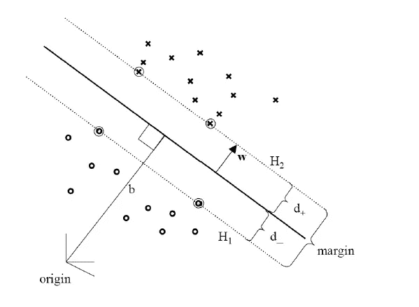

# 支持向量机的优化

> 原文：<https://medium.com/analytics-vidhya/optimization-of-support-vector-machine-709090570dbb?source=collection_archive---------6----------------------->

## 用二次规划优化线性可分分类器的数学解释。

来源:[图片](https://cdn.jvejournals.com/articles/18120/xml/img2.jpg)

对于线性可分数据，支持向量机(SVM)的目标函数定义为:

SVM 的目标函数

如果你想知道更多关于我们是如何制定它的，请阅读 [**第一部分**](https://ajinkya14jadhav.medium.com/support-vector-machine-intuition-validate-with-maths-e10fb8cc7f57) 。

这是一个带有线性约束的**二次**和**凸**目标函数。因此，为了优化这个目标函数，我们需要引入拉格朗日乘数α；不等式约束中各一个。这是一个叫做**二次规划问题的非线性规划问题。**

[朗格乘子法](https://en.wikipedia.org/wiki/Lagrange_multiplier)处理寻找服从**等式约束**的函数的局部最小值或局部最大值。但是在目标函数中，我们有一个不等式约束，所以我们需要使用一个*广义版本的拉格朗日乘数法，同时考虑到* ***不等式约束*** 。所以，**卡鲁什-库恩-塔克(KKT)条件**考虑不等式约束的广义拉格朗日乘子法为；

现在目标函数的拉格朗日(L)变成了；

其中α是拉格朗日乘数。因为线性约束大于或等于类型；我们使它小于或等于乘以-1，以满足 KKT 条件的拉格朗日乘子法。关于(w.r.t.) **w** 和**b**l 必须**最小化**而对于**α**s**最大化**，这意味着我们需要找到一个鞍点。****

********

****[形象信用](https://i.stack.imgur.com/VQhmi.png)****

****在上图中，你可以看到 X 是一个鞍点，沿着曲线 AB 我们最小化函数，沿着曲线 CD 最大化它的对偶。****

******对偶定理**陈述了在*中，一个凸优化问题和一组线性约束，如果原问题有最优解，那么对偶问题也有最优解。对应的值相等，我们称之为鞍点。*这里的主要问题是最小化关于 **W** 和 b 的 L，而对偶问题是最大化关于 **α** 的 L****

****如果违反了线性约束，那么可以通过增加相应的 **α** 来增加 L，但是然后 **W** 和 b 必须改变，使得 L 减小。这是当数据点位于裕量内并且必须改变 **W** 和 b 以调整裕量时的情况。对于所有不满足的约束，等式意味着大于 0，则相应的 **α** 必须为 0，以使 l 最大化。****

****因为我们需要最小化 L w.r.t. **W** 和 b，所以我们对其求导并使其等于零。如；****

********

****对 L w r t**w**和 b 求导后我们得到:****

********

****重新排列 L 的项，替换上面得到的值，然后****

************************

****现在，这是一个对偶问题，我们需要最大化 w.r.t. α，约束条件为:****

********

****这是使用二次优化的数值方法解决的，该方法通过最大化对偶问题 l 给出每个训练点的最佳α值。最佳α值大于 0 的训练点称为**支持向量。**对于其他训练点，最优α的值为零，位于边缘超平面的那一侧，使得；****

********

****这个不等式严格成立。****

****正如你可以注意到的，在上面的 L 的对偶公式中，两个维数为 d 的数据点的内积被采用。正如我们所知，内积提供了某种程度的相似性，或者说它表明了它们之间的距离。如果它们**相似**则**内积为 1** 或者如果它们**不相似**则为 **0** 。****

## ****关于 L 的内部产品的见解:****

****所以，让我们在内积的背景下理解 L 的对偶。正如我们所说，如果α不为零，那么函数将最大化。这些是帮助最大化利润的支持向量。****

****请注意约束中所有的α都是正的。让我们来探讨一些随之而来的案例:****

****情况 1:如果两个特征相似，那么它们的内积是 1。然后有两个子类，例如:****

****a)如果两个特征向量对 y 的输出值做出相反的预测，即一个是+1 或者另一个是-1，那么；****

********

****在函数的第二项变成负的，我们要减去它，所以这加到和上，使它最大化。这些是我们正在寻找的例子；区分这两个阶层的关键因素。****

****b)如果两个特征向量对 y 的输出值做出相似的预测，即两者都是+1 或-1，那么；****

********

****在函数的第二项变为正值，并且我们正在减去它，这降低了 l 的值。因此，该算法降低了做出相同预测的相似特征向量的等级。****

****情况 2:如果两个特征向量不相似，那么它们的内积是 0。所以，这个术语；****

********

****变为零。所以他们对 l 没有贡献。****

****使用α的最佳值，我们计算最佳权重，使得****

********

****现在最佳分离超平面由下式给出****

********

****超平面的最优方程****

********

****来源:[霍夫曼的研究论文](https://d3i71xaburhd42.cloudfront.net/6c41c29257597af6b7da10fbb335cd2c2f9bde75/7-Figure2-1.png)****

******总结:**简言之，**点(内)积**在优化中决定哪些数据点有助于得到最优超平面。这些数据点被称为**支持向量**，用于确定超平面的方向。****

******参考文献:******

****[1]:[sude shna Sarkar 的演讲](https://www.youtube.com/watch?v=YOsrYl1JRrc&ab_channel=MachineLearning-SudeshnaSarkar)****

****[2]:支持向量机—内核和内核技巧—马丁·霍夫曼****

****我希望这篇博客有助于理解 SVM 使用二次规划的最优化。如果您有任何想法、反馈或建议，请随时在下面发表评论。谢谢大家！****