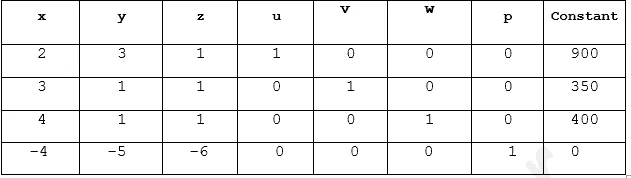

# 最优化:最大化的单纯形法。

> 原文：<https://medium.com/analytics-vidhya/optimization-simplex-method-for-maximization-e117dfa38114?source=collection_archive---------3----------------------->

照片取自[维基百科](https://en.wikipedia.org/wiki/Simplex_algorithm#/media/File:Simplex-method-3-dimensions.png)

# 介绍

单纯形法是一种手动求解线性规划模型的方法，使用松弛变量、表和枢轴变量作为寻找优化问题的最优解的手段。线性规划是在给定带有线性约束的最大值或最小值方程的情况下实现最佳结果的方法。大多数线性规划可以使用 MatLab 等在线求解器来求解，但单纯形法是一种手动求解线性规划的技术。要使用单纯形法求解线性规划模型，必须执行以下步骤:

●标准形式

●引入松弛变量

●创造场景

●枢纽变量

●创造一个新的场景

●检查最佳性

●确定最佳价值

本文档将单纯形法分解为上述步骤，并在整个文档中遵循下面所示的示例线性规划模型来寻找最优解。

最大化:

为了确定最大化，我们必须遵循以下步骤。

步骤:

1.  通过添加松弛变量来转换所有不等式主题方程。同样，通过将所有值移动到一边来创建等于零的目标函数。
    加入松弛变量(u，v，w)后的方程
    其中 u，v，w≥0

2.单纯形表用于在线性规划模型上执行行操作，以及检查最优解。该表由对应于线性约束变量的系数和目标函数的系数组成。在下面的表格中，表格中加粗的第一行说明了每一列所代表的内容。下面两行表示来自线性规划模型的线性约束可变系数，最后一行表示目标函数可变系数。

现在通过创建所有主体方程的系数来创建单纯形表，并在底部添加目标方程。

3.为了计算比率，我们可以从最后一行中选择最小值，并遵循以下步骤。

**如何识别枢纽列:**

上表中， **-6** 是最后一行最小的负数。这将指定 **z** 列包含用黄色突出显示的枢轴变量。

**如何识别透视表行:**

pivot 变量在行操作中用于确定哪个变量将成为单位值，并且是单位值转换中的一个关键因素。通过查看表格的底行和指示器，可以识别枢轴变量。假设解决方案不是最优的，在最下面一行中选择最小的负值。位于该值列中的一个值将是枢纽变量。要查找指标，请将线性约束的 beta 值除以包含可能的透视变量的列中的相应值。具有最小非负指标的行与底行中最小负值的行的交叉点将成为枢纽变量。

用相应行中的常数划分透视列，并标识值。

求解该比值得到第一个约束的值 **(900/1 = 900)** ，第二个约束的值 **(350/1 = 350)** ，第三个约束的值 **(400/1 = 400)** 。由于 350 是最小的非负比率，透视值将位于以绿色突出显示的第二行，透视行和列的交集将是透视元素，其值为 1，以红色突出显示。

既然已经确定了中枢变量，我们就可以研究进一步的解决方案来优化它。

**4。**为了优化 pivot 变量，需要将其转换为一个单位值(值为 1)。因为，pivot 元素在这里已经是 1 了，我们不需要让它成为单位值。

5.确定单位值后，处理公式，该公式将使包含单位值的列中的其他值变为零。这是因为松弛变量和其他变量值可以被识别，并且解决方案正在被优化。

公式:R1=R1-R2，R3=R3-R2，R4=R4+6R2

在我们的单纯形表上应用上述公式将得到下表。

因为底行中的所有值都大于或等于零，所以获得了最优解。

这里，基本变量是 u、z、w 和 p。
非基本变量是 x、v 和 y。

由此我们可以获得如下变量值:

x=0，y=0，v=0，u=550，w = 50，p = 2100，z = 350。

现在为了验证这个等式，

**最大最优值为 2100，位于目标函数的(0，0，350)处。**

# 结论

单纯形法是一种手工确定线性规划最优值的方法。该方法产生满足给定约束的最优解并产生最大 zeta 值。为了使用单纯形法，给定的线性规划模型需要是标准形式的，其中可以引入松弛变量。使用 tableau 和 pivot 变量，可以获得最佳解决方案。

# 词汇表

**基本变量**是最优解方面的非负变量。

**约束**是一系列等式和不等式，是寻找最优解时必须满足的一组标准。

**不等式**是一个表达式，它没有一个明确的解，可以用“大于”或“小于”符号代替传统的等号来区分。

**线性规划**是一种模型，用于在给定带有线性约束的最大值或最小值方程的情况下实现最佳结果。

**非基本变量**是在最优解方面为零的变量。

**最大化线性规划模型的最优解**是分配给目标函数中的变量以给出最大 zeta 值的值。最优解将存在于整个模型的图形的角点上。

**Pivot 变量**用于行操作，确定哪个变量将成为单位值，是单位值转换的关键因素。

**单纯形法**是一种手动求解线性规划模型的方法，使用松弛变量、表格和枢轴变量作为寻找优化问题最优解的手段。

**单纯形表**用于在线性规划模型上执行行操作以及检查最优性。

**松弛变量**是引入到线性程序的线性约束中的附加变量，用于将它们从不等式约束转换为等式约束。

**标准格式**是求解最优解之前所有线性程序的基线格式。

参考: [libretexts](https://math.libretexts.org/Bookshelves/Applied_Mathematics/Book%3A_Applied_Finite_Mathematics_(Sekhon_and_Bloom)/04%3A_Linear_Programming_The_Simplex_Method/4.02%3A_Maximization_By_The_Simplex_Method) ，书:布利泽，数学思维|皮尔森。