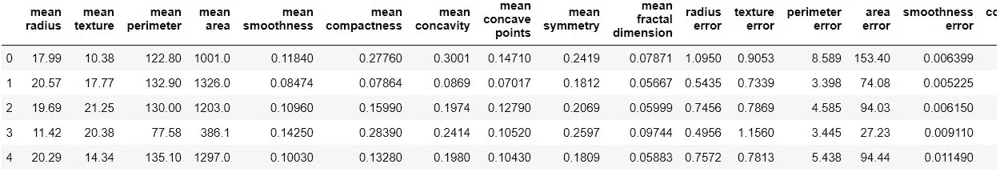
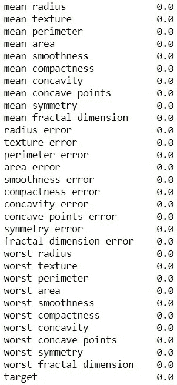
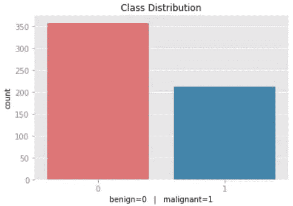
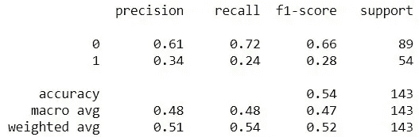
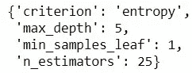
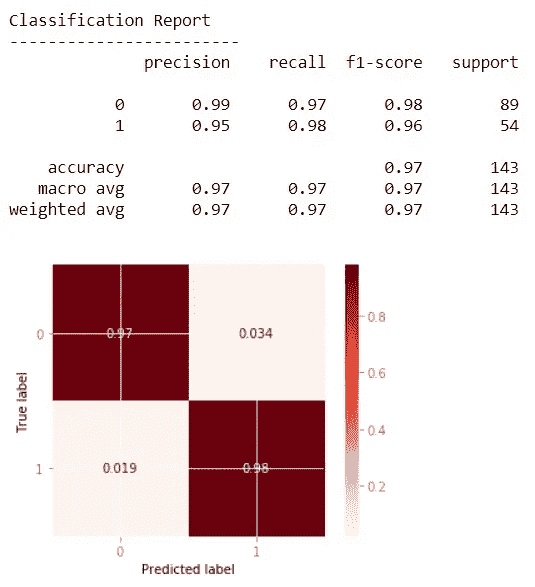

# 使用 GridSearch 优化超参数

> 原文：<https://medium.com/analytics-vidhya/optimize-hyperparameters-with-gridsearch-d351b0fd339d?source=collection_archive---------5----------------------->


在这篇博客中，我们将介绍什么是超参数，它们如何与网格搜索相联系，然后介绍一个使用网格搜索优化我们的模型的[示例笔记本](https://github.com/Lewis34cs/gridsearch_blog)。

# 什么是超参数？

超参数是其值不能从数据中确定的参数。超参数的值必须在模型经历其学习过程之前设置。例如，在 RandomForestClassifier 模型中，一些超参数包括:n_estimators、criterion、max_depth、mn_samples_split 等。(有关参数的完整列表，请访问 Sci-kit Learn 的 RandomForestClassifier 模型页面[此处](https://scikit-learn.org/stable/modules/generated/sklearn.ensemble.RandomForestClassifier.html))。

出于这个博客的目的，我们不会深入每个超参数的细节。超参数非常重要，因为它们直接控制训练算法的行为，并对被训练模型的性能有重大影响。每个超参数可以接受不同数量的值。例如， **n_estimators** 可以接受任何整数，而**标准**只能接受“基尼”或“熵”。剩下的问题是，我们如何为我们的模型选择最佳超参数，以产生最佳结果？

# 输入 GridSearch

网格搜索是一种工具，它为我们指定的每个超参数组合建立一个模型，并评估每个模型，以查看哪个超参数组合创建了最佳模型。我们不必手动选择参数，我们可以提供一个字典，其中的键是超参数名称，值是我们想要为该参数尝试的值的列表。假设我们想要计算出 **n_estimators** 的最佳数量和**criterion**的最佳值，应该是这样的:

```
# example
param_grid = {
'n_estimators': [10, 20, 50, 100],
'criterion': ['gini', 'entropy']
} 
```

**param_grid** 字典将包含我们想要为模型调整的每个超参数，以及该超参数的不同输入列表。

# 安装

我们将在本博客中使用的数据集将是 Sci-kit Learn 的乳腺癌数据集。如果你想在笔记本上跟随，你可以在这里找到它！首先，我们将导入必要的库:

```
# Importing first libraries
import pandas as pd
from sklearn.datasets import load_breast_cancer
```

接下来，我们设置数据:

```
# Setting the variable 'dataset' to hold the Bunch object
# (special kind of dictionary)
dataset = load_breast_cancer()# Creating variables to reference the target and feature columns
features = dataset.data
target = dataset.target
```

如果我们想进一步探索数据，我们可以创建一个数据框架来保存特性和目标！

```
# Creating a dataframe to hold the feature columns
df = pd.DataFrame(features)# Accessing the Bunch object (dataset) to provide feature names for # the feature columns in our dataframe
df.columns = dataset.feature_names# Adding the target to our dataframe by creating the 'target' column
df['target'] = target
```

从这里我们可以尽情探索！让我们继续查看数据帧的前 5 行:

```
df.head()
```



查看前 5 行

```
df.isna().sum()
```



确保数据中没有缺失值

我们将快速交换类别，使恶性类别为 1，良性类别为 0。我们可以通过创建一个小函数，然后将该函数应用于 dataframe 的目标列来实现。请注意，我们不需要这样做，我只是希望将恶性类设置为 1。

```
def convert_class(num):
   return abs(num — 1)
```

现在我们简单地将函数应用于数据帧:

```
converted_target = df[‘target’].apply(convert_class)
df['target'] = converted_target
```

现在，让我们继续查看班级分布情况:

```
# Setting labels for plot
labels ='Benign=0   |   ' + 'Malignant=1'# Viewing number of patients within each class
sns.countplot(x=df[‘target’])
plt.title(‘Class Distribution’)
plt.xlabel(labels);
```



查看班级分布

# 随机森林分类器信息

因为我们在这篇博客中使用了 RandomForestClassifier 模型，所以让我们来看看这个模型的一些基本细节:

1.  随机森林模型没有任何假设
2.  数字数据不需要缩放
3.  缺失数据会影响 Sci-kit 学习模型
4.  对异常值稳健

与线性和逻辑回归等其他模型不同，随机森林模型对数据没有任何假设。这意味着我们不需要担心要素之间的多重共线性或残差是否呈正态分布。用于训练随机森林模型的数据不需要缩放，但是如果数据被缩放，也不会对模型产生负面影响。因为我们将使用来自 Sci-kit Learn 的 RandomForest 分类器，所以我们需要确保数据集中没有丢失数据。请注意，RandomForest 模型的一些其他版本不需要对缺失数据进行任何预先处理。这个模型对异常值是健壮的，所以我们不需要担心定位和删除任何异常值。

## RandomForest 的一些缺点

*   不预测连续输出(用于回归)
*   不会预测超出训练集中值的范围
*   偏向有几个类别的分类变量
*   在多类问题上偏向更频繁的类

由于我们专注于二进制分类，并且在我们的特征中使用严格的数字数据，所以我们不需要担心 RandomForest 的缺点。以下是一些优点。

## RandomForest 的优势

*   可解释性
*   渲染特征重要性
*   需要更少的数据预处理
*   (理论上)不要过度拟合
*   良好的性能/准确性
*   抗噪声能力强
*   几乎不需要任何参数调整
*   适用于几乎任何机器学习问题

如果你对 RandomForests 有任何问题，欢迎在下面的评论中提问或给我发电子邮件！现在，我们将进入博客的主菜。

# 创建训练集和测试集

这是重要的一步，我们必须始终确保至少创建一个训练集和测试集——否则，我们如何知道我们的模型是否过度拟合数据？先来导入 Sci-kit Learn 的 train_test_split:

```
from sklearn.model_selection import train_test_split
```

现在，我们可以输入我们的特征和目标来创建训练集和测试集:

```
X = df.drop(columns=‘target’)
y = df[‘target’]X_train, X_test, y_train, y_test = train_test_split(X, y, random_state=42)
```

# 基线模型

基线模型的目的是，你猜对了，设置基线性能！它本质上是陈述一个人盲目猜测职业的准确性。我们创建和评估基线模型的原因是为了确定与基线模型相比，我们的实际模型改进了多少。要设置它，我们需要导入一些东西:

```
from sklearn.dummy import DummyClassifier
from sklearn.metrics import plot_confusion_matrix, classification_report
```

现在让我们创建 DummyClassifier 模型:

```
# Creating and fitting our dummy classifier to train set
dummy = DummyClassifier(strategy='stratified')
dummy.fit(X_train, y_train)# Creating our y_pred variable off of test features
y_pred = dummy.predict(X_test)# Printing out the classification report
print(classification_report(y_test, y_pred))
```



DummyClassifier 的分类报告

请记住，**0 级是良性的**，而**1 级是恶性的**。由于我们正在处理一个涉及癌症的数据集，准确性不是最重要的分数。我们希望确保我们不会告诉某人他们没有患癌症，而事实上他们患了癌症。由于我们想要极低的假阴性率，我们的焦点是恶性类别的**召回分数**。在这里，我们看到 DummyClassifier 对恶性分类的召回率为 24%。让我们看看我们是否能改善这一点！

# 制作类别权重字典

因为我们的类是不平衡的，所以我们可以制作一个类权重字典来输入到模型中，以帮助模型进一步区分类，方法是针对不正确的猜测对模型进行更严厉的惩罚。我们可以通过导入以下内容进行设置:

```
from sklearn.utils import class_weight
```

既然我们已经导入了 Sci-kit Learn 的 class_weight，我们现在可以创建一个字典来保存我们的类权重！

```
# A array object that contains the weights for both classes
class_weights = class_weight.compute_class_weight(‘balanced’, classes=np.unique(y_train), y=y_train)# A dictionary object containing key-value pairs of both classes and # their weights
class_weights_dict = {0: class_weights[0], 1: class_weights[1]}
print(f”Our class weights:\n{class_weights_dict}”)
```

# 实例化 RandomForestClassifier

我们已经快到 GridSearch 了——我们现在需要做的就是实例化我们的模型，创建一个超参数网格，其中包含我们想要研究的每个超参数的值范围，然后将它与 GridSearchCV 对象相匹配。让我们从创建模型开始:

```
# Importing necessary library to create our model
from sklearn.ensemble import RandomForestClassifier# Creating our model and passing in the class weights
forest = RandomForestClassifier(class_weight=class_weights_dict)
```

# 超参数网格

现在让我们创建我们的网格！这个网格将是一个字典，其中的键是我们要关注的超参数的名称，值将是包含特定超参数可以接受的不同值的列表。

```
# Creating a dictionary called params to hold our grid
params = {
‘n_estimators’: [10, 25, 50, 100, 200], 
‘criterion’: [‘gini’, ‘entropy’], 
‘max_depth’: [3, 5, 10, 15, 20, 25, None], 
‘min_samples_leaf’: [1, 2, 5, 10]
}
```

**重要提示**:注意你选择在 gridsearch 中评估多少不同的超参数，以及列表中的值的数量。gridsearches 的一个缺点是运行时间长…如果我们有一个大的数据集，这将需要非常长的时间(我以前运行过超过 8 个小时的 gridsearches)。

# 设置 GridSearchCV

现在我们已经创建了一个模型和一个网格，我们最终可以创建一个 GridSearchCV 对象并使它适合我们的训练数据！首先让我们导入必要的库:

```
from sklearn.model_selection import GridSearchCV
```

接下来，我们将创建 GridSearchCV 的一个实例:

```
clf = GridSearchCV(estimator=forest, param_grid=params, scoring=’recall’, cv=5)
```

注意上面，我们为**估计器**提供了我们的模型，为 **param_grid** 提供了我们的超参数网格，选择了**评分**来关注召回，并保留 **cv** 为默认整数 5。CV 是交叉验证，它决定了交叉验证拆分策略中的折叠数。

现在让我们让 GridSearchCV 对象适合我们的训练集:

```
# fitting clf to train set
clf.fit(X_train, y_train)
```

请注意，这可能需要相当长的时间，具体取决于参数的数量、每个参数要尝试的值的数量以及我们使用的数据量。拟合完成后，我们可以通过调用以下命令来查看最佳参数:

```
best_params = clf.best_params_
print(best_params)
```



现在，我们已经根据提供的值计算出了所选超参数的最佳值，我们将创建一个使用这些超参数值的新随机森林模型。我们不必根据网格搜索手动输入每个参数的最佳值。相反，我们可以通过在 **best_params** 前添加两个星号来轻松地将 **best_params** 字典解包到新模型中，如下所示:

```
# unpacking the best_params into our new model
best_forest = RandomForestClassifier(**best_params, class_weight=class_weights_dict)
```

现在，我们已经创建了具有最佳参数的模型，让我们将它与训练数据进行拟合:

```
# Fitting our model to the train set
fit_forest = best_forest.fit(X_train, y_train)# Creating predicted variables to compare against y_test
y_pred = fit_forest.predict(X_test)# making classification report and confusion matrix
print(classification_report(y_test, y_pred))
plot_confusion_matrix(fit_forest, X_test, y_test, normalize=’true’, cmap=’Reds’)
```



最优模型的分类报告和混淆矩阵

简而言之，这是如何网格搜索模型的超参数的基本方法，以便为网格中的每个指定参数找到最佳值。请记住，gridsearch 中的键、值和数据越多，grid search 完成彻底搜索所需的时间就越长。在这篇博客中，我们只对 RandomForestClassifier 的几个超参数进行了基本的网格搜索。笔记本的链接可以在[这里](https://github.com/Lewis34cs/gridsearch_blog)找到。我希望你喜欢，随时联系，如果你有任何问题！