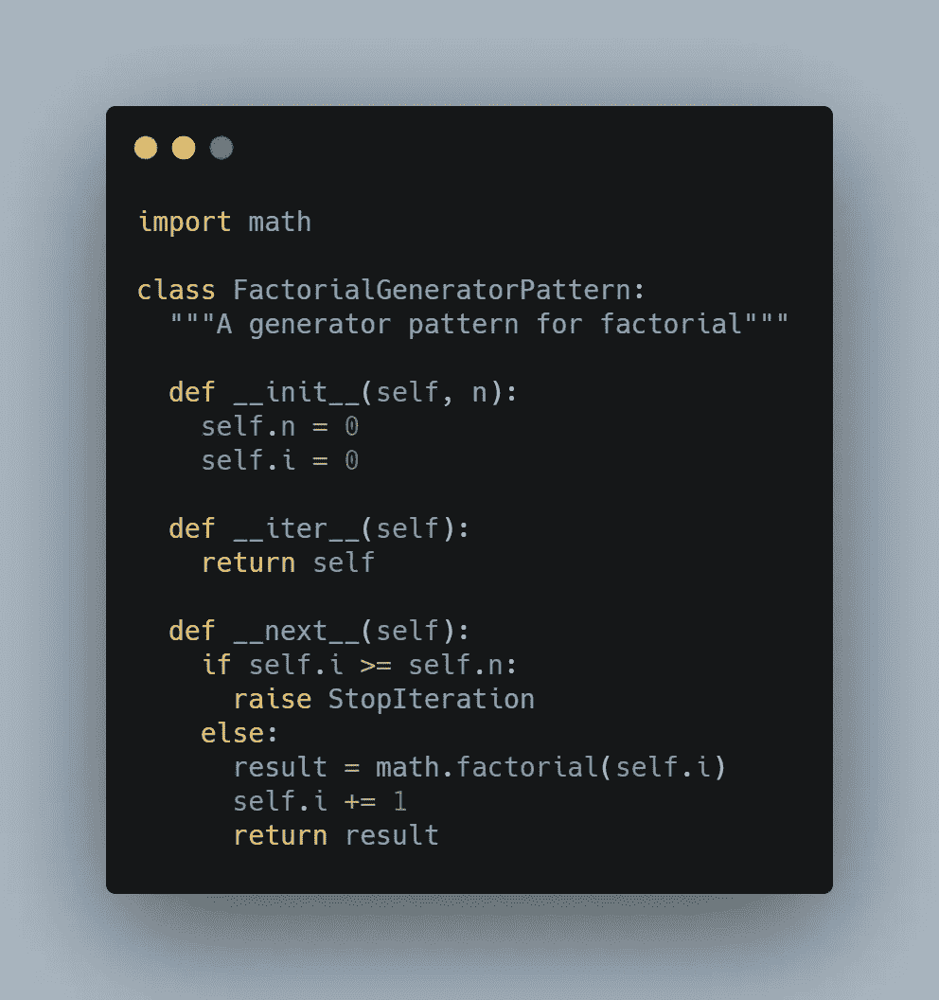
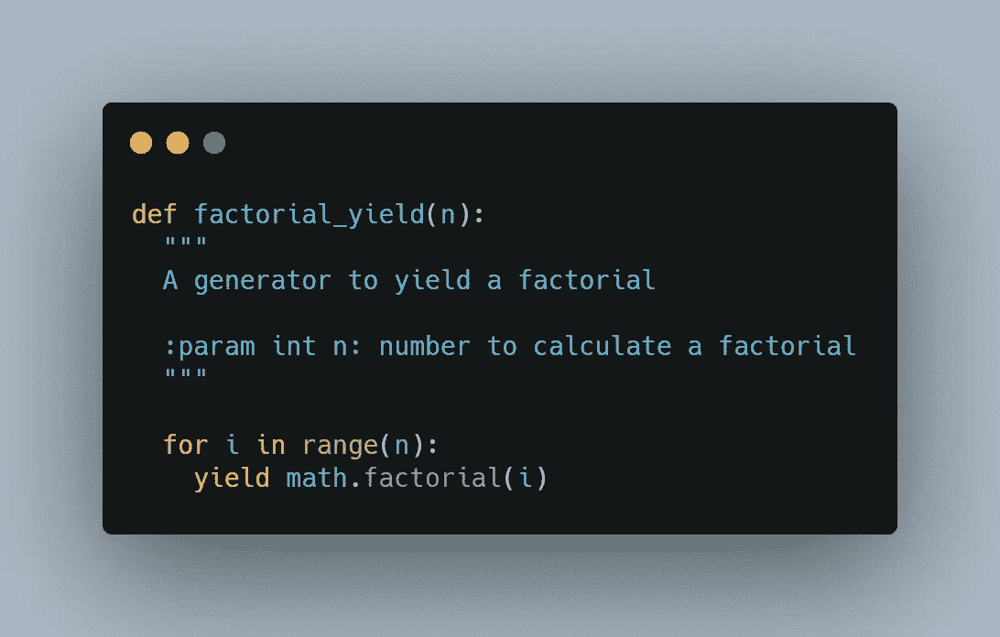
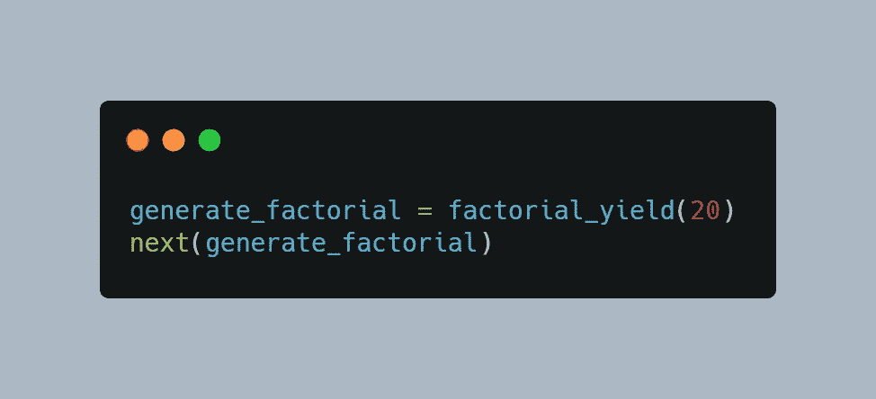
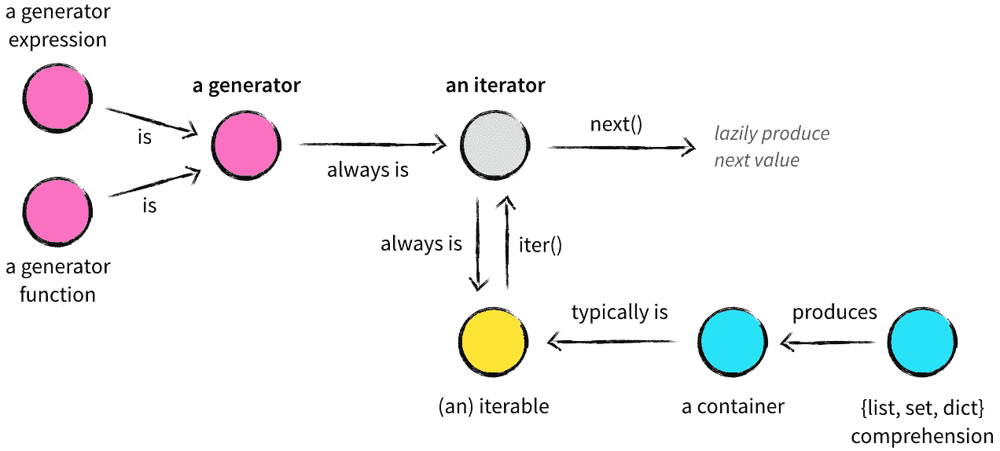
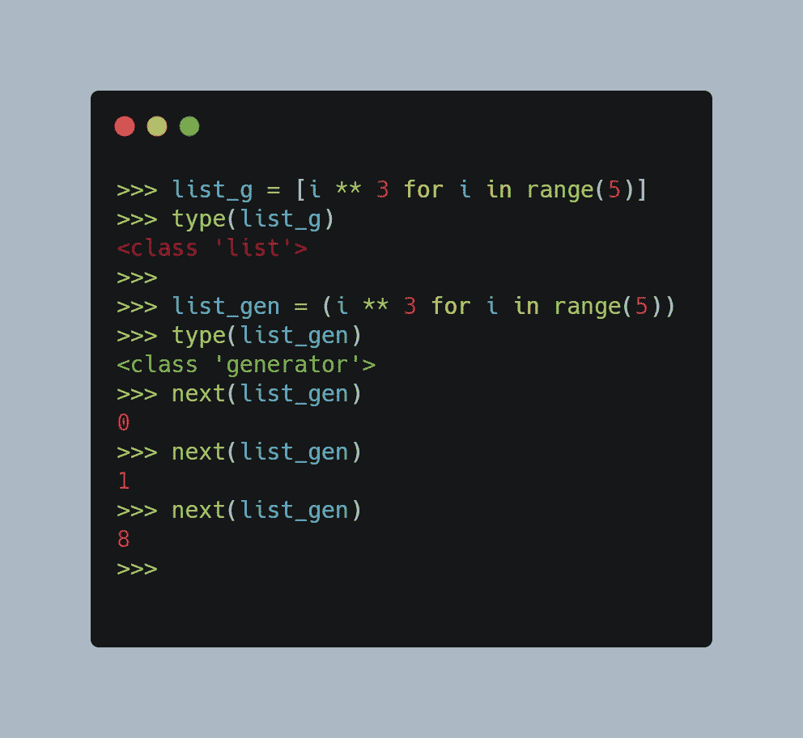
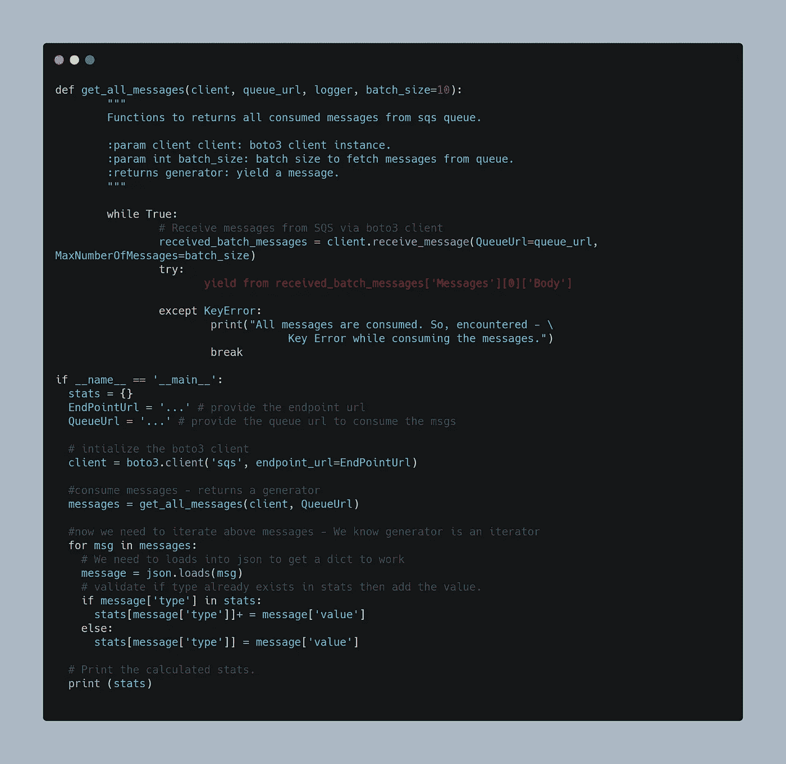

# 使用 Python 生成器优化您的代码

> 原文：<https://medium.com/analytics-vidhya/optimize-your-code-with-python-generator-9498b6ea1fa4?source=collection_archive---------13----------------------->

在 [Unsplash](https://unsplash.com?utm_source=medium&utm_medium=referral) 上由 [Chad Kirchoff](https://unsplash.com/@cakirchoff?utm_source=medium&utm_medium=referral) 拍摄的照片

您是否遇到过这样的问题:您的数据结构超出了内存，无法为下一次处理加载所有需要的中间数据，并且无法在每次调用它时维护内部状态？

听起来耳熟吗？🤔

## 欢迎来到发电机的世界

嗯，这种情况在编程中很正常，为了避免相同的问题，存在多个解决方案。

但是为了更好地解决这类问题，Python 有专门的函数/表达式，通常称为`**Generator**` **。**

在 [python wiki](https://wiki.python.org/moin/Generators) 中定义为，

> *“生成器函数允许你声明一个行为类似迭代器的函数，也就是说，它可以在 for 循环中使用。”*

因此，Generator 只不过是一个函数/表达式，它的行为类似于迭代器。这意味着生成器带有迭代器的属性，即类的`**__iter__**`和`**__next__**`方法。这在软件工程中也被称为**生成器模式**。

现在，让我们以下面的方式创建用于计算阶乘的生成器模式，

上面的代码为我们提供了一个很好的结构来处理 factorial 的生成器模式，但是它的实现有点冗长。再往前，问题就冒出来了，

**能不能简单点？**

让我们看看另一个代码更少但实现更智能的代码片段

我们看到代码实现**大大减少了**，但它仍然以更智能的方式服务于相同的目的。

上述代码片段的另一个有趣点是`yield` **。这与函数中的`return`语句行为相同——但是有一个重要的区别**

> 当遇到`**yield**` 语句时，Python 返回`**yield**` 指定的任何值，但是**暂停**函数的执行。然后我们可以**通过 **next()** 再次调用**相同的函数，它将**从上次遇到`**yield**` 的地方恢复**。

## 生成器与迭代器

图片来源:[https://nvie.com/posts/iterators-vs-generators/](https://nvie.com/posts/iterators-vs-generators/)

正如我们上面所讨论的，我们可以用以下几点来总结我们对目前所见的理解

★生成器是一个具有**迭代器能力的函数/表达式(但反之不成立)**，它提供了一个被称为**生成器模式的设计的实现。**

Python 中有两种类型的生成器。

**发生器功能**和**发生器表达式**。

发生器函数是指函数体中出现关键字`yield`的任何函数。

生成器表达式是列表理解的一般等价物。对于有限的用例来说，它的语法非常优雅

通过将列表理解放在括号()而不是列表[]中，可以将其转换为生成器

参见列表理解中**()代替[]** 的用法—第 4 行

★它是**内存高效的**，因为它不会一次存储所有内容，而是在迭代过程中执行，并保持内部状态。

# 用例与实施

亚马逊简单队列服务(SQS)是一个消息传递系统，用于将生成的消息保存一段时间。任何希望使用这些保留消息的消费者都可以连接到 SQS 并处理它们。

更多关于 AWS SQS 的信息可以在 [**这里**](https://aws.amazon.com/sqs/) 找到。

现在，让我们想象一下，如果作为一个消费者，我被要求消费来自 SQS 的消息，并处理它们以获得消息的一般摘要，例如，基于**类型的**值的总和(一旦我们将看到样本数据和示例，那么需求将非常清楚)，那么我们的实现步骤将是什么？****

**为此，也许可以采取以下步骤**

*   **连接到 SQS 自动气象站。**
*   **消费保持消息，并将它们存储在某个**数据结构**中，以便进一步处理。**
*   **对捕获的消息执行分析。**

**到目前为止一切顺利。**

**但是你认为第二点有什么问题吗？**

**通过在某一点消耗数据结构(例如列表或数组)中的所有消息，如果 SQS 中有大量消息，这些占位符会爆炸。在这个阶段，内存不足是一个明显且常见的问题。同意吗？？**

**在这里，发电机的重要性开始显现。**

## **步骤 1-原始消息**

**让我们假设 SQS 的样本数据集如下所示**

**{ ' Messages ':[{ ' MessageId ':' 762 b5 a79–29 B2–72 b8-f788–606 CCF 806629 '，' receipt handle ':' urgtrhwtg '，' MD 5 ofbody ':' 91e 9 b5 c 6 e0f 9860130 e 56 f 575680744d '，**' Body ':{ " type ":" page view "，" value": 1，" occurrence _ at ":" 2021–03–03****

## **步骤 2-解析的消息**

**现在，我们对上面消息中的斜体粗体部分感兴趣，以执行我们的分析，即下面的字符串**

***{"type": "pageview "，" value": 1，" occurrence _ at ":" 2021–03–22 10:33:38 " } '，*'*Body ':{ " type ":" pageview "，" value": 1.5，" occurrent _ at ":" 2021–03–22 10:33:38 " } '，{"type": "doc-view "，" value": 4.5，" occurrence _ at ":" 2021–03***

> **如果我们一直把上面的消息累积到列表中，那就不理想了，因为如果我们的队列很大，这会花费**很多内存**。我们可能会耗尽内存，丢失所有的消息。但是如果我们将它重写为一个**生成器**，并且**在我们收到消息时产生**消息，那么代码将会变得更加完美、优化，并且内存效率更高。**

## **步骤 3-类型及其总和**

**一旦所有的消息都被解析，我们需要得到所有**类型**的总和，预期的输出应该是这样的**

**{ " ***浏览量*** ": 2.5，}，{ "***doc-view***":4.5，} …..最多 k 条消息(其中 k ≤ n)**

**对于这个用例实现，我将使用 [**boto3 SDK。**](https://boto3.amazonaws.com/v1/documentation/api/latest/index.html) S 的安装指南和配置设置可以在 [**这里找到**](https://boto3.amazonaws.com/v1/documentation/api/latest/guide/quickstart.html)**

**让我们看看代码中的实现。**

****

**因此，在这篇博客中，我们已经学习了生成器、用法以及它们的实现。为了使解释和实现简单，这里只捕获了最少的代码。然而，完整的实现包括 AWS SQS 消息删除(消费后)、对每种类型的统计数据求和、记录日志(控制台和**TimedRotatingFileHandler**→*一个重要的处理程序，如果您的作业长时间运行)*、在 out 文件中写入统计数据、单元测试(示例测试)、设置配置和 Dockerfile 是作为完整示例项目的一部分开发的，可以在 [**my github**](https://github.com/saurabh2mishra/sqsapp) 上找到。**

****感谢阅读** ❤️**

## **参考**

**[https://aws.amazon.com/sqs/](https://aws.amazon.com/sqs/)[https://boto 3 . Amazon AWS . com/v1/documentation/API/latest/reference/services/SQS . html](https://boto3.amazonaws.com/v1/documentation/api/latest/reference/services/sqs.html)**