# 机器学习优化器

> 原文：<https://medium.com/analytics-vidhya/optimizers-for-machine-learning-302323e4e896?source=collection_archive---------16----------------------->

# 介绍

在这篇文章中，我们将学习优化器，这是机器学习中最重要的部分，在这篇博客中，我试图用简单的术语和可视化的方式解释优化器的每一个概念，以便初学者也能理解。

这个博客仅限于机器学习，看完博客，你就会知道优化器是如何工作的。

## 我们将要学习的内容

1.  什么是优化
2.  凸函数和非凸函数
3.  优化者
4.  基础微积分
5.  梯度下降(批量梯度下降)
6.  梯度下降的缺点
7.  随机梯度下降
8.  小批量梯度下降
9.  执行优化时的挑战

## 最佳化

首先，我们必须知道什么是最优化，用数学术语来说，寻找任何非线性函数的全局最小值或最大值被称为最优化。这里寻找最小值和最大值是一个特定的问题

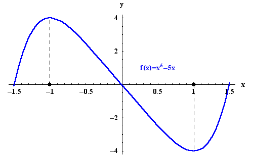

你可以看到上面的函数在-1 时最大，在 1 时最小。最优化就是找到 x 的值，其中函数 f(x)将是最小值或最大值

# **凸函数和非凸函数**

在机器学习和深度学习中，我们经常会遇到这种类型的函数。如果我们在一个函数的图上取任意两个点，并在这两个点之间画一条线段(最短路径)，如果这条线段在一个函数的图上，这类函数我们称之为凸函数，对于凸函数，任意两点之间的最短路径应该在图的上面，否则它是非凸函数。

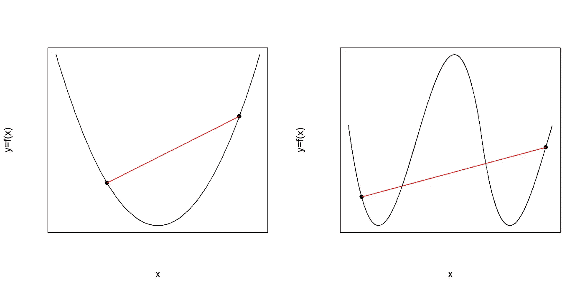

左边的函数 f(x)你可以看到两点之间的线段在图的上方，右边的函数 f(x)两点之间的线段不完全在图的上方，因此左边的函数 f(x)是凸函数，右边的函数 f(x)是非凸函数

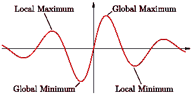

一个函数可以有多个最小值和最大值。包括端点的函数的绝对最高点和最低点称为全局最大值和全局最小值，全局最大值和全局最小值的邻域称为局部最大值和局部最小值。

对于凸函数，我们只有一个全局最小值或最大值，没有局部最小值或最大值，但在非凸函数中，我们可以看到局部和全局最小值和最大值。在深度学习中，我们遇到了更复杂的非凸函数

# **优化师**

有一些算法可以帮助找到一个函数的全局最小值。

在这里，为什么我们应该找到全局最小值，而不是全局最大值？

在机器学习和深度学习中，我们的大多数成本函数都是以这样一种方式定义的，即为了找到最小值，这只是为了我们的方便，这使得数学变得非常容易，例如以线性回归为例，我们必须最小化(最小值)成本函数∑ (yᵢ- h(w*xᵢ+ b))，如果你愿意，你可以以这样的方式改变成本函数，以便找到全局最大值，然后必须修改下面的算法来解决你的问题。

然而，让我们看看有哪些算法有助于任何函数的优化(全局最小值)。

*   梯度下降(批量梯度下降)
*   随机梯度下降
*   小批量梯度下降

# **基础微积分**

在进入优化之前，我们必须知道一些微积分的基础知识。

在数学中，每一条线和每一个函数都有一个斜率，但是什么是斜率呢

*   y 相对于 x 的变化率称为斜率
*   假设 x1 变为 x 1→x2，y1 变为 y1 →y2
*   那么斜率(m)=(y2-y1)/(x2-x1)
*   斜率通过 x 的变化告诉你 y 的变化

## 让我们回忆一下在学校里学过的斜坡基础知识

→我们如何求直线的斜率？

*   这条线与 x 轴所成的角度称为斜率(m)

> 其中 m = tanθθ=角度

→如果已知直线上的两点(x1，y1)，(x2，y2)，另一种求直线斜率的方法

> 那么斜率(m)=(y2-y1)/(x2–x1)

但是当涉及到连续函数时，斜率在点与点之间变化，我们不能使用上面的公式，我们必须找到另一种方法来寻找连续函数的斜率。如果你不知道什么是连续函数，我建议你去维基百科或者可汗学院。

让我们来讨论如何在任意特定点找到连续函数的斜率，看这里，对于每个连续函数，我们在特定点画一条切线，在这里我们要找到斜率或导数，不要担心导数是微积分中用来代替斜率的术语，切线与 x 轴所成的角度称为特定点的斜率或导数，我们也可以用极限来定义导数， 假设我们有函数 f(c)当 c 变为 c + h 时，函数 f(c)的值也变为 f(c + h)

> c →c + h，f(c) →f(c + h)
> 
> 那么斜率=f(c + h)-f(c)/(c + h-c)(我们的基本斜率公式(x2–x1)/(y2–y1))
> 
> 其中斜率=(f(c + h)-f(c))/h

如果 h 的极限接近于零而不是零，意味着 h 变得很小，我们可以假设为 0.0001 或任何点的值

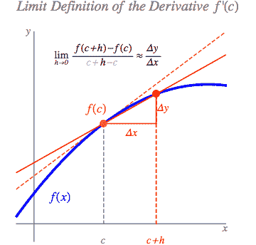

> 为了更清楚地理解，如果我们使用我们原来的斜率公式
> 
> (y2-y1)/(x2-x1) — -(1)
> 
> 假设 h=0.0001，斜率=f( c + h )-f(c)/c + h-c
> 
> 斜率= f(c+h)-f(c)/h = f(c+0.0001)-f(c)/0.0001—--(2)
> 
> 比较(1)和(2)
> 
> x2-x1 = 0.0001，y2-y1=f(c + 0.0001)-f(c)，
> 
> 在 x 轴上有点变化，所以在 y 轴上也会有点变化

(***c->c+0.01 中的小变化(点变化)函数变化很小 f(c) - > f(c+0.0001)，所以 c+0.0001 处的斜率几乎等于 c*** 处的斜率)

在上图中，你可以看到当 h 很小时，它几乎等于 c 点

> 因此 c 点的斜率(m)= f(c+h)-f(c)/h；其中限制 h — -> 0.0001 或者可以取任意点的值
> 
> 在微积分中，我们称斜率为导数(dy/dx)或梯度

每次我们不用极限来计算函数的导数。为了快速计算函数的导数或斜率，我们必须知道一些基本的微分公式。我强烈建议，如果你不知道微分，请回忆一下我们在学校学过的微分基本公式，因为通过使用这些公式，我们可以直接计算函数在任意点的导数。

**梯度下降**

这是所有优化器之父，大多数优化器在梯度下降中使用相同的逻辑，首先什么是梯度，梯度只不过是斜率，下降意味着向下移动，梯度下降背后的思想是

*在该值处使用梯度向下移动该值，直到梯度变为零*

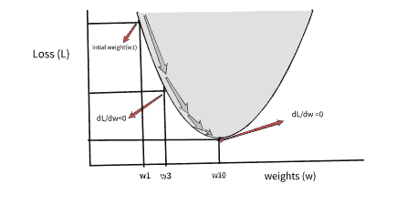

图(1)

让我用图中的一个例子来解释，我们可以看到图(1)中有一个凸函数，现在我们的座右铭是找到损失函数最小的“w ”,从图(1)中我们知道损失函数在 w₁₀最小，但在实时情况下，我们很难想象在“w”的哪个值下函数会最小，因为每个函数的行为都不同。通过使用梯度下降，我们可以很容易地找到函数的最小值，而不需要任何可视化，一旦你理解它背后的数学，你就会知道它为什么工作，看看它是如何工作的

让我们初始化任意随机值“w ”,假设随机值是上图中的 w₁，在 w₁，函数损失(l)没有最小化，我们必须将 w₁向下移动到函数“l”最小的地方，但这里的问题是如何移动

> 步骤:w_new=w_old - α * (dL/dw)

上面的公式用于移动权重‘w’，在上面的公式中‘w _ new’是我们必须移动的新步骤，其中 w_old 是当前的权重，这意味着 w₁，关于权重 w_old 的函数的 dL/dw 导数，其中α是学习率

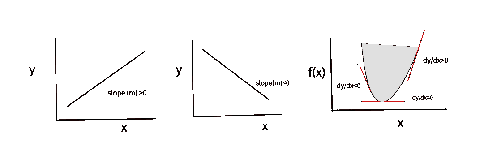

从上图中，你可以看到导数或斜率的表现，当切线或直线平行于 x 轴时，其斜率为零，当直线向上和向下移动时，其斜率大于零且小于零，当计算函数在特定点的导数时，其遵循相同的表现。

我们正在计算基于切线的函数的导数，我们已经在上面的微积分基本概念中看到了，

在图(1)中，我们在图的左侧初始化权重 w₁，因此在该点的切线将具有小于零的负斜率，因此函数 w.r.t .对 w₁的导数或斜率总是小于零，如果我们在函数的右侧初始化权重，则它的导数将大于零

> 步骤:w_new = w_old - α * (dL/dw)

仔细观察这里的游戏规则改变者是导数，让我们看看当我们在图(1)的左侧初始化时，导数将是负值。如果我们将负值放在上面的公式中，导数将通过乘以它前面的负变成正，然后它将变成

> w _ new = w _ old–α*(某个值)
> 
> w_new = w_old + α *(某个值)

这里发生的事情你可以看到“w_old”正在增加，意味着向前移动。在图(1)中，你可以看到 w_new =w3，w₁移动到 w₃

如果我们再重复一次这一步，那么我们就移动到另一个值“w ”,随着向前移动，导数慢慢趋向于零

当我们多次重复这个步骤时，w 会更新(移动)，随着向前移动，导数慢慢趋向于零，在这里，每一步导数都会使 w 的步长变小(长步长到小步长)，因为随着向前移动，导数越来越接近零(减小)，在重复多个步骤后，导数变为零，如果导数变为零，这意味着 w_old 处的导数为零， 我们知道何时导数为零(切线平行于 x 轴)，这意味着权重 w_old 处切线的斜率为零，因此 w_old 是函数的最小值，当你再次重复一步时，它会停止下一步，然后 w_new 变成 w_old，w_new= w_old

> w _ new = w _ old+α*(0)；dL/dw=0 → w_old 斜率变为' 0 '
> 
> w _ new = w _ oldw_old 变成 w_new，它不能进一步更新(我们达到最小值)不能进一步更新，因为在达到最小值后,“w_old”处的导数将总是零

我建议你通过初始化图表右侧的权重来尝试，这样你就可以知道步长方程是如何变化的，以及它将如何收敛

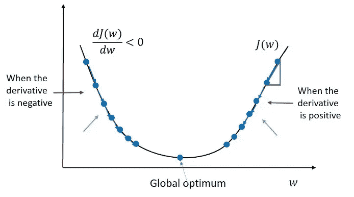

j(w)被称为我们的损失函数，正如我们在上面的图(1)中看到的

在这里，我们必须知道什么是α，它被称为学习率，在梯度下降步骤中，我们将导数或梯度乘以某个值，称为α，以某种速度移动“w ”,让我们看看当α很大时会发生什么

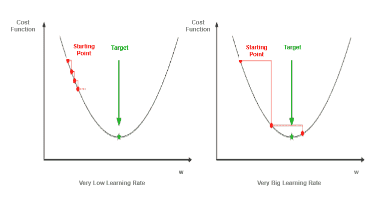

这里可以看到，当α较大时，它有可能远离最小值，由于导数或梯度，它将开始在最小值附近振荡，如果α较小，它将需要更多时间才能达到最小值

“α”是一个超参数，我们必须通过对不同的值进行实验来选择“α”的最佳值，通常大多数人在使用梯度下降时选择“α”为 1，以最短的时间达到全局最小值，使α在每一步的上升中减少。首先，随着向前移动，步长将慢慢减小并达到最小值。这被称为调度

## 梯度下降的缺点

假设我们的数据集中有 100 万个数据点，我们必须使用所有的数据点来为“w”的每次更新寻找梯度(dL/dw ),为每一步计算 100 万个数据点在计算上非常昂贵，这是梯度下降的主要缺点。实际上，我们获得的数据将会非常庞大，以数十亿或数万亿计，这就是所谓的大数据。我们不能在大数据上使用梯度下降，如果我们的数据集很小，梯度下降可以很好地工作，但对于大数据，它的计算成本非常高

## 随机梯度下降

我们知道，如果我们的数据集很大，使用梯度下降将导致计算复杂和昂贵的收敛到一个函数的最小值，这就是随机梯度下降的情况。SGD 是梯度下降的近似，除了计算梯度之外，它使用与梯度下降相同的思想。在梯度下降法中，当更新权重“w”时，我们通过使用所有数据点计算每一步的梯度(导数),但是在随机梯度下降法中，不是使用所有数据点，而是取任意一个随机点，计算导数并更新“w”。

> w _ new = w _ old-α*(dL/dw)；dL/dw→基于任意一个随机数据点计算

dL/dw 在每一步更新时，将从数据集中选取一个随机数据点，因为这个“w”更新将采取之字形运动

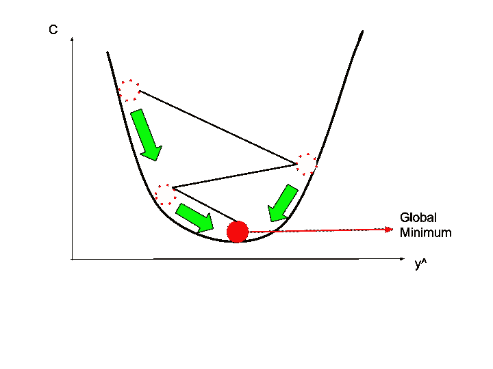

图(二)

当我们更新或移动“w”时，我们采用不同的数据点来计算导数或梯度，因此“w”每次更新时的导数将是不同的，这将使我们的“w”过度移动或采取小步骤，就像之字形步骤一样，因此我们可能会达到全局最小值或接近全局最小值，但与梯度下降相比，它需要更多的步骤(时期)

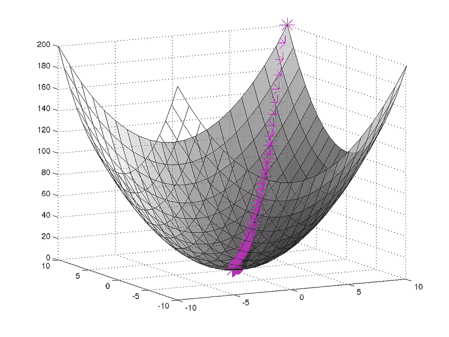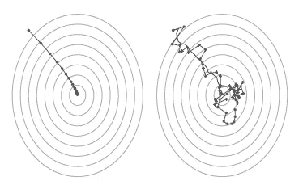

左边的是一个凸函数的三维图，如果我们从顶角看它，它看起来像圆，在这里你可以看到梯度下降和随机梯度下降是如何收敛到最小值的

你可以怀疑，在每次权重更新时取一个随机点，它将如何收敛到最小值，仔细观察我们的目标是走向全局最小值，这里导数的符号将告诉哪一侧移动，导数或梯度将告诉步长， 在梯度下降的情况下，我们取所有数据点并计算梯度，因此它将采取一些长步骤并在较少的时期内达到最小值，在随机梯度下降的情况下，我们随机取一个数据点，因此在上升(步骤)中，导数将很小，并且之字形运动是因为数据点的随机性。

## 小批量梯度下降

小批量梯度下降与随机梯度下降相同，它不是在数据集中随机选取一个数据点来计算导数或梯度，而是在数据集中每次更新权重“w”时选取数据点子集，因此与 SGD 相比，它将具有较少的曲折运动

> w _ new = w _ old—α*(dL/dw)；dL/dw→计算数据点子集

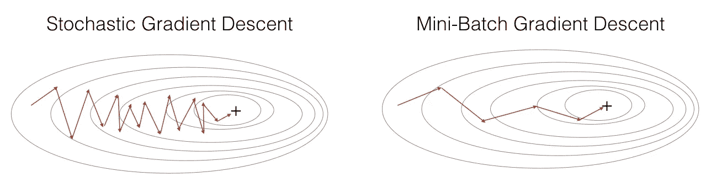

在上图中，您可以看到小批量梯度下降如何收敛到最小值，达到全局最小值需要更少的步骤，这是因为导数(dL/dw)，与随机梯度下降相比，导数将会很大，并且由于数据点的不同子集，它需要很大的曲折步骤，或者您可以像计算梯度一样考虑子集的随机性。而在 SGD 中，我们采用单个随机点，因此它将采取小的锯齿形步骤

## 我们在执行优化时面临哪些挑战

当执行梯度下降或 SGD 或小批量 SGD 时，我们的重量有可能会卡在鞍点

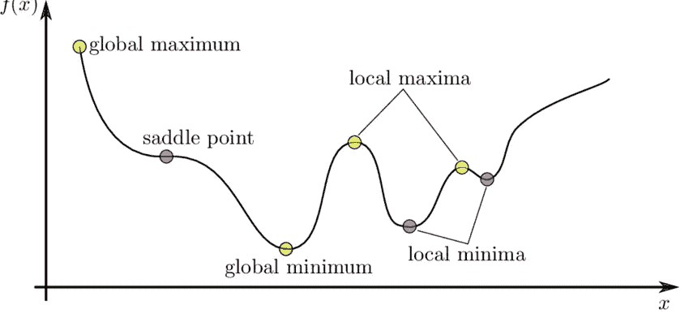

在二维空间中

在三维空间中，它看起来像这样

鞍点只不过是一个点，在这个点上我们的函数既不是最大值也不是最小值，但梯度将为零，你可以在非凸函数中看到这个鞍点，如果我们对非凸函数执行梯度下降或 sgd 或最小批量 sgd，我们的权重“w”将收敛，但很难说我们是在全局最小值或局部最小值还是在鞍点，这完全取决于权重的初始化， 如果我们在全局最小值附近初始化我们的权重，我们到达全局最小值，否则我们到达局部最小值或鞍点

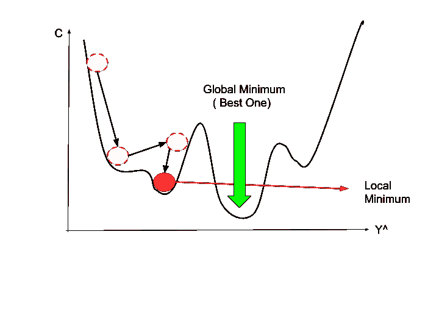

有一些技术可以帮助克服这个鞍点，但是如果我们停留在局部极小值，对我们来说就复杂了。研究学者对如何在高维空间中克服局部极小值有争议，但他们认为在高维空间中出现局部极小值的概率很小，所以我们遇到的大多是鞍点。在机器学习中，我们尝试优化凸函数，因此在这里我们不需要担心鞍点或局部最小值，但在深度学习中，我们主要遇到非凸函数，在那里我们看到更多的优化器，它们可以帮助克服鞍点，并使速度收敛到最小值