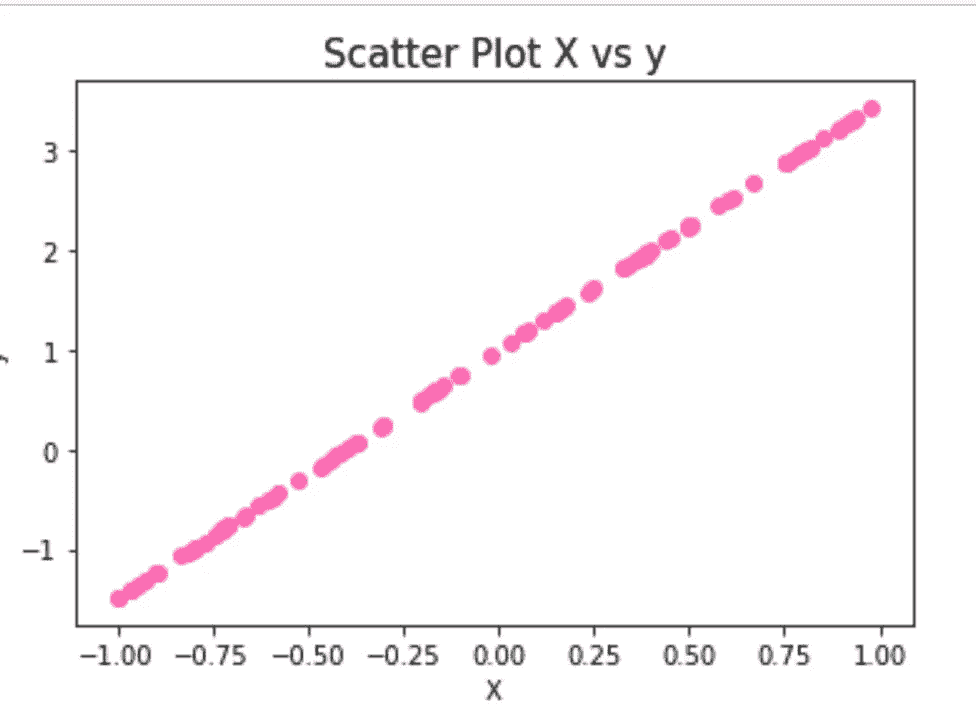
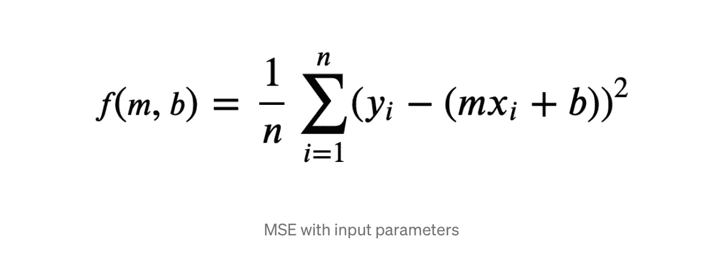
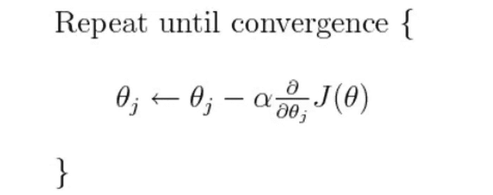
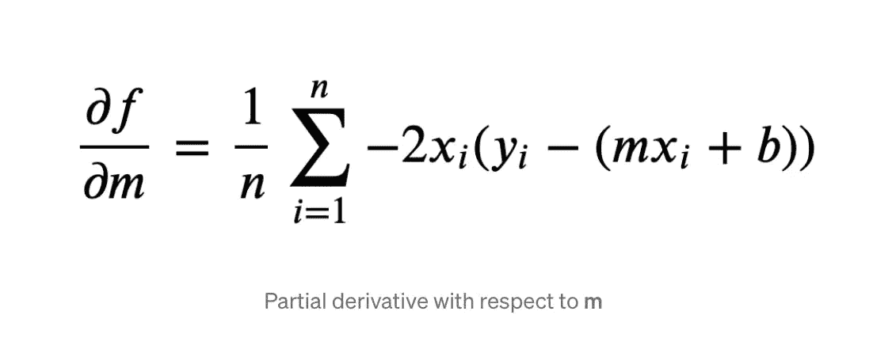
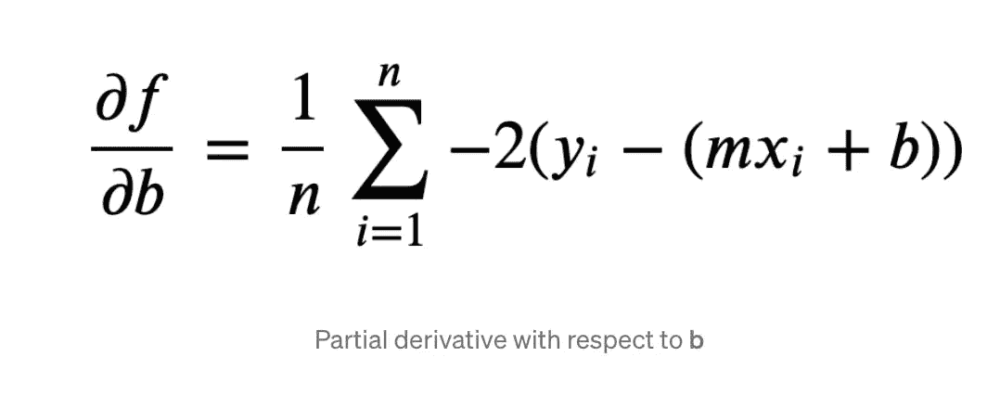
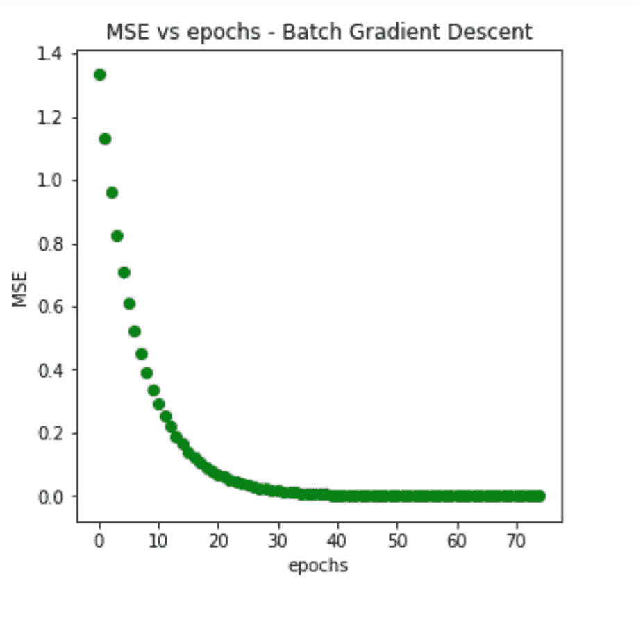
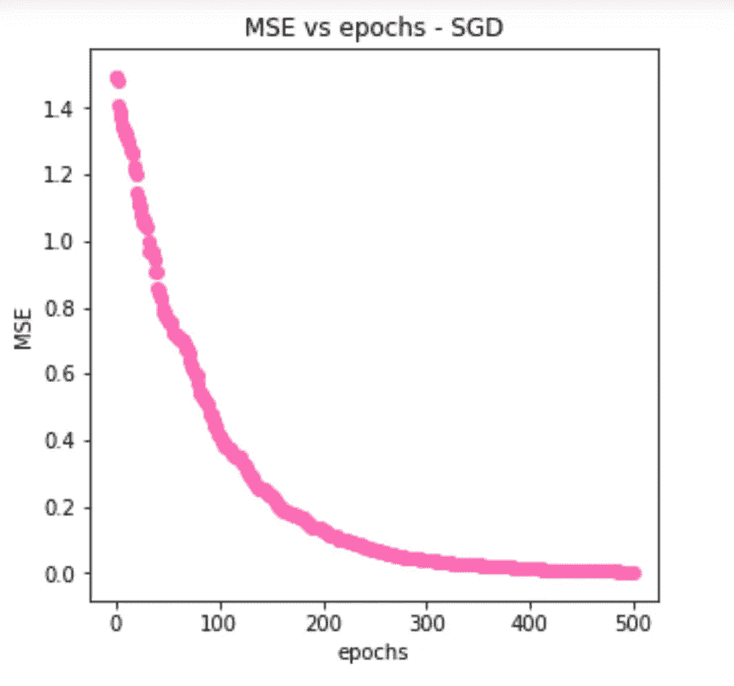
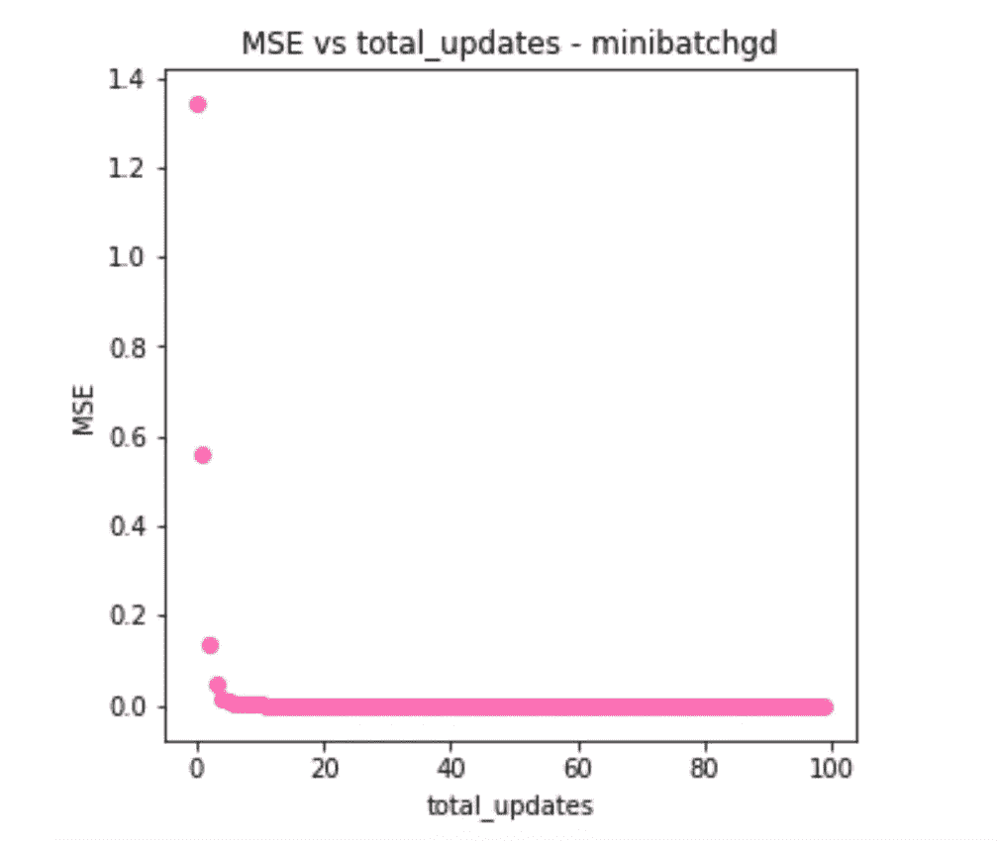

# 优化器—梯度下降算法(第一部分)

> 原文：<https://medium.com/analytics-vidhya/optimizers-gradient-descent-algorithms-part-1-ac9baf446df1?source=collection_archive---------1----------------------->

嘿大家好！欢迎来到我的博客！在这篇博客中，我们将看到一些基本优化算法的实现。在机器学习中，权重和偏差是机器学习/深度学习模型的可学习参数(Theta θ)。优化器是用于修改模型参数(权重和偏差)以最小化损失函数的算法。通常在模型训练的开始，权重和偏差被随机初始化。在训练期间，损失函数被计算，并且这些参数被优化器更新，使得损失函数的值最小。

在第 1 部分中，我们将从头开始学习并使用 python 实现以下算法。

1.  梯度下降
2.  随机梯度下降
3.  批量梯度下降
4.  小批量随机梯度下降

我们将针对具有单一特征的线性回归模型讨论这些算法。让我们考虑这个等式

```
y = 2.5X + 1 (1)
```

其中 m = 2.5，b = 1

我们的 X 具有 100 个数据点的单一特征。我们将用-1 和 1 之间的随机值填充 X。然后，我们可以使用上面所示的等式(1)计算 y。

```
import numpy as np
import random
# set seed for reproducibilty
np.random.seed(1) 
num_samples = 100
X = np.random.uniform(-1.,1.,num_samples)
m = 2.5
b = 1
y = m*X +b
```

让我们来看看由等式(1)表达的这个函数的可视化



我们将看到计算 m 和 b 的各种优化器算法的实现。我们将使用下图中等式描述的均方误差(MSE)作为目标函数(L)。基本上，我们将使用这些优化算法来最小化损失函数。



梯度下降:

在梯度下降中，计算目标函数(L)相对于参数 theta (θ)的梯度，并且在目标函数梯度的相反方向上更新参数。学习率α决定了达到局部最小值所要采取的步长。



基于多少数据用于计算权重更新的梯度，我们有不同的变量，我们将详细讨论这些变量

**批量梯度下降:**

在批量梯度下降中，对于每个时期，我们为整个数据集的目标函数计算梯度 [w.r .到](http://w.r.to/)参数。因此，参数的更新每个时期发生一次。批量梯度下降也称为香草梯度下降。

对于我们的 MSE 目标函数，关于 m 和 b 的梯度如下所示。如果你有兴趣了解如何计算梯度，请点击[这里](https://towardsdatascience.com/gradient-descent-from-scratch-e8b75fa986cc)



批量梯度下降的 Python 代码

```
import numpy as np
from sklearn.metrics import mean_squared_errordef batch_gradient_descent(X, y, lr, epochs): 
    m, b = 0.33, 0.48 # initialising the parameters
    # log stores m and b values for differnt updates 
    # mse stores the error
    log, mse = [], [] # lists to store learning process 
    N = len(X) # number of samplesfor _ in range(epochs):               
        f = y - (m*X + b)   
        # Updating m and b
        m -= lr * (-2 * X.dot(f).sum() / N)
        b -= lr * (-2 * f.sum() / N)log.append((m, b))
        mse.append(mean_squared_error(y, (m*X + b)))        
    return m, b, log, mse 
```

下图显示了 lr = 0.1 和时期= 75 时的 MSE 批次梯度下降。



注意:计算整个数据集的梯度后，参数会发生变化。如果数据集很大。许多功能，这是非常耗时的。它还需要更多的内存来计算整个数据集的梯度。

**随机梯度下降:**

在随机梯度下降中，从一个时期的整个集合中随机选择一个样本。计算该特定样品的梯度，并更新样品和重量。

随机梯度下降的 Python 代码；

```
import numpy as np
from sklearn.metrics import mean_squared_error
def SGD(X, y, lr, epochs):
    m, b = 0.5, 0.5  # initial parameters
    log, mse = [], [] # lists to store learning processfor _ in range(epochs):
        indexes = np.random.randint(0, len(X)) # random sample
        Xs = np.take(X, indexes)
        ys = np.take(y, indexes)
        N = len(X)
        f = ys - (m*Xs + b)# Updating parameters m and b
        m -= lr * (-2 * Xs*(f).sum() / N)
        b -= lr * (-2 * f.sum() / N)log.append((m, b))
        mse.append(mean_squared_error(y, m*X+b))return m, b, log, mse
```

下图显示了 lr = 0.85 和历元= 500 时 MSE 与历元的关系。我们可以观察到，对于我们的例子，我们能够以更高的学习率和更多的时期数达到局部最小值。



**小批量梯度下降:**

在小批量梯度下降中，对小批量样品进行更新。在我们的例子中，我们有 100 个样本。因此，批量大小为 10 时，我们在 10 个时期内有 100 次更新。小批量梯度下降是训练神经网络时选择的算法。

用于小批量梯度下降的 Python 代码

```
def minibatchgd(X, y, lr, epochs, batch_size):
    m, b = 0.5, 0.5 # initial parameters
    log, mse = [], [] # lists to store learning process
    for _ in range(epochs):
        total_len = len(X)
        for i in range(0, total_len, batch_size):
            Xs = X[i:i+batch_size]
            ys = y[i:i+batch_size]
            N = len(Xs)
            f = ys - (m*Xs + b)
            # Updating parameters m and b
            m -= lr * (-2 * Xs.dot(f).sum() / N)
            b -= lr * (-2 * f.sum() / N)
            log.append((m, b))
            mse.append(mean_squared_error(y, m*X+b))return m, b, log, mse
```

对于时期= 10，lr = 0.5，batch_size = 10，小批量梯度下降图如下所示。

小批量梯度下降也称为小批量 SGD，其中数据被随机打乱，然后选择小批量数据。



总而言之，对于“m”个样本的训练数据集，如果

1.  最小批量= 'm '。—批量梯度下降(一个时期的所有数据)
2.  最小批量= '1' —随机梯度下降(一个时期所有数据中的一个样本)
3.  小批量= ' m '/100-小批量梯度下降(一个时期取 m/100 个样品)

**重要注意事项:**

1.  必须改变超参数学习速率、时期、批次大小，以使 MSE 达到最小值(理想情况下为 0)。
2.  我们可以观察到，小批量梯度下降中的时期数显著低于批量梯度下降和随机梯度下降。这意味着用更少的训练时间达到最小值。
3.  学习速度必须仔细选择，这是一项相当具有挑战性的任务。

在下一部分，我们将讨论一些复杂的优化算法。该代码可在[https://github.com/bhuvanakundumani/optimizers.git](https://github.com/bhuvanakundumani/optimizers.git)获得

**参考文献**:
[https://ruder.io/optimizing-gradient-descent/](https://ruder.io/optimizing-gradient-descent/)
[https://www . kdnugges . com/2020/12/optimization-algorithms-neural-networks . html](https://www.kdnuggets.com/2020/12/optimization-algorithms-neural-networks.html)
[https://towards data science . com/gradient-descent-from-scratch-E8 b 75 fa 986 cc](https://towardsdatascience.com/gradient-descent-from-scratch-e8b75fa986cc)