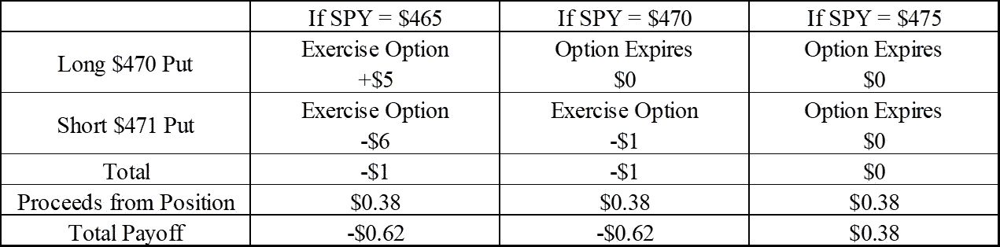
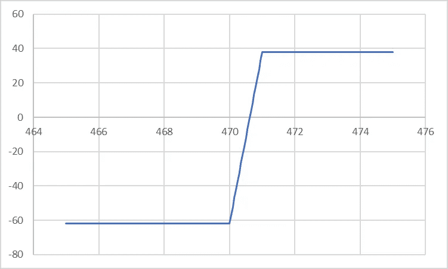
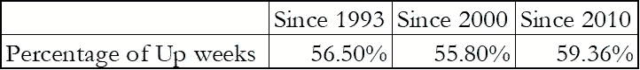
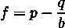
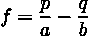
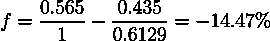

# 押注标准普尔 500 的期权策略

> 原文：<https://medium.com/analytics-vidhya/option-strategy-that-bets-on-s-p-500-2870255235c5?source=collection_archive---------1----------------------->

在这篇文章中，我想介绍一种期权交易策略，押注于标准普尔 500 的方向，并有可能每周使你的投资翻倍。就像你在赌场里做的一样(是也不是真的)。

# 战略

这种策略被称为信用看跌价差。它包括买入一个看跌期权的多头头寸和卖出另一个执行价更高的看跌期权的空头头寸。这两个执行价格应该接近当前的交易价格，这通常被称为“在钱”。这种策略是看涨的——当基础资产的价格上涨时，这种策略将产生利润。

让我们举一个例子来解释收益是如何工作的。假设这个间谍的交易价格是 470.59 美元。一周内到期、执行价格为 470 美元的看跌期权的要价为 2.85 美元，同一天到期、执行价格为 471 美元的看跌期权的交易价格为 3.23 美元。这个策略要求我们在 470 美元的看跌期权中建立多头头寸，在 471 美元的看跌期权中建立空头头寸。开仓时，我们以 2.85 美元买入 470 美元看跌期权，以 3.23 美元卖出 471 美元看跌期权。我们每份合约获得 0.38 美元，因为我们每次要交易 100 份合约，所以我们将获得 38 美元。

假设一个星期后，SPY 将上涨并收于 475 美元。你的多头头寸应该到期而没有价值，因为 470 美元看跌期权的多头头寸给你 470 美元的卖出权，当 SPY 实际上值 475 美元时，你不应该愿意这样做。出于同样的原因，471 美元看跌期权的空头头寸也不应该有任何价值。所以在到期时，整个头寸价值为 0 美元。如果间谍倒下了呢？如果间谍保持平躺会怎么样？下表和下图对现金流进行了最佳总结:

每周，如果 SPY 上涨，你每冒险 62 美元就能赚 38 美元，回报率约为 61%。

# 坦白说，从长远来看，间谍上升了。

在历史上，我们看到多少百分比的周间谍上升？自 1993 年成立以来，SPY 已经存在了将近 30 年。下表总结了不同时间范围内的周回报率(从周五到周五)。

相当一致。我们没有充分的理由相信最近的高比例会持续下去。所以你有超过一半的机会获得这 61%的回报。所以这可能会成功，对吗？只要涨跌比下跌多，我们就更有可能成功交易。

# 能不能稍微优化一下？

我将应用凯利标准作为一个例子。显然有更多的数学方法可以用来优化这样的策略。你也可以考虑股票市场可能的预测能力(注意，上一节中给出的概率是无条件的)。这里我只是无条件地考虑概率。

凯利标准是最佳赌注大小标准。你应该下注的财富的最佳百分比由以下因素决定

其中 p 是赢的概率，q 是输的概率，b 是赢/赔率。b 的应用有点复杂。b 是获胜的赔率。

在投资领域，有一个替代公式:

其中 a 是在负面结果中损失的部分，b 是在正面结果中获得的部分。我们赌 62 美元，如果输了，我们会输掉 100%，所以 a = 100%。当价格上涨时，我们将得到 61.29%(38 美元)。所以我们的最佳尺寸是

哎呀，这不起作用。这个标准的否定结果意味着我们需要在另一边下注。如果我们能把中奖概率提高到 65%，凯利准则会建议我们每周下注投资组合的 7.9%左右，但我们能做到吗？

# 裁决

如果你有足够的耐心到达这里，你可能已经看到这个策略并不像我们想象的那样是一个印钞机。或者至少不像看起来那么容易。就像你在赌场里做的一样，赔率和胜率不会一起让我们获利。有几个主要的“现实世界的问题”导致这个策略不起作用。在“教科书”的例子中，这种策略应该提供 1 的盈亏比，这意味着投资者应该损失与他们赢的一样多的钱。然而，期权市场的买卖差价通常很大，这让我们损失了 12 美元。就把这 12 美元当成我们在赌场里玩的钱，赌场总是赢。