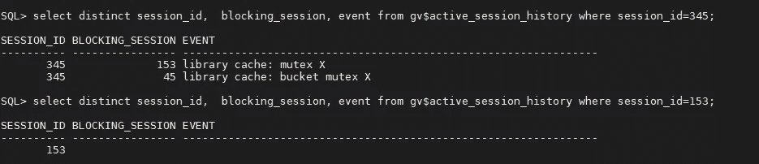

# Oracle 19c“库缓存加载锁定”

> 原文：<https://medium.com/analytics-vidhya/oracle-19c-library-cache-load-lock-e22adbe70eb?source=collection_archive---------1----------------------->

在我们开始之前，我想向我的两位老师(大师)道歉，他们是费哈特·森古尔和 T2。因为我不想使用他们教给我的科学方法，我只想用简单的方法。当然，这让我得出了错误的结果。然后使用正确的方法，我能够达到涅槃(这是什么样的涅槃？).

我们的问题是在警报日志文件中有很多“ORA-00018:超过最大会话数”条目。乍一看，这可能被视为错误的配置问题，我们需要更改最大会话数。然而，惊喜来了。当我为我的监控用户检查 v$session 时，我列出了许多“库缓存加载锁定”错误。

然后我尝试通过使用([https://smarttechways . com/2021/02/24/library-cache-load-lock-in-Oracle/](https://smarttechways.com/2021/02/24/library-cache-load-lock-in-oracle/))找到锁定的对象:

> **select to_char(SESSION_ID，' 999') sid，
> substr(LOCK_TYPE，1，30) Type，
> substr(lock_id1，1，23) Object_Name，
> substr(mode _ hold，1，4)hold，substr(mode_requested，1，4) REQ，
> LOCK _ id2 LOCK _ addr
> from DBA _ LOCK _ internal
> 其中
> mode_requested = 'None '【无】**

但是，我的查询也被同一个“库缓存加载锁定”事件阻塞了。那么，是哪个会话导致了这个问题呢？为了指出这一点，我刚刚使用了(有一个很好的递归查询，通过它们的关系列出了会话(我从[图格鲁·泰京·多尤克](https://www.linkedin.com/in/tugrul-tekin-doyuk-3806961)那里得到的)，但是由于会话数量很少，我将使用原始方式):

我没有考虑 sid = 45 的会话，因为这是我的一个会话，问题不是死锁。因此，我需要检查 sid =153 的 sessiod。

这个会话在做什么，被另一个会话阻塞了吗？希望不会:)。然后我查了 sql_id:

我们臭名昭著的 sql_id，0za9fv0j1vgkk(当然是为了我:)。让我们试着找出 sql_text。

> **从 v$sql 中选择 SQL_FULLTEXT，其中 SQL _ id = ' 0 za 9 Fv 0j 1 vgkk '；**

想猜猜结果:)？没什么，它也被相同的“库缓存加载锁定”事件阻止。此外，该会话属于“SYS”，即 Oracle 本身。我不能(不能(不应该))杀死它:)。

当我检查 sqltext 时，实例崩溃了:

**MMON (ospid: 1726):由于 ORA 错误 472** 而终止实例

**2022–01–07t 10:49:07.791280+01:00**

**原因—‘由于致命进程 PMON 死亡，实例被终止。’**

**2022–01–07t 10:49:08.196524+01:00**

**ORA-1092:奥皮茨克中止进程**

**2022–01–07t 10:49:08.212204+01:00**

实例打开后，我能够检查什么是 sqltext，它开始:

> **WITH MONITOR _ DATA AS(SELECT * FROM TABLE(GV $(CURSOR(SELECT USERENV(' instance ')AS ID，KEY，NVL2(PX_QCSID，NULL，STATUS) STATUS，FIRST_REFRESH_TIME，LAST_REFRESH_TIME，REFRESH_COUNT，PROCESS_NAME，SID，SQL_ID，SQL_EXEC_START，SQL_EXEC_ID，DBOP_NAME，DBOP_EXEC_ID，SQL_PLAN_HASH_VALUE，SQL_FULL_PLAN_HASH_VALUE，SESSION_SERIAL#**

我还检查了相关的跟踪文件并找到了堆栈:

> **ksedsts()+426<-kspol _ 12751 _ dump()+168<-dbgdaExecuteAction()+354<-dbgerRunAction()+83<-dbgerRunActions()+1352<**

当我搜索 sql_id、sqltext 和 stacks 时，我发现了这三个结果:

**文件 ID 1912230.1-**

[https://support.oracle.com/epmos/faces/DocumentDisplay?_ AFR loop = 1400044062885045&id = 1912230.1&display index = 2&_ AFR window mode = 0&_ ADF . ctrl-state = ibohbk 7 rz _ 391 #症状](https://support.oracle.com/epmos/faces/DocumentDisplay?_afrLoop=1418384640342726&id=1912230.1&displayIndex=2&_afrWindowMode=0&_adf.ctrl-state=kmx63y5eg_4#SYMPTOM)

**文件 ID 2253323.1-**

[https://support.oracle.com/epmos/faces/DocumentDisplay?_ AFR loop = 1418385898987017&id = 2253323.1&display index = 1&_ AFR window mode = 0&_ ADF . ctrl-state = kmx 63y 5 eg _ 45 #症状](https://support.oracle.com/epmos/faces/DocumentDisplay?_afrLoop=1418385898987017&id=2253323.1&displayIndex=1&_afrWindowMode=0&_adf.ctrl-state=kmx63y5eg_45#SYMPTOM)

**文件编号 2102131.1-**

[https://support.oracle.com/epmos/faces/DocumentDisplay?_ AFR loop = 1399635969835598&id = 2102131.1&display index = 6&_ AFR window mode = 0&_ ADF . ctrl-state = ibohbk 7 rz _ 173 #症状](https://support.oracle.com/epmos/faces/DocumentDisplay?_afrLoop=3040295085757&id=2102131.1&displayIndex=6&_afrWindowMode=0&_adf.ctrl-state=n2lnumlv7_4#SYMPTOM)

幸运的是，我的老队友，在银行工作的 Ferhat Gülerce 告诉我，他们比我先犯了这个错误。正在执行:

> **alter system set " _ report _ capture _ cycle _ time " = 0；/*默认为 60 秒*/**

解决这个错误(至少到目前为止:)。

如果有什么问题，请让我知道！

谢谢！