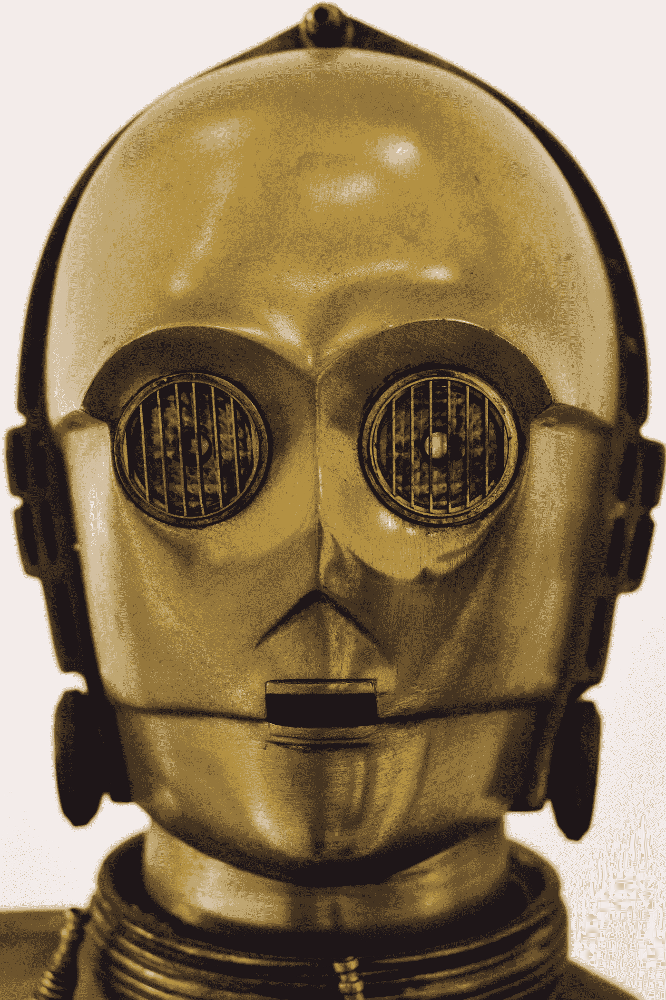
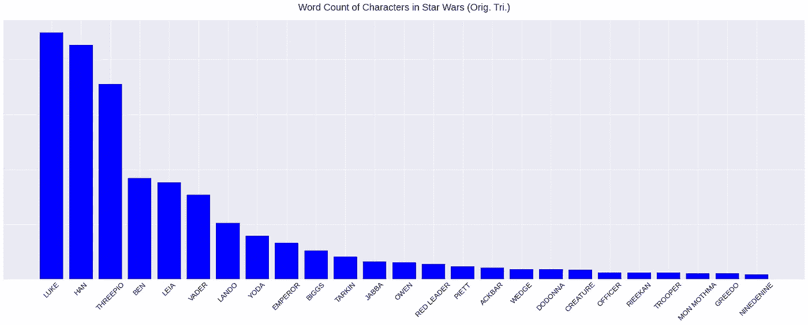
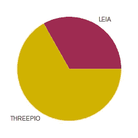
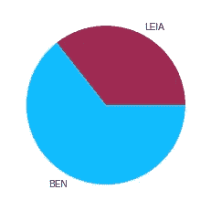
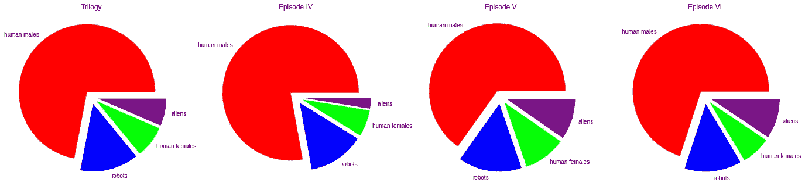
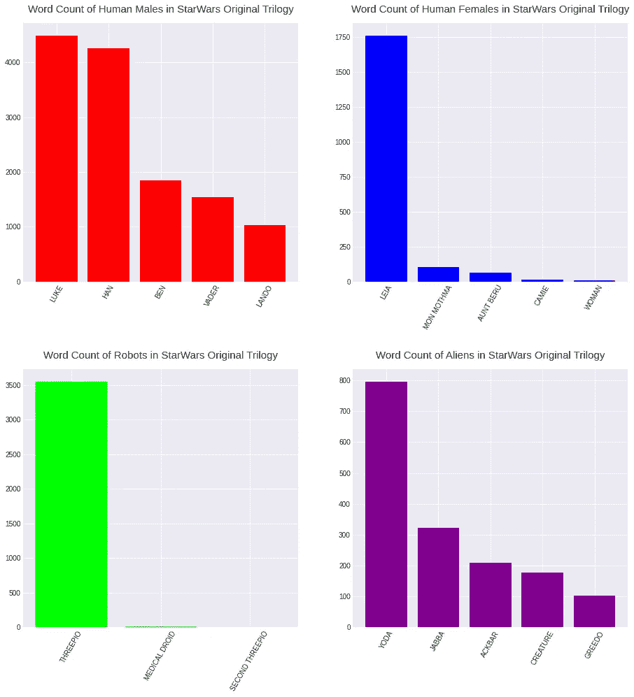
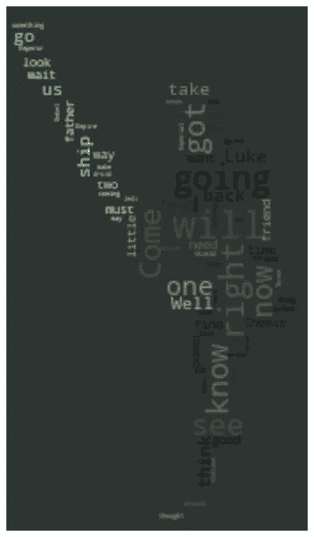
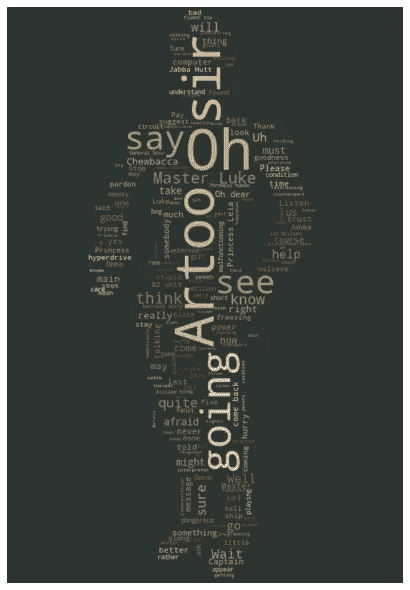
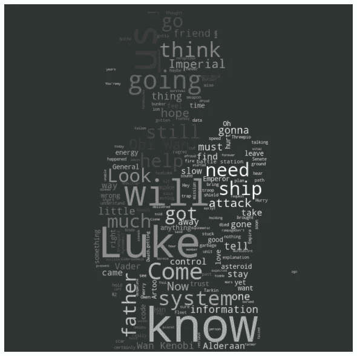
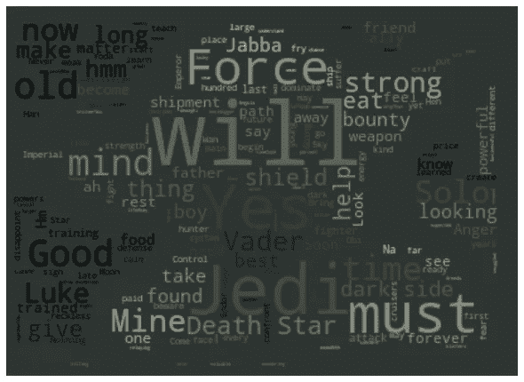

# 原创三部曲:星言

> 原文：<https://medium.com/analytics-vidhya/original-trilogy-star-words-35d14ce837c1?source=collection_archive---------24----------------------->

Lyman Gerona 在 [Unsplash](https://unsplash.com?utm_source=medium&utm_medium=referral) 上拍摄的照片

众所周知，前三部《星球大战》电影都有忠实的影迷。同样，这些电影的演员缺乏多样性也不是什么秘密。

你可能会争辩说“多样性？！有不同种类的外星人和许多机器人！”对此我会说“当然，他们*看起来*像一个多元化的群体，但是他们*s*found*像一个多元化的群体吗？”通过检查三部电影中的对话，我们会发现这些电影是多么的不同。*

***这不是对原著三部曲**的攻击。我喜欢那些电影，但是正如你将会看到的，在哪些角色说话最频繁，以及每个角色如何说话方面有着明显的差异。*

*不如从考察每个角色讲多少开始。下面是一个情节，列出了原三部曲中前 25 个散漫的角色。*

**

*最上面的发言者是卢克和韩(不奇怪)，但接下来的几个是有点令人震惊的 C-3PO，本和莱娅。我们都抱怨 3PO 总是赢，但是他说的话几乎是莱娅公主的两倍！在三部曲的大部分时间里，本·克诺比已经死了！*

**

*莱娅平均每部电影说大约 600 个单词，而畏缩、抱歉的机器人 3PO 一部电影脱口而出近 1200 个单词！*

**

*在最后一部电影中，已经死去 2 小时 47 分钟的本说的话几乎是莱娅的两倍。让活着的人说话吧，本！*

*是的，这只是两个例子，莱娅是第五个被说得最多的角色，所以也没那么糟糕。有很多角色说的比公主少得多。让我们从不同的角度来看多样性。*

*我们将三部曲中的所有角色分为四组:*

*   *男性(110 名成员)*
*   *外星人(8)*
*   *人类女性(6)*
*   *机器人(3)*

*由于我不是鉴定外星物种性别的专家，所以所有外星人物都会被归到一起。另外，我们不会包括像丘巴卡这样的角色，他们可能没有传统意义上的对话。有大量的外星人不会说英语，所以在阅读剩下的分析时要记住这一点。然而，它确实包括外星人，他们的对话为我们翻译，像赫特人贾巴。像 R2D2 这样的机器人也是如此，尽管它们非常受人崇拜，但它们不会对话。最后，机器人是非二进制的(ha ),所以它们也将被分组在一起。*

*看各组人物的纯数量，明显是男性主导，我们在省略男性外星人！在 127 个有英语对话的角色中，大约 87%是人类！很久以前，在一个遥远的星系里……比率不可能如此不平衡。也许这与“战争”主题有关，但让我们继续。*

*下面的图表显示了与这四个组相关的对话片段。*

**

*从这里，我们可以看到人类男性对话真正占主导地位。其他组没有机会。机器人一直是第二个说话最多的群体，考虑到这个事实，这主要是健谈的 3P0 一个人。在大多数电影中，人类女性似乎在与外星人争夺第三大发言权。在第六集中，女性角色是**最少被听到的群体**。这其中包括一名未来**叛军的将军。像莱娅这样的主角相对来说比较沉默，尤其是与卢克和韩相比。***

*让我们花点时间仔细看看这四组中的角色。下图显示了每组中最健谈的五个角色(如果有五个的话)。请注意下面这些图的比例，它们并不相同。*

**

*   *人类男性:前五个角色是你所期待的，韩和卢克的数量非常接近。考虑到他们在故事线内外，其他人的数字还不错。*
*   *人类女性:莱娅本质上是唯一一个在对话方面有一致性的女性角色。蒙·莫思马似乎有一个单独的对话。第五个说得最多的女人，字面上叫“女人”！一位不知名的女性是三部电影中第五位说话最多的女性，超过 6 小时 17 分钟，横跨整个银河系。*
*   ***机器人** : 看看 3PO 的**统治力**，该死的他真烦人。他让通用医疗机器人和第二代 3PO 相形见绌？！……深呼吸……至少有人同意我的观点:“我对你的观点不感兴趣，3PO。”——**韩独唱***
*   *外星人:再一次，这个团体更符合你的预期。尤达说了很多令人困惑但明智的话。虽然如果我们检查计数的范围，他们比其他三组少得多。*

*男性角色的数量有很大的差异，少数非男性和非人类角色的对话也不多。抛开单纯的数字，让我们考虑一下人物在说什么。*

*让我们深入对话的情感。同样，我们将分别比较这四组。首先让我们来看一个人类的词汇云。*

**

***人类男性常用词:***

*   *将要，对，去，来，拿，知道，得到，看见，现在*

*这些话很权威。比如“我们**会**或者“**现在就来**”。这些角色发出很多命令，当你想到卢克、汉和维德是这组中最直言不讳的角色时，这就不足为奇了。这种情绪表明，这些角色对自己很有信心，他们做出了决定。*

**

***机器人常用词:***

*   *哦，[R2]，先生，去，看，说，卢克主人*

*…现在我感觉很糟糕。3P0 是人类的奴隶，更不用说他们毫无防备。3P0 依靠其他角色来维持他的生命，并不断受到惊喜。他最常见的评论是宣布“哦！”。*

*从现在开始，我会试着不那么讨厌这个令人恼火的机器人。*

**

***人类女性常用词:***

*   *卢克，知道，将，我们，认为，帮助，父亲，去，来*

*这里的情绪听起来很受欢迎，并表达了领导力(即“知道”、“我们”)。有很多和人类相似的词。尽管他们说的话没有男性角色多，但他们肯定在故事中扮演了重要角色(比如成为公主和未来的将军)。*

*我想补充一点，人们可能会对原三部曲中女性的情感有不同的理解。查看单词 cloud，我们可以看到其他常见的单词，如“Luke”、“help”、“us”。我可能会偏向上一部电影，甚至是最近的几部电影，里面的莱娅公主是个大坏蛋。*

**

***外星人常用词:***

*   *意志，原力，是的，绝地，索罗，维德，必须，时间，死星，盾牌，我的，好*

*这里的情绪集中在原力上，听起来像尤达。他是说话最多的外星人，所以这可以理解。单看这些单词，你可能会推断出电影。*

*我们的情感分析的情感和上面的字数分析有很大的不同。虽然《星球大战》宇宙中的女性不怎么说话，但她们的态度和男主角一样坚定。外星人说的不多，但他们说的涵盖了电影的一些主题(即原力，绝地武士团)。最后，我的老朋友 3P0。可怜，可怜的 3P0。他说了这么多，但主题是一个惊恐的贝塔机器人。*

*这就结束了我对《星球大战》原著三部曲中对话的完全偏颇的分析。这是我在数据可视化和语言分析方面的第一次聚会，所以请对我提出的任何建议或错误进行评论。*