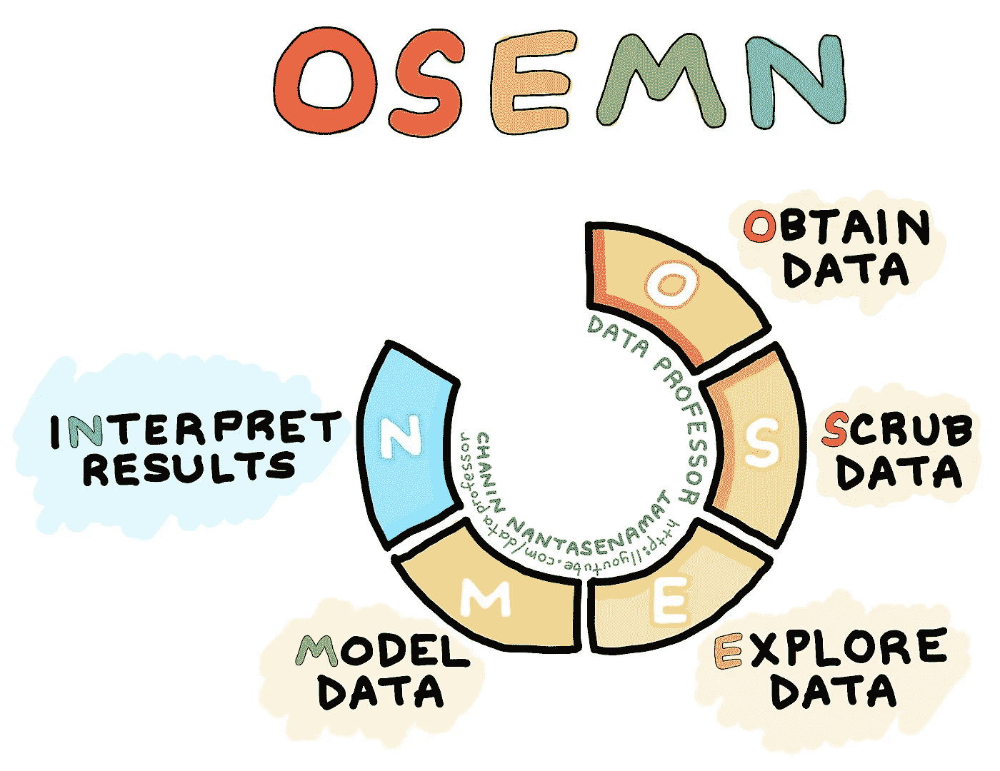

# OSEMN 很牛逼

> 原文：<https://medium.com/analytics-vidhya/osemn-is-awesome-3c9e42c3067d?source=collection_archive---------13----------------------->

对于数据科学家来说，为了完成他们的工作，有许多受欢迎的流程要经历，目前该领域中最受欢迎的流程之一是一个名为 OSEMN(与 awesome 押韵)的策略。今天我们将讨论 OSEMN 的五个步骤，以及为什么它对数据科学家来说是如此有用的工具。在这篇博文中，我们将重点讨论线性回归作为我们的模型类型。



(由 Chanin Nantasenamat 绘制)

# **O —获取数据**

可以通过多种方式获得数据。根据你为哪家公司工作，他们可能会为你提供数据，如果不是，你很可能需要网络搜集，使用 API，或者熟悉 SQL。一旦获得了数据，看一看您已经获得了什么并熟悉您的数据集是很重要的。一些有用的策略如下:

`df.head()` -提供数据帧的前五行。

`df.info()` -显示列中是否有任何缺失条目，识别数据类型，并提供列数。

`df.describe()` -给出每列的计数、平均值、标准差、最小值、25%、50%、75%和最大值。

# S —擦除数据

清理数据是数据科学家职业生涯中最耗时的工作之一。然而，将数据转换成更易于使用的格式是至关重要的。在大多数获得的数据中，会有一些缺失或错误。要注意的常见项目是空值、异常数字、符号或必须转换的数据类型。识别空值时，决定如何处理它们是很重要的。下面列出了常用于处理空值的代码:

`df.isna().sum()` -允许您查看数据框中每列的空值数量。

`df.unique()` -允许您查看每列的独特项目。

`df.nunique()` -计算你的独特物品的总数。

是用其他东西填充或替换你的空值的好工具。

`df.drop()` -如果您想删除一整行或一整列的过多空值。

要切换数据类型:

`df.col = df.col.astype('new_data_type')`

清理数据时要寻找的其他项目是分类变量(有时这在探索步骤中完成)。

`cat_cols = df.select_dtypes('object').columns` -识别作为对象列出的任何类别。您必须熟悉您的数据集，以查看是否有任何类别被列为数字列；常见的例子有邮政编码、年龄组和教育水平。

**线性回归模型**的额外清理

*检查多重共线性:*

1.  `data = df.iloc[:, 1:20]` -选择要检查多重共线性的列，然后删除任何相关值。
2.  `data.corr()`
3.  `abs(data.corr()0 > .75`——看一看相关性超过. 75

*接下来的步骤使用 vif 策略来处理多重共线性。这种方法在数据科学家领域越来越常用。*

1.  `from statsmodels.stats.outliers_influence import variance_inflation_factor`
2.  `X = data.drop('dependent_col', axis=1)` `X = sm.add_constant(X)` `X.shape`
3.  `vif = [variance_inflaction_factor{X.values, i) for i in range(X.shape[1])]`
4.  `vif_results = pd.Series(dict(zip(X.columns, vif)))`
5.  接下来，我们将寻找阈值超过 6 的任何 vif。数字 6 是多重共线性的分界点。
6.  `threshold = 6``bad_vif = list(vif_results[vif_results>threshold].index)`` if ' const ' in bad _ Vif:bad _ Vif . remove(' const ')bad Vif `中
7.  然后从您的数据框中删除坏的 vif 列。

根据偏好，运行多个模型以查看整个工作流程中的 R2 和多重共线性变化是非常常见的。在处理数据时，可能需要多次检查多重共线性。接下来，我们将介绍如何规范化您的数据。两种流行的方法是使用 z 值或数据的 IQR。我将在下面模拟 IQR 方法:

1.  `Q1 = data['dependent_col'].quantile(0.25)` `Q3 = data['dependent_col'].quantile(0.75)` `IQR = Q3-Q1` `print(IQR)`
2.  `test = df_ohe[~((df_ohe['price'] < (Q1 - 1.5 * IQR)) |(df_ohe['price'] > (Q3 + 1.5 * IQR)))]``print(df_out.shape)`——保存一个新的数据帧，除了你的离群值。~符号的意思是的反义词，所以通过加上这个，我们保存了除离群值之外的所有内容。

# 探索

Explore 是数据科学家执行 EDA(探索性数据分析)的地方，这是数据科学家在建模之前进行可视化以更好地理解数据的另一种方式。探索步骤中包含的可视化通常是散点图、核密度估计、散点图和 QQ 图(在创建 QQ 图之前必须创建 OLS 回归)。数据科学家应该在探索步骤中检查线性。在 OSEMN 流程中，经常会出现擦洗和探索重叠。就是在这一步，numpy，seaborn，pandas，scipy 派上了用场。

距离图:`sns.distplot(data)`

散点图:`sns.scatterplot(data)`

联合图(结合散点图和散点图):`sns.jointplot(data=df, x='col', y='dependent_col', kind='reg')`

QQ 图:`sm.graphics.qqplot(model.resid, fit=True, line='45')`

内核密度估计:`sns.kdeplot(data)`

*查看我的另一篇博文“数据可视化:何时和如何”,了解 OSEMN 探索部分的更多细节。*

# 模型

根据您试图解决的任务，有许多不同的建模方式。在这篇博文中，我将使用推理或预测来模拟线性回归。推论是在问“X 如何影响 Y？”而预测会问“我如何用 X 来预测 Y？”在你的工作流程中可能会有许多模型被完成，但是这是你最终模型应该被放置的地方。下面我将向你展示如何创建一个 OLS 模型。

`import statsmodels.formula.api as smf`

1.  `target = dependent_col`
2.  `features = '+'.join(data.drop(columns = 'dependent_col').columns)`
3.  `formula = target + '~' + features`

运行最终模型后，您将需要使用 sklearn 的 train_test_split 执行回归模型验证。

```
import sklearn.model_selection 
import train_test_split
from sklearn.metrics import r2_score
```

1.  `df_train, df_test = train_test_split(data)`
2.  `df_train.shape, df_test.shape` -检查形状
3.  使用列车数据运行 OLS 模型
4.  `y_train_pred = model.predict(df_train)` -对 y_test_pred 进行同样的操作
5.  `r2_train = r2_score(df_train['dependent_col'], y_train_pred)` -对 r2_test 进行同样的操作

目标是让你的训练成绩和测试成绩非常接近！

# N =解释

在这里，您将解释您的最终模型，并根据数据集确定 3 个以上可行的见解作为建议。确保这些数据以一种非技术型受众能够理解的方式呈现，并记住要经常说谢谢。