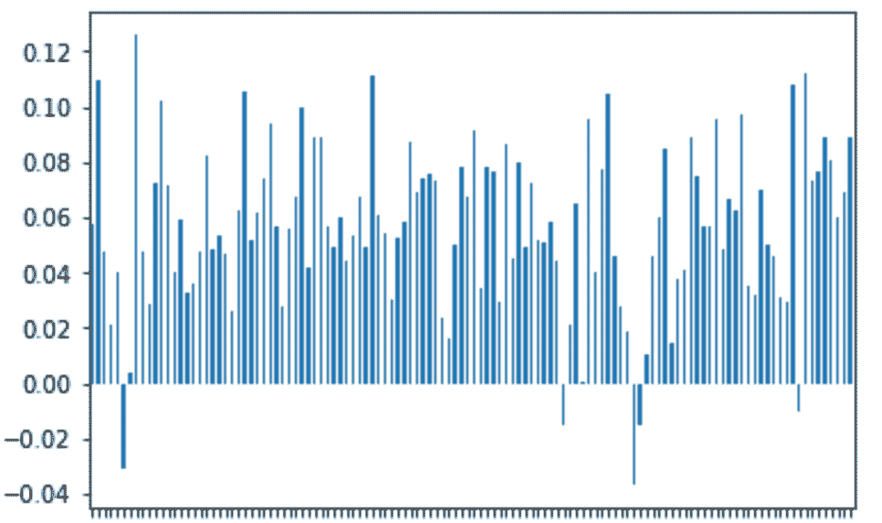

# 我们对数字的体验

> 原文：<https://medium.com/analytics-vidhya/our-experience-with-numerai-2b0777acc12e?source=collection_archive---------2----------------------->

Saahil Barai，Amit 维尔马，Hasanain Manesia，Stephen Chang，Yash Dhaduti 和 Brian Menezes。


马克西姆·霍普曼在 [Unsplash](https://unsplash.com?utm_source=medium&utm_medium=referral) 上的照片

# 数字导论

Numerai 是一个平台，用户有机会在抽象的金融数据上建立机器学习模型，以预测股市。Numerai 由几个方面组成，当它们结合在一起时，会使平台变得非常有趣。我们将首先简要介绍 Numerai 的每个主要方面:数据、建模、提交、评分和赌注。

数据是数字的核心组成部分之一。Numerai 为其用户提供高质量的财务数据，这些数据经过了清理、规范和模糊处理。通过这样做，Numerai 使数据科学家能够通过提供普通投资者不容易获得的高质量金融数据，将他们的才能和知识应用于股票市场。最重要的是，数据已经清理完毕，基本上可以“开箱即用”了。利用这一点，数据用户可以使用对应于当前股票市场的特征建立模型来预测指示未来价格的目标变量。每周周六，一个新的测试数据集被发布，用户必须在周一之前提交他们的新预测。每次提交后，Numerai 将显示用户提交诊断，通过各种指标向用户指示历史验证数据上的模型性能和风险特征。数字的主要评分部分是你的预测和目标之间的相关性。这些相关性将在由 20 个交易日组成的锦标赛回合中进行计算。最后，用户可以选择在他们的模型上下注。模型做得越好，这一轮结束时的奖金就越多。通过这种方式，鼓励用户参与并改进他们的模型。这五个方面共同创造了一个令人难以置信的独特社区，使数据科学家能够进入股票市场领域。

# 数据


锦标赛数据片段

上面显示了提供给用户的锦标赛数据片段。第一列有一个对应于特定股票的 id。标题为 era 的第二列表示收集每只股票数据的时间段。每个纪元代表一个月。最后，对数据进行抽象，每个特性和目标取 0 到 1 之间的 5 个值。

# 度量和诊断

数字上的度量分为 3 类:性能、风险和元模型贡献(MMC)。性能由夏普分数、相关性分数和特征中性相关性分数组成。夏普分数的计算方法是将每时代相关性的平均值除以每时代相关性的标准差。相关性分数简单地是每时代相关性的平均值，而特征中性相关性分数是在预测已经被中和到所有特征之后的每时代相关性的平均值。这个类别是对验证集性能的度量。风险包括标准差、特征暴露和最大提取。特征暴露表示任何一个特征与目标预测的最大相关性。就相关性而言，最大提取代表任何两个时代之间的最大差异。此类别是对模型在未来相关性中出现重大损失的可能性的度量。为了解释 MMC 由什么组成，我们必须首先讨论什么是元模型。元模型是一轮中所有提交内容的加权集合。用户在他们的模型上投入得越多，他们在集合中的表现就越多。因此，除了相关性评分组件之外，还存在 MMC 组件，它是用户提交到元模型的相关性。这样做是为了鼓励平台上的集体用户的表现，而不是仅仅鼓励个人相关性。MMC 组件由 MMC +相关性夏普评分、MMC 平均值以及与示例预测的相关性组成。MMC +相关性 sharpe 评分非常类似于 sharpe 评分，除了均值和标准差部分现在添加了 MMC 评分。这意味着 MMC +相关性 sharpe 的计算是通过将每个 era 的相关性加上每个 era 的 MMC 相关性加上标准偏差加上 MMC 标准偏差来计算的。这个类别是衡量一个模型与平台上其他用户的提交相比有多独特的标准。有关这些指标的更多信息，Numerai 有一个很棒的页面解释诊断。

# 建模

有许多模型可以用于数字锦标赛，每个模型都有自己的优点和缺点。有些模型在某些应用中非常有用，但在其他应用中却表现不佳。本节的目标是找到更适合 Numerai 提供的数据和指标结构的模型。下面我们详细介绍我们使用各种回归模型的经验。这些模型有两大类:线性和非线性。非线性模型包括大多数基于树的模型，而线性模型基于线性回归。

**运行线性模型的一般见解:**

总的来说，相对于我们项目中创建的其他模型以及数字竞赛中的其他模型，所有线性模型的性能都很差。模型 1-6 的结果并不令人惊讶，因为我们有时间序列数据，使用线性关系并不能很好地模拟时间序列数据。对我们将得到的结果有一点概念，我们仍然想看看我们使用线性模型对数据集建模的效果如何。岭回归和线性回归的普通版本提供了最好的验证 sharpe，而其他线性模型的表现相对于基线验证 sharpe 0 . 4918 要差得多。尽管这些线性模型表现不佳，但有趣的是看到 lasso 如何能够产生相对于该项目中测试的所有模型的低验证标准偏差。也就是说，在分析模型 1-6 之后，最大的收获是，对于所提供的数据集，很难依赖任何非优化或优化的线性模型。

**模型 1:普通线性回归**

```
**Metrics** Validation Sharpe: 0.4918
Validation Correlation: 0.0149
Validation Feature Neutral Correlation: 0.0025
Validation Standard Deviation: 0.0303
```

从性能指标的角度来看，验证 sharpe 非常低，这是可以理解的，因为这是我们运行的第一个模型。从风险度量的角度来看，相对于我们使用的所有其他模型，验证标准偏差非常高，几乎是非线性模型的两倍。从这个线性模型中，我们意识到我们需要找到一种方法来增加验证相关性或降低验证标准偏差。因为线性回归实际上没有任何数值特征来进行超参数化，所以我们选择评估其他线性模型，如 ridge、lasso 和 elastic net。

**模型二:香草岭回归**

```
**Metrics** 
Validation Sharpe: 0.4918
Validation Correlation: 0.0149
Validation Feature Neutral Correlation: 0.0025
Validation Standard Deviation: 0.0303
```

希望通过增加惩罚来改善验证 sharpe，岭回归的表现与普通线性回归基本相同(对于验证 sharpe、验证标准差和验证相关性)。验证相关性和验证标准偏差与运行线性回归时相同，这是意料之外的。如前所述，我们希望这个模型至少能给我们一个不同的验证相关性或验证标准差。然而，因为情况并非如此，我们想到了超参数化 alpha 和 max 迭代，希望增加验证相关性和/或降低验证标准偏差。

**模型 3:基于 alpha 和 max_iter 的 GridSearchCV 岭回归**

```
**Metrics**
Validation Sharpe: 0.4908
Validation Correlation: 0.0149
Validation Feature Neutral Correlation: 0.0026
Validation Standard Deviation: 0.0304
```

为了增加验证相关性和降低验证标准偏差，我们使用岭回归运行了 gridsearch(通过 alpha 和 max 迭代)。与我们的香草岭回归模型相比，我们的超参数化模型没有产生有利的结果。令我们惊讶的是，由于验证标准偏差增加了 0.0001，验证夏普下降了。即使在使用 GridSearchCV 以及 alpha 和 max 迭代的多个范围后，验证相关性和验证标准差也没有发生太大变化，从而将验证形状从. 4908 提高到. 4918 附近。鉴于这些是唯一的数字参数，这是我们在岭回归上进行网格搜索的最佳方法。

**模型 4:香草套索回归**

```
**Metrics**
Validation Sharpe: -0.2058
Validation Correlation: -0.0031
Validation Feature Neutral Correlation: -0.0030
Validation Standard Deviation: 0.0151
```

鉴于线性回归和岭回归模型的表现，出于好奇，我们想评估 lasso 回归相对于它们的表现如何。我们对我们的发现感到相当惊讶，因为与岭回归和线性回归相比，验证 sharpe 要差得多。这主要是由于负验证相关性。然而，唯一改进的度量是验证标准偏差，它几乎是运行普通线性回归和普通岭回归时的一半。这一改进激励我们超参数化 lasso 回归，希望使验证相关性成为更高的正数。

**模型 5:使用 GridSearchCV 对 alpha 和 max_iter 进行套索回归**

```
**Metrics**
Validation Sharpe: -0.2058
Validation Correlation: -0.0031
Validation Feature Neutral Correlation: -0.0030
Validation Standard Deviation: 0.0151
```

由于香草套索模型的验证标准偏差降低，大约为线性和岭回归模型的 0.5 倍，我们希望通过 alpha 和 max 迭代的超参数化套索将使验证相关性为正，从而导致验证夏普值接近 0.5。可悲的是，事实并非如此。我们无法完全改变验证相关性，这与我们在岭回归上进行网格搜索时的情况类似。也就是说，我们意识到，即使在 alpha 和 max 迭代等参数上进行网格搜索，对于线性模型也不是很有用，因为增加惩罚只会降低时间序列数据的验证相关性。

**型号 6:香草弹力网**

```
**Metrics** 
Validation Sharpe: -0.2058
Validation Correlation: -0.0031
Validation Feature Neutral Correlation: -0.0030
Validation Standard Deviation: 0.0151
```

弹性网是我们使用线性模型的最后尝试，看看脊和套索的任何组合是否可以为我们提供高于. 4918 的验证夏普。不幸的是，我们得到了与我们运行的两个套索回归模型相同的结果。这不足以激励我们过度参数化，因为我们预计性能指标是不利的。换句话说，我们不想继续优化弹性网络，因为我们希望得到与普通和超参数化套索模型完全相同或几乎没有变化的指标。

**运行非线性模型的一般见解:**

总的来说，非线性模型比线性模型给出了更好的结果，平均验证 sharpe 在. 7 以上。在所有普通模型中，我们通常看到一个趋势，即验证标准偏差约为 0.02，而验证相关性约为 0.015，除了一些模型，如 RandomForestRegressor。尽管如此，这些非线性模型被证明更值得研究，尽管它们需要更长的训练时间。此外，我们发现实施额外的工具来改进验证 sharpe 是有益的，这包括数据预处理、数据后处理、era 增强和神经网络。

**型号 7: Vanilla XGBRegressor**

```
**Metrics** 
Validation Sharpe: 0.6822
Validation Correlation: 0.0119
Validation Feature Neutral Correlation: 0.0064
Validation Standard Deviation: 0.0175
```

从线性模型过渡过来，XGBoost 被证明比我们运行的任何线性模型都有显著的改进。验证标准偏差非常接近从我们的线性模型中发现的最低值，为 0.0151。唯一的缺点是我们的模型的验证相关性比我们的线性模型的最高验证相关性(0.0149)要低(0.0119)。鉴于这种巨大的改进，我们试图超参数化 XGBoost，看看验证相关性和标准偏差是否会有更有利的变化，以帮助我们将验证 sharpe 提高到 0.65 以上。

**型号 8:香草灯**

```
**Metrics**
Validation Sharpe: 0.6348
Validation Correlation: 0.0151
Validation Feature Neutral Correlation: 0.0076
Validation Standard Deviation: 0.0238
```

和 XGBoost 一样，LightGBM 也被证明是对我们的线性模型的一大改进。验证相关性为 0.151，是我们收到的最高相关性之一。相反，高验证标准偏差使该模型的性能与 XGBoost 大致处于同一水平。

**型号 9:香草猫升压器**

```
**Metrics**
Validation Sharpe: 0.8704
Validation Correlation: 0.0172
Validation Feature Neutral Correlation: 0.0122
Validation Standard Deviation: 0.0198
```

鉴于其有效性，CatBoost 是迄今为止我们运行的最好的香草模型。由于高验证相关性，我们能够得到 0.8704 的验证夏普。验证标准偏差小于 0.02，因此使用该模型作为我们最终竞争解决方案的一部分看起来很有希望。也就是说，我们认为该模型值得优化/超参数化。

**模型 10:香草 RandomForestRegressor**

```
**Metrics** 
Validation Sharpe: 0.3854
Validation Correlation: 0.0081 
Validation Feature Neutral Correlation: 0.0023
Validation Standard Deviation: 0.0210
```

尽管它是一个非线性模型，RandomForestRegressor 是我们项目中表现最差的模型之一。验证标准偏差与其他非线性模型(如 XGBoost、CatBoost 和 LightGBM)的标准偏差相当，但极低的验证相关性被证明是昂贵的，因为验证 sharpe 为. 3854，这比普通线性回归的验证 sharpe(为. 4918)差得多。出于这个原因，我们决定不再进一步优化 RandomForestRegressor。

**模型 11:在 n 个估计量和学习率上具有 GridSearchCV 的 CatBoostRegressor】**

```
**Parameters Chosen** learning_rate: .5
n_estimators: 500**Metrics**
Validation Sharpe: 0.8057
Validation Correlation: 0.0196
Validation Feature Neutral Correlation: 0.0129
Validation Standard Deviation: 0.0244
```

考虑到 n_esitmators 和 learning_rate 是会影响像 CatBoost 这样的助推回归变量的核心参数，我们惊讶地发现，在使用 GridSearchCV 之后，我们无法实现高于. 8704 的验证 sharpe。我们最大的问题是我们的验证标准偏差比验证相关性增加得多。出于这个原因，我们试图使用 vanilla CatBoost 作为我们最终模型的一部分。

**模型 12:具有特征中和的香草催化剂增强**

```
**Metrics**
Validation Sharpe: 0.6967
Validation Correlation: 0.0148
Validation Feature Neutral Correlation: 0.016
Validation Standard Deviation: 0.0213
```

在降低验证标准偏差的尝试中，我们发现数据后处理将是一种有用的方法。我们决定在 CatBoost 上使用它，因为它已经是没有超参数化的最高性能的模型之一。也就是说，在使用每个时代的特征中和时，我们最终得到了一个较低的验证 sharpe。

**模型 13:普通梯度推进回归器**

```
**Metrics** 
Validation Sharpe: 0.5997
Validation Correlation: 0.0165
Validation Feature Neutral Correlation: 0.0091
Validation Standard Deviation: 0.0275
```

普通梯度增强回归器的性能与 LightGBM 和 XGBoost 大致相同。验证相关性相当接近于 vanilla CatBoost 的验证相关性，这非常有趣。此外，验证标准偏差是我们运行的所有非线性模型中最高的，这在帮助提高验证 sharpe 方面不一定是好的。

**模型 14: LightGBMRegressor 与 GridSearchCV 超过 n_estimators、max_depth 和 learning_rate**

```
**Parameters Chosen** n_estimators: 900
learning_rate: .01
max_depth: 10**Metrics** 
Validation Sharpe: 0.7188
Validation Correlation: 0.0177
Validation Feature Neutral Correlation: 0.0110
Validation Standard Deviation: 0.0247
```

对 n 估计量、最大深度和学习率的超参数化导致了对普通 LightGBMRegressor 的显著改进。我们看到验证锐度、验证相关性和特征中性相关性显著增加。然而，vanilla CatBoostRegressor 在优化的 LightGBMRegressor 上仍然有相当大的领先优势。我们可以在每个模型的验证夏普中看到这种差异:0.7188 对 0.8704。还需要注意的是，vanilla CatboostRegressor 的验证标准偏差较小，这在一定程度上表明模型的 sharpe 不是过度拟合的结果。因此，CatBoostRegressor 仍然是我们的首选。

**模型 15: XGBRegressor，具有 n_estimators、max_depth、colsample_bytree 和 learning_rate 上的 GridSearchCV】**

```
**Parameters Chosen** colsample_bytree: 0.1
learning_rate: 0.01
n_estimators: 1000
max_depth: 5**Metrics** Validation Sharpe: 0.7676
Validation Correlation: 0.0228
Validation Feature Neutral Correlation: 0.0172 
Validation Standard Deviation: 0.0297
```

对 n_estimators、max_depth、colsample_bytree 和 learning_rate 的超参数化导致了对传统 XGBRegressor 的显著改进。然而，这一改进还不足以超越我们的顶级车型。验证夏普看到从 0.6822 增加到 0.7676。另一方面，验证标准偏差大幅增加。这表明，虽然我们可能通过超参数化增加了相关性，但模型在验证阶段不太一致。

**模型 16:用超参数化 XGBRegressor 堆叠 Vanilla CatBoost】**

```
**Metrics**
Validation Sharpe: 0.7542
Validation Correlation: 0.0206
Validation Feature Neutral Correlation: 0.0127
Validation Standard Deviation: 0.0273
```

既然我们已经测试了一系列模型，我们觉得是时候通过堆叠非线性模型来使我们的实验多样化了。需要明确的是，使用的基本估计器是 Vanilla CatBoost，而模型套件仅由来自模型 15 的超参数化 XGBoost 模型组成。这是我们第一次尝试将以前运行良好的模型组合起来。我们惊讶地发现，这种堆叠事实上损害了验证夏普，因为普通 CatBoost 和超参数化 XGBRegressor 都有高于 0.7542 的单独验证夏普。

**模型 17:用超参数化 XGBRegressor 堆叠 Vanilla CatBoost 并执行特征中和**

```
**Metrics** Validation Sharpe: 0.9314
Validation Correlation: 0.0191
Validation Feature Neutral Correlation: 0.0138 
Validation Standard Deviation: 0.0205
```

模型 17 与模型 16 相同，除了模型 17 具有特征中和。这是我们进行 A/B 测试的尝试，以了解中和对叠加回归量的真实影响。从验证夏普值从 0.7542 增加到 0.9314 可以看出，结果非常积极。这种变化可能是由于两个模型之间的标准偏差的减少。在这种情况下，特征中和使得跨时代的相关性更加一致，从而导致更高的验证锐度。这款车型是迄今为止测试过的性能最高的车型之一。

**模型 18:带梯度助推回归器的 Era 助推模型**

```
**Parameters Chosen**  
max_depth: 5
learning_rate: 0.01
subsample: 0.5
n_estimators: 10
num_iters: 200**Metrics** 
Validation Sharpe: 0.8071
Validation Correlation: 0.0179
Validation Feature Neutral Correlation: 0.0141 
Validation Standard Deviation: 0.0222
```

该模型使用 GradientBoostingRegressor 和一些超参数调整，但最重要的是，使用 era boosting 算法。era boosting 算法的目标是降低标准偏差，从而提高验证 sharpe。这使得验证夏普显著大于模型 13，这是一个普通的梯度推进回归。但是，一些模型得到了比该模型更好的验证 sharpe，因此尽管 era boosting 算法可能是有效的，但应使用不同的 boosting 回归变量来最大化验证 sharpe。

**模型 19:具有梯度增强回归器和维数减少的 Era 增强模型**

```
**Parameters Chosen** 
max_depth: 5
learning_rate: 0.01 
subsample: 0.5
n_estimators: 10
num_iters: 200**Metrics** Validation Sharpe: 0.7112
Validation Correlation: 0.0149
Validation Feature Neutral Correlation: 0.0106
Validation Standard Deviation: 0.0210
```

模型 19 与模型 18 相同，除了该模型使用维度缩减。与模型 18 相比，维数减少表明验证夏普和 CORR + MMC 夏普指标均有所增加。这表明“id”和“era”这两个列通过将它们视为特征而对模型没有帮助，并且特征选择的少量使用允许我们对模型进行改进。

**模型 20:具有大小为 4000 的两个隐藏层和泄漏 Relu 激活的神经网络**

```
**Metrics** 
Validation Sharpe: 0.0782
Validation Correlation: 0.0029
Validation Standard Deviation: 0.0153
```

模型 20 训练神经网络的 PyTorch 实现。最初在训练期间，网络在验证数据上表现出色。然而，随着时间的推移，相关性迅速下降到(接近)0，这可能是因为神经网络对训练数据过度拟合。那么，改进这个模型可能需要一个具有额外正则化的架构。

**模型 21:有附加丢失的神经网络。**

```
**Metrics** Validation Sharpe: 0.7114
Validation Correlation: 0.0260
Validation Standard Deviation: 0.0361
```

21 型与 20 型几乎相同。唯一的区别是在输入和第一个隐藏层上增加了 35%的下降。该模型在避免过度拟合方面要好得多，并且表现几乎与决策树一样好。然而，与以前的模型相比，标准偏差要高得多，这表明如果市场开始产生越来越复杂的电子逆向拍卖(与训练数据电子逆向拍卖不相似的测试数据电子逆向拍卖)，该模型就不那么稳健，并且可能表现不佳。

# 数据预处理

数据预处理是创建和改进机器学习模型的一个重要步骤，尤其是我们为数字竞赛创建的模型。输入模型的数据质量直接影响模型的学习方式，因此这一步对于创建高效学习的模型是不可或缺的。我们在数据预处理阶段采取的一些步骤包括数据质量评估、特征聚合、特征采样、特征编码和降维。

**数据质量评估**

在检查数据质量时，我们通常希望寻找重复值、缺失值和不一致值。

首先，为了检查重复值，我们可以对“numerai _ training _ data.csv”运行 duplicate()，它将检查此数据帧中是否有任何重复的行。运行之后，它返回 false，这意味着表中没有任何重复的值。

为了检查丢失的值，我们可以运行 df . is null()values . any()，这将让我们知道 dataframe 中是否有任何值是 NaN。此指令返回 false，表示该表没有任何 NaN 值。

最后，对于不一致的值，我们希望检查分类或定量列中的所有值是否都是它们各自的值。例如，我们不希望在应该是分类的列中有数量值。在确定了每一列的值之后，我们可以推断出第 1 列和第 2 列的“era”和“data_type”分别是分类特征，而第 3 列到第 313 列是数量特征。因为第 1 列和第 2 列中的值是严格分类的，而第 3 列到第 313 列中的值是严格定量的，所以我们可以推断这个数据集中没有不一致的值。

**特征聚合**

执行特征聚合，以便我们可以通过减少数据对象的数量来获得更好的数据视角。这不仅减少了处理时间和内存消耗，而且可以提供更稳定、更高级别的数据视图，因为我们不需要查看每个单独的数据对象。

对于“numerai _ training _ data.csv”，我们可以看到我们可以聚合的分类特征是“era”。仔细观察，从“纪元 1”到“纪元 120”大约有 120 个“纪元”。这些纪元可以按平均值按列分组，如下所示。


*列“era”上的功能聚合示例*

上图给出了对“era”列执行特性聚合后的数据帧的简化版本，如省略号所示。完成此操作后，我们可以看到，通过按纪元汇总每个特性的平均值，该表变成了一个更高级的视图。虽然它允许我们大大减少制作模型的时间，但我们牺牲了信息的损失，尤其是每行的单个值。

**特征采样**

因为我们正在处理一个非常大的数据集，该数据集有 500，000 多行和 300 多个要素，所以要素采样是一项重要的技术，通过只关注我们正在查看的数据的子集来减少创建模型的运行时间。最重要的是，我们希望对代表整个数据集的要素进行采样，这样我们的模型既不会过拟合，也不会欠拟合。

要素采样的最佳方法之一是通过 train_test_split 进行分层采样，该方法采用数据集、目标要素和任何附加参数来指定应如何进行分割，尤其是参数“分层”。将列“feature_intelligence1”到“feature_wisdom46”作为我们的 X，将列“target”作为我们的 y，我们可以从主数据集中获得有效的训练和测试数据，这是我们可以用来训练模型的最具代表性的样本。

因为我们通常使用“numerai _ training _ data.csv”作为我们的训练数据，所以这种训练和测试数据分割可用于局部预测最有效的 MMC 分数，而不必使用我们在数字竞赛中的日常提交。澄清一下,“最有效”是指通过从数字竞赛提交的给定训练数据中创建训练测试分割，得到的 MMC 分数将与数字竞赛提交的 MMC 分数略有不同。

**特征编码**

特征编码是一种将我们的数据集重新构建为机器/模型的输入，同时仍然保留其意义的方法。名义编码和顺序编码是最常见的特征编码类型。更详细地说，名义编码是一种一对一的映射，它保留了我们的数据的含义，比如独热编码技术。顺序编码使用任意范围的整数映射，例如将“红色”指定为 1，“蓝色”指定为 2，“绿色”指定为 3。

在我们的例子中，我们使用了一个强有力的例子，即一键编码，这是一种名义上的编码技术。具体来说，我们的特性从‘feature _ intelligence 1’到‘feature _ wisdom 46’都使用这个数组中的值:[0，0.25，0.50，0.75，1]。因为 one-hot 编码主要用于将分类变量转换为数值，所以我们需要为每个现有的特性创建 5 个新特性；例如，对于“feature_intelligence1”，我们需要创建“feature_intelligence1_0.0”、“feature_intelligence1_0.25”、“feature_intelligence1_0.5”、“feature_intelligence1_0.75”和“feature_intelligence1_1.0”，它们将替换“feature_intelligence1”。下面可以看到所采用的独热编码技术的一个例子。


*特征‘feature _ intelligence 1’的一键编码结果*

在运行了几个示例模型(没有一个需要提及)之后，我们可以看到，不幸的是，模型在使用一键编码时表现更差。虽然模型的性能要快得多(运行相同的模型需要更少的时间)，但 CORR + MMC 以及验证夏普措施受到了影响。

在我们的 GradientBoost 模型上执行一键编码后的数字诊断=验证夏普:0.7112，验证相关性:0.0149，验证特征中性相关性:0.0106，验证标准偏差:0.0210，特征暴露:0.2816，最大下降:-0.049，相关性+ MMC 夏普:0.4598，MMC 均值:-0.0024

**降维**

大多数数据集，包括 Numerai 提供给我们的数据集，都有大量的特征或维度。通常，数据集的特征/维度越多，数据集的复杂性就越大。这将增加训练我们的模型所需的时间，以及增加过度拟合数据的机会，或者将您的参数与训练数据拟合得太紧。

在数字训练数据中，我们对数据集应用的降维步骤是，我们从训练数据中删除了作为特征的列“id”和“era”。这样做，我们消除了噪声和无意义的特征，并且我们的模型更容易可视化。

使用模型 18(一个梯度增强回归模型，侧重于 era 增强，验证夏普为 0.8，MMC + CORR 为 0.56)，采用我们的维度缩减(模型 19)仅略微提高了分数，验证夏普和 MMC + CORR 分别为 0.83 和 0.61。这表明“id”和“era”这两个列通过将它们视为特征而对模型没有帮助，并且特征选择的少量使用允许我们对模型进行改进。

# **时代助推**

在 Numerai 的性能类别中，拥有一个好的 sharpe 分数是至关重要的，这基本上意味着在不同时代之间具有较低的标准差。最初，实现一个普通的 XGBoost 模型可以得到下图。



每个时代的相关性图表

这个图表衡量了每个时代的相关性。乍一看，预测似乎表现良好，该模型与许多时代正相关，尽管它表现良好，但也有许多时代具有弱或负相关。使用更多的树最终会提高模型的平均性能，大多数纪元的相关性会增加，但仍会有一些纪元具有弱/负相关性，从而使模型不一致。本质上，XGBoost 模型试图最大化所有数据的平均性能，但是我们也希望模型最小化跨时代的标准偏差。

为了改进这些模型，我们可以利用一个称为 Era Boosting 的概念，其中我们实质上是提高较低 Era 的权重，以增加相关性，降低标准偏差，从而提高 sharpe 得分和性能。

era boosting 算法伪代码如下，主要目标是根据数据构建 10 棵树，使用模型进行预测，然后找出表现最差的一半 era。然后在那个时代的子集上建立 10 棵新的树，重复这个过程。

**纪元推进算法**

1.  根据训练数据在所有年代建立 10 棵树。
2.  使用你的模型对数据进行预测，找出表现最差的时代
3.  只在最坏的半个时代建造 10 棵树。
4.  再次预测，找到表现最差的一半的时代，建立 10 棵新树，然后重复。

在实现该算法 20 次后，我们最终得到了大约 200 棵树，每 10 棵新树的过程是在最坏的一半纪元上生成的，该模型的新图表如下所示，该图表测量每个纪元的相关性。


era 提升后的每个 Era 相关性图表

现在，与之前显示的模型相比，上面的模型是使用 era boosting 算法的 20 次迭代制作的，没有具有弱相关性或负相关性的 era，所有 era 都具有一致、相似的性能和低的总体标准偏差。在实现所有迭代后，标准偏差从 0.28 变为 0.003，这是一个显著的改进。通过在性能方面最差的一半纪元上构建树，我们现在允许模型给出相同的性能，并最小化所有纪元之间的差异。在 Numerai 上实现的 era boosting 的精确分数也可以在建模部分的模型 18 中找到，精确的 sharpe 分数是 0.8071，这也是对其他模型的显著改进。下表还显示了 boosting 算法每 5 次交互的标准偏差的减少，以进一步显示分数和 Era Boosting 的每次重复之间的关系。请记住，sharpe 分数取决于模型的均值和标准差，因此降低标准差将大大提高我们的 sharpe 分数。


该表显示了 boosting 算法每 5 次交互的标准偏差的减少

然而，关于 era 提升能在多大程度上提高总体验证 sharpe 分数，还存在一些问题。我们正在实现 boosting，这是用来克服欠拟合的，但在某种程度上，在实现 200 棵树后，模型很可能会开始过拟合，因此应该调整树的数量，以及学习率和其他参数来克服这一点。当试图预测锦标赛夏普值时，这可能导致训练分数夏普值非常误导。此外，该模型没有积极使用其他方法来提高整体平均性能，而是致力于降低模型的方差，因此尝试将该模型与其他模型结合起来以提高整体结果非常重要。

最后，era boosting 是一种我们可以包含或添加到其他模型中的算法，以进一步提高模型的标准差，这将有助于数字的性能指标。这一概念有助于确保所有时代的一致结果，同时仍然保持相对较高的正相关值，这对于提高验证锐度至关重要。

**特征曝光**

特性暴露在模型的一致性中起着重要的作用，因此，这是我们决定致力于的一个指标。特征暴露的重要性可以通过回归问题的上下文来传达。数字的目标是预测与股票市场相关的未来价值。股票市场的本质是它不能被单一的特征很好地长期预测。在一个市场体系中表现良好的特性在另一个市场体系中可能表现不佳。在模型中具有少量高权重的特征可能会使模型随着时间的推移在市场中表现很差。

数字竞赛的特征曝光度计算基于斯皮尔曼等级相关系数(SRCC)。可以通过首先选择两个要素并将其转换为等级来计算 SRCC。一旦获得这些排名，SRCC 就是两个排名变量之间的协方差与每个排名变量的标准差的乘积。

一旦计算出每一列的 Spearman 等级相关系数，就可以使用均方根函数将这些系数组合成一个单一指标。然而，查看每一列的相关系数也可以提供有用的信息。例如，最大 SRCC 值可用作额外的风险指标。最大 SRCC 值表示预测目标与单个特征列的最大相关性。

**特征曝光与相关性权衡**

通过阅读论坛和进行我们自己的实验，我们开始意识到在特性暴露和相关性之间有一个权衡。具有非常低的特征暴露的模型可能不擅长指示任何重要的东西，而具有高特征暴露的模型可能具有高度不一致的相关性。在这两个极端之间的某个地方，存在着一个保守的模型，从长期来看，它表现得相当好，但代价是一些相关性。


作为特征暴露的函数的相关性和一致性的相对图。

上图显示，随着特性曝光度的增加，相关性也会以一致性为代价而增加。在特征暴露的较低范围上，模型通常不能拾取任何重要的东西，因此它将持续地表现不佳。在特征暴露的较高范围上，模型将过度适应市场的当前状态，在多个不同的状态上表现得非常不一致。换句话说，随着时间的推移，它会有很大的可变性。

查看图表，理想的场景是一致性和相关性相交的两个极端中间的最佳点。这个交集纯粹是概念性的，以便描绘出我们在优化特性暴露方面的目标是什么。

现在开始我们寻找这个甜蜜点的探索。Numerai 提供的补充资源阐明了解决高特征暴露的一种方法:特征中和。

```
#Code from Numerai Analysis and Tips Notebook def _neutralize(df, columns, by, proportion=1.0):
    scores = df[columns]
    exposures = df[by].values
    scores = scores - proportion * exposures.dot(np.linalg.pinv(exposures).dot(scores))
    return scores / scores.std(ddof=0)
```

要素中和首先将整个数据帧、要中和的列、要中和的要素以及中和比例作为输入。第一行和第二行分别隔离要中和的列(得分)和要中和的特征(暴露)。对于第三行，代码通过一个向量乘以指定的比例来减少中和列。所使用的向量是通过首先取曝光的伪倒数与分数的点积，然后取结果与曝光的点积来计算的。


摩尔·彭罗斯伪逆例子

在我们上述问题的上下文中，摩尔彭罗斯矩阵由“np.linalg.pinv(exposures)”的结果表示。向量 y 可以被认为是由“.”表示的分数。点(分数)”。最后，x 可以被认为是β值的向量。重要的是要记住，由于对问题的“m>n”限制，Moore Penrose 解不是精确解。然而，如果 m=n，我们可以得到一个精确解。Moore Penrose 解产生最小平方误差的解，这就是为什么我们可以将 x 向量视为β向量，其中β表示最小平方线性解的系数。一旦这些β值被计算出来，我们取另一个点积，这次是将曝光和β值相乘。这产生了我们可以认为是最小二乘解的预测。然后，将该预测乘以期望的比例，并从原始得分向量中减去，以创建新的得分向量。最后，新的分数向量除以其标准偏差，以重新调整它，然后返回。这个过程的目标是减少特征暴露。

下面我们将研究特征中和对基于树的模型的影响。如果我们将这一过程应用于线性回归模型，我们将减去两个线性方程，导致一个糟糕的整体模型，正如 [jrb 关于特征曝光的伟大文章](https://forum.numer.ai/t/model-diagnostics-feature-exposure/899)所示。我们将使用两个基于树的模型来形成特征暴露的基线测量，它们是 XGB 回归模型和随机森林模型。这些模型将在没有超参数化的情况下进行训练，并用于预测锦标赛数据或测试集中的值。利用这些预测值，我们将计算特征暴露和最大特征暴露，以获得我们的基线。接下来，我们将从每个模型中获取预测值，并在计算要素暴露和最大要素暴露之前中和它们，以查看值的变化。在此分析中，我们将使用的中和比例为 0.50。


比例为 0.50 的特征中和对随机森林和 XGB 回归的影响。

从上表中我们可以看出，在两种情况下，中和都显著减少了特征暴露。这些发现与我们寻找一致性和相关性最佳点的最初目标是一致的。对于此分析的第二部分，我们将更改比例值，而不是将其固定为 0.50。通过检查不同比例水平的相关性和特征暴露，我们希望可视化特征暴露和相关性权衡。


随机森林回归图


XGB 回归图

上面的图表显示了特征中和对特征暴露、最大特征暴露和可以用作相关性度量的数值分数的影响。

```
#Code from Numerai Analysis and Tips Notebook# The models should be scored based on the rank-correlation (spearman) with the targetdef numerai_score(y_true, y_pred):
    y_prednew = pd.Series(y_pred)
    rank_pred = y_prednew.groupby(eras).apply(lambda x: x.rank(pct=True, method="first"))
    return np.corrcoef(y_true, rank_pred)[0,1]
```

在回顾图表中的发现之前，记住我们的假设是很重要的，即增加比例值应该代表中和强度的增加，同时以相关性为代价减少特征暴露。

很快，我们可以看到，增加比例值会以近乎线性的方式降低相关性。两个模型生成的第三个图表清楚地表明了这一想法，即在模型的相关性和您可以限制任何一个特征的预测能力之间存在权衡。如果我们过多地减少对特征的暴露，模型就失去了很好的预测能力。

比例值对最大特征暴露的第二个图表也在很大程度上证明了我们的假设。随着中和比例的上升，我们看到最大特征曝光几乎呈线性下降。然而，从 0.80 到 1.00 的图形尾端显示了最大特征曝光的增加。

第一个比例值对特征暴露的图表是最有趣的，与我们最初的假设相反。这些图看起来像抛物线，指示特征曝光度下降，直到某个比例值在 0.20 和 0.40 之间。有趣的是，在特征曝光的低谷之后，最大特征曝光继续下降。这表明我们可能通过中和重新引入了一些特征。最大特征暴露图的尾端进一步支持了这一指示，该图也显示了暴露的增加。可能正在发生的是，在许多特征中，暴露程度略有上升，以解释一些最具预测性的特征的下降。这种小幅上涨在 0.20 和 0.40 区间后开始生效，并从那时起开始复合。而最具预测性的特征的减少一直保持到 0.80 的范围。

在分析的这一点上，我们开始怀疑第一组图表上的波谷是否是我们一直在寻找的最佳点。为了验证这一说法，我们查看了最大压降指标、验证夏普和验证标准差。最大下降指标是任何两个验证期之间相关性的最大下降。验证夏普是每时代相关性的平均值与每时代相关性的标准偏差之比。

从下表中我们可以看出，第 1 行所示的波谷(0.3 的中和比例)不会导致验证 sharpe 的优化。随着比例的上升，验证夏普持续下降。这可能是因为每个时代相关性的平均值随着比例的上升而下降，但标准差也以比平均值更慢的速度下降，导致验证夏普下降。


显示中和比例对最大压降、验证夏普和验证标准偏差的影响的表格。

总的来说，我们最初的假设与我们的发现在很大程度上是一致的。我们确实看到，增加比例值(表示中和强度增加，同时特征曝光减少)会导致相关性丧失。我们还发现，中和强度的增加会导致稠度的增加。


总体调查结果图表

上图类似于上面提出的概念图，尽管看起来可能不一样。在该图中，我们使用中和比例的增加作为特征暴露减少的代表。此外，我们使用每个时代的相关平均值作为相关性的代表，使用每个时代的相关标准差作为一致性的代表。然后，我们看到特征暴露的减少导致标准偏差的减少，这可以被视为一致性的增加，因为每个时代的相关性分布更紧密。此外，我们看到特征暴露的减少导致每个时代相关平均值的减少，这可以被视为整体相关性的减少。

上图中没有交叉点，因为每个指标都有自己的尺度，我们使用标准差来代表一致性。

最后，值得一提的是，这种权衡也反映了用户的风险偏好。如果一个用户有很高的风险偏好，他或她可能会执行很少或没有中和，希望获得更高的回报。相反，如果用户的风险偏好较低，他或她可能会大幅中和，试图在每一轮中获得持续较小的回报。在我们的模型中，我们认为，更高的中和比例会以更高的相关性为代价，为我们提供更一致的实时股票市场数据。我们更接近于低风险偏好战略。因此，我们最终选择的中和比例为 0.60。这一选择反映在上述模型 12 和 17 的后处理中。

虽然我们没有找到最佳中和值的明确交叉点或定量范围，但我们能够表明确实存在一种关系或权衡，并通过测试举例说明。

# 多媒体控制器

MMC，或元模型贡献，是对所有用户提交的数字竞赛进行评分的方式。为了解释 MMC 由什么组成，我们必须首先讨论什么是元模型。元模型是一轮中所有提交内容的加权集合。用户在他们的模型上投入得越多，他们在集合中的表现就越多。因此，除了相关性评分组件之外，还存在 MMC 组件，它是用户提交到元模型的相关性。这样做是为了鼓励平台上的集体用户的表现，而不是仅仅鼓励个人相关性。MMC 组件由 MMC +相关性得分、MMC 平均值以及与示例预测的相关性(CORR)组成。

在 Numerai 的竞赛中，创意会得到重奖。他们通过 MMC 进行量化的过程如下:

1.  从所有用户提交的内容中构建一个模型。
2.  取每个用户提交和元模型预测的差异
3.  将所述差异与真实的股票市场结果进行比较
4.  用户现在被激励通过寻找独特的数据来改善这些差异
5.  利润！

虽然大多数数据科学竞赛都是修改数据预处理阶段、试用数千种 XGBoost 模型和交叉验证以及调整超参数的某种变体，但 Numerai 希望通过使用元模型贡献来偏离这一趋势。

```
performance * (1-correlation_with_all_other_models)
```

上面的等式是一种根据用户在提交中创建的模型的独特性来确定用户应该得到多少报酬的方法。然而，在 7 月 20 日之前，Numerai 已经认识到，用户将试图牺牲他们的 CORR 分数来获得更高的 MMC 分数，反之亦然。这从用户付费的方式就可以看出来。通过一个例子来解释，如果用户具有 0.15 CORR 和-0.04，他们将被支付 stake * 0.11，其中 stake 是用户对其提交的量化值，作为信任的量化形式。

在 7 月 20 日之后，Numerai 已经改变了他们的排行榜，根据 MMC + CORR 对用户进行排名，这是之前两种指标的结合。这使得用户可以将他们的注意力从牺牲是否应该让他们的 CORR 或 MMC 得分更高转移开，并使他们只专注于制造真正独特的模型。这是基于这样一种信念，即用户不应该因为不断地用积极的 MMC 对元模型进行改进并在他们的模型上获得高分而受到惩罚。

然而，用户仍然相信在关注 CORR 支付和 MMC + CORR 支付之间做出选择。这是基于最大化平均支出和支出夏普，概念解释在本博客前面。在绘制了验证和训练数据的纯 CORR 与 MMC + CORR 指标的散点图，以及训练和验证数据中每个 era 的 CORR 和 MMC 得分之间相关性的散点图后，非常明显的是，在大多数情况下，使用 MMC + CORR 方法进行支付对在数字竞争中具有正 MMC 的模型更有利。

从我们之前展示的模型构建中，我们经历了 CORR + MMC 分数的各种增加，特别是从线性模型切换到非线性模型之后。在本节中，为了简单起见，我们将 CORR + MMC 评分作为 MMC 平均值和相关性指标的代表性增加。为了详细说明，模型 1-3 使用了线性和岭回归，并进行网格搜索交叉验证，得出最大 MMC + CORR 得分为 0.3166。然而，对于模型 4-6，我们切换到香草套索回归和使用弹性网，我们经历了 MMC + CORR 分数的大幅下降，下降到 0.1992 的小分数。这是负验证相关性的结果。

向前移动到非线性模型，我们经历了 MMC + CORR 分数的大跳跃。从具有普通 xgb 回归的模型 7 开始，所报告的 MMC + CORR 是 0.4750，比之前的高点 0.3166 有所提高。这不仅是因为算法是非线性的，而且 XGBoost 为我们做了一些参数调整，导致分数略有提高。作为我们的最终模型之一，CatboostRegressor 和 RandomForestRegressor 模型创建了 MMC + CORR 得分为 0.65 的模型，这是我们迄今为止的最高得分。为此，我们继续对 Catboost 和 RandomForest 模型进行超参数调优。然而，在发现 RandomForestRegressor 具有非常低的验证相关性后，我们切换回 CatboostRegressor，它为我们提供了 CORR + MMC 的最佳结果。

# 结果和结论

总的来说，我们的建模方法揭示了许多有趣的发现，特别是当我们在我们的模型套件上超参数化、堆叠和使用许多不同的工具时。我们发现，与我们测试的非线性模型相比，线性模型的平均表现要差得多。我们认为，测试更多非线性模型和尝试超参数化、数据预处理等组合的过程导致了更高的验证 sharpe 分数。毕竟，我们最好的模型是 Model 17，它由带有超参数化 XGBRegressor 的 Vanilla CatBoost 和执行特性中和组成。我们认为，这个模型的良好性能很大一部分是因为特征中和，这降低了跨时代相关性的标准偏差，使它们更加一致。

就我们的数据预处理工作而言，我们能够研究各种技术，包括数据质量评估、特征聚合、特征采样、特征编码和降维。然而，付诸行动的是数据质量评估、特征采样、降维以及特征编码。前 3 种技术用于创建模型 19，该模型基于模型 18 的 GradientBoostingRegressor 模型，侧重于 era 提升。维数减少改善了我们模型的验证夏普分数以及 CORR + MMC 度量，仅略微改善了分数，验证夏普和 MMC + CORR 的分数分别为 0.83 和 0.61。

现在，鉴于我们对 17 款车型的最高验证 sharpe 性能，我们还想反思一下为什么我们认为其他车型的性能不如我们。如前所述，由于每个时代的相关性的高标准偏差，所有在该竞争中运行的线性模型表现非常差。这将导致非常高的验证标准偏差或非常低(可能为负)的验证相关性，从而严重影响验证 sharpe。此外，每个时代正相关性的一致性的缺乏将导致我们所有线性模型的验证相关性分数非常低，甚至是负的。至于我们的非线性模型，我们认为它们表现得明显更好，因为它们能够捕捉线性模型所不能捕捉的关系。换句话说，股票市场数据本身并不符合许多线性关系。此外，基于树的模型利用了许多模型的能力。每棵树都可以选择数据中的不同关系，然后将每棵树的结果合并或平均。这是我们认为基于树的模型带来的另一个优势。

实施 era boosting 被证明有利于提高模型的有效性。era boosting 算法用于提升性能较低的 era，从而降低模型中 era 的标准偏差。这在解释时代之间的可变性方面做得很好，至于给定的数据，时代是我们的主要数据点，因为其余的数据被有意隐藏。这种方法允许我们特别增加模型的验证锐度。然而，这并不影响模型的其他指标，因此为了提供更好的结果，era boosting 应该包含在其他模型或技术中。实施 era boosting 的一些关键要点是，这在严格提高 era 的标准差方面非常成功，但模型本身难以提高平均性能和其他风险指标，因此很难提高这些指标。

特征暴露被证明是一个重要的旋钮，我们可以转向降低风险，增加模型的有效性。特征中和方法允许我们转动旋钮，降低每个特征的预测能力。这样做的结果是，平均而言，每个时代的相关性更低，但跨时代的一致性更高。跨时代的一致性反映在验证夏普的增加。

在我们的 MMC 部分，我们介绍了 MMC 的含义，它在用户为竞赛创建提交内容时所采用的策略中所起的作用，以及他们如何根据 MMC 获得报酬。关于我们在 CORR + MMC 指标(相关性+元模型贡献)方面的经验，由于我们从线性模型向非线性模型的转变，我们的得分有了显著提高。切换到 CatboostRegressor 等模型并采用中和等技术，降低了我们模型的标准偏差并增加了验证夏普，从而使 CORR + MMC 有了更大的增加。

总之，这场比赛证明是一个很好的途径，让我们扩展我们的机器学习知识，看看我们如何使用我们的技能集来分析时间序列数据，以预测股票市场。此外，由于我们中的许多人没有参加过基于回归的机器学习竞赛，我们意识到在我们寻找最佳模型的方法中有很多东西要学习，同时探索重要的技术来增加验证夏普。也就是说，我们希望利用这些分析数据和生成模型的重要方面，因为我们不仅考虑我们的下一次数据科学竞赛，而且还考虑我们开始进入行业工作并对现实世界的问题进行数据分析。

数字论坛和文档是学习的好地方。以下是一些对我们有帮助的资源:

*   [数字锦标赛概述—数字锦标赛](https://docs.numer.ai/tournament/learn)
*   [模型诊断更新—公告—数字论坛](https://forum.numer.ai/t/model-diagnostics-update/902)
*   [斯皮尔曼等级相关系数—维基百科](https://en.wikipedia.org/wiki/Spearman%27s_rank_correlation_coefficient)
*   [用 Moore-Penrose 伪逆解线性方程组——YouTube](https://www.youtube.com/watch?v=5bxsxM2UTb4)
*   [Richard Craib:华尔街赌注、数字和股票交易的未来| Lex Fridman 播客#159 — YouTube](https://www.youtube.com/watch?v=ziQSpuST6Es)
*   [时代助推模型—数据科学—数字论坛](https://forum.numer.ai/t/era-boosted-models/189)