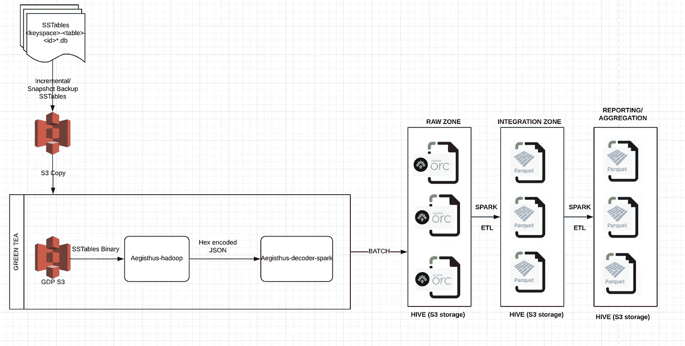
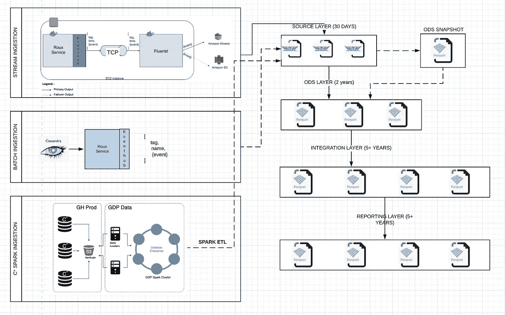

# 我们迈向基于事件的分析平台的旅程

> 原文：<https://medium.com/analytics-vidhya/our-journey-towards-streaming-analytics-8324042c6b74?source=collection_archive---------13----------------------->

我们是一家数据驱动的科技公司，数据是我们工作的核心。作为一家互联网公司，我们从各种内部和外部来源获取并分析数 Pb 的数据。随着组织的有机和无机快速增长，在过去几年中，我们一直在实现数据环境的现代化，并大幅扩展我们的数据平台基础架构。随着组织的不断发展和技术的快速变化，数据工程师的生活中似乎没有沾沾自喜的时刻——在这里，变化是唯一不变的！我们最近做了这样的改变，我们进一步增强了我们的能力，使近实时的基于事件的数据处理成为现实。

# 传统流程:

我们使用具有 28 个集群和 800 多个节点的开源 Cassandra (C*)发行版作为我们的生产 OLTP 数据库。C*作为一个分布式的键-值对数据库，它在不可变的二进制数据库文件中的许多不同节点中存储表的数据片段，这些文件被称为 SSTables，我们在 S3 增量地和/或完整地备份这些 [SSTables](https://github.com/fullcontact/hadoop-sstable) 用于数据库恢复目的。网飞开发并开源了一个名为 [Aegisthus](https://github.com/Netflix/aegisthus/,) 的工具，可以将这些二进制 db 文件翻译成 JSON。使用 Aegisthus 和自主开发的流程，我们可以批量供应数据平台的源层。以下是工艺流程的简化图示-

遗留流程

这在相当一段时间内为我们完成了工作，但存在以下固有问题:

1.  [Aegisthus](https://github.com/Netflix/aegisthus/,) 项目现已存档，该插件没有主动维护或支持，当前版本不支持升级后的 C*版本。因此，我们有点被旧版本的 Cassandra 锁定，从业务和运营的角度来看，这是一个风险。
2.  Cassandra 很好地实现了存储和检索键值对数据的目的，但是当所有分布的数据都需要从表中进行整理以生成表的当前快照/CDC 时，这个过程变得非常耗费资源和时间。
3.  由于我们直接从 Cassandra 生产数据库备份中提取数据，分析团队(即数据的消费者)无法控制所读取数据的结构或数据类型。因此，生产数据库中的任何此类更改通常会使我们的管道失败，需要进行中断修复。
4.  没有地方来处理源模式的演变。作为一个充满活力的组织，我们经常推出新功能。为了将新的数据带到数据仓库，我们被迫在增量 ETL 管道中运行回填。
5.  这是一个批处理过程，有很长的等待时间。

这些是我们需要立即解决的一些问题，这是我们转向基于事件的平台的绝佳机会-

# 现代化流程:

# **源层:**

我们近 80%的数据适合流式传输，其余 20%的数据需要高精度，查找或维度数据很少改变，或者数据对象较大(> 1MB)，需要批处理。现代化后，我们通过以下方式从生产 C*数据库获取数据-

## 1.流式摄取:

微服务应用程序捕获事务日志并传输这些日志条目。我们使用 *Fluentd* 作为日志聚合器，它定期从 fluentd-agents(以 TCP 模式从服务中收集日志流)收集分布式日志，在一个时间范围内进行聚合和重复数据删除，并发送到 AWS Firehose，在一定次数的重试后故障切换到 S3 路径。将数据分块(大约 5mb/文件)、分批(YYYY-MM-DD-HH)发送，然后写入 S3。

现代化流程

我们从微服务中标准化和抽象出事件发布流程，我们将其命名为 *Eventhub。*每次服务团队想要发布数据时，他们都需要在 Java 代码中调用该功能，并按照数据生产者和消费者之间约定的模式传递事件 POJO。这样，数据生产者就必须严格按照约定的模式发送数据，任何偏差都会导致事件发布失败，从而强制执行 [***数据约定***](https://docs.microsoft.com/en-us/dotnet/framework/wcf/feature-details/using-data-contracts) ***。*** *Eventhub* 也下面做附加作品——

*   向 JSON 注入元数据并序列化事件 POJOs
*   将事件类型、唯一事件 id、事件时间戳添加到 JSON 中
*   向*数据狗*发出不同的度量，用于监控和调试。

该模式在生产者和消费者团队之间的开发阶段最终确定，任何更改都需要消费者团队的 PR 批准。这个收缩的模式定义也是我们实现 [***模式进化***](https://docs.oracle.com/database/nosql-11.2.2.0/GettingStartedGuide/schemaevolution.html)*的地方，为了**向前兼容**(新版本的编写器模式—例如，添加新列)，需要在模式中提到新添加列的默认值。Avro 是面向行的数据格式，能够读取新数据和旧数据。**还支持向后兼容性(**读者模式的新版本—例如，取消列)。*

*Kinesis 写入 S3 的文件是二进制 JSON (Avro)格式，看起来像:*S3://event-name/yyyymmdd hh/XXX . Avro .*该路径链接到外部配置单元表，该表也链接到相同的数据契约模式。这样数据在产生后一分钟左右就可供查询，从而使****接近实时**** **分析*。**

**这对于我们需要接收的大部分数据来说都非常好，但这仍然有某些缺点，我们需要替代的并行解决方案-**

1.  **当前的流处理非常稳定，但由于“至少一次”语义，当这些事件超出在 *Fluentd* 配置的重复数据删除窗口时，我们仍有可能出现重复事件，或者由于系统中的不同故障点，很少会出现缺失事件。对于关键的财务指标或对账，这可能会导致问题。**
2.  **对频率极低的事件进行流式传输是没有意义的，例如一些很少更改的查找类型的数据。**
3.  **Kinesis Firehose 允许记录大小达到 1000 KB，我们发现这在某些情况下是有限制的，因为数据生产者不能在数据中发送大的 JSON blobs。**

**我们以两种不同的方式解决了这一挑战，这两种方式都来自不同的用例。**

## **2.批量摄入:**

**这里的数据发布与 eventhub streaming 中的相同，即它通过数据契约和 Eventhub 功能进行，但 fluentd 代理没有配置为读取这些数据，而是从 Cassandra 产品中批量提取数据，并通过 Eventhub 写入指定的 S3 路径。这适用于关键的小批量数据。**

## **3.C*火花摄入:**

**Cassandra (C*)的 DataStax Enterprise (DSE)发行版附带了 Spark connector，很容易建立一个 db api 连接，并将所需数据从 DSE Cassandra 提取到 parquet 文件。我们的生产 C*是开源版本和 800 多个节点的集群，因此更容易将所需 C*密钥空间/表的子集从生产集群转移到单独的小型 DSE Cassandra 集群，并从那里提取数据到分析平台的源区域。生产中的增量/快照稳定备份被复制到 GDP S3 存储桶，然后加载到 GDP C*集群。从这里，使用 Spark connector 以 parquet 格式提取数据，这很容易用于分析。该流程用于一些包含大量数据的表格，与 GreenTea 流程相比，该流程消耗的资源和时间较少，并且不依赖于 [Aegisthus](https://github.com/Netflix/aegisthus/,) 插件。这是 GreenTea 过程的中间替代，没有数据契约和模式演化。**

# **ODS 层:**

**原始区或着陆区中的数据有利于进行近实时数据分析，但这带来了某些功能，需要下游层(ODS)来运行大型分析工作负载-**

1.  **源层是面向行的 Avro 格式。这对于大型分析工作负载来说性能不是很好，因为它们通常需要面向列的结构。**
2.  **来自数据生产者的数据的源层或着陆区本质上是短暂的，并且具有有限的保留期(我们将其设置为 30 天)。这也部分是因为消费者的隐私法(如 CCPA ),该法要求在收到消费者的“忘记我”通知后的几天内从系统中删除消费者的数据。从 ODS 到报告层，我们使用一个模糊处理过程，该过程定期(我们将转到令牌化过程，以更好的方式处理这一点)为希望被遗忘的客户模糊 PII 数据。**
3.  **在许多情况下，数据生产者可能更倾向于发送来自服务的复杂或嵌套的 JSON，而没有责任或能力以更相关和易于消费的形式提供数据。ODS 是一个层，在这个层中，使用定制流程的不太熟悉的用户可以更方便地进行分析。话虽如此，但强烈建议不要在模式契约中接受复杂的数据类型。来自服务的数据应该是具有最低复杂性的格式良好且完整的业务事件。**
4.  **某些其他基于规则的数据验证、重复数据删除、合并源中的小文件等。以使其成为数据仓库中的第一个净化的用户可消费层。**

**我们已经创建了高度可配置的工厂(流和批处理),用于从服务到 ODS 层接收数据。如果数据从源实时输入 ODS，ODS 的一些好处就会丧失，但用户仍然可以通过合并 ODS 的批量数据和源层的流数据(大多数情况下不到一分钟的延迟)来获得接近实时的数据。**

# **ODS 快照层:**

**ODS(前一层)存放不可变的事件日志数据，这些数据是不压缩的。因此，同一个主键可能有许多行，它们是在不同的时间点生成的。“ODS 快照”包含数据的快照视图，该视图由给定的主键压缩。我们构建了高度可配置的声明性工厂来完成这种压缩。**

# **集成层:**

**ODS 为用户提供了查询操作数据的能力，操作数据是不可变的事件日志数据。它仍然不是运行真正的报告查询或方便地将它与仓库中的其他数据结合起来进行决策的地方。这些不可变的事件日志仍然需要经历来自最新状态的转换逻辑，以描绘人们关心的数据的当前视图，这是在集成层中完成的。该过程改变了数据的现有状态，并且由于 S3(我们使用的文件存储)不支持改变，该层不能是流层，也不需要成为流层。我们使用 Spark 批处理 ETL 定期刷新我们的集成层。集成层支持快照或增量摄取。**

# **展望未来:**

**使用我们当前的框架，我们可以进行非常低的延迟近实时分析，但我们仍然无法执行流或真正的实时分析。我们正在使用 Kafka 进行 POC 和流分析的实施，并计划在我们的数据平台中添加以下功能—**

*   **复杂的事件处理能力，这将帮助我们在管道中插入事件处理例程，利用来自多个主题的流连接。目前，我们无法将来自不同事件管道的飞行数据结合起来。**
*   **这将为我们的交易系统提供一个反馈回路。**
*   **除了充当消息队列，Kafka 还可以作为我们的源层，具有数据保留、自动日志压缩和事件重复数据删除功能，因此可以替代源、 *ODS* 和 *ODS 快照*层。**
*   **有了 Kafka，我们可以在更高的抽象层次上处理数据流。**