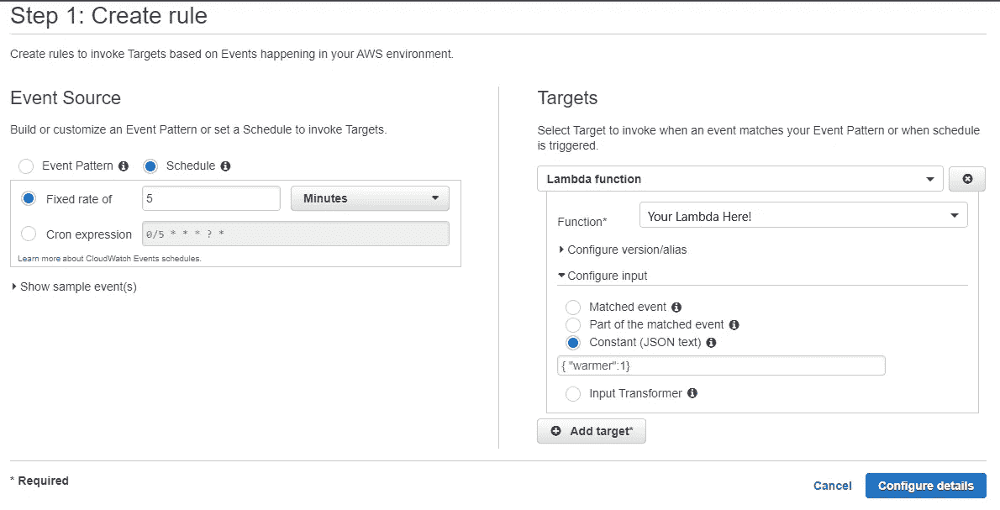

# 远离寒冷——通过加热 AWS Lambda 功能避免寒冷的简单指南

> 原文：<https://medium.com/analytics-vidhya/out-from-the-cold-a-simple-guide-to-avoiding-cold-boots-by-warming-your-aws-lambda-functions-66af38f286a0?source=collection_archive---------10----------------------->


已经有很多文章讨论了如何优化 AWS Lambda 函数，使其运行得更快，并避免可怕的“冷启动”场景。尽管亚马逊技术支持者报告说[极少数的函数调用实际上是冷启动的(大约 0.2%)。也就是说，我遇到过很多情况，在这些情况下，你肯定会遇到很多冷门，最好还是避开它们:](https://www.jeremydaly.com/lambda-warmer-optimize-aws-lambda-function-cold-starts/)

1.  小项目或有几个功能的原型，所有这些都可以在不同的间隔时间调用。即使你修补的东西永远不会见天日，等待 Lambdas 旋转起来会很快变得乏味。
2.  你已经建立了一个作品集或演示网站，你正在申请一份工作。如果你想用你做的一些很酷的东西给人留下一个好印象，最好通过长时间展示一个负载微调器来避免破坏它。
3.  人们经常提到冷启动等待时间只有几秒钟，但我从来没有这样的经历。对我来说，我经常花 5-6 秒钟等待我的 Lambda 从床上滚下来，然后去工作。

记住这些相当轻量级的场景，让我们深入到一个简单、直接的方法来温暖你的羔羊。

# 强制性的开场白

简单地说，“冷启动”是 Lambda 函数的第一次缓慢启动。

在该功能最初“启动”后，它可以在更快的基础上可用，直到 Lambda 长时间未被使用(或者数据中心被小行星撞击)。在这段延长的时间(或不幸的天体之怒)之后，Lambda 功能被破坏，因此整个冷启动过程必须再次启动。

“预热”一个函数就是按照设定的时间表以编程方式调用它，这样你就不会让驱动 Amazon Lambda 基础设施的小精灵破坏你的 Lambda 环境。这使功能保持在快速响应的状态，所以你的应用程序，网站，或任何东西保持活力。

# 保暖守则

在我们深入研究代码之前，首先让我们了解一些简单而优秀的暖羊基本规则:

1.  **不要调用整个函数**——你应该直接在你的函数中编写一个非常短、快速的逻辑路径来预热函数。如果你有一个带有 DB 调用的 Lambda，对其他 Lambda 的后续调用，或者任何繁重的事情，节省计算时间，尽可能高效和廉价地进行更温暖的调用。
2.  **尽可能稀疏地预热** —如果您将预热间隔设置为大约 5 分钟，您将确保您的功能始终为准时响应做好准备，但您也不会不必要地增加基础设施的负担。
3.  **靠近源**——如果你有一个 Lambda，它被调用到它上面的其他基础设施的栈下(最常见的例子是 API 网关)，避免调用栈顶的函数。任何像这样的循环作业都应该调用尽可能接近 Lambda 本身的函数。

首要任务是如何告诉你的功能你只是在升温。如果你的功能不知道什么时候只是预热而不是完全运行，你就不能遵守我们的第一条基本原则。最简单的方法是将一个布尔或位传递给所有 Lambdas 接收的事件对象。通过这种方式，该功能知道如何短路其完整运行，并尽可能快地返回，以保持您的微服务活跃和温暖。我们一会儿将讨论这将如何工作的细节。

好了，代码时间！下面是一个非常简单的例子，您接收一个小部件 ID，然后返回一个相关的小部件列表:

如您所见，在第 4 行，我们立即处理了预热逻辑，以防止任何潜在的高成本操作被执行。鉴于云技术在很大程度上是基于 I/O 操作或计算时间，这可能会在未来为我们节省大量资金或成本。如果我们没有传入一个预热调用，那么该函数将正常执行。

现在我假设你已经知道了如何部署和测试 Lambda 的基本知识。但是因为我说过这是一个简单的指南，所以我想尽可能简单地修改我的例子。如果我想在本地测试这个函数以确保逻辑正常工作，我可以简单地在函数的底部添加以下内容:

```
context= ''event={'warmer': 1 }print(getWidgets(event, context))
```

类似地，更改我的事件字典使 warmer 等于 0 将调用完整的函数(在您的情况下，这将失败，除非您绝对*喜欢*设置 DynamoDB 实例，在这种情况下，金星🌟).

# 让我们加热一个λ

现在是时候在 AWS 中实际设置升温机制，并触及我们的最后两条基本规则。我将假设您已经知道如何以多种可用的方式部署 Lambda。如果你不知道，那就留言说“嘿，肖恩，你的穴居人大脑和 6 年级的写作能力对我来说有点意义——请写一篇关于部署 Lambdas 的文章。”

现在我们已经部署了我们的功能，让我们对它进行测试，以确保我们可以在没有 AWS 基础设施设置的情况下预热它。如果我们的代码或 lambda 部署有问题，这可以让我们省去很多麻烦，但我们可以在没有测试的情况下开始其他基础设施。让我们进入 AWS 控制台上的 Lambda 并设置一个新的测试，只粘贴这个简单的 JSON。

```
{ “warmer”: 1 }
```

假设运行正常，函数返回“warmed”——让我们配置真实的东西。为此，我们需要前往云观察>事件>规则。现在让我们创建一个新规则。这里有很多内容需要填充和讨论，但我会尽量简短。确保您选择了一个 Lambda 函数作为您的目标，并将您刚刚粘贴的 JSON 提供给它，以进行我们的测试。你可以选择你的 API 网关或者你的 Lambda 栈中更高的东西，但是以免我们忘记前面提到的规则 3。



除此之外，其余的设置应该相当简单。根据规则 2，我们只想在 5 分钟内热身。这应该足够频繁，并保存您的活动，确保它是活跃的…祝贺！你现在正在加热你的λ。

*感谢阅读！请在下面留下改进建议、评论或批评。如果你觉得特别书呆子气，* [*在 LinkedIn*](https://www.linkedin.com/in/sean-drummy-a6b6774/) *上联系我。*