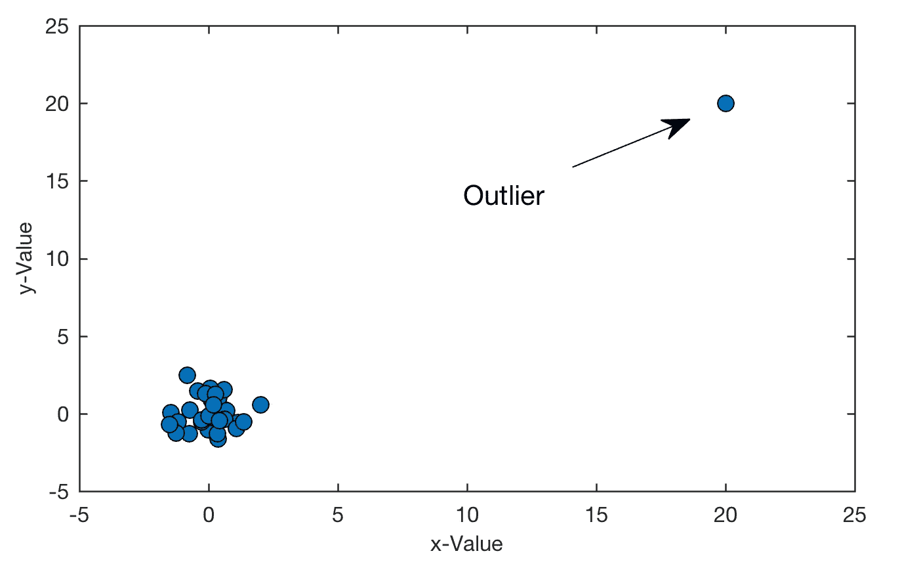
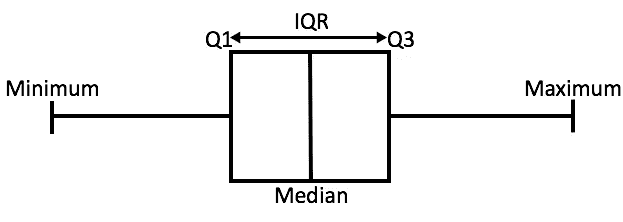
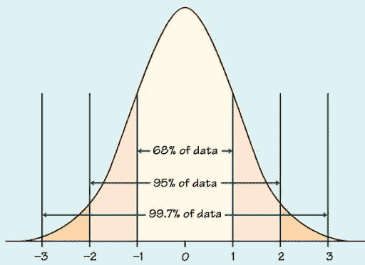

# 机器学习中的离群点检测

> 原文：<https://medium.com/analytics-vidhya/outlier-detection-in-machine-learning-382557c775aa?source=collection_archive---------1----------------------->

# 什么是离群值？

离群值是与数据集中的其余数据点明显不同的数据点。异常值增加了数据集中的方差，从而导致统计功效的降低。因此，识别这些异常值并相应地对待它们是非常重要的。

# 异常值出现的原因

异常值可能由于各种原因而出现。一些最常见的原因包括:

*   数据输入错误。
*   数据点缩放不当。
*   测量过程中产生的误差。
*   真实极端数据点的存在。

# 异常值检测的重要性

既然我们知道了异常值出现的原因，那么知道识别这些异常值的重要性也是很重要的。简单的原因是一些集中趋势的测量和可变性的测量受到异常值的影响。

*   **平均值:**因为平均值是数据集中所有值的平均值，所以它会受到异常值的影响。平均值向异常值移动。
*   **中位数:**中位数是数据集的中间值，不受离群值的影响。因此，在处理含有异常值的数据集时，我们应该使用中位数而不是均值。
*   **Mode:** Mode 是在数据集中出现次数最多的值，不受离群值的影响。
*   **方差&标准差:**由于均值用于计算方差和标准差，所以二者都会受到异常值的影响。
*   **范围:**由于范围是最小和最大数据点之间的差值，范围受异常值的影响最大。

因此，除了中位数和众数之外，大多数其他重要指标都会受到异常值的影响。除了这些原因之外，异常值还会在拟合模型时造成问题，并增加误差。因此，识别这些异常值非常重要。

# 识别异常值的方法

## 1.IQR 方法

四分位间距

四分位数间距(IQR)是数据集的中间 50%。换句话说，它是数据集的第三个四分位数(第 75 个百分位数)和第一个四分位数(第 25 个百分位数)之间的差值。

IQR = Q3 -Q1

下限*= Q1–1.5 * IQR*

上限 *= Q3+1.5*IQR*

IQR 找到下限和上限来识别异常值。高于或低于这些阈值 1.5 倍的任何值都被识别为异常值。

## 2.z 分数

正态分布

Z-score 告诉我们一个数据点高于或低于平均值多少个标准差。它假设数据点遵循高斯分布。

***Z-* 得分 *= (X-* 均值 *) /* 标准差**

从上面的正态分布图我们可以得出:

*   68%的数据位于 1 个标准偏差内。
*   95%的数据位于 2 个标准偏差内。
*   99.7%的数据位于 3 个标准偏差内。

由于大多数数据点(99.7%)位于平均值以上或以下的 3 个标准偏差内，任何大于+3 的 Z 值或任何小于-3 的 Z 值都被视为异常值。

## 3.形象化

也可以通过使用各种可视化方法来检测异常值的存在。一些著名的情节包括:

*   散点图
*   盒须图
*   柱状图
*   分布图
*   QQ 情节

## **4。DBSCAN (** 带噪声应用的基于密度的空间聚类)

DBSCAN 是一种聚类方法，用于将高密度的簇与低密度的簇分开。它基本上将数据点分为核心点、边界点或噪声点。这里的噪声点是异常值。

基于密度的噪声应用空间聚类

5.**假设检验**

我们还可以使用假设检验来识别数据集中的异常值。一些著名的异常值检测假设测试包括:

*   格拉布斯试验
*   卡方检验
*   狄克逊 Q 试验

**假设检验**

上面提到的每一种测试都使用不同的方法来识别异常值。在 Grubb 的测试中，我们假设:

**零假设:**样本中的所有数据点均来自一个服从相同正态分布的总体。

**替代假设:**样本中的一个数据点不是从与其他数据点相同的正态分布总体中抽取的。

如果 p 值小于显著性水平，我们可以拒绝零假设，并断定其中一个值是异常值。

# 处理异常值

现在我们知道了如何以及为什么要检测异常值，下一个问题是如何处理这些异常值。

一种简单的方法是丢弃离群值，但这并不适用于所有场景。基于用例，我们需要决定是否丢弃一个离群值。

**何时放弃离群值？**

*   当我们确定异常值是完全错误的时候。
*   当我们有大量数据时。
*   当我们可以恢复到原始数据时，如果在后期我们发现丢弃异常值不是一个好主意。

**什么时候不要丢弃离群值？**

*   当有很多异常值时。
*   当处理敏感的关键用例时。

**如何处理不可剔除的异常值？**

*   **实施:**我们可以根据用例，用平均值、中值或众数来代替离群值。
*   **基于分位数的下限和上限:**在该技术中，我们可以对较低值进行下限(例如，用第 10 个百分位替换)和上限(例如，用第 90 个百分位替换)。

# 结论

离群值很难处理，但也不能忽视

离群点的检测和处理是数据预处理中不可忽视的主要步骤之一。忽略异常值将导致数据的偏差，我们可能无法得到想要的结果。

如果你喜欢这篇文章，请鼓掌和分享！快乐阅读！